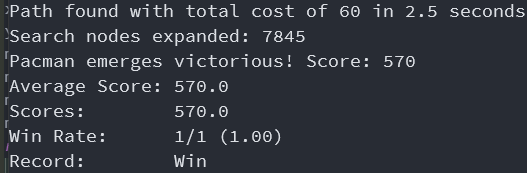

# P01 Pacman Game

| 学号     | 姓名   | 专业(方向) |
| -------- | ----- | ---------- |
| 18308045 | 谷正阳 | 大数据     |
| 18340016 | 陈俊熹 | 大数据     |

### 1.Idea of A* Algorithm (Use a few sentences to describe your understanding of the algorithm)

- 用启发式信息预测剩余路径开销的下界h，与已走路径开销g求和，得预测总路径开销下界f。类似一致代价搜索，贪心地选f最小的优先扩展，随着不断扩展f不断接近真实总路径开销。

### 2. Idea of Min-Max and alpha-beta pruning algorithms

- 评价衡量其中一个agent的收益，收益越高评价越高。使用Min-Max对双方选择做出预判，从而选出最优。极大节点想最大化自己的收益因此扩展评价高的节点，极小节点想最小化对方的收益因此扩展评价最低的节点，类似没有回溯的深度优先搜索。
- 在Min-Max的基础上，利用了一些结论可以去掉一些不必要的计算。另外形式上，$\alpha$可视作极大节点max的初始化，$\beta$可视作极小节点min的初始化。

### 3. Codes

**Question 1**

```python
def aStarSearch(problem, heuristic=nullHeuristic):
    """Search the node that has the lowest combined cost and heuristic first."""
    "*** YOUR CODE HERE ***"
    visited = set()
    class My_state(object):
        def __init__(self, state, g, action = None, predecessor = None):
            self.state = state
            self.h = heuristic(self.state, problem)
            self.g = g
            self.f = self.h + g
            self.action = action
            self.predecessor = predecessor
        def __lt__(self, other):  # operator <
            if self.f == other.f:
                return self.h < other.h
            return self.f < other.f
    import Queue
    frontier = Queue.PriorityQueue()
    frontier.put(My_state(problem.getStartState(), 0, list()))
    while not frontier.empty():
        current = frontier.get()
        if current.state not in visited:
            visited.add(current.state)
            if problem.isGoalState(current.state):
                actions = list()
                while current.predecessor is not None:
                    actions.append(current.action)
                    current = current.predecessor
                actions.reverse()
                return actions
            for (successor, action, stepCost) in problem.getSuccessors(current.state):
                if successor not in visited:
                    frontier.put(My_state(successor, current.g + stepCost, action, current))
```

**Question 2**

```python
def cornersHeuristic(state, problem):
    """
    A heuristic for the CornersProblem that you defined.

      state:   The current search state
               (a data structure you chose in your search problem)

      problem: The CornersProblem instance for this layout.

    This function should always return a number that is a lower bound on the
    shortest path from the state to a goal of the problem; i.e.  it should be
    admissible (as well as consistent).
    """
    corners = problem.corners # These are the corner coordinates
    walls = problem.walls # These are the walls of the maze, as a Grid (game.py)

    "*** YOUR CODE HERE ***"
    """
    # 若已知先到达左下再到达左上
    # 当剩下不足3个corners时，返回到剩下所有corners的最大manhattan距离，这样到达goal时返回0
    # 当3个corners时，返回到左上corner的manhattan距离+刚好到达该corner的h值（为了和后续连起来保证一致性）
    # 当4个corners时，返回到左下corner的manhattan距离+刚好到达该corner后h值（为了和后续连起来保证一致性）
    if sum(state[:4]) == 4:
        return abs(state[4][0] - corners[2][0]) + abs(state[4][1] - corners[2][1]) + walls.height + walls.height + walls.width - 6
    elif sum(state[:4]) == 3:
        return abs(state[4][0] - corners[0][0]) + abs(state[4][1] - corners[0][1]) + walls.height + walls.width - 6
    """
    return max([state[i] * (abs(state[4][0] - corners[i][0]) + abs(state[4][1] - corners[i][1])) for i in range(4)])
```

**Question 3**

```python
def foodHeuristic(state, problem):
    """
    Your heuristic for the FoodSearchProblem goes here.

    This heuristic must be consistent to ensure correctness.  First, try to come
    up with an admissible heuristic; almost all admissible heuristics will be
    consistent as well.

    If using A* ever finds a solution that is worse uniform cost search finds,
    your heuristic is *not* consistent, and probably not admissible!  On the
    other hand, inadmissible or inconsistent heuristics may find optimal
    solutions, so be careful.

    The state is a tuple ( pacmanPosition, foodGrid ) where foodGrid is a Grid
    (see game.py) of either True or False. You can call foodGrid.asList() to get
    a list of food coordinates instead.

    If you want access to info like walls, capsules, etc., you can query the
    problem.  For example, problem.walls gives you a Grid of where the walls
    are.

    If you want to *store* information to be reused in other calls to the
    heuristic, there is a dictionary called problem.heuristicInfo that you can
    use. For example, if you only want to count the walls once and store that
    value, try: problem.heuristicInfo['wallCount'] = problem.walls.count()
    Subsequent calls to this heuristic can access
    problem.heuristicInfo['wallCount']
    """
    position, foodGrid = state
    "*** YOUR CODE HERE ***"
    """
    # h值更小的方案：到最远food的距离，效果更差
    foodList = foodGrid.asList()
    if len(foodList) is 0:
        return 0
    else:
        return max([abs(position[0] - x) + abs(position[0] - y) for x, y in foodGrid.asList()])
    """
    """
    # h值较小的方案，返回上下左右四个方向最远食物距离和，若某方向无食物则设0
    # 若横向移动，不会因为纵向改变h值
    # 若横向两个方向有food，横向移动不会改变h值
    # 若横向一个方向有food，横向移动h值最多减小1
    # 若横向没有方向有food，横向移动h值不会减少
    # 若纵向移动同理
    max_left = 0
    max_right = 0
    max_up = 0
    max_down = 0
    foodList = foodGrid.asList()
    for x, y in foodGrid.asList():
        if x < position[0] and max_left < position[0] - x:
            max_left = position[0] - x
        if position[0] < x and max_right < x - position[0]:
            max_right = x - position[0]
        if y < position[1] and max_up < position[1] - y:
            max_up = position[1] - y
        if position[1] < y and max_down < y - position[1]:
            max_down = y - position[1]
    return max_left + max_right + max_up + max_down
    """
    # 在未吃到最远端food时，第一项是常数，后两项最多减少1
    # 不妨设x0<=x1<=x2，y0<=y1<=y2，在吃到最远端前返回(x2-x0)+(y2-y0)+1+0，则吃到之后返回(x1-x0)+(y1-y0)+(x2-x1)+(y2-y1)即减少1
    foodList = foodGrid.asList()
    if foodList == []:
        return 0
    x_list = [x for x, y in foodList]
    y_list = [y for x, y in foodList]
    max_left = min(x_list)
    max_right = max(x_list)
    max_up = min(y_list)
    max_down = max(y_list)
    return (max_right - max_left) + (max_down - max_up)\
        + min(abs(position[0] - max_left), abs(position[0] - max_right))\
        + min(abs(position[1] - max_up), abs(position[1] - max_down))
```

**Question 4**

```python
    def getAction(self, gameState):
        """
          Returns the minimax action from the current gameState using self.depth
          and self.evaluationFunction.

          Here are some method calls that might be useful when implementing minimax.

          gameState.getLegalActions(agentIndex):
            Returns a list of legal actions for an agent
            agentIndex=0 means Pacman, ghosts are >= 1

          gameState.generateSuccessor(agentIndex, action):
            Returns the successor game state after an agent takes an action

          gameState.getNumAgents():
            Returns the total number of agents in the game
        """
        "*** YOUR CODE HERE ***"
        def DFMiniMax(n, Player, level):
          if Player >= n.getNumAgents():
              Player = 0
              level += 1
          if level is self.depth:
            return (None, self.evaluationFunction(n))
          actions = n.getLegalActions(Player)
          if actions == []:
            return (None, self.evaluationFunction(n))
          if Player is self.index:
            optimal = (None, -float("inf"))
          else:
            optimal = (None, float("inf"))
          for action in actions:
            V = DFMiniMax(n.generateSuccessor(Player, action), Player + 1, level)[1]
            if (Player is self.index and optimal[1] < V)\
                    or (Player is not self.index and optimal[1] > V):
              optimal = (action, V)
          return optimal
        return DFMiniMax(gameState, 0, 0)[0]
```

**Question 5**

```python
    def getAction(self, gameState):
        """
          Returns the minimax action using self.depth and self.evaluationFunction
        """
        "*** YOUR CODE HERE ***"
        """ 
        # 理论课件上的伪代码实现
        def AlphaBeta(n, Player, alpha, beta, level):
          if Player >= n.getNumAgents():
              Player = 0
              level += 1
          if level is self.depth:
            return (None, self.evaluationFunction(n))
          actions = n.getLegalActions(Player)
          if actions == []:
            return (None, self.evaluationFunction(n))
          if Player is self.index:
            optimal = (None, alpha)
          else:
            optimal = (None, beta)
          for action in actions:
            V = AlphaBeta(n.generateSuccessor(Player, action), Player + 1, alpha, beta, level)[1]
            if Player is self.index and alpha < V:
              alpha = V
              optimal = (action, alpha)
            elif Player is not self.index and beta > V:
              beta = V
              optimal = (action, beta)
            if beta <= alpha:
              break
          return optimal
        """
        def AlphaBeta(n, Player, alpha, beta, level):
          if Player >= n.getNumAgents():
              Player = 0
              level += 1
          if level is self.depth:
            return (None, self.evaluationFunction(n))
          actions = n.getLegalActions(Player)
          if actions == []:
            return (None, self.evaluationFunction(n))
          if Player is self.index:
            optimal = (None, -float("inf"))
          else:
            optimal = (None, float("inf"))
          for action in actions:
            V = AlphaBeta(n.generateSuccessor(Player, action), Player + 1, alpha, beta, level)[1]
            if Player is self.index:
              if V > optimal[1]:
                optimal = (action, V)
                if V > alpha:
                  alpha = V
            else:
              if V < optimal[1]:
                optimal = (action, V)
                if V < beta:
                  beta = V
            if beta < alpha:
              break
          return optimal
        return AlphaBeta(gameState, 0, -float("inf"), float("inf"), 0)[0]
```

### 4.结果展示





### 5.结果分析

#### 1.Search in Pacman

- 三种启发式函数
  1. manhattan距离。
  2. 剩余corners最远的manhattan距离。
  3. 到各个方向最远food的距离和（横向food只算横向距离，纵向food只算纵向距离）。
- 区别：
  1. 第一种manhattan距离只适合到达一个food。
  2. 第二种利用了4个corners位置固定且对称的信息。
  3. 第三种利用了全图都有可能分布food的特点。
- 可以到达相关结果原因：
  1. 第一种到达目标时，manhattan距离是0，且每次移动h最多减小1（即cost）所以满足一致性，因此也满足可采纳性。另外直观上看是用manhattan距离估计起点到终点的路径开销，每次找最小的最终会找到最优。
  2. 第二种到达目标时，退化成到最后corner的manhattan距离，是0，且当最远corner不变时，每次移动到达最远的最多减少1；当最远corner改变时，另一个当前最远corner比和上一个最远corner当前距离远，因而不会减少比1更多，因而满足一致性，所以也满足可采纳性。另外从直观上看，当还未到某corner时，由于到该corner比到最远corner近因而一般可以比最远corner更快找到，当到达该corner后，会优先选择缩短到最远corner的距离因而可以快速到新的corner。
  3. 第三种到达目标时，退化成到最后food的manhattan距离，是0，且每次移动最多减少1（当移动反向的无food时），因而满足一致性，所以也满足可采纳性。另外从直观上看，到达一个方向最远food后，会优先扩展缩短另一个方向距离，更容易扩展到整个图的全部food。
- 其他想法：
  1. 同是可采纳的启发式函数，值越大越好。
    考虑Problem3使用最远manhattan距离作为启发式函数，其一致性在Problem2讨论，其值必然是小于当前用的启发式函数。
    
    考虑Problem3使用四个方向最大距离和作为启发式函数，其一致性在注释讨论，其值必然是小于当前用的启发式函数。
    
  2. 更多的启发式信息可以构造更好的启发式函数。
    考虑如果已知一些启发式信息，如Problem2已知先到左下角，再到左上角，那么可以构造如下启发式函数：
     1. 当剩下不足3个corners时，返回到剩下所有corners的最大manhattan距离，这样到达goal时返回0
     2. 当3个corners时，返回到左上corner的manhattan距离+刚好到达该corner的h值（为了和后续连起来保证一致性）
     3. 当4个corners时，返回到左下corner的manhattan距离+刚好到达该corner后h值（为了和后续连起来保证一致性）
    这样可以获得更大，更好的启发式函数。
    
#### 2.Multi-Agent Pacman

- Briefly analyze the complexity difference between α-β pruning and minmax algorithm（hints: search depth and time）
  1. 设深度$d$，每步分支$b$。所以minmax算法时间复杂度$O(b^d)$即遍历每个节点，因为是深度优先所以空间复杂度$O(bd)$即遍历一条路径，放入Frontier的元素总数。
  2. $\alpha$-$\beta$剪枝，对于第一个玩家需要访问第二个玩家$b$个节点以找到最大/最小，而对于第二个玩家可能只需要访问$1$个至$b$个就可以驳斥掉其他节点。因而最优访问节点数随层数变化$1,b,2b-1,2b^2-b,2b^2-1,\cdots$相当于$O(b^{d/2})$，而最差访问节点数是$1,b,b^2,\cdots$相当于$O(b^d)$。空间复杂度仍是$O(bd)$。

### 6.Experimental experience 
- Q1：
  1. 题目要求只能改`aStarSearch`，而每个节点需要记录`f`值和路径。所以运用python的语言特性，在函数中定义一个类`My_state`，包裹在本来的`state`外面。
  2. 路径的记录：通过记录`action`和前驱`predecessor`，形成一个链表，最后返回时，遍历链表从而获得路径，没有每个节点记录完整的路径，减小了空间开销。
  3. 环检测：使用`set`，查找开销是$O(1)$，不需要遍历整个数组。
  4. Frontier：使用优先队列，需要`My_state`重载`<`运算符。
- Q2：
  1. 尝试过四个manhattan距离和，为了要满足一致性，需要除以2，但是效果不佳。
  2. 尝试过在manhattan距离和一半的基础上，引入先到达左下角的信息以增大启发式函数，虽然效果不错，但是这个条件是不一定发生的。
  3. 尝试过最小manhattan距离，但是效果不佳。
  4. 怀疑可能是因为最小manhattan距离小于等于最大manhattan距离，而有结论可采纳的启发式函数越大越好，因而采用最大manhattan距离，满足要求。
- Q3：
  1. 尝试过到每个food的manhattan距离和除以food总数，效果不佳。
  2. 尝试过到最远food的manhattan距离，效果不佳。
  3. 考虑更大的启发式函数，可以是到四个方向最远的距离和，满足要求。
  4. 继续增大，改进成当前的启发式函数，效果更佳。
- Q4：
  1. 通过打印`getLegalActions`的返回值，发现可能返回`[]`，观察源代码，此时为输或赢，作为递归终止条件之一。
  2. `Player`每步加1，`level`的更新，通过看`Player`是不是非法，`level == depth`作为递归终止条件之一。
  3. 返回值包括了`action`和对应评价。
  4. 为了递归调用，利用了python的语言特性，在函数中定义函数。
  5. 代码编写参照了课件上的伪代码。
- Q5：
  1. 把Q4的函数进行改编。
  2. 代码编写参照了实验课件中的伪代码，与理论课课件伪代码有出入。如极大节点如果找不到比$\alpha$更大的V时，实验课中代码是返回V（对应V的action），而理论课代码是返回$\alpha$（对应无action）。另外，实验课剪枝条件是$\beta<\alpha$而理论课剪枝条件是$\beta\le\alpha$，实际上应该换成$\beta\le\alpha$效果更好，因为可以剪掉更多没必要的情况。
