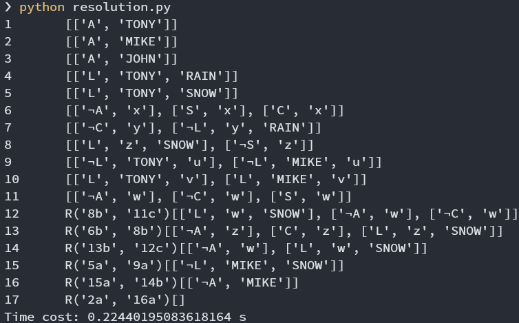

# P02.2 Resolution

| 学号      | 姓名 | 专业(方向)     |
| -------  | ---- | -------------- |
| 18308045 | 谷正阳 | 大数据 |

### 1.task

- Implement the MGU algorithm. (10 points)

  1. 运用了链表`Linked_list`来表示$\sigma$，链表使用游标实现，且实现了一些方法。
      ```python
      # sigma: Linked_list(equation)
      # equation: [str, str]
      ```

  2. 置换组合算法参考课件代码：
  

  3. MGU算法参考课件代码：
  

- Using the MGU algorithm, implement a system to decide via resolution if a set of first-order clauses is satisfiable.
The input of your system is a file containing a set of first-order clauses.
In case of unsatisfiability, the output of your system is a derivation of the empty clause where each line is in the form of "R[8a,12c]clause". Only include those clauses that are useful in the derivation. (10 points)

  1. 术语解释：

     - `clauses`表示全部的子句，是`clause`的容器，逻辑上表示每个`clause`与。

     - `clause`表示单个子句，是`items`的容器，逻辑上表示每个`items`或。

     - `items`表示子句中的一项，是`item`的容器，在此做限定是作用于变量或常量上的谓词。

     - `item`表示谓词的每个部分，`item[0]`是谓词名，`item[1:]`是该谓词作用在的全部变量、常量。

     - 变量：单个字母，在此均设为小写。

     - 常量：至少两个字母，而且保证不包含变量，在此均设为大写。
        ```python
        # 假设一个字母是变量，否则是常量，且变量名不包含常量。
        ```

     - $\sigma$：置换，见课件置换组合及MGU算法。

     - `equation`：置换中的每一条，见课件置换组合及MGU算法。

  3. 该部分自顶向下分别由`resolve`，`union`，`MGU`三个函数组成。

     - `resolve`用于在`clauses`中选择调用`union`进行合并得到新的`clause`，并判断是否是空，如果为空则返回`False`，结束归结，找到结果是最优解。

     - `union`判断两个`clause`能否合并，如果可以合并，找到相反的`items`，调用`MGU`，得到最一般和一，从而合并两个`clause`，如果无法合并则返回`None`。

     - `MGU`用来找两个`items`的最一般和一，详见课件算法。

- Explain any ideas you use to improve the search efficiency. (5 points)
  1. 数据结构选择：

     - `clauses`、`clause`的数据结构最初使用的也是链表。

     - 但是最终的`resolve`实现版本，`clauses`中的`clause`无需频繁增删，因而改用`Array`。

     - 而`clause`中的`items`尽管需要增删但是频率不高（实际上只有`union`最终合并`clause`之后才会在新`clause`中删除相同的`items`），而且进入`union`的时候要先对`clause`进行拷贝，链表尽管复杂度不高但是拷贝效率低（对空`Linked_list`使用`extend`操作进行深拷贝），因而也改用`Array`。
        ```python
        # clauses: Array(clause)
        # clause: Array(item)
        ```

     - `Array`包括一个用于存值的数组和一个表记录该数值是否存在，因而删除操作仅是将表中的该项改成`False`。

     - `items`用`list`，因为无需增删所以不使用链表，而且需要改其中的`item`所以不用`tuple`而用可变对象`list`。

     - `item`用`str`。
        ```python
        # f/g/items: list(item=str())
        ```

     - `sigma`用链表`Linked_list`，考虑计算置换组合的三个步骤需要大量增删。
        ```python
        # sigma: Linked_list(equation)
        ```

     - `equation`用`[左, 右]`的`list`，考虑置换组合的三个步骤需要改变`equation`中第二项的值。

        ```python
        # equation: [str, str]
        ```

  2. 由于`resolve`需要处理的数据最多（考虑`clauses`中无用的`clause`可能很多），所以要进行优化。

      - 由于要最优解，所以需要使用UCS算法。路径开销的定义见下。

      - `tree`用来记录路径和路径开销，`tree`的数据结构是`Tree`，是通过记录每个节点的两个孩子从而构建的二叉树。它有主要方法如下：

        1. `append`方法，接受两个孩子节点的下标`a`，`b`作为参数，来添加一个新的父节点。

        2. `is_sub`方法，接受两个节点的下标`a`，`b`，判断`a`树是不是`b`树的子树。

        3. `Size`方法，接受一个节点的下标`a`，返回`a`树的大小（树大小动态计算，存在`size`数组中，所以`Size`方法复杂度$O(1)$）。

      - `tree`存储所有`clause`的逻辑关系，如果`clause1`，`clause2`归结得到`clause3`，则`clause3`为`clause1`、`clause2`的父节点。

      - 得到`clause3`路径定义是以`clause3`为根的子树。

      - 得到`clause3`路径开销定义是$\text{Size}(clause1)+\text{Size}(clause2)$。考虑每两条边表示一次归结，一共有$\text{Size}(clause3)-1=\text{Size}(clause1)+\text{Size}(clause2)$条边，目标是归结次数最少，因而每次拓展$\text{Size}(clause1)+\text{Size}(clause2)$最小。

      - `is_sub`方法可以用于剪枝，考虑3 blocks问题，有`clauses`：
        ```python
        ####### input for 3' blocks #######
        # On(aa,bb)
        # On(bb,cc)
        # Green(aa)
        # ¬Green(cc)
        # (¬On(x,y), ¬Green(x), Green(y))
        ###################################
        ```
        1和5归结出6，5和6还可以继续归结，会重复得到1。`is_sub`可以一定程度上避免循环论证的过程（条件推结论，再拿结论推条件）。

      - `based_on`是存“得到一个`clause`所基于的全部初始`clause`的可重复集合”的`list`。

      - “得到一个`clause`所基于的全部初始`clause`可重复集合”使用的`set_repeated`，是基于`dict`实现的可以重复的集合（`{key:counting}`），有并集操作（重载`+`），比较操作（重载`==`），长度操作（重载`len`）。其中长度是动态地记录，所以`len`的复杂度是$O(1)$。长度操作可以用来记录路径开销`tree`类似，复杂度类似，但是代码里没用到。

      - `based_on`的另一个用途是用来剪枝，考虑如果`clause1`，`caluse2`归结得到的`clause3`与历史上得到的`clause0`使用的每个初始`clause`的数目均相同（在UCS算法中是可能的），则`clause3`是等于`clause0`的。这个可以提前通过`based_on[index_of_clause1] + based_on[index_of_clause2] in based_on`来判断，从而可能无需对`clause1`，`clause2`使用计算时间长的`union`。

      - `resolve`虽然使用了USC算法，但是算法中寻找路径开销最小的部分，比较特别，这个问题是这样的：

        1. 由于USC每次都将新`clause`放在`clauses`末端，所以`clauses`是一个路径开销不严格递增的序列。

        2. 由新状态路径开销的定义，需要从`clauses`中找到路径开销和最小的两个`clause`。

        3. 由于一些剪枝的限制，真的路径开销和最小不一定取到，而是应取到满足约束的最小路径开销和。

      - 因此这个问题就转化成了在一个非严格递增序列中，找到两个数的下标，使得这两个数的下标满足约束，而且这两个数的和最小。这里使用的算法是这样的：

        1. 用`left_bound`，`right_bound`规定我想找的更优的两个数下标所在范围，`left_bound`设为最小下标`1`，`right_bound`设为最大下标`len(clauses) - 1`（减1的原因在于python数组不是真的以1开头，这里1开头实际上是在0的位置加入了一个无效值）。

        2. `index`从`left_bound + 1`遍历到`right_bound`。

           - 如果中途找到`left_bound`和`index`是满足约束的，则停止遍历。设置$sum_{max} = \max(sum_{max}, cost[left\_bound] + coct[index])$。设置`right_bound`为$index - 1$。

           - 如果遍历正常终止，则`left_bound`加1。

        3. 继续回到1，直到`left_bound == right_bound`。

      - 这个算法基于的事实是，在非严格递增的数组中找到了符合约束的`a`和`b`，而且`a`之前都已经考虑过，如果想要找到更优的只能从`a`和`b`之间找两个数。

      - 最后一步重要的优化是`min_spouse`，用来改进上述算法。在这个问题下，是每次更新`clauses`后都要跑一次上述算法，因而每次运行，都会重复判断一遍上次运行判断的节点，这是不必要的。因而用`min_spouse`记录每个`left_bound`这次还需判断的第一个`index`。每个`min_spouse[left_bound]`初始化为`left_bound + 1`，上述算法改成：

        1. 用`left_bound`，`right_bound`规定我想找的更优的两个数下标所在范围，`left_bound`设为最小下标`1`，`right_bound`设为最大下标`len(clauses) - 1`（减1的原因在于python数组不是真的以1开头，这里1开头实际上是在0的位置加入了一个无效值）。

        2. `index`从`min_spouse[left_bound]`遍历到`right_bound`。

           - 如果中途找到`left_bound`和`index`是满足约束的，则停止遍历。设置$sum_{max} = \max(sum_{max}, cost[left\_bound] + coct[index])$。设置`right_bound`为$index - 1$。

           - 如果遍历正常终止，则`left_bound`加1。

        3. 遍历终止后，设置`min_spouse[left_bound]`为`index`（考虑循环如果是找到满足约束终止，当前`index`是找到的满足约束的下标，由于不一定是最优，下一次运行还要继续考虑；如果是正常终止，当前`index`是`right_bound +　1`，表示`right_bound`及以前的都考虑过，下一次运行不用考虑。），继续回到1，直到`left_bound == right_bound`。

- Run your system on the examples of hardworker(sue), 3-blocks, Alpine Club. Include your input and output files in your report. (15 points)

    结果见后。

- What do you think are the main problems for using resolution to check for satisfiability for a set of first-order clauses? Explain. (10 points)

    1. 不满足问题可能开销很大，因为要归结至不再出现新的`clause`才会返回`True`。另外我当前算法没有设置环路检测，因为`clause`结构复杂，环路检测开销大。

### 2.Codes

#### 1.MGU

```python
import copy


class Linked_list():
    def __init__(self, size):
        if size < 0:
            return
        self.size = size + 2
        self.space = [[0, (i + 1) % self.size, None] for i in range(self.size)]
        self.header = 1
        self.space[0][1] = self.space[1][1]
        self.space[1][1] = 0
        self.length = 0

    def Header(self):
        return self.header

    def Tail(self):
        return 1

    def Last(self, pointer):
        if 1 > pointer or pointer >= self.size or pointer == self.header:
            return None
        return self.space[pointer][0]

    def Next(self, pointer):
        if 2 > pointer or pointer >= self.size:
            return None
        return self.space[pointer][1]

    def __getitem__(self, pointer):
        if 2 > pointer or pointer >= self.size:
            return None
        return self.space[pointer][2]

    def __setitem__(self, pointer, value):
        if 2 > pointer or pointer >= self.size:
            return None
        self.space[pointer][2] = value
        return value

    def New(self, value, pointer):
        new_pointer = self.space[0][1]
        if 1 > pointer or pointer >= self.size or new_pointer == 0:
            return None
        self.space[0][1] = self.space[new_pointer][1]
        self.space[new_pointer][1] = pointer
        if pointer == self.header:
            self.header = new_pointer
        else:
            self.space[self.space[pointer][0]][1] = new_pointer
        self.space[new_pointer][0] = self.space[pointer][0]
        self.space[pointer][0] = new_pointer
        self.space[new_pointer][2] = value
        self.length += 1
        return new_pointer

    def Delete(self, pointer):
        if 2 > pointer or pointer >= self.size:
            return None
        ret = self.space[pointer][1]
        self.space[ret][0] = self.space[pointer][0]
        if pointer == self.header:
            self.header = ret
        else:
            self.space[self.space[pointer][0]][1] = ret
        self.space[pointer][1] = self.space[0][1]
        self.space[0][1] = pointer
        self.length -= 1
        return ret

    def Size(self):
        return self.size - 2

    def __len__(self):
        return self.length

    def __eq__(self, linked_list2):
        if self.length != len(linked_list2):
            return False
        pointer1 = self.header
        pointer2 = linked_list2.Header()
        while pointer1 != 1:
            if self.space[pointer1][2] != linked_list2.Vlaue(pointer2):
                return False
            pointer1 = self.space[pointer1][1]
            pointer2 = linked_list2.Next(pointer2)
        return True

    def Extend(self, linked_list2):
        length = self.length + linked_list2.length
        if length > self.size - 2:
            return None
        pointer2 = linked_list2.Header()
        while pointer2 != 1:
            self.New(copy.deepcopy(linked_list2[pointer2]), 1)
            pointer2 = linked_list2.Next(pointer2)
        self.length = length
        return length

    def Print(self, end=' '):
        pointer = self.header
        while pointer != 1:
            print(self.space[pointer][2], end=end)
            pointer = self.space[pointer][1]


def MGU(f, g):
    sigma = Linked_list(20)
    if len(f) != len(g):
        return None
    length = len(f)
    while True:
        index = 0
        while index < length:
            if f[index] != g[index]:
                if len(f[index]) == 1 and f[index] not in g[index]:
                    V = f[index]
                    t = g[index]
                    V_in = 'f'
                elif len(g[index]) == 1 and g[index] not in f[index]:
                    V = g[index]
                    t = f[index]
                    V_in = 'g'
                else:
                    return None
                break
            index += 1
        if index == length:
            return sigma
        pointer = sigma.Header()
        while pointer != sigma.Tail():
            sigma[pointer][1] = sigma[pointer][1].replace(V, t)
            pointer = sigma.Next(pointer)
        pointer = sigma.Header()
        while pointer != sigma.Tail():
            last = pointer
            pointer = sigma.Next(pointer)
            if sigma[last][0] == sigma[last][1]:
                sigma.Delete(last)
        pointer = sigma.Header()
        while pointer != sigma.Tail():
            if sigma[pointer][0] == V:
                break
            pointer = sigma.Next(pointer)
        else:
            sigma.New([V, t, V_in], sigma.Tail())
        for index in range(len(f)):
            if V_in == 'f':
                f[index] = f[index].replace(V, t)
            else:
                g[index] = g[index].replace(V, t)
```

#### 2.resolve
```python
class Array():
    def __init__(self):
        self.space = list()
        self.table = list()
        self.length = 0

    def append(self, value):
        self.space.append(value)
        self.table.append(True)
        self.length += 1

    def pop(self):
        self.table.pop()
        self.length -= 1
        return self.space.pop()

    def Length(self):
        return self.length

    def restore(self, index):
        if not self.table[index]:
            self.table[index] = True
            self.length += 1

    def __getitem__(self, index):
        if self.table[index] == False:
            return None
        else:
            return self.space[index]

    def __delitem__(self, index):
        if self.table[index]:
            self.table[index] = False
            self.length -= 1

    def __len__(self):
        return len(self.space)

    def __add__(self, array):
        new = Array()
        for i in range(len(self.space)):
            if self.table[i]:
                new.append(self.space[i])
        for i in range(len(array)):
            if array[i] is not None:
                new.append(array[i])
        return new


class Clauses(Array):
    pass


class Clause(Array):
    def __init__(self, index):
        super(Clause, self).__init__()
        self.index = index

    def Index(self):
        return self.index

    def deepcopy(self):
        new = Clause(self.index)
        for i in range(len(self.space)):
            if self.table[i]:
                new.append(copy.deepcopy(self.space[i]))
        return new

    def __add__(self, clause):
        global clause_index
        new = Clause(clause_index)
        for i in range(len(self.space)):
            if self.table[i]:
                new.append(self.space[i])
        for i in range(len(clause)):
            if clause[i] is not None:
                for j in range(len(self.space)):
                    if self.table[j]:
                        if self.space[j][0] == clause[i][0]:
                            for k in range(1, len(self.space[j])):
                                if self.space[j][k] != clause[i][k]\
                                    and not (len(self.space[j][k]) == 1
                                            and len(clause[i][k]) == 1):
                                    break
                            else:
                                break
                else:
                    new.append(clause[i])
        return new

    def Dump(self):
        l = list()
        for i in range(len(self.space)):
            if self.table[i]:
                l.append(self.space[i])
        return l


class Tree():
    def __init__(self):
        self.space = [()]
        self.value = [None]
        self.size = [0]

    def append(self, value, a, b):
        self.space.append((a, b))
        self.size.append(self.size[a] + self.size[b] + 1)
        self.value.append(value)

    def Size(self, a):
        return self.size[a]

    def Value(self, a):
        return self.value[a]

    def Children(self, a):
        return self.space[a]

    def is_sub(self, a, b):
        if a == b:
            return True
        if b == 0:
            return False
        return self.is_sub(a, self.space[b][0]) or self.is_sub(a, self.space[b][1])

    def __contains__(self, a):
        return a in self.space

    def Back(self):
        return len(self.space) - 1


class set_repeated():
    def __init__(self, dict2):
        self.dict = dict(dict2)
        self.length = 0
        for key, value in dict2.items():
            self.length += value

    def Dict(self):
        return self.dict

    def __add__(self, set2):
        dict3 = copy.deepcopy(self.dict)
        for key, value in set2.Dict().items():
            if dict3.get(key) is None:
                dict3[key] = value
            else:
                dict3[key] += value
        return set_repeated(dict3)

    def __eq__(self, set2):
        return self.dict == set2.Dict()

    def __len__(self):
        return self.length()


def union(clause1_constant, clause2_constant):
    clause1 = clause1_constant.deepcopy()
    clause2 = clause2_constant.deepcopy()
    index1 = 0
    for i in range(len(clause1)):
        if clause1[i] is None:
            continue
        f = clause1[i]
        index2 = 0
        for j in range(len(clause2)):
            if clause2[j] is None:
                continue
            g = clause2[j]
            if f[0] == '¬' + g[0]\
                    or '¬' + f[0] == g[0]:
                sigma = MGU(f[1:], g[1:])
                if sigma is None:
                    return None, None, None
                pointer = sigma.Header()
                while pointer != sigma.Tail():
                    V, t, V_in = sigma[pointer]
                    if V_in == 'f':
                        for k in range(len(clause1)):
                            if clause1[k] is None:
                                continue
                            for index in range(len(clause1[k][1:])):
                                clause1[k][index +
                                           1] = clause1[k][index + 1].replace(V, t)
                    else:
                        for k in range(len(clause2)):
                            if clause2[k] is None:
                                continue
                            for index in range(len(clause2[k][1:])):
                                clause2[k][index +
                                           1] = clause2[k][index + 1].replace(V, t)
                    pointer = sigma.Next(pointer)
                del clause1[i]
                del clause2[j]
                return clause1 + clause2, chr(ord('a') + index1), chr(ord('a') + index2)
            index2 += 1
        index1 += 1
    return None, None, None


def resolve(clauses, tree, based_on, min_spouse):
    global clause_index
    while True:
        if clauses.Length() == 0:
            return False
        left_bound = 1
        right_bound = len(clauses) - 1
        min_sum = float('inf')
        min_clause1_index = None
        min_clause2_index = None
        min_clause3 = None
        min_items_index1 = None
        min_items_index2 = None
        while left_bound < right_bound:
            if clauses[left_bound] is None:
                left_bound += 1
                continue
            clause1 = clauses[left_bound]
            index = min_spouse[left_bound]
            while index <= right_bound:
                if clauses[index] is None:
                    index += 1
                    continue
                if based_on[left_bound] + based_on[index] in based_on:
                    index += 1
                    continue
                if tree.is_sub(left_bound, index):
                    index += 1
                    continue
                clause2 = clauses[index]
                clause3, items_index1, items_index2 = union(
                    clause1, clause2)
                if items_index1 is None:
                    index += 1
                    continue
                sum_base = tree.Size(left_bound) + tree.Size(index)
                if sum_base < min_sum:
                    min_sum = sum_base
                    min_clause1_index = left_bound
                    min_clause2_index = index
                    min_clause3 = clause3
                    min_items_index1 = items_index1
                    min_items_index2 = items_index2
                right_bound = index - 1
            min_spouse[left_bound] = index
            left_bound += 1
        if min_items_index1 is None:
            return True
        tree.append((min_items_index1, min_items_index2),
                    min_clause1_index, min_clause2_index)
        clause_index += 1
        based_on.append(based_on[min_clause1_index] +
                        based_on[min_clause2_index])
        clauses.append(min_clause3)
        min_spouse.append(clause_index)
        if min_clause3.Length() == 0:
            return False
```


### 3.结果展示




### 4.Experimental experience

最开始做了很多尝试，包括不同数据结构，不同搜索算法（尝试过深度优先），不同剪枝策略。最后`min_spouse`的加入使得本来跑几分钟的代码加速到小于1秒。