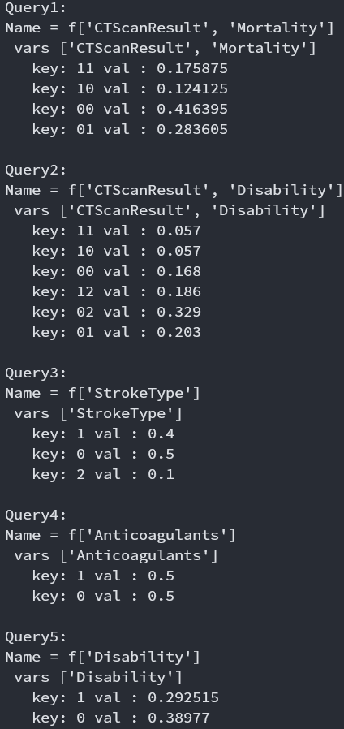
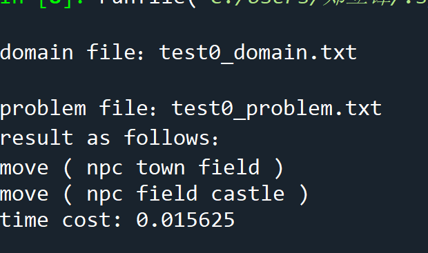
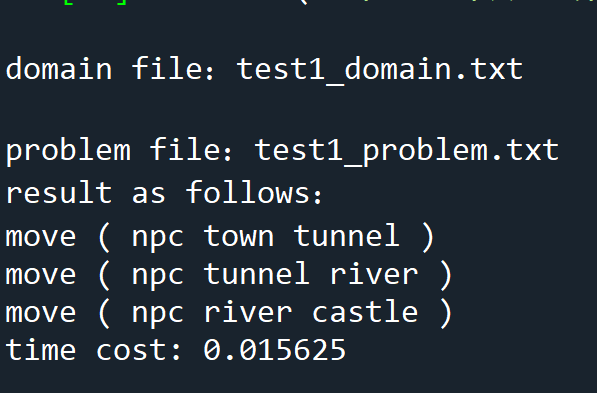
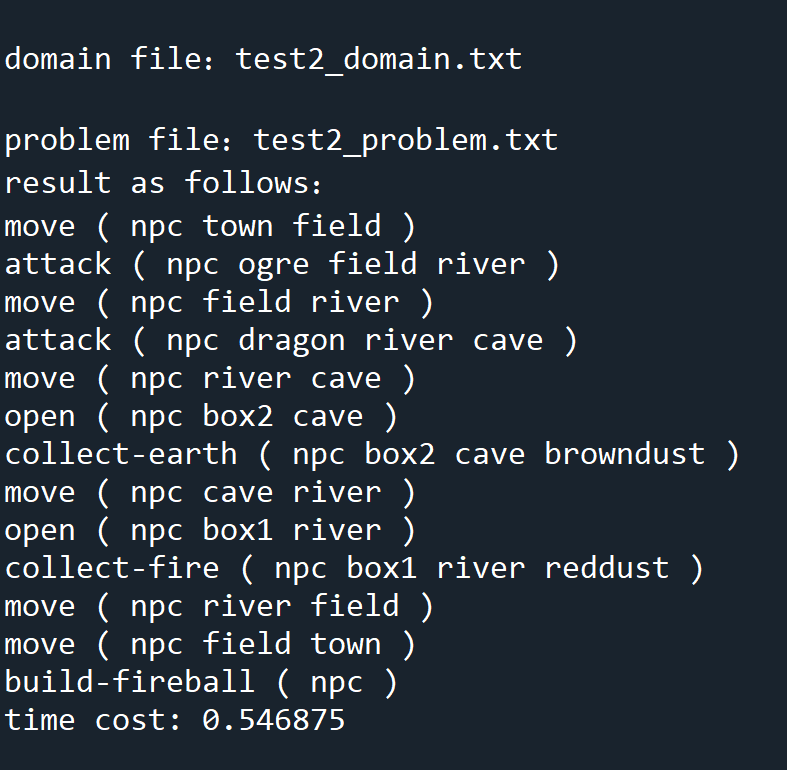
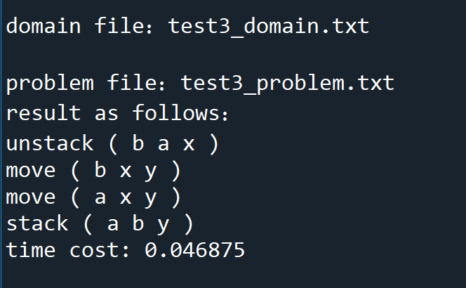
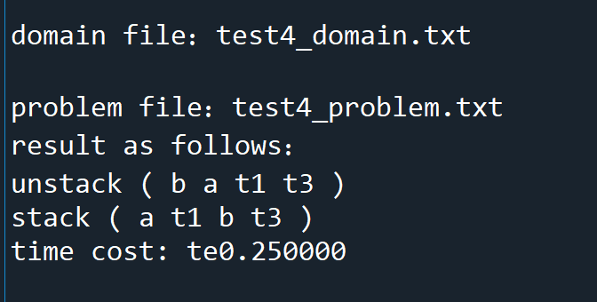

# P03

| 学号      | 姓名 | 专业(方向)     |
| -------  | ---- | -------------- |
| 18308045 18340229 | 谷正阳 周泰来 | 大数据 超算 |

### 1.task

#### task2

- Briefly describe with sentences the main ideas of  the VE algorithm. (10 points)
    1. 对于计算query variables的概率分布，我们传统的算法是使用贝叶斯网络显式地计算全部变量联合概率分布，再对hidden variables求和消除，从而得到结果。这是指数复杂度的。
    2. 比如如果根据贝叶斯网络我们要计算：
    $$P(DE)=\sum_{ABC}P(E|C)P(D|BC)P(C|A)P(B|A)P(A)$$
    。按照传统的做法，我们需要穷尽$A,B,C,D,E$的所有取值，计算概率分布
    $$P(E|C)P(D|BC)P(C|A)P(B|A)P(A)$$
    ，再对这个概率分布求和。这里面不难发现，对于$D,E$的每一个不同取值，都要算一次概率分布
    $$P(C|A)P(B|A)P(A)$$
    这样导致了很多重复计算。
    3. VE算法实际上运用了动态规划的思想。即算一次概率分布
    $$P(C|A)P(B|A)P(A)$$
    ，将其保存为新fact。注意，这里本质上是$P(ABC)$，有一个独立性假设
    $$P(ABC)=P(C|AB)P(B|A)P(A)=P(C|A)P(B|A)P(A)$$
    另外由于其他概率分布里，不以$A$为变量，所以可以提前对$A$求和，即消除$A$。
    $$P(BC)=\sum_A P(ABC)$$
    这样我们就获得了一个新的问题：
    $$P(DE)=\sum_{BC}P(E|C)P(D|BC)P(BC)$$
    。然后可以继续这样的变量消除计算。
    4. 我们也可以指定别的消除顺序，如：
    $$P(BD|AC)=P(D|ABC)P(B|AC)=P(D|BC)P(B|A)$$
    $$P(D|AC)=\sum_B P(BD|AC)$$
    $$P(DE)=\sum_{AC}P(E|C)P(D|AC)P(C|A)P(A)$$
    5. 对于给定evidence的问题，如$P(D,E|a)$，按照传统做法，我们可以先求：
    $$P(aDE)=\sum_{BC}P(E|C)P(D|BC)P(C|a)P(B|a)P(a)$$
    ，再根据贝叶斯公式：
    $$P(DE|a)=\frac{P(aDE)}{P(a)}=\frac{P(aDE)}{\sum_{DE}P(aDE)}$$
    所以本质上是求概率分布$P(aDE)$，实际上把先对所有概率分布$A=a$即可，同样也可以用变量消除。
- Implement the VE algorithm (C++ or Python) to calculate the following probability values: (10 points)
    1. VE算法原理见上，代码用的E09的实现。
    2. VE算法还有一种优化，Bucket Elimination。其思想是建立一个字典`buckets`，提前按照`variable:facts`的方式初始化`buckets`（这里每个fact只存储在按照order顺序找到的第一个bucket中）这样后续通过`variable`查询`facts`很快，且维护简单只需用新生成的`new_fact`的`varList`先生成一个集合`varSet`，然后再遍历后面的order，找到一个最近的`var in varSet`，将`new_fact`放入该bucket中。
    3. 下面进行复杂度分析。若有$m$个facts，order长度$n$，每个fact最多$w$个变量，注意这里一般$m\ge n$。则传统做法找facts的复杂度$O(nmw)$，Bucket Elimination建表加找facts加维护的复杂度$O(mw+n(1+w+n))=O(mw+n^2)$。由于一般$m\ge n$所以Bucket Elimination复杂度是更好的。
    4. Bucket Elimination还可以进行evidence的处理，实际上就是将order扩展为evidence+order，将evidence作为作为facts处理，如$A=a$等价于增加一个fact：
    $$P(A)=\begin{cases}
                1,&A=a\\
                0,&A\ne a
            \end{cases}$$
    5. Bucket Elimination部分参考[link](http://web.cs.iastate.edu/~jtian/cs673/cs673_spring05/lectures/cs262a-5.pdf)，代码见[Codes](#Codes)，结果见[Results](#Results)。
    6. 输入通过yaml格式，并对其进行处理，yaml格式的输入通过简单修改tex文件中给出的数据即可实现。
- Implement an algorithm to select a good order of variable elimination. (10 points)
    1. 由于变量消除的复杂度是$O(nc^w)$，只有order width $w$是可以通过选不同order调节的参数，因而需要最小化$w$。
    2. order width计算的算法参考理论课件。建立一个超图，节点表示变量，超边表示fact（超边用集合实现），每次变量消除就是对含消除节点的超边取并集并删去该节点，选出整个消除过程（可用Bucket Elimination优化）中新生成的最大的边大小。
    3. best order即先通过全排列获得所有可能的order，再从中选order width最小的，是一个NP难问题。
    4. min-degree order是一种能算出相对好的order的启发式方法。其思想是每一步贪婪地选一个变量使生成的fact最小。min-degree order由于每次要对不同的节点进行对比，而超图通过节点查超边的效率低（不能用Bucket Elimination的方法，因为预先没有order，无法建立一个没有重复facts的buckets）。所以这里建立了一张图，节点是变量，边表示两变量在同一个fact中，每次变量消除就是把消除节点的所有邻居相互连接并删去该节点。图使用邻接表法实现（`{节点:{邻居}}`）。
    5. min-fill order是一种通常来说更好的启发式方法。其思想是每一步选出需要增加边最少的节点。其与min-degree order相比，好处在于考虑节点X、Y，X有5个邻居但是邻居彼此相连，Y有3个邻居但是彼此不相连且构成fact大小均为2。如果是min-degree order会选择Y从而生成一个大小为3的fact，比之前大。如果是min-fill order会选择X从而生成一个大小为4的fact，但是由于邻居两两彼此连接因而意味着可能我们原本生成了一个这样的大小为5的fact，消除变量后大小变为4，fact大小变小了。而我们本来是希望全局的最大的fact大小最小，所以fact大小变小比找一个当前最小的fact大小通常要更优。
    6. 这部分实现同样参考了[link](http://web.cs.iastate.edu/~jtian/cs673/cs673_spring05/lectures/cs262a-5.pdf)。
- Compare the running times of the VE algorithm for different orders of variable elimination, and fill out the following table: For test cases p4 and p5, for each of the order selected by your algorithm and 5 other orders, report the elimination with, and the total running time of the VE algorithm. For each case, the first order of elimination should be the one chosen by your algorithm. Analyze the results. (20 points)
    见[Results](#Results)。


#### task1

* In this part, you will implement a simple STRIPS planner. The input of your planner is a PDDL domain file and a problem file in the STRIPS restriction, that is, preconditions of actions and the goal are conjunctions of atoms, and effects of actions are conjunctions of literals. The output of your planner is a sequence of actions to achieve the goal. 

* Describe with sentences the main ideas behind computing the heuristic for a state using reachability analysis from lecture notes. (10 points) 

  * 根据定理：松弛后的搜索问题的长度一定小于等于原搜索问题的长度，可以将计算松弛后的搜索问题的长度作为一种搜索的启发式函数。

  - 在求解规划问题的每一步中，将动作的 adds 加入谓词库中，并且把动作的 dels 从谓词库中删除。解决搜索问题的 A* 算法需要设计启发式函数，称从开始搜索到抵达目标采取的行动数为搜索的长度。
  - 启发式函数：先交叉计算每一层谓词集 S 和动作集 A，计算方法是 S0 为初始状态集，Ai 为 A(i-1) 和前提条件包含在 Si 中的动作的并集，Si 为 S(i-1) 和 A(i-1) 中所有动作的 adds 的并集，循环直到 SK 满足目标谓词集。得到每一层的 S 和 A 后，从 SK 开始递归反推到 S0，从而计算出启发式函数的值。具体反推的做法如下：每一层都有一个 G 和 一个 Si。初始 G 为目标集，初始S为SK，如果S为S0，返回0，否则将G分为GP和GN，GP为G与S(i-1)的交集，GN为G减去GP。在A(i-1) 中寻找 GN 的一个最小覆盖集，新的 G 是 GP 与最小覆盖集中动作的前提谓词的交集，返回最小动作集中动作的个数加上下一层递归函数的返回值

* Explain any ideas you use to speed up the implementation. (10 points)

  1、如果在输入的时候限定了 type的objects和动作的变量，可以利用type使得动作库的规模缩减，降低运行时间。

  2、在搜索的过程中，需要给动作赋值，然后将动作的前提库与当前的状态库进行比较，而给动作赋值就需要给动作的前提库、adds 库和 dels 库三个库里的谓词赋值，这样做需要耗费比较长时间。可以优化的方法是读取输入文件后获取这个搜索的动作以及object，并进行遍历获取赋值，之后便省去了大量时间，只需要比较行为就可以了。 

  3、在程序中合理的运用浅拷贝和深拷贝，对于不会改变列表值的函数或操作使用浅拷贝，对于 需要改变的部分使用深拷贝，这样也可以减少程序运行的开销，加速运行速度。 

* Run you planner on the 5 test cases, and report the returned plans and the running times. Analyse the experimental results. (10 points)

### 2.Codes<a id="Codes"></a>

#### task2

-  BucketElimination

    ```python
    class BucketElimination(VariableElimination):
        @staticmethod
        def inference(factorList, queryVariables,
                    orderedListOfHiddenVariables, evidenceList, len_domain):
            orderedListOfHiddenVariables = evidenceList.keys() + orderedListOfHiddenVariables
            buckets = {var: list() for var in orderedListOfHiddenVariables}
            query_bucket = list()
            for ev in evidenceList:
                new_var_list = [ev]
                new_node = Node("f" + str(new_var_list), new_var_list)
                new_cpt = dict()
                for i in range(len_domain[ev]):
                    if i == evidenceList[ev]:
                        new_cpt[str(i)] = 1.0
                    else:
                        new_cpt[str(i)] = 0.0
                new_node.setCpt(new_cpt)
                buckets[ev].append(new_node)
            for f in factorList:
                for var in orderedListOfHiddenVariables:
                    if var in f.varList:
                        buckets[var].append(f)
                        break
                else:
                    query_bucket.append(f)
            i = 0
            while i < len(orderedListOfHiddenVariables):
                var = orderedListOfHiddenVariables[i]
                bucket = buckets[var]
                i += 1
                if len(bucket) > 0:
                    new_factor = reduce(Node.multiply, bucket)
                    new_factor = new_factor.sumout(var)
                    varSet = new_factor.varList
                    for var in orderedListOfHiddenVariables[i:]:
                        if var in varSet:
                            buckets[var].append(new_factor)
                            break
                    else:
                        query_bucket.append(new_factor)

            res = query_bucket[0]
            for factor in query_bucket[1:]:
                res = res.multiply(factor)
            total = sum(res.cpt.values())
            res.cpt = {k: v/total for k, v in res.cpt.items()}
            return res
    ```

- orderWidth

    ```python
    @staticmethod
    def orderWidth(factorList, orderedListOfHiddenVariables,
                    evidenceList, len_domain):
        orderedListOfHiddenVariables = evidenceList.keys() + orderedListOfHiddenVariables
        buckets = {var: list() for var in orderedListOfHiddenVariables}
        for ev in evidenceList:
            buckets[ev].append({ev})
        for f in factorList:
            for var in orderedListOfHiddenVariables:
                if var in f.varList:
                    buckets[var].append(set(f.varList))
                    break
        num_var = len(len_domain)
        width = 0
        i = 0
        while i < len(orderedListOfHiddenVariables) and num_var > width:
            var = orderedListOfHiddenVariables[i]
            bucket = buckets[var]
            i += 1
            if len(bucket) > 0:
                new_edge = reduce(lambda x, y: x | y, bucket)
                new_edge.remove(var)
                for var in orderedListOfHiddenVariables[i:]:
                    if var in list(new_edge):
                        width = max(width, len(new_edge))
                        buckets[var].append(new_edge)
                        break
            num_var -= 1
        return width
    ```

- bestOrder

    ```python
    @staticmethod
    def bestOrder(factorList, queryVariables, evidenceList, len_domain):
        # queryVariables = set(queryVariables)
        # hidden = filter(
        #     lambda var: var not in queryVariables and var not in evidenceList, len_domain.keys())
        # def orderWidth(order):
        #     return VariableElimination.orderWidth(
        #         factorList, list(order), evidenceList, len_domain)
        # return list(min(itertools.permutations(hidden), key=orderWidth))
        return list(min(itertools.permutations(filter(lambda var: var not in set(queryVariables) and var not in evidenceList, len_domain.keys())), key=lambda order: VariableElimination.orderWidth(factorList, list(order), evidenceList, len_domain)))
    ```

- minDegreeOrder

    ```python
    @staticmethod
    def minDegreeOrder(factorList, queryVariables, evidenceList, len_domain):
        queryVariables = set(queryVariables)
        hidden = filter(
            lambda var: var not in queryVariables and var not in evidenceList, len_domain.keys())
        G = {var: set() for var in hidden}
        for f in factorList:
            varList = filter(
                lambda var: var not in queryVariables and var not in evidenceList, f.varList)
            varSet = set(varList)
            for var in varList:
                G[var].update(varSet)
        order = list()
        while len(hidden) > 0:
            min_var = min(hidden, key=lambda var: len(G[var]))
            for var in hidden:
                if min_var in G[var]:
                    G[var].remove(min_var)
            order.append(min_var)
            G_min_var = G[min_var]
            hidden.remove(min_var)
            for var in list(G_min_var):
                G[var].update(G_min_var)
        return order
    ```

- minFillOrder

    ```python
    @staticmethod
    def minFillOrder(factorList, queryVariables, evidenceList, len_domain):
        queryVariables = set(queryVariables)
        hidden = filter(
            lambda var: var not in queryVariables and var not in evidenceList, len_domain.keys())
        G = {var: set() for var in hidden}
        for f in factorList:
            varList = filter(
                lambda var: var not in queryVariables and var not in evidenceList, f.varList)
            varSet = set(varList)
            for var in varList:
                G[var].update(varSet)
        order = list()
        while len(hidden) > 0:
            min_var = min(hidden, key=lambda var: sum(
                (len(G[var] - G[v]) for v in list(G[var]))))
            for var in hidden:
                if min_var in G[var]:
                    G[var].remove(min_var)
            order.append(min_var)
            G_min_var = G[min_var]
            hidden.remove(min_var)
            for var in list(G_min_var):
                G[var].update(G_min_var)
        return order
    ```


#### task1 STRIPS planner

```python
#coding=utf-8
from functools import *
from itertools import * 
from copy import *
from time import *

movevec = []
prevec = []
iniku = []
goalyes = []
goalno = []
statelib = []
statecircle = []
types = []
ob = []
actionku = []

class pre(object):
    def __init__(self):
        self.name = ''
        self.order = []
        self.bian = []
        self.num = 0

    def dealpre(self,line):
        self.name = line[0][1:len(line[0])]
        self.order = []
        self.bian = []
        self.num = 0
        for i in range(1,len(line)):
            if(line[i][0]=='?'):
                self.num = self.num + 1

class move(object):
    def __init__(self,thename):
        self.name = thename
        self.par = []
        self.duplicate = []
        self.type = []
        self.precon = []
        self.prenot = []
        self.adds = []
        self.dels = []
    def para(self,line):
        for i in range(1,len(line)):
            if(line[i][0]=='?'):
                nowbian = line[i][1:len(line[i])]
                self.par.append(nowbian)
                self.duplicate.append(None)
            elif(line[i][0]=='(' and line[i][1]=='?'):
                nowbian = line[i][2:len(line[i])]
                self.par.append(nowbian)
                self.duplicate.append(None)
            elif(line[i][0]=='-'):
                nowtype = line[i][1:len(line[i])]
                if(nowtype[-1]==')'):
                    nowtype = nowtype[0:len(nowtype)-1]
                wei = -1
                for j in range(0,len(types)):
                    if(types[j]==nowtype):
                        wei = j
                        break
                if(wei==-1):
                    print("error!")
                else:
                    self.type.append(wei)
      
    def prec(self,line):
        zheng = 1
        shide = -1
        for i in range(0,len(line)):
            nowprec = line[i][1:len(line[i])]
            if(nowprec=='not'):
                zheng = -1
            else:
                shide = -1
                for j in range(0,len(prevec)):
                    if(prevec[j].name==nowprec):
                        shide = j
                        break
                if(shide!=-1):
                    num = prevec[shide].num
                    thisprec = pre()
                    thisprec.name = nowprec
                    for j in range(0,num):
                        nowbian = line[i+j+1][1:len(line[i+j+1])]
                        while 1:
                            if(nowbian[len(nowbian)-1]!=')'):
                                break
                            else:
                                nowbian = nowbian[0:len(nowbian)-1]
                        thisprec.bian.append(nowbian)
                        thisprec.order.append(None)
                    if(zheng==1):
                        self.precon.append(thisprec)
                    else:
                        self.prenot.append(thisprec)
                        zheng = 1

    def effe(self,line):
        zheng = 1
        shide = -1
        for i in range(0,len(line)):
            nowprec = line[i][1:len(line[i])]
            if(nowprec=='not'):
                zheng = -1
            else:
                shide = -1
                for j in range(0,len(prevec)):
                    if(prevec[j].name==nowprec):
                        shide = j
                        break
                if(shide!=-1):
                    num = prevec[shide].num
                    thisprec = pre()
                    thisprec.name = nowprec
                    for j in range(0,num):
                        nowbian = line[i+j+1][1:len(line[i+j+1])]
                        while 1:
                            if(nowbian[len(nowbian)-1]!=')'):
                                break
                            else:
                                nowbian = nowbian[0:len(nowbian)-1]
                        thisprec.bian.append(nowbian)
                        thisprec.order.append(None)
                    if(zheng==1):
                        self.adds.append(thisprec)
                    else:
                        self.dels.append(thisprec)
                        zheng = 1

def managedomain():
    filename = input("domain file：")
    f = open(filename,"r")
    status = 0
    movenum = 0
    while 1:
        oneline = f.readline()
        if(not oneline):
            break
        if(status==0):
            line = oneline.split()
            if(line[0]=='(:types'):
                for i in range(1,len(line)):
                    thetype = line[i]
                    if(thetype[-1]==')'):
                        thetype = thetype[0:len(thetype)-1]
                    types.append(thetype)
                    ob.append([])
            if(line[0]=='(:predicates'):
                status = 1
        elif(status==1):
            line = oneline.split()
            if(line[0]==')'):
                status = 2
            else:
                thisprec = pre()
                thisprec.dealpre(line)
                prevec.append(thisprec)
        elif(status==2):
            line = oneline.split()
            if(line[0]=='(:action'):
                movevec.append(move(line[1]))
                line = f.readline().split()
                movevec[movenum].para(line)
                line = f.readline().split()
                movevec[movenum].prec(line)
                line = f.readline().split()
                movevec[movenum].effe(line)
                line = f.readline()
                movenum = movenum + 1

def manageproblem():
    filename = input("problem file：")
    f = open(filename,"r")
    zheng = 1
    while 1:
        oneline = f.readline().split()
        if(not oneline):
            break
        if(oneline[0]=='(:init'):
            for i in range(0,len(oneline)):
                wei = -1
                nowprename = oneline[i][1:len(oneline[i])]
                for j in range(0,len(prevec)):
                    if(nowprename==prevec[j].name):
                        wei = j
                        break
                if(wei!=-1):
                    num = prevec[wei].num
                    thispre = pre()
                    thispre.name = nowprename
                    for j in range(0,num):
                        nowbian = oneline[i+j+1]
                        while 1:
                            if(nowbian[len(nowbian)-1]!=')'):
                                break
                            else:
                                nowbian = nowbian[0:len(nowbian)-1]
                        thispre.order.append(nowbian)
                    iniku.append(thispre)
        elif(oneline[0]=='(:goal'):
            for i in range(0,len(oneline)):
                wei = -1
                nowprename = oneline[i][1:len(oneline[i])]
                if(nowprename=='not'):
                    zheng = -1
                else:
                    for j in range(0,len(prevec)):
                        if(nowprename==prevec[j].name):
                            wei = j
                            break
                    if(wei!=-1):
                        num = prevec[wei].num
                        thispre = pre()
                        thispre.name = nowprename
                        for j in range(0,num):
                            nowbian = oneline[i+j+1]
                            while 1:
                                if(nowbian[len(nowbian)-1]!=')'):
                                    break
                                else:
                                    nowbian = nowbian[0:len(nowbian)-1]
                            thispre.order.append(nowbian)
                        if(zheng==1):
                            goalyes.append(thispre)
                        else:
                            goalno.append(thispre)
                            zheng = 1
        elif(oneline[0]=='(:objects'):
            while 1:
                oneline = f.readline().split()
                if(oneline[0]==')'):
                    break
                thislei = oneline[-1][1:len(oneline[-1])]
                for i in range(0,len(types)):
                    if(thislei==types[i]):
                        for j in range(0,len(oneline)-1):
                            ob[i].append(oneline[j])

def actduplicate(themove):
    onemove = move('')
    onemove = deepcopy(themove)
    for i in onemove.precon:
        for j in range(0,len(i.bian)):
            wei = -1
            for k in range(0,len(onemove.par)):
                if(i.bian[j]==onemove.par[k]):
                    wei = k
                    break
            if(wei==-1):
                print("error")
            else:
                i.order[j] = onemove.duplicate[wei]
    for i in onemove.prenot:
        for j in range(0,len(i.bian)):
            wei = -1
            for k in range(0,len(onemove.par)):
                if(i.bian[j]==onemove.par[k]):
                    wei = k
                    break
            if(wei==-1):
                print("error")
            else:
                i.order[j] = onemove.duplicate[wei]
    for i in onemove.adds:
        for j in range(0,len(i.bian)):
            wei = -1
            for k in range(0,len(onemove.par)):
                if(i.bian[j]==onemove.par[k]):
                    wei = k
                    break
            if(wei==-1):
                print("error")
            else:
                i.order[j] = onemove.duplicate[wei]
    for i in onemove.dels:
        for j in range(0,len(i.bian)):
            wei = -1
            for k in range(0,len(onemove.par)):
                if(i.bian[j]==onemove.par[k]):
                    wei = k
                    break
            if(wei==-1):
                print("error")
            else:
                i.order[j] = onemove.duplicate[wei]
    return onemove            

def getactionlib():
    for i in movevec:
        funum = len(i.par)
        if(funum==1):
            for d in product(ob[i.type[0]]):
                i.duplicate[0] = d[0]
                themove = actduplicate(i)
                actionku.append(themove)
        elif(funum==2):
            for d in product(ob[i.type[0]],ob[i.type[1]]):
                i.duplicate[0] = d[0]
                i.duplicate[1] = d[1]
                themove = actduplicate(i)
                actionku.append(themove)            
        elif(funum==3):
            for d in product(ob[i.type[0]],ob[i.type[1]],ob[i.type[2]]):
                i.duplicate[0] = d[0]
                i.duplicate[1] = d[1]
                i.duplicate[2] = d[2]
                themove = actduplicate(i)
                actionku.append(themove) 
        elif(funum==4):
            for d in product(ob[i.type[0]],ob[i.type[1]],ob[i.type[2]],ob[i.type[3]]):
                i.duplicate[0] = d[0]
                i.duplicate[1] = d[1]
                i.duplicate[2] = d[2]
                i.duplicate[3] = d[3]
                themove = actduplicate(i)
                actionku.append(themove) 
        else:
            print("error!")


def CountActions(G,num,theS,theA):
    if(num==0):
        return 0
    else:
        GP = []
        GN = []
        for i in G:
            if(isinku(i,theS[num-1])):
                GP.append(i)
            else:
                GN.append(i)
        NewG = deepcopy(GP)
        for i in theA[num-1]:
            for j in i.precon:
                if(isinku(j,NewG)==0):
                    NewG.append(j)
        newnum = num-1
        return CountActions(NewG,newnum,theS,theA) + len(theA[num-1])

def specantake(oneact,nowku):
    keyi = 1
    for i in oneact.precon:
        if(isinku(i,nowku)==0):
            keyi = 0
            break
    return keyi    


def heuristic(thestate):
    num = 0
    theS = []
    theA = []
    theS.append([])
    theS[0] = deepcopy(thestate.ku)
    lastnum = len(theS[0])
    while 1:
        if(isgoal(theS[num])==1):
            break
        else:
            theS.append([])
            theA.append([])
            num = num + 1
            theS[num] = deepcopy(theS[num-1])
            for i in actionku:
                if(specantake(i,theS[num-1])==1):
                    theA[num-1].append(i)
            for i in theA[num-1]:
                for j in i.adds:
                    if(isinku(j,theS[num])==0):
                        theS[num].append(j)
            thisnum = len(theS[num])
            if(lastnum==thisnum):
                return 10000
            else:
                lastnum = thisnum          
    if(num==0):
        return 0
    else:
        iniG = deepcopy(iniku)
        return CountActions(iniG,num,theS,theA)

def isgoal(theku):
    goalnum = 1
    for i in goalyes:
        if(isinku(i,theku)==0):
            goalnum = 0
            break
    return goalnum    

class state(object):
    def __init__(self):
        self.h = 0
        self.g = 0
        self.order = 0
        self.ku = []
        self.havetake = []

def isinku(onepre,preku):
    zai = 0
    for i in preku:
        if(i.name==onepre.name):
            deng = 1
            for j in range(0,len(i.order)):
                #print(onepre.order[j])
                #print(i.order[j])
                if(onepre.order[j]!=i.order[j]):
                    deng = 0
                    break
            if(deng==1):
                zai = 1
                break
    return zai 

def getgoal(nowstate):
    goalnum = 1
    for i in goalyes:
        if(isinku(i,nowstate.ku)==0):
            goalnum = 0
            break
    for i in goalno:
        if(isinku(i,nowstate.ku)==1):
            goalnum = 0
            break
    return goalnum


def cantake(oneact,nowku):
    keyi = 1
    for i in oneact.precon:
        if(isinku(i,nowku)==0):
            keyi = 0
            break
    if(keyi==1):
        for i in oneact.prenot:
            if(isinku(i,nowku)==1):
                keyi = 0
                break
    return keyi

def getnextstate(nowstate):
    nextstatelib = []
    thenum = 0
    for i in actionku:
        if(cantake(i,nowstate.ku)==1):
            nextstatelib.append(state())
            nextstatelib[thenum] = deepcopy(nowstate)

            for j in i.dels:
                if(isinku(j,nextstatelib[thenum].ku)==1):
                    wei = -1
                    for k in range(0,len(nextstatelib[thenum].ku)):
                        if(j.name==nextstatelib[thenum].ku[k].name):
                            deng = 1
                            for m in range(0,len(j.order)):
                                if(nextstatelib[thenum].ku[k].order[m]!=j.order[m]):
                                    deng = 0
                                break
                            if(deng==1):
                                wei = k
                                break    
                    if(wei==-1):
                        print("error!")
                    nextstatelib[thenum].ku.pop(wei)

            for j in i.adds:
                if(isinku(j,nextstatelib[thenum].ku)==0):
                    nextstatelib[thenum].ku.append(j)

            nextstatelib[thenum].g = heuristic(nextstatelib[thenum])
            nextstatelib[thenum].h = nowstate.h + 1
            nextstatelib[thenum].order = nextstatelib[thenum].g + nextstatelib[thenum].h
            nextstatelib[thenum].havetake.append(i)
            thenum = thenum + 1

    return nextstatelib


def huan(nowstate):
    zai = 0
    for i in statecircle:
        if(len(i.ku)==len(nowstate.ku)):
            shi = 1
            for j in nowstate.ku:
                if(isinku(j,i.ku)==0):
                    shi = 0
                    break
            if(shi==1):
                zai = 1
                break
    return zai

def cmp(a,b):
    if(a.order<b.order):
        return -1
    if(a.order>b.order):
        return 1
    return 0


def printpre(thepre,num):
    print(thepre.name)
    if(num==0):
        for i in thepre.bian:
            print(i,end = ' ')
    else:
        for i in thepre.order:
            print(i,end = ' ')
    print("")
    
def printmove(themove):
    print(themove.name,end = ' ( ')
    for i in themove.duplicate:
        print(i,end = ' ')
    print(")")

def printstate(thestate):
    print(thestate.g)
    print(thestate.h)
    print("\nku:")
    for i in thestate.ku:
        printpre(i, 1)
    print("\nmove:")
    for i in thestate.havetake:
        printmove(i)


def Astar():
    global statelib
    global statecircle
    while 1:
        nowstate = statelib.pop()
        if(getgoal(nowstate)==1):
            print("result as follows：")
            for i in nowstate.havetake:
                printmove(i)
            break
        else:
            nextstatelib = getnextstate(nowstate)
            for i in nextstatelib:
                if(huan(i)==0):
                    statelib.append(i)
                    statecircle.append(i)
            statelib = sorted(statelib,key=cmp_to_key(cmp))


ticks1 = process_time()
managedomain()
manageproblem()
getactionlib()
inistate = state()
inistate.ku = deepcopy(iniku)
inistate.g = heuristic(inistate)
inistate.h = 0
inistate.order = inistate.g + inistate.h
statelib.append(inistate)
statecircle.append(inistate)
Astar()
ticks2 = process_time()
print("time cost: %f"%(ticks2-ticks1))


```


### 3.Results<a id="Results"></a>

#### task2

- Implement the VE algorithm (C++ or Python) to calculate the following probability values: (10 points)
    
- Compare the running times of the VE algorithm for different orders of variable elimination, and fill out the following table: For test cases p4 and p5, for each of the order selected by your algorithm and 5 other orders, report the elimination with, and the total running time of the VE algorithm. For each case, the first order of elimination should be the one chosen by your algorithm. Analyze the results. (20 points)

|Testcase|Order method    |order                                                                                       |width|Order time  |VE time         |BE time         |
|--------|----------------|--------------------------------------------------------------------------------------------|-----|------------|----------------|----------------|
|p4      |Best Order      |['Disability', 'CTScanResult', 'MRIScanResult', 'StrokeType', 'Mortality']                  |2    |1587.2341 us|170.9441 us     |172.7306 us     |
|p4      |Min-Degree Order|['Disability', 'Mortality', 'CTScanResult', 'StrokeType', 'MRIScanResult']                  |2    |18.4208 us  |139.5542 us     |173.6564 us     |
|p4      |Min-Fill Order  |['Disability', 'CTScanResult', 'MRIScanResult', 'StrokeType', 'Mortality']                  |2    |48.3037 us  |166.1266 us     |172.8365 us     |
|p4      |Median Order    |['MRIScanResult', 'Disability', 'StrokeType', 'CTScanResult', 'Mortality']                  |3    |-           |201.1912 us     |255.08 us       |
|p4      |Worst Order     |['StrokeType', 'Mortality', 'MRIScanResult', 'CTScanResult', 'Disability']                  |5    |-           |546.5631 us     |786.0258 us     |
|p4      |Average Order   |-                                                                                           |-    |-           |254.334525 us   |323.230341667 us|
|p5      |Best Order      |['Anticoagulants', 'CTScanResult', 'PatientAge', 'MRIScanResult', 'StrokeType', 'Mortality']|2    |9006.1265 us|280.4427 us     |197.8579 us     |
|p5      |Min-Degree Order|['PatientAge', 'Anticoagulants', 'Mortality', 'CTScanResult', 'StrokeType', 'MRIScanResult']|2    |21.5814 us  |196.3944 us     |247.5501 us     |
|p5      |Min-Fill Order  |['Anticoagulants', 'CTScanResult', 'PatientAge', 'MRIScanResult', 'StrokeType', 'Mortality']|2    |61.1665 us  |262.3826 us     |197.0379 us     |
|p5      |Median Order    |['Anticoagulants', 'CTScanResult', 'StrokeType', 'PatientAge', 'MRIScanResult', 'Mortality']|4    |-           |579.2487 us     |668.1145 us     |
|p5      |Worst Order     |['StrokeType', 'Mortality', 'MRIScanResult', 'PatientAge', 'CTScanResult', 'Anticoagulants']|6    |-           |1596.0871 us    |1708.5908 us    |
|p5      |Average Order   |-                                                                                           |-    |-           |653.299398611 us|675.711248611 us|

分析：

- 这里的计时是统计1000次（Average Order则对每一个Order运行100次）获得结果。
- 第1、3行对比，第7、9行对比，可以看出order一样的情况下，耗时大致相等，说明计时相对稳定。
- 第1、2行对比，第7、8行对比，可以看出width不变的情况下，VE和BE的时间都有较大变化。由于VE有遍历找到factor立即`break`，而BE有遍历找到用来放新fact的bucket立即`break`，换句话说两者的最好时间开销和最差时间开销都是不一样的，因而可能会产生这样的影响。
- 总体来看VE和BE的耗时都差不多，由于几个例子$m=n=7$，$w\le6$，数据规模太小，无法体现时间复杂度的差异。
- 第1、2、3行与4、5、6行对比，第7、8、9行与10、11、12行对比，可以看出order width小的变量消除时间开销小，说明order width作为评价order优劣的标准很好。
- 第1、2、3行对比，第4、5、6行对比，可以看出三种方法都找到了最优的order，而计算order时间上Min-Degree Order和Min-Fill Order远好于Best Order，说明两种启发式方法都是能找到较好order的很好的启发式方法。
- 两种启发式方法的对比上，由于例子不是很好，无法体现哪一个更优。


#### task1

#### STRIPS planner运行结果如下

结合五个案例的复杂程度可以分析出到达目标状态所需的动作数越多的搜索耗时时间越长，搜索涉及的动作、谓词和物体越多越复杂搜索耗费的时间也越长











### 4.Experimental experience
1. 代码基于E09，理论课件，[link](http://web.cs.iastate.edu/~jtian/cs673/cs673_spring05/lectures/cs262a-5.pdf)。
2. 使用了python的一些语法，如`filter`，`map`，`reduce`，和用`key`的`min`，`max`，`sort`。
3. 使用了yaml格式来做输入。
4. 在程序中合理运用了浅拷贝和深拷贝，加快了效率
5. 在搜索过程中使用了环检测进行剪枝
