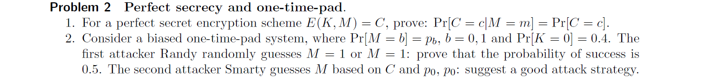
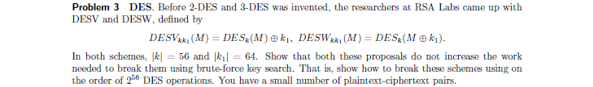
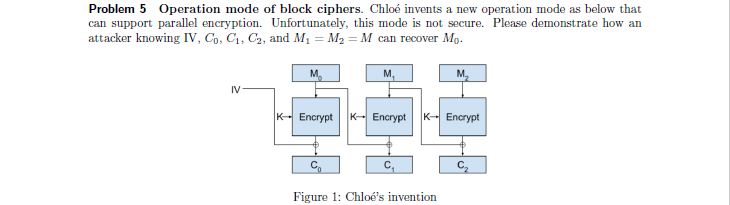

AB出现位置分别在$1$和$5$，相差$4$，有因数$2$，所以可能。
奇数位A出现$3$次，B出现$1$次，C出现$1$次，偶数位A出现$0$次，B出现$4$次，C出现$1$次。
$0.7=\frac{3+4}{10}$
$0.2=\frac{1+1}{10}$
$0.1=\frac{1+0}{10}$
所以可能是AB。

1. $\text{Pr}[C=c|M=m]=\frac{\text{Pr}[C=c\wedge M=m]}{\text{Pr}[M=m]}=\frac{\text{Pr}[M=m|C=c]\cdot\text{Pr}[C=c]}{\text{Pr}[M=m]}=\frac{\text{Pr}[M=m]\cdot\text{Pr}[C=c]}{\text{Pr}[M=m]}=\text{Pr}[C=c]$
2. 设$M'$为猜测。
$\begin{aligned}
&\text{Pr}[(M'=0\wedge M=0)\vee(M'=1\wedge M=1)]\\
=&\text{Pr}[M'=0\wedge M=0]+\text{Pr}[M'=1\wedge M=1]\\
=&\text{Pr}[M'=0]\cdot\text{Pr}[M=0]+\text{Pr}[M'=1]\cdot\text{Pr}[M=1]\\
=&0.5\cdot p_0+0.5\cdot(1-p_0)\\
=&0.5
\end{aligned}$
$\begin{aligned}
&\text{Pr}[M=0|C=c]\\
=&\frac{\text{Pr}[M=0\wedge C=c]}{\text{Pr}[C=c]}\\
=&\frac{\text{Pr}[M=0\wedge M\oplus K=c]}{\text{Pr}[(M=0\vee M\ne0)\wedge C=c]}\\
=&\frac{\text{Pr}[M=0\wedge K=c]}{\text{Pr}[(M=0\wedge K=c)\vee(M\ne0\wedge K\ne c)]}\\
=&\frac{\text{Pr}[M=0]\cdot\text{Pr}[K=c]}{\text{Pr}[M=0]\cdot\text{Pr}[K=c]+\text{Pr}[M\ne0]\cdot\text{Pr}[K\ne c]}\\
=&\frac{p_0\cdot\text{Pr}[K=c]}{p_0\cdot\text{Pr}[K=c]+(1-p_0)\cdot\text{Pr}[K\ne c]}\\
=&\begin{cases}
\frac{p_0\cdot0.4}{p_0\cdot0.4+(1-p_0)\cdot0.6},&c=0\\
\frac{p_0\cdot0.6}{p_0\cdot0.6+(1-p_0)\cdot0.4},&c=1
\end{cases}\\
=&\begin{cases}
\frac{2\cdot p_0}{3-p_0},&c=0\\
\frac{3\cdot p_0}{2+p_0},&c=1
\end{cases}
\end{aligned}$
所以$c=0$时，$p_0\ge\frac3 5$则估计$M'=0$否则估计$M'=1$；$c=1$时，$p_0\ge\frac2 5$则估计$M'=0$否则估计$M'=1$。

DESV：对于$(M,C)$枚举$k$，计算$2^{56}$次$DES_k(M)$，获得中间结果$m_1$。枚举$k_1$，计算$2^{64}$次$C\oplus k_1$，获得中间结果$m_2$，比对$m_1$和$m_2$，若相等则破解$k$和$k_1$，共$2^{56}$次DES运算。
DESW：对于$(M,C)$枚举$k$，计算$2^{56}$次$DES^{-1}_k(C)$，获得中间结果$m_1$。枚举$k_1$，计算$2^{64}$次$M\oplus k_1$，获得中间结果$m_2$，比对$m_1$和$m_2$，若相等则破解$k$和$k_1$，共$2^{56}$次DES运算。

Bob和Alice共享$p\cdot q=N$，$(p-1)(q-1)=\phi$，Bob知道Alice的公钥$(e_A,N)$，$\gcd(e_A,\phi)=1$且$e_A\cdot d_A\mod\phi=1$即$e_A\cdot d_A-k\cdot\phi=\gcd(e_A,\phi)$，用广义欧几里法可解$d_A$。

因为
$E(M_1,K)\oplus M_0=C_1$
$E(M_2,K)\oplus M_1=C_2$
所以
$E(M,K)\oplus M_0=C_1$
$E(M,K)\oplus M=C_2$
所以
$M_0\oplus M=E(M,K)\oplus M_0\oplus E(M,K)\oplus M=C_1\oplus C_2$
所以
$M_0=C_1\oplus C_2\oplus M$

