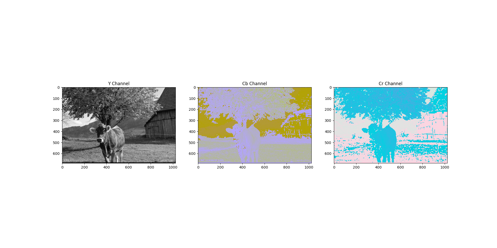

# jpeg

[toc]

## 概述

在此只实现了简单的JPEG压缩，二次采样使用4:4:4的方式，深度受限赫夫曼树的问题通过旋转操作解决。由于不明原因，图片需要使用[JPEGsnoop](https://github.com/ImpulseAdventure/JPEGsnoop)打开。

## 程序实现

### RGB转YCbCr

RGB图像转亮度色度表示，只需要进行如下线性变换：

```python
...
RGB2YCbCr_a = np.array([[0.299, -0.168935, 0.499813],
                        [0.587, -0.331665, -0.418531],
                        [0.114, 0.50059, -0.081282]])
RGB2YCbCr_b = np.array([[-127.5, 0, 0]])
...
class encoder(object):
    ...
    def RGB2YCbCr(self):
        self.img = ((self.img.reshape(-1, 3)) @ RGB2YCbCr_a).reshape(self.h, self.w, 3) + RGB2YCbCr_b
        return self
    ...
```

`RGB2YCbCr_b`的作用是转成到所需的$[-127.5,127.5]^3$空间。

### 二次采样

在此只实现了4:4:4的二次采样（也即不采样）。

### 离散余弦变换

将数据分成$8\times8$的块，并使用矩阵运算$F(u,v)=\textbf{T}_8\cdot f(i,j)\cdot\textbf{T}_8^T$：

```python
...
T8 = np.array([[np.cos((2 * j + 1) * i * np.pi / 16) / 2 if i > 0 else 1 / 8 ** 0.5 for j in range(8)] for i in range(8)])
T8_T = T8.T
...
class encoder(object):
    ...
    def DCT(self):
        for i in range(0, self.h, 8):
            for j in range(0, self.w, 8):
                for k in (0, 1, 2):
                    self.img[i:i+8, j:j+8, k] = T8 @ self.img[i:i+8, j:j+8, k] @ T8_T
        return self
    ...
```

### 量化

把分块的数据除以量化矩阵$Q_x$，再取整。如果量化矩阵内某一点值很大，块内对应的点会大概率变成0，也即被滤掉，这样会降低图像质量，但是后续压缩会利用这一点，因而也会增加压缩率。具体实现如下：

```python
class encoder(object):
    ...
    def quantize(self):
        for i in range(0, self.h, 8):
            for j in range(0, self.w, 8):
                self.img[i:i+8, j:j+8] = (self.img[i:i+8, j:j+8] / self.Qx).round().astype(np.int16)
        return self
    ...
```

$Q_x$是由默认量化矩阵$Q$使用质量因子做缩放得到的。质量因子越小量化矩阵的值越大，根据上面的讨论，图像质量越低，压缩率越高。量化矩阵是左上角（作用于直流分量和低频交流分量）小，右下角（作用域高频交流分量）大，因而会滤掉高频的交流分量而保留直流分量和低频交流分量。另外色度量化矩阵右下角的大数多于亮读量化矩阵，因而色度对高频交流分量的量化更多。设置$Q_x$的代码如下：

```python
...
Q = np.array([[[16, 11, 10, 16, 24, 40, 51, 61],
            [12, 12, 14, 19, 26, 58, 60, 55],
            [14, 13, 16, 24, 40, 57, 69, 56],
            [14, 17, 22, 29, 51, 87, 80, 62],
            [18, 22, 37, 56, 68, 109, 103, 77],
            [24, 35, 55, 64, 81, 104, 113, 92],
            [49, 64, 78, 87, 103, 121, 120, 101],
            [72, 92, 95, 98, 112, 100, 103, 99]],

            [[17, 18, 24, 47, 99, 99, 99, 99],
            [18, 21, 26, 66, 99, 99, 99, 99],
            [24, 26, 56, 99, 99, 99, 99, 99],
            [47, 66, 99, 99, 99, 99, 99, 99],
            [99, 99, 99, 99, 99, 99, 99, 99],
            [99, 99, 99, 99, 99, 99, 99, 99],
            [99, 99, 99, 99, 99, 99, 99, 99],
            [99, 99, 99, 99, 99, 99, 99, 99]],

            [[17, 18, 24, 47, 99, 99, 99, 99],
            [18, 21, 26, 66, 99, 99, 99, 99],
            [24, 26, 56, 99, 99, 99, 99, 99],
            [47, 66, 99, 99, 99, 99, 99, 99],
            [99, 99, 99, 99, 99, 99, 99, 99],
            [99, 99, 99, 99, 99, 99, 99, 99],
            [99, 99, 99, 99, 99, 99, 99, 99],
            [99, 99, 99, 99, 99, 99, 99, 99]]], dtype=np.uint8).transpose(1, 2, 0)
Q1 = np.ones((8, 8, 3), dtype=np.uint8)
...
class encoder(object):
    ...
    def set_qf(self, qf):
        assert 1 <= qf and qf <= 100
        if self.qf != qf:
            self.qf = qf
            if qf >= 50:
                self.scaling_factor = (100 - qf) / 50
            else:
                self.scaling_factor = 50 / qf
            if self.scaling_factor != 0:
                self.Qx = np.ceil((Q * self.scaling_factor)).astype(np.uint8)
            else:
                self.Qx = Q1
        return self
    ...
```

### JPEG前面阶段的可视化





### 交流分量的游程编码

将每一个块使用Z字扫描，将2d的块变成1d的数组，伪代码如下：

```python
for m in range(1, 15):
    min_m_7 = min(m, 7)
    for n in range(max(m - 7, 0), min_m_7 + 1):
        if m % 2:
            num = block[n, m - n]
        else:
            num = block[m - n, n]
        do_something(num)
```

根据量化后交流分量0多的特点，在此使用特殊的游程编码，$(RUNLENGTH,NUMBER)$，其中RUNLENGTH表示NUMBER前面0的数量，NUMBER表示当前数字。如果最后数字是一串0的话，用$(0,0)$表示结尾的一串0。另外，$RUNLENGTH$满足约束$RUNLENGTH\le15$，当出现连续0数量大于等于16时，使用$(15,0)$表示连续16个0。完整代码实现如下：

```python
class encoder(object):
    ...
    def RLE(self):
        for k in (0, 1, 2):
            AC = list()
            for i in range(0, self.h, 8):
                for j in range(0, self.w, 8):
                    zero_count = 0
                    for m in range(1, 15):
                        min_m_7 = min(m, 7)
                        for n in range(max(m - 7, 0), min_m_7 + 1):
                            if m % 2:
                                num = int(self.img[i + n, j + m - n, k])
                            else:
                                num = int(self.img[i + m - n, j + n, k])
                            if num == 0:
                                zero_count += 1
                            else:
                                while zero_count > 15:
                                    AC.append((15, 0))
                                    zero_count -= 16
                                AC.append((zero_count, num))
                                zero_count = 0
                    if zero_count != 0:
                        AC.append((0, 0))
            self.AC[k] = AC
        return self
    ...
```

### 直流分量的差分脉冲编码调制

由于图像相邻块的直流分量差别不大的特点，用相邻数的差值表示数值可以有较好的效果：

```python
class encoder(object):
    ...
    def DPCM(self):
        for k in (0, 1, 2):
            DC = list()
            last = 0
            for i in range(0, self.h, 8):
                for j in range(0, self.w, 8):
                    cur = int(self.img[i, j, k])
                    DC.append(cur - last)
                    last = cur
            self.DC[k] = DC
        return self
    ...
```

### 赫夫曼编码

#### 直流分量

对于直流分量，实际使用$(SIZE,AMPLITUDE)$来存储，这里的$AMPLITUDE$表示对单个直流分量值二进制编码表示，而$SIZE$表示编码的长度，这样解码的时候会先读取编码长度再根据长度读取编码，即可顺利读取该数。由于$AMPLITUDE$取值很多，采样分布稀疏，赫夫曼编码效果不好，所以对取值少的$SIZE$进行赫夫曼编码。$SIZE$可由以下公式计算：

```python
size = int(log2(abs(num))) + 1 if abs(num) > 0 else 0
```

由于YCbCr各通道取值范围$[-127.5,127.5]$，离散余弦变换后直流分量取值范围$[-1020,1020]$，相邻差值绝对值最大$2040$，因而$SIZE$最大$\lceil\log_2(2040)\rceil=11$。

直流分量赫夫曼编码构建代码如下（`build_Huffman_table`会在后续讲解）：

```python
class encoder(object):
    ...
    def DC_Huffman(self):
        for k, DC in enumerate(self.DC):
            if k != 2:
                root = float('-inf')
                edges = dict()
                counts = dict()
            for i in range(self.block_num):
                amplitude = DC[i]
                sign = amplitude > 0
                amplitude = abs(amplitude)
                size = int(np.log2(amplitude)) + 1 if amplitude > 0 else 0
                DC[i] = size, BitArray() if size == 0 else BitArray(uint=amplitude, length=size) if sign else ~BitArray(uint=amplitude, length=size)
                if size not in counts:
                    root = max(size, root)
                    counts[size] = 1
                else:
                    counts[size] += 1
            if k != 1:
                k //= 2
                self.DC_Huffman_encode[k] = dict()
                self.DC_Huffman_table[k] = [0] * 16
                build_Huffman_table(self.DC_Huffman_encode[k], self.DC_Huffman_table[k], root, edges, counts)
        return self
    ...
```

#### 交流分量

对于交流分量，实际使用$(Symbol1,Symbol2)$的方式存储，其中
$$Symbol1=RUNLENGTH<<4+SIZE$$
，$Symbol2$是$AMPLITUDE$，这里$AMPLITUDE$是交流分量中$NUMBER$的编码，$SIZE$是其编码长度。由于离散余弦变换后交流分量的$NUMBER$取值范围$[-510,510]$，因而$SIZE$最大$10<2^4-1$，因而$Symbol1$的低4位足够表示。而根据$RUNLENGTH\le15=2^4-1$的约束，$Symbol1$的高4位也足以表示$RUNLENGTH$。

另外根据上述计算$SIZE$的公式，有
$$SIZE=0,\text{iff.}NUMBER=0$$
，而
$$NUMBER=0,\text{iff.}RUNLENGTH=0\vee RUNLENGTH=15$$
，所以$Symbol1$总共$11\times16-14=162$种情况。

交流分量赫夫曼编码构建代码如下：

```python
class encoder(object):
    ...
    def AC_Huffman(self):
        for k, AC in enumerate(self.AC):
            if k != 2:
                root = float('-inf')
                edges = dict()
                counts = dict()
            for i in range(len(AC)):
                runlength, amplitude = AC[i]
                sign = amplitude > 0
                amplitude = abs(amplitude)
                size = int(np.log2(amplitude)) + 1 if amplitude > 0 else 0
                symbol1 = (runlength << 4) + size
                AC[i] = symbol1, BitArray() if size == 0 else BitArray(uint=amplitude, length=size) if sign else ~BitArray(uint=amplitude, length=size)
                if symbol1 not in counts:
                    root = max(symbol1, root)
                    counts[symbol1] = 1
                else:
                    counts[symbol1] += 1
            if k != 1:
                k //= 2
                self.AC_Huffman_encode[k] = dict()
                self.AC_Huffman_table[k] = [0] * 16
                build_Huffman_table(self.AC_Huffman_encode[k], self.AC_Huffman_table[k], root, edges, counts)
        return self
    ...
```

#### 编码长度受限赫夫曼编码构建

另外有约束，赫夫曼编码长度不超过$16$，即树高（只有一个节点视作树高$0$）不超过$16$。直流分量的$SIZE$根据上述讨论，只有$12$种状态，最差情况树高$12$，仍是足够的。而交流分量的$Symbol1$根据上述讨论，有$162$种状态，最优情况树高$\lceil\log_2(162)\rceil=8$尚且满足，而最差情况树高$162$远超约束。因而此处需要做一个权衡，降低树高，以满足约束。而这样做不免会导致期望编码长度不及以前，所以直观上，要对树做尽可能少的修改。

我的策略是从叶子节点开始，对树做类似平衡二叉树的旋转操作，直至满足约束。最差情况下，这棵树将十分接近一棵满二叉树（即对于节点数量$N$，树高$H$，有$2^H+1\le N\le 2^{H+1}-1$。

假设圆形表示节点，方形表示子树。这里定义的旋转操作是下图


转换成下图


这样直观上，好像树高降低了，但是其实不一定。因为方框表示子树，比如如果本身子树`l`和节点`r`的子树高度相同，旋转后树的高度反而增加了，因为`l`下移了一层。

为了解决这个问题，要增加约束：

1. 同层（即距离树根距离相同）的树高高的子树尽量右移（类似范式赫夫曼树），因而树高从左向右不严格递增，而且相邻子树高度相等当且仅当右边子树是满二叉树（即满足$N=2^{H+1}-1$）。
2. 对满足$2^H+1\le N\le 2^{H+1}-1$的树不使用旋转。
3. 对旋转后树高不变的树不旋转。

假设$h(num)$表示$num$子树的树高，$n(num)$表示$num$子树的节点个数。则旋转前有：
$$h(rr)=\max(h(rrl),h(rrr))+1=h(rrr)+1$$
，同理有：
$$h(r)=h(rrr)+2$$
$$h(num)=h(rrr)+3$$

另外根据约束1，有
$$h(l)\le h(r)$$
若
$$h(l)=h(r)$$
则有：
$$n(r)=2^{h(r)+1}-1$$
$$n(num)=n(l)+n(r)+1=n(l)+2^{h(r)+1}$$
$$2^{h(l)}+1=2^{h(r)}+1\le n(l)$$
则有：
$$2^{h(r)+1}+1=2^{h(num)}+1\le n(num)$$
根据约束2不旋转，所以要旋转的话，满足
$$h(l)\le h(r)-1=h(rrr)+1$$

而旋转后有：
$$h'(rr)=\max(h(rrl),h(rrr))+1=h(rrr)+1$$
$$h'(r)=\max(h(l),h(rl))+1$$
$$h'(num)=\max(h(l),h(rl),h(rrr))+2$$
因为
$$h(l)\le h(rrr)+1$$
$$h(rl)\le h(rr)=h(rrr)+1$$
所以若
$$h(l)>h(rrr)\vee h(rl)>h(rrr)$$
则：
$$h(num)=h'(num)$$
根据约束3不旋转，所以要旋转的话，满足
$$h(l),h(rl)\le h(rrr)$$
综上，得证满足该约束下，旋转后有：
$$h'(num)<h(num)$$
另外，上述证明中发现令树高增加的情况只有不满足约束2的情况，因而约束23可以合并，合并后约束：

1. 同层（即距离树根距离相同）的树高高的子树尽量右移（类似范式赫夫曼树），因而树高从左向右不严格递增，而且相邻子树高度相等当且仅当右边子树是满二叉树（即满足$N=2^{H+1}-1$）。
2. 对旋转后树高不减少的树不旋转。

虽然合并后约束2看似废话，但实际上根据上述证明旋转后树高增加则说明当前已经是能达到的最小树高，而旋转后树高不变则违反了尽量少地改变树的原则。

约束1的右移操作如下：

```python
def shift_right_subtree(num, edges, heights):
    q = Queue()
    q.put((num, 0))
    table = list()
    while not q.empty():
        num, size = q.get()
        if size == len(table):
            table.append(list())
        table[size].append(num)
        if num in edges:
            l, r = edges[num]
            new_size = size + 1
            q.put((l, new_size))
            q.put((r, new_size))
    cur_level = table.pop()
    while len(table) > 0:
        last_level = table.pop()
        last_level_idx = len(last_level)
        cur_level.sort(key=lambda num:heights[num])
        while len(cur_level) > 0:
            last_level_idx -= 1
            while last_level[last_level_idx] not in edges:
                last_level_idx -= 1
            last_level_num = last_level[last_level_idx]
            r, l = cur_level.pop(), cur_level.pop()
            edges[last_level_num] = [l, r]
            heights[last_level_num] = heights[r] + 1
        cur_level = last_level
```

通过旋转操作，约束树高为$15$代码如下：

```python
def limit_length_15(num, edges, heights):
    if heights[num] > 15:
        st1 = [(num, 15)]
        st2 = [(num, 15)]
        while len(st1) > 0:
            num, limit = st1.pop()
            l, r = edges[num]
            new_limit = limit - 1
            if l in edges:
                st1.append((l, new_limit))
                if heights[l] > new_limit:
                    st2.append((num, limit))
            if r in edges:
                st1.append((r, new_limit))
                if heights[r] > new_limit:
                    st2.append((num, limit))
        while len(st2) > 0:
            num, limit = st2.pop()
            l, r = edges[num]
            height_l, height_r = heights[l], heights[r]
            edges[num] = [l, r] if height_l <= height_r else [r, l]
            heights[num] = max(height_l, height_r) + 1
            if heights[num] > limit:
                rl, rr = edges[r]
                height_rl, height_rr = heights[rl], heights[rr]
                height_r = max(height_l, height_rl) + 1
                height_num = max(height_r, height_rr) + 1
                if height_num < heights[num]:
                    edges[r] = [l, rl]
                    edges[num] = [r, rr]
                    shift_right_subtree(num, edges, heights)
```

建赫夫曼树的节点时，对两个子节点分别使用`limit_length_15`限制其树高$15$，从而实现每次构建节点树高不超过$15+1=16$。另外，每次构建节点后，对该节点使用`shift_right_subtree`使其满足约束1。赫夫曼树构建代码如下：

```python
def build_Huffman_table(Huffman_encode, Huffman_table, root, edges, counts):
    pq = PriorityQueue()
    heights = dict()
    for num, count in counts.items():
        pq.put((count, num))
        heights[num] = 0
    while pq.qsize() > 1:
        count1, num1 = pq.get()
        limit_length_15(num1, edges, heights)
        count2, num2 = pq.get()
        limit_length_15(num2, edges, heights)
        new_count = count1 + count2
        root += 1
        edges[root] = [num1, num2]
        shift_right_subtree(root, edges, heights)
        pq.put((new_count, root))
    q = Queue()
    q.put((root, 0))
    code = BitArray('0b0')
    while not q.empty():
        num, size = q.get()
        if num in edges:
            l, r = edges[num]
            new_size = size + 1
            q.put((l, new_size))
            q.put((r, new_size))
        else:
            code += size - len(code)
            Huffman_encode[num] = code
            code = BitArray(uint=code.uint + 1, length=len(code) + (code.int == -1))
            Huffman_table[size - 1] += 1
            Huffman_table.append(num)
```

## 视觉效果和压缩效果比较

由于不明原因，我转换出的JPEG文件使用普通阅览器打不开，需要使用JPEG解析工具[JPEGsnoop](https://github.com/ImpulseAdventure/JPEGsnoop)才能打开。下面JPEG文件都是对该工具展示图片的截图。猜测原因可能是使用了自定义的赫夫曼表或未使用4:2:0的二次采样。GIF文件使用`matplotlib.pyplot.imsave`生成。

### 动物卡通图片

#### 原图


#### GIF：438KB


在大色块的地方没有失真，在渐变色的地方（狮子头发，河马鼻子）出现了色带。

#### JPEG

##### qf=100：512KB


基本没有失真，但压缩率低于GIF。

##### qf=99：392KB


比qf=100略有失真，但压缩率高于GIF。

### 动物照片

#### 原图


#### GIF：706KB


基本没有失真。

#### JPEG

#### qf=100：813KB


基本没有失真，但压缩率低于GIF。

#### qf=99：630KB


比qf=99略有失真，但压缩率高于GIF。

### 总结

动物卡通图片的颜色较多，多种动物颜色不同，甚至有的动物有多种颜色（鹦鹉，含渐变色的动物），导致没有存储渐变色这种不太重要的颜色，因而产生色带。因而JPEG明显好于GIF。动物照片颜色较少两种方法效果类似。
