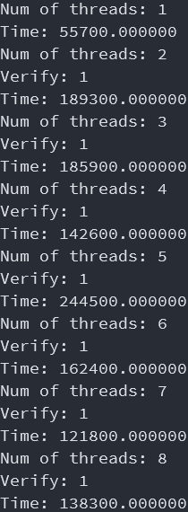
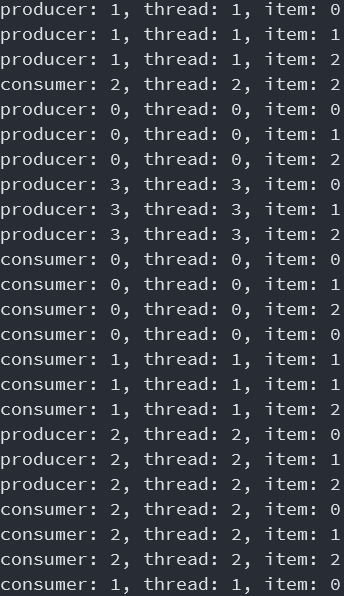

<script type="text/javascript" src="http://cdn.mathjax.org/mathjax/latest/MathJax.js?config=default"></script>
<center><font size=7>并行与分布式作业</font></center>
<center><font size=5>&nbsp;</font></center>
<center><font size=5>OpenMp和MPI</font></center>
<center><font size=5>第五次作业</font></center>
<center><font size=5>&nbsp;</font></center>
<center><font size=5>&nbsp;</font></center>
<center><font size=5>&nbsp;</font></center>
<center><font size=5>&nbsp;</font></center>
<center><font size=5>&nbsp;</font></center>
<center><font size=5>&nbsp;</font></center>
<center><font size=5>&nbsp;</font></center>
<center><font size=5>&nbsp;</font></center>
<center><font size=5>&nbsp;</font></center>
<center><font size=5>&nbsp;</font></center>
<center><font size=5>&nbsp;</font></center>
<center><font size=5>姓名：谷正阳</font></center>
<center><font size=5>班级：行政一班</font></center>
<center><font size=5>学号：18308045</font></center>
<div style="page-break-after: always;"></div>

### 一、问题描述
1. Consider a sparse matrix stored in the compressed row format (you may find
a description of this format on the web or any suitable text on sparse linear
algebra). Write an OpenMP program for computing the product of this matrix
with a vector. Download sample matrices from the Matrix Market
(http://math.nist.gov/MatrixMarket/) and test the performance of your
implementation as a function of matrix size and number of threads.
2. Implement a producer-consumer framework in OpenMP using sections to
create a single producer task and a single consumer task. Ensure appropriate
synchronization using locks. Test your program for a varying number of
producers and consumers.
3. 利用MPI通信程序测试本地进程以及远程进程之间的通信时延和带宽。
### 二、解决方案
1. 
- CRS的格式描述如下：https://mc-stan.org/docs/2_22/functions-reference/CSR.html
- HB的格式描述如下：https://math.nist.gov/MatrixMarket/formats.html#hb
- 可以看出HB刚好是CRS的转置，为了方便运算将HB格式看作是CRS格式，问题相当于求Matrix Market上获得矩阵的转置右乘一个向量。
- 定义如下数据结构：
```C++
struct CRS
{
    float *val;
    size_t *col_ind;
    size_t *row_ptr;
    size_t row;
};
```

- 第三行第一个1138是矩阵行数，第二个1138是矩阵列数，2596是矩阵非零元素数。因为是看作该矩阵的转置，所以第二个1138作为矩阵列数`row`，2596作为矩阵`val`和`col_ind`数组的长度。
- 另外注意到，HB格式一行长度80，加上尾部的`'\n'`即81个字符。所以可以通过`fseek`更改光标的位置，来读取数据。
```C++
fseek(fp, 2 * 81 + 28, SEEK_SET);
size_t n;
CRS crs;
fscanf(fp, "%zu%zu", &crs.row, &n);
```
- 后面三个块分别对应`row_ptr`，`col_ind`，`val`。
- CRS格式稀疏矩阵的乘法比较简单，每行只对非零元素做乘法求和即可。
```C++
void mul(Vec ans, CRS crs, Vec vec, unsigned char num_t = 1)
{
#pragma omp parallel for num_threads(num_t)
    for (int i = 1; i <= crs.row; i++)
    {
        //printf("i = %zu, ThreadId = %d\n", i, omp_get_thread_num());
        ans.val[i] = 0;
        for (size_t j = crs.row_ptr[i]; j < crs.row_ptr[i + 1]; j++)
        {
            ans.val[i] += vec.val[crs.col_ind[j]] * crs.val[j];
        }
    }
}
```
2. 
- 生产者消费者模型描述如下：https://zh.wikipedia.org/zh-hans/%E7%94%9F%E4%BA%A7%E8%80%85%E6%B6%88%E8%B4%B9%E8%80%85%E9%97%AE%E9%A2%98
- 生产者生产后若队不满产品入队，否则等待队空。若队非空产品出队消费者消费，否则等待队非空。
- RC问题的考虑1：多个生产者之间都会读写队尾和队尾指针，同时读写可能会出现RC问题。多个消费者之间都会读写队首和队首指针，同时读写可能会出现RC问题。因而分别各使用一个锁保证互斥关系。
```C++
omp_set_lock(&(bp->back_mutex));
while (bp->front == (bp->back + 1) % Q_MAX_SIZE)
    ;
bp->push(item);
omp_unset_lock(&(bp->back_mutex));
```
```C++
omp_set_lock(&(bp->front_mutex));
while (bp->front == bp->back)
    ;
int item = bp->pop();
omp_unset_lock(&(bp->front_mutex));
```
- RC问题的考虑2：当队空时该步两个指针相等下一步指针相邻，可能会出现问题。考虑此时队空，若`push`过程先修改尾指针再写队尾，则修改完尾指针后，可能消费者挑出循环，然后执行`pop`，这时队内没有元素，出错。然而如果`push`先写队尾再修改尾指针，则消费者一定会`push`后跳出循环。
```C++
void Buffer::push(int item)
{
    queue[back] = item;
    back = (back + 1) % Q_MAX_SIZE;
}
```
- 综上，两个锁分别保证生产者之间的互斥关系和消费者之间的互斥关系即可。
```C++
struct Buffer
{
    int queue[Q_MAX_SIZE];
    size_t front;
    size_t back;
    omp_lock_t front_mutex;
    omp_lock_t back_mutex;
    Buffer();
    ~Buffer();
    void push(int item);
    int pop();
};
```
3. 
- 带宽通过用大数组的吞吐量近似。大数组从master发送至slave再发回master记录时间。
- 注意有非纯传输数据的时间，通过将`count`设为0，测量一次非串数数据的时间，再将`count`设为大数组的元素数，测量时间，做差即为latency，进而算出吞吐量。
测量非传输数据的时间：
```C
for (size_t i = 0; i < TIMES; i++)
{
    if (rank == 0)
    {
        start = MPI_Wtime();
        MPI_Send(arr, 0, MPI_INT, 1, 0, MPI_COMM_WORLD);
    }
    if (rank == 1)
    {
        MPI_Recv(arr, 0, MPI_INT, 0, 0, MPI_COMM_WORLD, &status);
        MPI_Send(arr, 0, MPI_INT, 0, 0, MPI_COMM_WORLD);
    }
    if(rank == 0)
    {
        MPI_Recv(arr, 0, MPI_INT, 1, 0, MPI_COMM_WORLD, &status);
        end = MPI_Wtime();
        process += (end - start) / 2;
    }
    MPI_Barrier(MPI_COMM_WORLD);
}
if (rank == 0)
{
    process /= TIMES;
}
MPI_Barrier(MPI_COMM_WORLD);
```
测量总时间：
```C
if (rank == 0)
{
    start = MPI_Wtime();
    MPI_Send(arr, SIZE, MPI_INT, 1, 0, MPI_COMM_WORLD);
}
if (rank == 1)
{
    MPI_Recv(arr, SIZE, MPI_INT, 0, 0, MPI_COMM_WORLD, &status);
    MPI_Send(arr, SIZE, MPI_INT, 0, 0, MPI_COMM_WORLD);
}
if(rank == 0)
{
    MPI_Recv(arr, SIZE, MPI_INT, 1, 0, MPI_COMM_WORLD, &status);
    end = MPI_Wtime();
    printf("Latency: %lf s\n", (end - start) / 2 - process);
    printf("Bandwidth: %lf Bps\n", SIZE * sizeof(int) / ((end - start) / 2 - process));
}
```
### 三、实验结果
1. 以1线程计算结果为标准答案，核对多线程答案，以说明无RC问题发生。发现1线程，5线程，8线程效果较好。多线程性能提升不大，考虑数组太小，且稀疏数组，只对非零元素做运算。

2. 4个producer，3个consumer，每个producer生产3个item。thread表明调度情况。

3. 以两台机器作为两节点运行。

### 四、遇到的问题及解决方法
**问题1.** 将sections和for嵌套，sections区分生产者和消费者，for区分不同的生产者和不同的消费者。但是嵌套后整体变成串行。
**解决1.** 加`omp_set_nested(1);`，以允许嵌套。

**问题2.** MPI环境的搭建。
**解决2.** 在Windows系统主机上使用WSL搭建MPI环境，在另一台Ubuntu系统主机上直接搭建MPI环境。

**问题3.** 在WSL的非图形界面上代码编辑。
**解决3.** 安装neovim，使用合适的插件和设置。

**问题4.** 两台主机文件的传送。
**解决4.** 在Ubuntu系统主机上搭建SSH服务器，在Windows系统主机上使用WinSCP连接Ubuntu系统主机的SFTP。

**问题5.** 两台主机的通信。
**解决5.** 在Ubuntu系统主机上添加和WSL用户名一样的用户，WSL上也搭建SSH服务器，两台主机都使用ssh-keygen，生成私钥和公钥，并各自将公钥拷贝到另一台主机上，实现免密登录。并将在WSL中编译后的文件拷贝到Ubuntu系统主机的相同的路径中。

**问题6.** 普通用户权限。
**解决6.** 使用chmod 777修改拷贝到Ubuntu系统主机上文件的权限，使新建的普通用户可以访问。