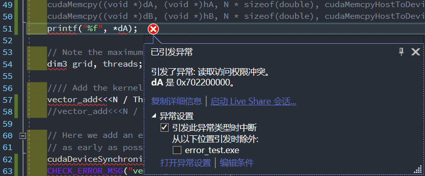

<script type="text/javascript" src="http://cdn.mathjax.org/mathjax/latest/MathJax.js?config=default"></script>
<center><font size=7>并行与分布式作业</font></center>
<center><font size=5>&nbsp;</font></center>
<center><font size=5>CUDA</font></center>
<center><font size=5>第六次作业</font></center>
<center><font size=5>&nbsp;</font></center>
<center><font size=5>&nbsp;</font></center>
<center><font size=5>&nbsp;</font></center>
<center><font size=5>&nbsp;</font></center>
<center><font size=5>&nbsp;</font></center>
<center><font size=5>&nbsp;</font></center>
<center><font size=5>&nbsp;</font></center>
<center><font size=5>&nbsp;</font></center>
<center><font size=5>&nbsp;</font></center>
<center><font size=5>&nbsp;</font></center>
<center><font size=5>&nbsp;</font></center>
<center><font size=5>姓名：谷正阳</font></center>
<center><font size=5>班级：行政一班</font></center>
<center><font size=5>学号：18308045</font></center>
<div style="page-break-after: always;"></div>

### 一、问题描述
###### CUDA-homework-1：
Start from the provided skeleton code error-test.cu that provides some convenience macros for error checking. The macros are defined in the header file error_checks_1.h. Add the missing memory allocations and copies and the kernel launch and check that your code works.
1. What happens if you try to launch kernel with too large block size? When do you catch the error if you remove the cudaDeviceSynchronize() call?
2. What happens if you try to dereference a pointer to device memory in host code?
3. What if you try to access host memory from the kernel?
Remember that you can use also cuda-memcheck!If you have time, you can also check what happens if you remove all error checks and do the same tests again.

###### CUDA-homework-2:
In this exercise we will implement a Jacobi iteration which is a very simple finite-difference scheme. Familiarize yourself with the provided skeleton. Then implement following things:
1. Write the missing CUDA kernel sweepGPU that implements the same algorithm as the sweepCPU function. Check that the reported averate difference is in the order of the numerical accuracy.
2. Experiment with different grid and block sizes and compare the execution times.
### 二、解决方案
###### CUDA-homework-1：
首先要为`dA`，`dB`，`dC`分配存储。
```C++
CUDA_CHECK(cudaMalloc((void **)&dA, sizeof(double) * N));
CUDA_CHECK(cudaMalloc((void **)&dB, sizeof(double) * N));
CUDA_CHECK(cudaMalloc((void **)&dC, sizeof(double) * N));
```
然后要用host数据`hA`，`hB`为待相加矩阵的device数据`dA`，`dB`初始化。注意第三个参数是存储大小，而非存储元素数。
```C++
CUDA_CHECK(cudaMemcpy((void *)dA, (void *)hA, N * sizeof(double), cudaMemcpyHostToDevice));
CUDA_CHECK(cudaMemcpy((void *)dB, (void *)hB, N * sizeof(double), cudaMemcpyHostToDevice));
```
然后增加调用。通过观察`vector_add`函数，可以发现是一维索引。因而右如下形式调用。
```C++
vector_add<<<N / ThreadsInBlock + 1, ThreadsInBlock>>>(dC, dA, dB, N);
```
然后是用device数据`dC`为相加结果host数据`hC`赋值。
```C++
CUDA_CHECK(cudaMemcpy((void *)hC, (void *)dC, N * sizeof(double), cudaMemcpyDeviceToHost));
```
最后是为`dA`，`dB`，`dC`释放存储。
```C++
CUDA_CHECK(cudaFree((void *)dA));
CUDA_CHECK(cudaFree((void *)dB));
CUDA_CHECK(cudaFree((void *)dC));
```
1.由于一个block最多1024个threads。所以小于等于1024时可以正常运行，大于1024时报错。在此分别用`128`，`1024`，`1025`来验证。
```C++
//const int ThreadsInBlock = 128;
const int ThreadsInBlock = 1024;
//const int ThreadsInBlock = 1025;
```
`cudaDeviceSynchronize`会阻塞当前程序的执行，直到所有任务都处理完毕。因而可以使之在`vector_add`内出错，然后增加任务处理时间，观察有无`cudaDeviceSynchronize`的区别。
在`vector_add`内出错。
```C++
//vector_add<<<N / ThreadsInBlock + 1, ThreadsInBlock>>>(dC, dA, dB, N);
vector_add<<<N / ThreadsInBlock + 1, ThreadsInBlock>>>(hC, hA, hB, N);
```
在`vector_add`内加一段空转，使任务不会很快执行完。
```C++
__global__ void vector_add(double *C, const double *A, const double *B, int N)
{
    // Add the kernel code
    int idx = blockIdx.x * blockDim.x + threadIdx.x;

    if (idx == N - 1)
    {
		for (int i = 0; i < 1000; i++);
    }
    // Do not try to access past the allocated memory
    if (idx < N)
    {
        C[idx] = A[idx] + B[idx];
    }
}
```
2.在host代码中解引用device数据。
```C++
CUDA_CHECK(cudaMalloc((void **)&dA, sizeof(double) * N));
CUDA_CHECK(cudaMalloc((void **)&dB, sizeof(double) * N));
CUDA_CHECK(cudaMalloc((void **)&dC, sizeof(double) * N));
CUDA_CHECK(cudaMemcpy((void *)dA, (void *)hA, N * sizeof(double), cudaMemcpyHostToDevice));
CUDA_CHECK(cudaMemcpy((void *)dB, (void *)hB, N * sizeof(double), cudaMemcpyHostToDevice));
/*cudaMalloc((void **)&dA, sizeof(double) * N);
cudaMalloc((void **)&dB, sizeof(double) * N);
cudaMalloc((void **)&dC, sizeof(double) * N);
cudaMemcpy((void *)dA, (void *)hA, N * sizeof(double), cudaMemcpyHostToDevice);
cudaMemcpy((void *)dB, (void *)hB, N * sizeof(double), cudaMemcpyHostToDevice);*/
printf("%f", *dA);
```
3.在device代码中解引用host数据。方案在1中体现。

###### CUDA-homework-2:
1.`sweepGPU`。观察`sweepCPU`，是一个嵌套的`for`，表明是二维的，且不通迭代之间无依赖关系。另外`i`，`j`均是从`1`到`N - 2`。所以使用如下二维索引：
```C++
void sweepGPU(double* phi, const double* phiPrev, const double* source,
	double h2, int N)
{
	int i, j;
	int index, i1, i2, i3, i4;

	i = threadIdx.x + blockIdx.x * blockDim.x + 1;
	j = threadIdx.y + blockIdx.y * blockDim.y + 1;
	if (i < N - 1 && j < N - 1)
	{
		index = i + j * N;
		i1 = (i - 1) + j * N;
		i2 = (i + 1) + j * N;
		i3 = i + (j - 1) * N;
		i4 = i + (j + 1) * N;
		phi[index] = 0.25 * (phiPrev[i1] + phiPrev[i2] +
			phiPrev[i3] + phiPrev[i4] -
			h2 * source[index]);
	}
}
```
sweepGPU启动过程。
```C++
sweepGPU<<<dimGrid, dimBlock>>>(phiPrev_d, phi_d, source_d, h * h, N);
sweepGPU<<<dimGrid, dimBlock>>>(phi_d, phiPrev_d, source_d, h * h, N);
```
由于最后是比较`phi`和`phi_cuda`的结果，所以考虑将计算结果拷贝给`phi_cuda`。
```C++
CUDA_CHECK(cudaMemcpy(phi_cuda, phi_d, size, cudaMemcpyDeviceToHost));
```
释放存储。
```C++
cudaFree(source_d);
cudaFree(phi_d);
cudaFree(phiPrev_d);
```
2.由于一个block中最多1024个threads，而且有`dim3 dimBlock(blocksize, blocksize);`，所以一个block中有$blocksize^2$个threads。所以`blocksize`从1到32。调换一下代码的顺序，并注释掉一部分没必要的打印。
### 三、实验结果
###### CUDA-homework-1：
1.`ThreadsInBlock = 128`正常运行：

`ThreadsInBlock = 1024`正常运行：

`ThreadsInBlock = 1025`出错：

保留`cudaDeviceSynchronize`出错结果：

不保留`cudaDeviceSynchronize`且增加空转时间出错结果：

发现没有了报错字符串，但是仍然会报错。经断点调试，发现`cudaMemcpy`，`cudaFree`也起到阻塞的作用，且会在`CUDA_CHECK`报错。
不保留`CUDA_CHECK`：

发现不报错了。因为没有`cudaDeviceSynchronize`不会等待任务执行完后继续执行，而任务执行完后已经没有报错语句了。
2.在host代码中解引用device数据出错：

值得注意的是，这是直接在IDE中引发异常。应该是device存储地址不是合法的用户地址空间。到此结束执行，因而有无`CUDA_ERROR_MSG`和`CUDA_CHECK`都无影响：

3.在device代码中解引用host数据出错：
结果已在1中讨论。

###### CUDA-homework-2:
1.补全代码后结果：

看出CPU，GPU运算无差别，且GPU加速明显。
2.改变`blocksize`结果：


可以看出性能最好在`blocksize = 8`和`blocksize = 32`，`blocksize = 1`性能最差。
### 四、遇到的问题及解决方法
**问题1.** CUDA环境。
**解决1.** 最开始想在WSL内安装，需要WSL2，且需要预览版本的Windows10。
https://developer.nvidia.com/blog/announcing-cuda-on-windows-subsystem-for-linux-2/
但是由于种种原因，最终失败了。
后来直接安装Windows版本的CUDA，在VS中创建项目即可。

**问题2.** sys/time.h
**解决2.** 由于Windows中没有sys/time.h库，上网查询，有人已经写简易的Windows版的sys/time.h库，拿来用即可。
https://blog.csdn.net/zhudinglym/article/details/71683400