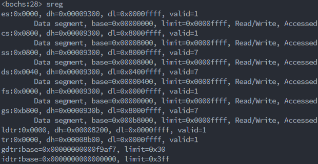
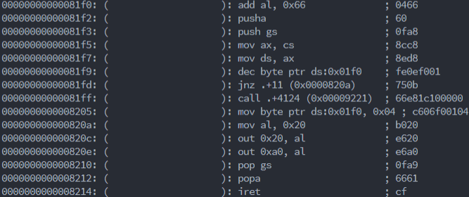
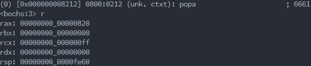
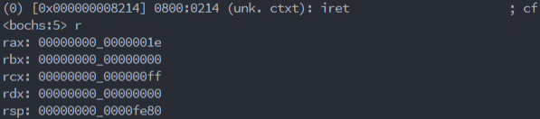
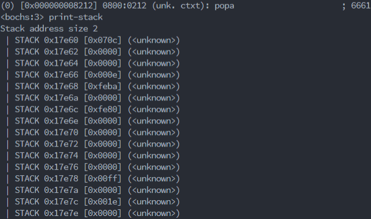
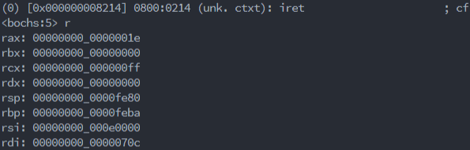
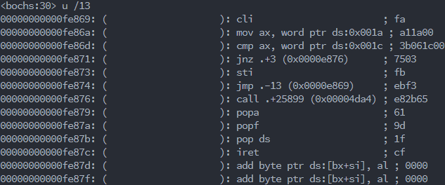
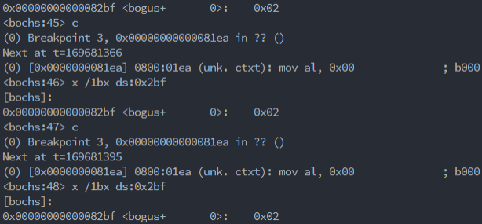

# <center>实验四：具有中断处理的内核</center>
### 一、实验目的：
1. PC系统的中断机制和原理。

2. 理解操作系统内核对异步事件的处理方法。

3. 掌握中断处理编程的方法。

4. 掌握内核中断处理代码组织的设计方法。

5. 了解查询式I/O控制方式的编程方法。
### 二、实验原理：
1. 两片可编程中断控制器8259形成级联，提供15个中断信号

2. 连接到INTR为，可屏蔽中断，可通过`cli`，`sti`设置IF标志，来决定是否屏蔽

3. 中断存在优先级，IR0最高，IR7最低，从片连接主片的IR2，当优先级更高的中断来时，先处理高优先级的中断

4. 中断向量表物理地址：0x0-0x3ff，用于存放256种中断对应的256个程序

5. 每个中断对应4B，为中断程序的段地址和偏移地址

6. 处理器收到中断号： 
>- 压栈`flags`，清除`if`，`tf`，然后当前`cs`，`ip`压栈
>- 中断号，从中断向量表中取出`cs`，`ip`。若要中断嵌套需要`sti`
>- `iret`，弹出`ip`，`cs`，`flags`。注意已经恢复`flags`可以收到新中断

7. 非可屏蔽中断自动生成中断号码2，其他过程同上

8. CMOS RAM的0x70或0x74指定内存单元，0x71或0x75用于读写数据

9. CMOS RAM保存的日期和时间使用BCD，每四位二进制表示一位十进制

10. CMOS RAM偏移地址0x0A-0x0D分别对应寄存器ABCD
>- 用寄存器AB设置RTC功能
>- 寄存器CD表示RTC工作状态

11. `eflags`寄存器：https://blog.csdn.net/jn1158359135/article/details/7761011

12. `pushad`，`popad`：https://blog.csdn.net/longintchar/article/details/50866801

13. `int 13h`：https://www.cnblogs.com/heisenberg-/p/6582124.html

14. 键盘中断：https://blog.csdn.net/zhaixh_89/article/details/102639921?utm_medium=distribute.pc_relevant.none-task-blog-BlogCommendFromMachineLearnPai2-1.nonecase&depth_1-utm_source=distribute.pc_relevant.none-task-blog-BlogCommendFromMachineLearnPai2-1.nonecase

15. `int 9`与`int 16h`：https://blog.csdn.net/ZCMUCZX/article/details/80462394
### 三、实验要求：
1. 知道PC系统的中断硬件系统的原理。

2. 掌握x86汇编语言对时钟中断的响应处理编程方法。

3. 重写和扩展实验三的的内核程序，增加时钟中断的响应处理和键盘中断响应。

4. 编写实验报告，描述实验工作的过程和必要的细节，如截屏或录屏，以证实实验工作的真实性。
### 四、实验内容：
1. 编写x86汇编语言对时钟中断的响应处理程序：设计一个汇编程序，在一段时间内系统时钟中断发生时，屏幕变化显示信息。在屏幕24行79列位置轮流显示’|’、’/’和’\’(无敌风火轮)，适当控制显示速度，以方便观察效果，也可以屏幕上画框、反弹字符等，方便观察时钟中断多次发生。将程序生成COM格式程序，在DOS或虚拟环境运行。

2. 重写和扩展实验三的的内核程序，增加时钟中断的响应处理和键盘中断响应。在屏幕右下角显示一个转动的无敌风火轮，确保内核功能不比实验三的程序弱，展示原有功能或加强功能可以工作。

3. 扩展实验三的的内核程序，但不修改原有的用户程序，实现在用户程序执行期间，若触碰键盘，屏幕某个位置会显示”OUCH!OUCH!”。

4. 编写实验报告，描述实验工作的过程和必要的细节，如截屏或录屏，以证实实验工作的真实性。
### 五、实验结果：
#### 1. 该步中遇到如下问题：
>**问题1：** 问题文件为“.bin”，将“.bin”填入虚拟软盘，在bochs中无法时钟中断切换字符，但是在VirtualBox和DOSBox中可以。  
>**解决1：** 观察IF标志位，发现bochs运行时，IF标志位为0。  
>  
>根据*实验原理 11*，第9位为IF标志位此时为0。而根据*实验原理 2*，需要用`sti`设置`if`为1，使其不被屏蔽。
>```x86asm
>org 7c00h                    ; 程序加载到100h，可用于生成COM
>                              ; 设置时钟中断向量（08h），初始化段寄存器
>sti
>xor ax,ax                    ; AX = 0
>mov es,ax                    ; ES = 0
>mov word [es:20h],Timer      ; 设置时钟中断向量的偏移地址
>mov ax,cs
>mov word [es:22h],ax         ; 设置时钟中断向量的段地址=CS
>mov ds,ax                    ; DS = CS
>mov es,ax                    ; ES = CS
>```
>结果如下：  
>  
>可以看到，第9位变成了1。
#### 2. 该步中遇到如下问题：
>**问题1：** 时钟中断其他函数坏掉，行为混乱，如光标持续后移。  
>**解决1：** 使用`push`和`pop`保护寄存器。  
>根据*实验原理 6*，中断调用就是跳到中断向量表中写的指定`cs`和`ip`，而中断调用和`iret`并不会恢复`cs`，`ip`，`flags`之外的寄存器值，因此若中断调用修改了原本函数用到的寄存器值，跳回原本函数的时候会破坏函数。根据*实验原理原理 12*使用`pushad`，`popad`等对寄存器进行保护。
>```x86asm
>_clock_timer:
>    pushad
>    push gs
>    dec byte [count]               ; 递减计数变量
>    jnz _timer_end                 ; >0：跳转
>    call dword clock
>    mov byte[count],delay          ; 重置计数变量=初值delay
>_timer_end:
>    mov al,20h                     ; AL = EOI
>    out 20h,al                     ; 发送EOI到主8529A
>    out 0A0h,al                    ; 发送EOI到从8529A
>    pop gs
>    popad
>    iret                           ; 从中断返回
>```
>**问题2：** 风火轮的拓展性不够好。  
>**解决2：** 对风火轮拆成多个函数。  
>1. 将设置中断向量表，拆成一个函数`void _set_timer()`，未来若有需要，可将`_clock_timer`和`count`设置成参数。
>```x86asm
>_set_timer:
>    sti
>    xor ax, ax                     ; AX = 0
>    mov es, ax                     ; ES = 0
>    mov word[es:20h], _clock_timer ; 设置时钟中断向量的偏移地址
>    mov ax, cs
>    mov word[es:22h], ax           ; 设置时钟中断向量的段地址=CS
>    ret
>    delay equ 4                    ; 计时器延迟计数
>    count db delay                 ; 计时器计数变量，初值=delay
>```
>2. 将中断程序修改为asm函数`void _clock_timer()`包裹c函数`void clock()`。其中asm函数用于中断调用的延迟、保护寄存器和返回，c函数用于实际的效果。
>```x86asm
>_clock_timer:
>    pushad
>    push gs
>    dec byte [count]               ; 递减计数变量
>    jnz _timer_end                 ; >0：跳转
>    call dword clock
>    mov byte[count],delay          ; 重置计数变量=初值delay
>_timer_end:
>    mov al,20h                     ; AL = EOI
>    out 20h,al                     ; 发送EOI到主8529A
>    out 0A0h,al                    ; 发送EOI到从8529A
>    pop gs
>    popad
>    iret                           ; 从中断返回
>```
>3. 将写显存封装为函数`void display(char ch, int x, int y, int color)`。用于不需要设置光标的显示字符操作。
>```x86asm
>_display:
>    mov eax, dword[esp+12]
>    mov ebx, 80
>    mul ebx
>    add eax, dword[esp+8]
>    mov ebx, 2
>    mul ebx
>    mov ebx, eax
>    mov	ax, 0B800h                 ; 文本窗口显存起始地址
>    mov	gs, ax                     ; GS = B800h
>    mov ah, byte[esp+16]           ; 0000：黑底、1111：亮白字（默认值为07h）
>    mov al, byte[esp+4]            ; AL = 显示字符值（默认值为20h=空格符）
>    mov [gs:ebx], ax               ; 屏幕第 x 行, 第 y 列
>    ret
>```
>**问题3：** 风火轮功能实用性不强。  
>**解决3：** 在风火轮尾部增加一个系统时间。  
>根据*实验原理 8 9 10*，可以通过访问CMOS RAM获得系统时间，如下：
>```x86asm
>_get_time:
>    mov al, 0                      ; Get seconds (00 to 59)
>    out 0x70, al
>    in al, 0x71
>    mov byte[_second], al
>```
>我将系统时间存在一个数列`unsigned char _time[6]`中，使用`void _get_time()`更新系统时间。另外，由于从CMOS RAM获得的系统时间是BCD，所以使用`void BCD2str(unsigned char BCD, char *str)`进行转换。
>```C
>void BCD2str(unsigned char BCD, char *str)
>{
>    str[0] = (BCD >> 4) + '0';
>    str[1] = (BCD & 0xf) + '0';
>}
>```
>**问题4：** 在DOSBox中可以正确显示时间，填写到软盘在虚拟机内不能正确显示时间。  
>**解决4：** 经过漫长的排查，终于发现在`void BCD2str(unsigned char BCD, char *str)`函数中，使用`ds:0xfe34`来访问`*str`，之前都是在`ss:0xfe34`访问的`*str`，而此处的`ds`和`ss`竟然是不一样的！  
>  
>段地址0x800为正常，换言之`ds`寄存器的0x40是不正常的。然而观察未进行中断调用时，`ds`是正常的，怀疑是中断调用应该初始化`ds`寄存器。另外，如果只修改`ds`寄存器而不保护它，会出现奇怪的错误，应该是中断调用需要用到`ds`为0x40。
>```x86asm
>_clock_timer:
>    pushad
>    push es
>    push gs
>    push ds
>    mov ax, cs
>    mov ds, ax
>    dec byte [count]               ; 递减计数变量
>    jnz _timer_end                 ; >0：跳转
>    call dword clock
>    mov byte[count],delay          ; 重置计数变量=初值delay
>_timer_end:
>    mov al,20h                     ; AL = EOI
>    out 20h,al                     ; 发送EOI到主8529A
>    out 0A0h,al                    ; 发送EOI到从8529A
>    pop ds
>    pop gs
>    pop es
>    popad
>    iret                           ; 从中断返回
>```
>果然成功。  
>**问题5：** bochs设置的有的断点不起作用。  
>**解决5：** 在设置中断向量表的时候，设置的程序位置在0x81f1  
>  
>然而在bochs中并没有在0x81f1的指令。  
>  
>又发现，`popad`前后sp相差0x20，刚好是8个dword，和*实验原理 12*不谋而合。  
>  
>  
>可以从机器码中发现，按照*实验原理 12*的说法，`pushad`的机器码应为0x6660，而bochs却将0x66认作是前一条指令，而`popad`对应的0x6661是正确的。另外，通过对比`popad`前栈和`popad`后寄存器的值，可以看出*实验原理 12*给出的压栈顺序`eax`，`ecx`，`edx`，`ebx`，`esp`，`ebp`，`esi`，`edi`是正确的。  
>  
>  
>分析得知代码中`pushad`前的`count db delay`污染了`pushad`，因而将`count db delay`放在最后，果然得到了正确的`pushad`。  
>  
>**问题6：** 在DOSBox中时钟中断时可以使用`int 16h`读取字符，填写到软盘在虚拟机内时钟中断时不能使用`int 16h`读取字符。  
>**解决6：** 断点调试时，发现一直停在`int 16h`读取字符服务的阻塞位置。  
>  
>尝试用其他的方法阻塞而不是中断的方式阻塞。根据*实验原理 13*如用`int 16h`的非阻塞的检测键盘输入服务，循环阻塞。
>```x86asm
>_get:
>    mov ah, 1
>    int 16h
>    jz _get
>    mov ah, 0
>    int 16h
>    ret
>```
>
>果真成功。
#### 3. 该步中遇到如下问题：
>**问题1：** `void _set_timer()`扩展性不够。  
>**解决1：** 将`void _set_timer()`修改为`void _set_int(int cs, void (*inter)(), int index)`。另外，要保证运行`_set_int(int cs, void (*inter)(), int index)`时，不被中断，因而分别在首尾加上`cli`，`sti`。
>```x86asm
>_set_int:
>    cli
>    xor ax, ax                ; AX = 0
>    mov es, ax                ; ES = 0
>    mov ax, word[esp+8]
>    mov ebx, dword[esp+12]
>    shl ebx, 2
>    mov word[es:ebx], ax    ; 设置中断向量的偏移地址
>    mov ax, word[esp+4]
>    mov word[es:ebx+2], ax  ; 设置中断向量的段地址
>    sti
>    ret
>```
>另外，将`delay`修改为在中断中初始化的变量`_delay`，这样每个中断都会有不同的`_delay`并且将`void _clock_timer()`改名为`void _clock()`。
>```x86asm
>_clock:
>    pushad
>    push es
>    push gs
>    push ds
>    mov ax, cs
>    mov ds, ax
>    mov dword[_delay], 10
>    dec dword[_count]      ; 递减计数变量
>    jnz _clock_end         ; >0：跳转
>    call dword clock
>    mov eax, dword[_delay]
>    mov dword[_count], eax ; 重置计数变量=初值delay
>_clock_end:
>    mov al, 20h            ; AL = EOI
>    out 20h, al            ; 发送EOI到主8529A
>    out 0A0h, al           ; 发送EOI到从8529A
>    pop ds
>    pop gs
>    pop es
>    popad
>    iret                   ; 从中断返回
>```
>```x86asm
>_data_define:
>    _delay dd 1
>    _count dd 1               ; 计时器计数变量，初值=delay
>```
>**问题2：** `void display_str(char *str, int x, int y, int color)`和`void print(char *str)`不支持对`'\n'`操作。  
>**解决2：** 进行如下拓展。
>```C
>void display_str(char *str, int x, int y, int color)
>{
>    int offset_x = 0, offset_y = 0;
>    for (int i = 0; str[i] != 0; i++)
>    {
>        if (str[i] == '\n')
>        {
>            offset_x = 0;
>            offset_y++;
>        }
>        else
>        {
>            _display(str[i], x + offset_x, y + offset_y, color);
>            offset_x++;
>        }
>    }
>}
>```
>```C
>void print(char *str)
>{
>    for (int i = 0; str[i] != '\0'; i++)
>    {
>        if (str[i] == '\n')
>        {
>            cursor_x = 0;
>            cursor_y++;
>        }
>        else
>        {
>            _put(str[i]);
>            cursor_x++;
>        }
>        _move(cursor_x, cursor_y);
>    }
>}
>```
>**问题3：** 在调用`void callf(int cl, int ch, int dh, int len)`时需要设置键盘中断程序`void _ouch()`。  
>**解决3：** 重写`void callf(int cl, int ch, int dh, int len)`，使其能够调用`void _set_int(int cs, void (*inter)(), int index)`，设置键盘中断程序`void _ouch()`。另外根据*实验原理 14*，`int 16h`中断会用到`int 9`中断将60端口扫描码转成缓冲区的字符，因而需要保存原有的`int 9`中断，以便回来时恢复`int 9`。
>```x86asm
>_callf:
>    xor ax, ax             ; AX = 0
>    mov es, ax             ; ES = 0
>    mov eax, dword[es:36]  ; 设置中断向量的偏移地址
>    mov dword[_int_9], eax
>    mov ax, 0xb00
>    mov es, ax             ; es:bx
>    mov cl, byte[esp+4]    ; 扇区号
>    mov ch, byte[esp+8]    ; 柱面号 ; 起始编号为0
>    mov dh, byte[esp+12]   ; 磁头号 ; 起始编号为0
>    mov al, byte[esp+16]   ; 扇区数
>    mov bx, 0x100          ; 偏移地址; 存放数据的内存偏移地址
>    mov ah, 2              ; 功能号
>    mov dl, 0              ; 驱动器号 ; 软盘为0，硬盘和U盘为80H
>    int 13H                ; 调用读磁盘BIOS的13h功能
>    push dword 9
>    push dword _ouch
>    push dword 0x800
>    call dword _set_int
>    add esp, 12
>    call 0xb00:0x100       ; 0xb100
>    mov ax, cs             ; 恢复段地址
>    mov ds, ax
>    push dword 9
>    push dword[_int_9]
>    push dword[_int_9+2]
>    call dword _set_int
>    add esp, 12
>    ret
>```
>**问题4：** 刚运行用户程序就开始显示`"OUCH!OUCH!"`。  
>**解决4：** 通过运行如下代码，发现每次进入用户程序，都会发生一次键盘中断，表现为每次进入用户程序不按键盘，都会产生不同颜色的`OUCH!OUCH!`
>```C
>int color = 0b11100100;
>void ouch()
>{
>    display_str("OUCH!OUCH!", 35, 12, color);
>    color = ~color;
>}
>```
>另外，进入用户程序的时候，按下键盘和松开键盘都会改变一次颜色，即都会发生键盘中断。这样，上面的问题可以这样解释：按Enter键还未松开时，进入用户程序，松开Enter刚好触发一次中断导致出现`"OUCH!OUCH!"`。可以通过增加一个变量`_press`在调用用户程序的时候初始化，键盘中断每两次展示一次`"OUCH!OUCH!"`。
>```x86asm
>    int 13H                ; 调用读磁盘BIOS的13h功能
>    mov dword[_press], 0
>    push dword 9
>    push dword _ouch
>    push dword 0x800
>    call dword _set_int
>    add esp, 12
>    call 0xb00:0x100       ; 0xb100
>```
>```x86asm
>_ouch:
>    pushad
>    push es
>    push gs
>    push ds
>    mov ax, cs
>    mov ds, ax
>    in al, 60h
>    cmp dword[_press], 0
>    jz _ouch_end
>    call dword ouch
>_ouch_end:
>    xor dword[_press], 0xffff
>    mov al, 20h            ; AL = EOI
>    out 20h, al            ; 发送EOI到主8529A
>    out 0A0h, al           ; 发送EOI到从8529A
>    pop ds
>    pop gs
>    pop es
>    popad
>    iret
>```
>**问题4：** `void ouch()`需要设置成显示一段时间，然后不显示。  
>**解决4：** 起初想通过调用`void _get_time()`刷新时间数组`unsigned short _time`，据此可以设置成1s变换1次颜色共显示4s。但是却发现，中断过程中CMOS RAM的值一直没有发生变化，怀疑是CMOS RAM值的更新也需要可屏蔽中断控制，根据*实验原理 6.*运行中断前先cli，因而无法执行其他可屏蔽中断，因而无法修改。
>```C
>void ouch()
>{
>    int color = 0b11100100;
>    _get_time();
>    unsigned short sec = _time[5];
>    for (int i = 0; i < 4; i++)
>    {
>        while (1)
>        {
>            _get_time();
>            if (_time[5] != sec)
>            {
>                sec = _time[5];
>                break;
>            }
>        }
>        display_str("OUCH!OUCH!", 35, 12, color);
>        color = ~color;
>    }
>    display_str("          ", 35, 12, 0x0f);
>}
>```
>  
>因而改成循环。
>```C
>void ouch()
>{
>    int color = 0b11100100;
>    for (int i = 0; i < 4; i++)
>    {
>        display_str("OUCH!OUCH!", 35, 12, color);
>        color = ~color;
>        for (unsigned int j = 0; j < 0x3ffffff; j++)
>            ;
>    }
>    display_str("          ", 35, 12, 0x0f);
>}
>```
>**问题5：** 如果用户程序需要键盘服务，则重写中断向量表会导致无法正常使用。  
>**解决5：** 根据*实验原理 15*，`int 9`将键盘扫描码转成对应ascii放入键盘缓冲区中，`int 16h`通过读取键盘缓冲区，返回键盘输入。因而，若要使用键盘服务，则需要保留原本`int 9`的服务。  
>```x86asm
>_ouch:
>    pushad
>    push es
>    push gs
>    push ds
>    mov ax, cs
>    mov ds, ax
>    in al, 60h
>    pushf
>    pushf
>    pop ax
>    and ah, 0b11111100
>    push ax
>    popf
>    call dword[_int_9]
>    cmp dword[_press], 0
>    jz _ouch_end
>    call dword ouch
>```
>根据*实验原理 6*，可以通过模拟中断调用的方式，来调用存在`_int_9`位置的函数。另外，根据*实验原理 11*，可以通过栈和掩码的操作修改`if` `tf`的值。因此第一次`pushf`将flags压入栈，在运行`dword[_int_9]`到iret时，弹出。第二次pushf，连同后面的popf用来修改`if` `tf`。另外，若要使用`call 段:偏移`的方式调用，需要段是立即数，因而设置立即数`_int_9_cs`，`_int_9_ip`。
>```x86ASM
>_ouch:
>    pushad
>    push es
>    push gs
>    push ds
>    mov ax, cs
>    mov ds, ax
>    in al, 60h
>    pushf
>    pushf
>    pop ax
>    and ah, 0b11111100
>    push ax
>    popf
>    call _int_9_cs:_int_9_ip
>    cmp dword[_press], 0
>    jz _ouch_end
>    call dword ouch
>```
>**问题6：** 发现上次写的cal.com是存在BUG的，无法返回监控程序。  
>**解决6：** 首先是，返回的时候应该使用`retf`从而弹出`cs`和`ip`。另外`ss`寄存器初始化后需要恢复，然而ss寄存器决定了栈的段地址，因而只有将旧的`ss`存在新的栈中才行，这就需要先用其他寄存器拷贝一下`ss`的值。另外，`esp`也应当初始化，因为`esp`寄存器决定了决定了栈大小，而新进入所有用户程序栈应该是一个定长的。因此不妨将`esp`设为0xffff。同样，其他nasm代码入口也应改成这样，而stoneN.asm系列不改也无妨，因为它们没有用到栈。
>```x86ASM
>_start:
>    push dword ebp
>    mov ax, cs
>    mov ds, ax
>    mov bx, ss
>    mov ss, ax
>    mov ebp, esp
>    mov esp, 0xffff
>    push word bx
>    push dword ebp
>    call dword main
>    mov bx, word[esp+4]
>    pop dword esp
>    mov ss, bx
>    pop dword ebp
>    retf>_start:
>```
>**问题7：** 在cal.com中，时间乱码。  
>**解决7：** 见*步骤2.问题4*分析，即要求中断进行过程中`ss`寄存器`ds`值相同。  
>然而因为中断程序是内核程序的一部分，在用户程序调用中断程序时可能修改内核程序的栈，因而起初并未对`ss`寄存器进行设置。  
>由于设置了常规程序栈顶在0xffff，而且目前com文件前0x100是没有内容的，所以不妨将栈顶设在0x100。但是这样一来，栈只有256B大小，所以规定中断程序相关的函数内不能有数组出现。
>```x86ASM
>_clock:
>    pushad
>    push word es
>    push word gs
>    push word ds
>    mov ax, cs
>    mov ds, ax
>    mov bx, ss
>    mov ss, ax
>    mov ebp, esp
>    mov esp, 0x100
>    push word bx
>    push dword ebp
>    mov dword[_delay], 10
>    dec dword[_count]      ; 递减计数变量
>    jnz _clock_end         ; >0：跳转
>    call dword clock
>    mov eax, dword[_delay]
>    mov dword[_count], eax ; 重置计数变量=初值delay
>_clock_end:
>    mov al, 20h            ; AL = EOI
>    out 20h, al            ; 发送EOI到主8529A
>    out 0A0h, al           ; 发送EOI到从8529A
>    mov bx, word[esp+4]
>    pop dword esp
>    pop word ss
>    mov ss, bx
>    pop word ds
>    pop word gs
>    pop word es
>    popad
>    iret                   ; 从中断返回
>```
>```C
>char HW_arr[] = "\\|/";
>int HW_cur = 0;
>char clock_str[20] = "20yy/mm/dd hh:mm:ss";
>void clock()
>{
>    if (HW_arr[HW_cur] == 0)
>    {
>        HW_cur = 0;
>    }
>    _display(HW_arr[HW_cur++], 60, 24, 0b00111111);
>    _get_time();
>    char *ptr = clock_str + 2;
>    for (int i = 0; i < 6; i++)
>    {
>        BCD2str(_time[i], ptr);
>        ptr += 3;
>    }
>    display_str(clock_str, 61, 24, 0b00111101);
>}
>```
>**问题8：** 上次使用`ret`而非`o32 ret`的原则如今不适用。  
>**解决8：** 观察发现nasm中`ret`机器码不带`0x66`，而gcc中`ret`机器码带`0x66`，应该将`ret`改成`o32 ret`即可。  
>**问题9：** 用户程序运行和`void _ouch()`运行是互斥的，即显示`"OUCH!OUCH!"`的同时其他程序是不工作的，如果用户程序需要输入就会持续打断非常不人性化。  
>**解决9：** 扩展`void clock()`。使其可以按需求显示字符串。基本原理如下：  
>1. 类似FAT表项的可复用的链表数据结构`struct node`。
>>将之前写的用于存字符的链表节点结构`struct node`的`int next`和`int last`属性单独剥离出来，构成新的数据结构`struct node`，一种类似FAT表项的数据结构。  
>>```C
>>struct node
>>{
>>    int next;
>>    int last;
>>};
>>```
>>这样之前的游标空间的数组`struct node ndsp[NDSPSZ]`，就改为两个数组`char chsp[CHSPSZ]`和`struct node chndsp[CHSPSZ]`分别用来存节点值，和节点的前驱后继位置。  
>>相应的，构造函数`new_node`和析构函数`delete_node`也做成只处理节点前驱后继位置的函数，不处理节点值。  
>>这样一来，就可以让链表节点值和前驱后继位置形成像FAT表项和文件之间的关系，做到一个可以复用链表数据结构。
>2. 要实时显示的内容数据结构`struct layer`。
>>通过`void display_str(char *str, int x, int y, int color)`函数显示一个字符串需要`char *str`，`int x`，`int y`，`int color`四个参数，分别表示显示内容，x轴位置，y轴位置，颜色。这样一来只需要这四个参数，再调用这个函数就可以显示字符串。同时由于*步骤3.问题2*使`void display_str(char *str, int x, int y, int color)`函数已经支持`'\n'`，所以只需要一个字符串就可以显示多行。
>>```C
>>struct layer
>>{
>>    char *str;
>>    int x;
>>    int y;
>>    int color;
>>};
>>```
>>类似的，用`struct node`使其可以串成一个链表。
>3. 用于实时生成显示内容的数据结构`struct layfun`。
>>其中`void (*fun)(int *n_ptr)`成员表示用于实时生成显示内容`struct layer`的函数。`int n`成员表示剩余显示次数；`int *n_ptr`用于接收`int n`以便`fun`修改之。一旦`int n`归零，表示该函数失效，就需要将该节点删掉。
>>```C
>>struct layfun
>>{
>>    void (*fun)(int *n_ptr);
>>    int n;
>>};
>>```
>>同样用struct node使其可以串成一个链表。
>4. 重写的`void clock()`，用于实时处理两个链表。
>>`void clock()`先从头部遍历一次`struct layfun`的链表，执行链表中的每个函数。每个函数会生成一个`struct layer`类型的节点在`struct layer`链表的头部；还会修改`int n`的值，因此在函数执行完毕后，检查一下`int n`是否为0，如果为0，就删掉该节点。  
>>再从头部遍历一次`struct lay`的链表，每遍历一个显示其中的内容，并且将其删除。
>>```C
>>void clock()
>>{
>>    for (int ptr = lyfnheader; lyfnsp[ptr].fun != NULL; ptr = lyfnndsp[ptr].next)
>>    {
>>        lyfnsp[ptr].fun(&lyfnsp[ptr].n);
>>        if (lyfnsp[ptr].n == 0)
>>        {
>>            delete_node(ptr, &lyfnheader, lyfnndsp);
>>        }
>>    }
>>    while (lysp[lyheader].str != NULL)
>>    {
>>        display_str(lysp[lyheader].str, lysp[lyheader].x, lysp[lyheader].y, lysp[lyheader].color);
>>        delete_node(lyheader, &lyheader, lyndsp);
>>    }
>>}
>>```
>5. 重写风火轮，显示时间，显示OUCH，使其符合上述`void (*fun)(int *n_ptr)`的规范，即生成`struct layer`和修改`int n`。
>>这里有一些有创意的设计，比如修改刷新频率：
>>```C
>>void clock_time(int *n_ptr)
>>{
>>    if (*n_ptr % 2 == 0)
>>    {
>>        _get_time();
>>        char *ptr = clock_str + 2;
>>        for (int i = 0; i < 6; i++)
>>        {
>>            BCD2str(_time[i], ptr);
>>            ptr += 3;
>>        }
>>        new_layer(clock_str, 61, 24, 0b00111101, lyheader);
>>    }
>>    *n_ptr -= 1;
>>    ...
>>}
>>```
>>实时可变的显示颜色：
>>```C
>>void clock_ouch(int *n_ptr)
>>{
>>    ...
>>    else
>>    {
>>        ouch_color = ~ouch_color;
>>    }
>>}
>>```
>>有限的生命：
>>```C
>>void clock_ouch(int *n_ptr)
>>{
>>    new_layer(ouch_str, 35, 12, ouch_color, lyheader);
>>    *n_ptr -= 1;
>>    if (*n_ptr == 1)
>>    {
>>        ouch_color = 0;
>>    }
>>    ...
>>}
>>```
>>续命：
>>```C
>>void clock_hotwheel(int *n_ptr)
>>{
>>    hotwheel_str[0] = hotwheel_arr[*n_ptr % 3];
>>    new_layer(hotwheel_str, 60, 24, 0b00111111, lyheader);
>>    *n_ptr -= 1;
>>    if (*n_ptr % 3 == 0)
>>    {
>>        *n_ptr = 3;
>>    }
>>}
>>```
>6. 不同显示内容的覆盖关系。
>>由4可以看出，`struct layer`不同节点显示之间，是有覆盖关系的。  
>>`struct layer`的链表是先入后出的，因此是先入链表的显示内容会覆盖后入链表的显示内容。  
>>因此需要`struct layfun`链表同样先入后访问，这样才能使先放入`struct layfun`链表的函数后生成`struct layer`节点，从而先显示被后显示的覆盖。因此，再`struct layfun`链表每次插入新结点的时候，从头部插入，然后遍历的时候从头部访问。
>>```C
>>    new_layfun(clock_hotwheel, 3, lyfnheader);
>>```
>>这样才能满足后打开的窗口覆盖先打开的窗口的自然的覆盖关系。
#### 4. 该步中遇到如下问题：
>**问题1：** 之前使用word+模板的方式编写实验报告，虽然模板很美观但是报告却有很多问题：间距不合适要么太松要么分页太乱，代码选用文本形式没有语法高亮，使用图片格式无法直接拷贝文本。  
>**解决1：** 使用markdown编写报告，没有分页不需要因为分页问题而担忧，提供代码高亮服务不用为代码的形式而发愁。  
>**问题2：** 实验真实性证明。  
>**解决2：** 虽然旧的代码被新的代码覆盖掉了，但是保有debug时必要的截图还有代码。另外有录屏用于展示功能。
### 六、实验亮点：
1. 基本实现实验基本要求
2. 在linux环境下编译
3. 使用了C代码bug在gdb来debug，其他bug在bochsdbg来debug的策略
3. 将上次代码的遗留的未发现的问题逐一解决
4. 将链表的逻辑关系单独提炼出来，为今后的开发铺平道路
5. 实现了一套可以多层实时显示的结构
6. 首次使用markdown来编写实验报告
### 七、实验反思：
>首先是bug的问题，几次实验我将绝大多数时间花费到了写bug和debug上。虽然现在debug越来越熟练了，但是还是很浪费时间。因此今后要认真地听课，百度，看博客，在自己的知识水平足够高的时候再动手写代码，所谓磨刀不误砍柴工。
>
>第二是对后续工作的构想。我希望后面能把我之前写的FAT12文件系统搬进我的操作系统，这样一方面我之前的功夫没有白费，另一方面可以让操作系统更加完善。但这就要求更多的时间。我本来是打算在这次实验将之前的FAT12文件系统彻底搬进来，但是两个周的时间，一个周用来划水，一个周用来debug，导致实质性的工作并没有完成多少。所以希望下次能够花更少的时间划水和debug，卯足劲将整个FAT12文件系统搬进来。
>
>第三是实验报告书写的问题。我的思路不明，语言乏力的问题是很难立刻解决了，但是排版不好的问题可以通过换工具来快速解决。这次是第一次使用markdown，难免还会有排版不熟练的问题，希望助教能够指正。另外这次markdown的体验，我感觉很好。我认为它的排版比word简洁不少，很容易就可以获得一个相对美观的实验报告，另外可以用熟悉的vscode编辑，又可以练习vim的熟练度。所以今后如果没有学习latex，我会持续使用markdown来写作业。
>
>第四是代码管理的问题。由于实验报告是随着写代码一同进行的，代码是不停迭代的，而实验报告却仍保有旧的代码，这样对应起来是不太方便的。所以我打算在下次实验，每做完一个步骤提交一次代码，这样可以通过看提交历史来找到获得旧的代码。
>
>最后是实验报告的反馈问题。我是最近才发现，原来学委一个月前发的反馈文档是在线文档，导致最近才看到之前实验报告的反馈情况。没看到反馈，导致一直以来我对实验报告都不是很重视。虽然之前的代码平平无奇，但是对我而言是有一定工作量的（主要是在debug上），比如国庆那次作业由于是在外地，代码都是远程用pad到电脑上写的，debug非常的艰苦（但是也因此学会了gdb和bochsdbg的操作，这些都是后话了）。反馈是很重要的，不仅仅是分数的问题，更是自我提高的一个途径，所谓见贤思齐，见不贤自省。可能有的同学和我之前一样，也不知道原来每次实验报告都有反馈，所以希望助教能够提示学委，让他们告知同学反馈的文档是在线文档。