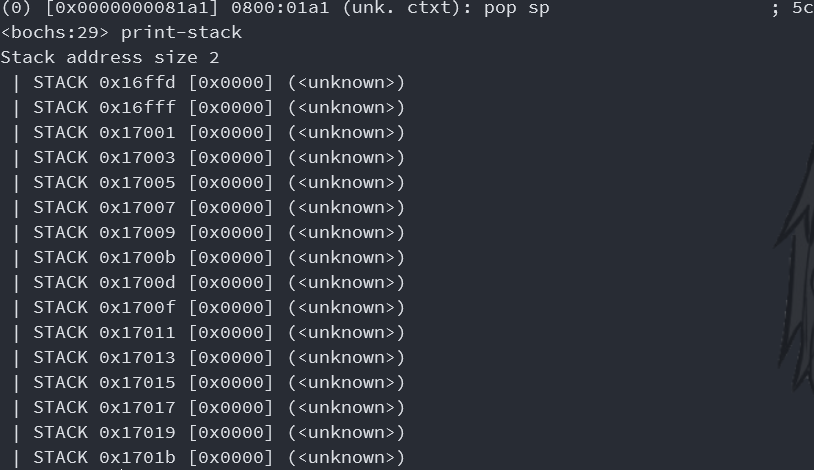
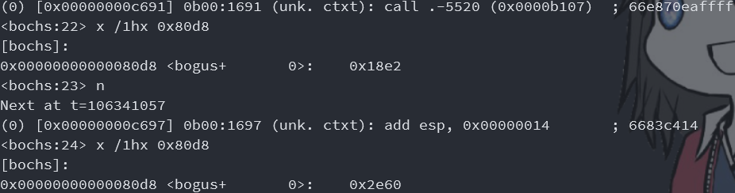

# <center>实验五：实现系统调用</center>
### 一、实验目的：
1. 学习掌握PC系统的软中断指令
2. 掌握操作系统内核对用户提供服务的系统调用程序设计方法
3. 掌握C语言的库设计方法
4. 掌握用户程序请求系统服务的方法
### 二、实验要求：
1. 了解PC系统的软中断指令的原理
2. 掌握x86汇编语言软中断的响应处理编程方法
3. 扩展实验四的的内核程序，增加输入输出服务的系统调用。
4. C语言的库设计，实现putch()、getch()、printf()、scanf()等基本输入输出库过程。
5. 编写实验报告，描述实验工作的过程和必要的细节，如截屏或录屏，以证实实验工作的真实性
### 三、技术路线：

### 四、实验原理：
1. 处理器收到中断号： 
>- 压栈`flags`，清除`if`，`tf`，然后当前`cs`，`ip`压栈
>- 中断号，从中断向量表中取出`cs`，`ip`。若要中断嵌套需要`sti`
>- `iret`，弹出`ip`，`cs`，`flags`。注意已经恢复`flags`可以收到新中断
2. PSP的意义：http://blog.sina.com.cn/s/blog_56c1d3290102yqg2.html
3. PSP的内容：http://faydoc.tripod.com/structures/13/1378.htm
4. `int 21h`：https://blog.csdn.net/chinazeze/article/details/1735621
5. printf：https://fishc.com.cn/thread-77360-18-4.html  里面有我18  年的时候写的答案，其实最后没用上。
6. 可变参数：https://stackoverflow.com/questions/30700921/variable-number-of-arguments-without-stdarg-h-under-x64
7. Intel2GAS：https://github.com/skywind3000/Intel2GAS
8. 浮点数的堆栈处理：https://blog.csdn.net/liujiayu2/article/details/77711838
9. 调用汇编函数时寄存器的取舍：https://blog.csdn.net/shallnet/article/details/45651601
### 五、实验内容：
##### (1)	修改实验4的内核代码，先编写save()和restart()两个汇编过程，分别用于中断处理的现场保护和现场恢复，内核定义一个保护现场的数据结构，以后，处理程序的开头都调用save()保存中断现场，处理完后都用restart()恢复中断现场。
###### 理论准备：
1. `ip`，`cs`，`flags`寄存器。
>根据*实验原理 1*，`ip`，`cs`，`flags`寄存器被存储在栈中，`_save`时需要将这三个寄存器从栈中取出放入结构体中，`_restart`时则需要将这三个寄存器从结构体放回栈中。因此为了正确放置三个寄存器的位置，需要得知三个寄存器在栈中的顺序。通过断点调试，观察情况如下：
>- iret前栈情况：  
>
>- iret后寄存器情况：  
>
>
>栈顶第一个`0x15c`被存放在`ip`寄存器中，栈顶第二个`0x800`应该是段地址，而第三个`0x202`则被存放在`flags`寄存器中。所以可以确定顺序：栈顶开始算`ip`，`cs`，`flags`。
2. `ds`寄存器。
>- 因为访问静态内存区需要`ds`寄存器，即需要新的`ds`值。所以需要保证在`_save`中，先修改`ds`寄存器才能进行保存寄存器。
>- 这就要求了需要先暂时保存旧的`ds`，因而暂时将其存在栈中。
>- 而在`_restart`中，需要最后恢复`ds`寄存器。
3. 栈。
>- 在`_save`时，在暂时存`ds`的过程中，不能修改其他寄存器或者可以令其他寄存器存储时可以恢复，因而将其存在旧`ds`存在栈中。
>- 修改`ds`也需要利用栈做中转。
>- 在保存`sp`和`ss`前按顺序弹出`ds`，`ip`，`cs`，`flags`保证栈内无其他寄存器。
>- 在初始化`sp`和`ss`前保证`sp`和`ss`被保存。  
>- 在`_restart`时，需要先恢复`ss`，`sp`再压入`flags`，`cs`，`ip`以兼容`iret`。
4. 返回地址。
>返回地址也在栈中，由于返回地址存在栈中，要正确地将栈中4B地址暂存到一个全局变量里，然后`ret`前将返回地址再压入栈中。
1##### 代码编写
1. 保存寄存器用变量`_register`及暂存4B返回地址用定义：
>```x86asm
>_register:
>    _ax dd 0
>    _bx dd 0
>    _cx dd 0
>    _dx dd 0
>    _sp dd 0
>    _bp dd 0
>    _si dd 0
>    _di dd 0
>    _ip dw 0
>    _flags dw 0
>    _es dw 0
>    _cs dw 0
>    _ss dw 0
>    _ds dw 0
>    _fs dw 0
>    _gs dw 0
>_ret_addr: dd 0
>```
2. `_save`和`_restart`。
>按照*理论准备 1 2 3 4*，存在下面的“珠宝串”满足以上所有的“同步关系”：
>```mermaid
>graph TD
>A[_save]
>B(栈中暂存旧ds)
>C(使用栈初始化ds)
>D(将旧ds弹出保存)
>E(弹出4B返回地址暂存)
>F(按顺序pop保存栈中寄存器)
>G(保存其他段寄存器)
>J(保存其他寄存器)
>H(初始化ss,sp)
>I(压入4B返回地址暂存)
>K(o32 ret)
>A==>B==>C==>D==>E==>F==>G==>H==>I==>J==>K
>a[_restart]
>b(弹出4B返回地址暂存)
>c(恢复除ds外寄存器)
>d(flags,cs,ip压入栈中)
>e(压入4B返回地址暂存)
>f(恢复ds寄存器)
>g(o32 ret)
>a==>b==>c==>d==>e==>f==>g
>```
>写成代码即：
>```x86asm
>_save:
>    push word ds
>    push word cs
>    pop word ds
>    pop word [_ds]
>    pop dword [_ret_addr]
>    pop word [_ip]
>    pop word [_cs]
>    pop word [_flags]
>    mov word [_es], es 
>    mov word [_ss], ss 
>    mov word [_fs], fs 
>    mov word [_gs], gs
>    push word cs
>    pop word ss
>    mov esp, 0x100
>    mov dword [_ax], eax
>    mov dword [_bx], ebx
>    mov dword [_cx], ecx
>    mov dword [_dx], edx
>    mov dword [_sp], esp
>    mov dword [_bp], ebp
>    mov dword [_si], esi
>    mov dword [_di], edi
>    push dword [_ret_addr]
>    o32 ret
>_restart:
>    pop dword [_ret_addr]
>    mov eax, dword [_ax]
>    mov ebx, dword [_bx]
>    mov ecx, dword [_cx]
>    mov edx, dword [_dx]
>    mov esp, dword [_sp]
>    mov ebp, dword [_bp]
>    mov esi, dword [_si]
>    mov edi, dword [_di]
>    mov es, word [_es] 
>    mov ss, word [_ss] 
>    mov fs, word [_fs] 
>    mov gs, word [_gs]
>    push word [_flags]
>    push word [_cs]
>    push word [_ip]
>    push dword [_ret_addr]
>    mov ds, word [_ds]
>    o32 ret
>```
2. 调用`_restart`和`_save`。
>`_clock`处理比较简单；
>```x86asm
>_clock:
>    call dword _save
>    ...
>_clock_end:
>    mov al, 20h               ; AL = EOI
>    out 20h, al               ; 发送EOI到主8529A
>    out 0A0h, al              ; 发送EOI到从8529A
>    call dword _restart
>    iret                      ; 从中断返回
>```
>`_ouch`由于要调用旧的`int 9`中断代码处理键盘输入，所以看上去比较复杂，实际上处理和`_clock`是相同的：
>```x86asm
>_ouch:
>    call dword _save
>    in al, 60h
>    pushf
>    pushf
>    pop ax
>    and ah, 0b11111100
>    push ax
>    popf
>    call _int_9_cs:_int_9_ip
>    cmp dword[_press], 0
>    jz _ouch_end
>    mov dword[ouch_color], 0b11100100
>    push dword [lyfnheader]
>    push dword 4
>    push dword clock_ouch
>    call dword new_layfun
>    add esp, 12
>_ouch_end:
>    xor dword[_press], 0xffff
>    mov al, 20h               ; AL = EOI
>    out 20h, al               ; 发送EOI到主8529A
>    out 0A0h, al              ; 发送EOI到从8529A
>    call dword _restart
>    iret                      ; 从中断返回
>```
##### (2)	内核增加int 20h、int 21h和int 22h软中断的处理程序，其中，int 20h用于用户程序结束时返回内核准备接受命令的状态；int 21h用于系统调用，并实现3-5个简单系统调用功能；int22h功能未定，先实现为屏幕某处显示INT22H。
###### 理论准备：
1. int 20h，com，exe，PSP。
>根据*实验原理 2*，可以得知：
>- com和exe的区别是com文件小于等于64KB即一个段，而exe文件无所谓。
>- PSP（首段小于等于0x100的地方）中首个信息是`int 20h`。
>- `int 20h`既可以`ret`回PSP处使用。这就说明了，调用用户程序时，至少将PSP的地址压入了栈中。而如果想要直接调用`int 20h`的情况也可以返回，需要在一个地方（PSP）记录内核的`ss`和`sp`，因而`int 20h`依赖PSP的段地址。
>- `int 20h`依赖PSP的`ds`，因而exe文件多个段的情况，在其他段的时候`ds`均发生了改变，因而无法定位PSP中记录的信息。因而exe文件在其他段只能通过`ret`返回，不能直接调用`int 20h`
>
>根据*实验原理 3*，可以得知：PSP中有0x2e开始一个dword保存了内核的`ss`和`sp`，和上述猜测一样。
2. 调用用户程序与返回内核。
>根据上述要求，同样需要修改调用用户程序的过程。
>- 为了在用户程序栈顶放入PSP地址。
>- 在这之前，需要将内核的`ss`，`sp`放入PSP表中。
>- 这就要求了在这之前初始化`ds`。
>- 另外为了保护`bp`，需要将`bp`压入栈，这就要求了，在初始化`ss`，`sp`前将其压入栈。
>- 另外因为需要使用`int 20h`返回内核，所以可以使用标签跳转到固定的位置。
>- 这样又要求了`int 20h`要恢复`ds`。
>- 而在恢复`ds`之前要读取PSP因而要先读PSP恢复`ss`，`sp`再恢复`ds`。
>- 中断直接跳转无法恢复flags，需要调用iret恢复flags，因而需要将返回地址和flags压入内核栈中。
3. `int 21h`的`0x2a`号功能和`0x2c`号功能取日期和取时间。
>根据*实验原理 4*，得知有功能号`0x2a`是取日期，`0x2c`是取时间，因为时钟中断时刻刷新`_time`数组内的值，所以直接读取`_time`数组即可。
>- 功能号：`0x2a`
>- 参数：无
>- 返回值：CX=年，DH:DL=月:日(BCD)
>- 功能号：`0x2c`
>- 参数：无
>- 返回值：CH:CL=时:分(BCD)，DH:DL=秒:1/100秒(1/100秒暂不支持，设为0)
4. 封装`void _call(unsigned cs, unsigned ip)`以便内核可以调用用户程序的函数。
>- 使用`retf`代替`call cs:ip`的操作，因为`call cs:ip`的`cs`只能是立即数。
>- 在这之前，需要将返回地址，`cs`，`ip`按顺序压入栈中。
>- 因为是函数，不会初始化段寄存器和`sp`，所以需要在调用前初始化。这就要求了先暂存`sp`再初始化`ds`，`ss`，`sp`，再进行上一条的栈操作。
>- 保护`ebp`，适时将其压入栈中。
>- 要保证调用时可以传递一个参数，这样这个参数既可以作为普通的参数，又可以作为指针（四位刚好两位段两位偏移）指向其它的参数。
>- 另外，远程的函数要远返回，需要外层套一层`retf`，而不是使用`o32 ret`。这样的话，弹出2位`ip`和2位`cs`，而不是4位`cs`。
5. 修改实验4的`struct layfun`，使其可以调用用户程序定义的函数。
>- 将成员中的函数指针改为段、地址，其他如链接存储等特性保持不变。
>- 利用*理论准备 4*所作的`void _call(unsigned cs, unsigned ip, unsigned arg)`实现调用。
6. `int 21h`的0x63号功能，新建一个`struct layfun`。
>- 参数：`es`对应`unsigned cs`，`ebx`对应`void (*fun)(void *arg)`，`ecx`对应`int n`
>- 返回值：`eax`对应分配的下标，如果是0即分配失败。
7. 中断调用返回值的处理。
>由于中断调用要保护寄存器，所以看似无法提供返回值的功能。然而，可以通过在`call dword _restart`前，修改`_register`内寄存器的值，来做到返回值的功能。这也体现了将寄存器保存在静态内存区而不是保存在栈内存区的优势，可读性好，修改方便。
8. 封装`unsigned char _memb(unsigned ds, unsigned char *ptr)`，以便内核可以读取用户程序的一字节内存。
>主要是为了后续`display_str`可以打印用户程序定义的字符串。
9. 修改`display_str`，使其可以打印用户程序定义的字符串。
>- 增加一个参数：段。
>- 利用*理论准备 8*所做的函数访问内存。
10. 修改`struct layer`，使其可以访用户程序定义的字符串。相关函数也相应作出修改。
>- 增加一个成员：段。
>- 每个字节可以利用*理论准备 9*所做的函数进行打印。
11. `int 21`的0x64号功能，新建一个`struct layer`。
>- 参数：`es`对应`unsigned ds`，`ebx`对应`unsigned char *ptr`，`ch`对应`int x`，`cl`对应`int y`，`dx`对应`color`
>- 返回值：`eax`对应分配的下标，如果是0即分配失败。
12. 用户程序要访问`int *n_ptr`指向的地址，同样需要`_memb`进行访问，然而使用这种方法需要在每个用户程序都要实现一遍`_memb`，很麻烦。因而将原本`int *n_ptr`做参数改为`int n`做参数，然后通过返回值来得到修改后的`int n`。
###### 代码编写：
1. `_int_20h`。
>根据*理论准备 1 2*，得知`_int_20h`应有如下工作：
>```mermaid
>graph TD
>A[_int_20h]
>B(弹栈暂存flags)
>C(读取PSP恢复ss,sp为内核调用前状态)
>D(恢复ds)
>E(压栈flags,cs,ip)
>F(iret)
>A==>B==>C==>D==>E==>F
>a[_callf]
>b(加载用户程序)
>c(设置_ouch)
>d(ebp压入栈)
>e(初始化ds)
>f(将int 20h,ss,sp填入PSP)
>g(初始化ss,sp)
>h(将PSP地址压入栈)
>i(跳转进入用户程序)
>j(_after_user_ret)
>k(恢复int 9)
>l(ebp弹出栈)
>m(o32 ret)
>a==>b==>c==>d==>e==>f==>g==>h==>i==>j==>k==>l==>m
>```
>以下是代码实现：
>```x86asm
>_int_20h:
>    add sp, 4
>    pop word bx
>    mov sp, word [0x2e]
>    mov ss, word [0x30]
>    mov ax, 0x800
>    mov ds, ax
>    push bx
>    push 0x800
>    push word _after_user_ret
>    iret
>```
>```x86asm
>_callf:
>    ...
>    add esp, 12
>    push dword ebp
>    mov ax, 0xb00
>    mov ds, ax
>    mov word [0], 0x20cd
>    mov word [0x2e], sp
>    mov word [0x30], ss
>    mov sp, 0xffff
>    mov ss, ax
>    push word 0xb00
>    push word 0x0
>    jmp 0xb00:0x100          ; 0xb100
>_after_user_ret:
>    ...
>    pop dword ebp
>    o32 ret
>```
2. `void _call(unsigned cs, void (*fun)(void *arg), void *arg)`
>注释是当前栈中的情况，其中：
>- 在`mov sp, 0x100`处当前栈由内核栈ker-stack改变成用户栈user-stack。
>- 在`_call_ret:`处表示用户函数返回的位置。
>- 在`pop word sp`处当前栈由用户栈变回内核栈。
>- 为了防止栈不要被覆盖，另外不掩盖代码，将`sp`初始化为0xefff，即正常情况下可用的栈有0xffff-0xefff=4096B，代码长度不超过0xeeff。
>```x86asm
>_call:
>    mov ax, word [esp + 4]    ; ker-stack: ker-ret-addr/user-cs/user-ip/arg
>    mov bx, word [esp + 8]
>    mov ecx, dword [esp + 12]
>    push dword ebp            ; ker-stack: ebp/ker-ret-addr/user-cs/user-ip/arg
>    mov dx, sp
>    mov ss, ax
>    mov sp, 0xefff            ; user-stack: ，ker-stack: ebp/ker-ret-addr/user-cs/user-ip/arg
>    push word dx              ; user-stack: ker-sp
>    push dword ecx            ; user-stack: arg/ker-sp
>    push word 0x800           ; user-stack: ker-cs/arg/ker-sp
>    push word _call_ret       ; user-stack: ker-next-ip/ker-cs/arg/ker-sp
>    push word ax              ; user-stack: user-cs/ker-next-ip/ker-cs/arg/ker-sp
>    push word bx              ; user-stack: user-ip/user-cs/ker-next-ip/ker-cs/arg/ker-sp
>    mov ds, ax
>    retf                      ; user-stack: ker-next-ip/ker-cs/arg/ker-sp
>_call_ret:                    ; user-stack: arg/ker-sp（在用户程序retf后）
>    add sp, 4                 ; user-stack: ker-sp
>    mov ax, cs
>    mov ds, ax
>    mov ss, ax
>    pop word sp               ; ker-stack: ebp/ker-ret-addr/user-cs/user-ip，user-stack:
>    pop dword ebp             ; ker-stack: ker-ret-addr/user-cs/user-ip
>    o32 ret                   ; ker-stack: user-cs/user-ip
>```
3. `struct lyfnsp`，`void clock_hotwheel(int *n_ptr)`等修改。
>要支持`retf`因而在最后使用内联汇编加`__asm__("retf\n");`然而却无法正常运行。断点调试发现如下问题：
>```
>0000000000009703: (                    ): retf                      ; 66cb
>0000000000009705: (                    ): nop                       ; 90
>0000000000009706: (                    ): leave                     ; 66c9
>0000000000009708: (                    ): ret                       ; 66c3
>```
>虽然`retf`成功嵌入，但是C语言处理`return;`的时候，前面又加了一个`leave`，作用是恢复`esp`和`ebp`，因而需要再嵌入`leave`，有如下语句：
>```C
>void clock_hotwheel(int *n_ptr)
>{
>    hotwheel_str[0] = hotwheel_arr[*n_ptr % 3];
>    new_layer(hotwheel_str, 60, 24, 0b00111111, lyheader);
>    *n_ptr -= 1;
>    if (*n_ptr % 3 == 0)
>    {
>        *n_ptr = 3;
>    }
>    __asm__("leave\n");
>    __asm__("retf\n");
>}
>```
>之后发现问题，C的内联汇编`retf`被编译成32位地址，而我前面传入的是16位地址，用的也是16位`retf`。
>```
>(0) [0x000000009707] 0800:1707 (unk. ctxt): retf                      ; 66cb
>```
>和
>```
>(0) [0x000000008182] 0800:0182 (unk. ctxt): retf                      ; cb
>```
>但是如果将返回地址改成32位，两个32位导致了第一个参数在`esp + 8`的位置，和C是不对应的，所以还是要在C外面套一层asm，调用asm的函数，这样做是最自然的。
>```x86asm
>_clock_hotwheel:
>    mov eax, dword [esp + 4]
>    push dword eax
>    call dword clock_hotwheel
>    add esp, 4
>    retf
>```
>然后出现了一个很神秘的问题，就是`struct layfun`里面加新的成员，都不能正确运行，而如果在外面定义数组则可以正确运行。经检查发现，是内核8k了但是mbr加载内核只加载了15个扇区，导致不完整。另外，如果是在外面定义数组竟然编译出的文件大小是一样的。怀疑是有一部分因为要对齐所以是空的。
>```
>0x0000000000009ee4 <bogus+     416>: \3   \2   \0   \0   \0    B   \x0E \8
>0x0000000000009eec <bogus+     424>: \x85 \2    C   \x0D \5   \3   \xFC \1  
>0x0000000000009ef4 <bogus+     432>: \xC5 \x0C \4   \4   \x1C \0   \0   \0
>0x0000000000009efc <bogus+     440>: \8   \3   \0   \0   \0   \0   \0   \0  
>0x0000000000009f04 <bogus+     448>: \0   \0   \0   \0   \0   \0   \0   \0
>```
>最后`struct layfun`的修改，以及``void _call(unsigned cs, void (*fun)(void *arg), void *arg)`的调用
>```C
>struct layfun
>{
>    unsigned cs;
>    void (*fun)(int *n_ptr);
>    int n;
>};
>```
>```C
>_call(lyfnsp[ptr].cs, (void (*)(void *))lyfnsp[ptr].fun, (void *)&lyfnsp[ptr].n);
>```
4. `int 21h`的0x63号功能。
>根据*理论准备 6 7*，*代码编写 2 3*的准备，得到如下代码：
>```x86asm
>_int_21h:
>    call dword _save
>    cmp ah, 0x2a
>    jz _int_21h_2ah
>    cmp ah, 0x2c
>    jz _int_21h_2ch
>    cmp ah, 0x63
>    jz _int_21h_63h
>```
>```x86asm
>_int_21h_63h:
>    push dword [lyfnheader]
>    push dword ecx
>    push dword ebx
>    push word 0
>    push word es
>    call dword new_layfun
>    add esp, 16
>    mov dword [_ax], eax
>    jmp _int_21h_end
>```
>```x86asm
>_int_21h_end:
>    call dword _restart
>    iret
>```
5. 将`_ouch`中调用`int new_layfun(unsigned cs, void (*fun)(int *n_ptr), int n, int cursor)`的过程改为使用`int 21h`调用的过程中发现问题。
>```x86asm
>_ouch:
>    ...
>    mov ax, 0x800
>    mov es, ax
>    mov ah, 0x63
>    mov ecx, 4
>    mov ebx, _clock_ouch
>    int 0x21
>_ouch_end:
>    ...
>```
>出现问题，因为`_ouch`本身是在中断里面，中断的过程不能调用中断，否则会导致栈被覆盖同时返回值也会导致`_register`改变。因而将`int 0x21`恢复回直接调用。另外，通过观察寄存器，发现`_save`的一个问题：会改变`ax`的值，然而如果把`ax`当作参数则会出现问题，因而在最后加一句恢复`eax`。
>```x86asm
>_save:
>    ...
>    mov eax, dword[_ax]
>    o32 ret
>```
>所以在此只是模拟以下调用的过程，检验一下正确性。
>```x86asm
>_ouch:
>    ...
>    mov ax, 0x800
>    mov es, ax
>    mov ah, 0x63
>    mov ecx, 4
>    mov ebx, _clock_ouch
>    push dword [lyfnheader]
>    push dword ecx
>    push dword ebx
>    push word 0
>    push word es
>    call dword new_layfun
>    add esp, 16
>_ouch_end:
>    ...
>```
>
>发现是正确的，修改回去。
>```x86asm
>_ouch:
>    ...
>    push dword [lyfnheader]
>    push dword 4
>    push dword _clock_ouch
>    push dword 0x800
>    call dword new_layfun
>    add esp, 16
>_ouch_end:
>    ...
>```
6. `int 21h`的0x2a号和0x2c号功能。
>根据*理论准备 3 7*，得到如下代码：
>```x86asm
>_int_21h_2ah:
>    mov ch, 0
>    mov cl, byte [_year]
>    mov dh, byte [_month]
>    mov dl, byte [_day]
>    mov byte [_cx], cl
>    mov word [_dx], dx
>    jmp _int_21h_end
>```
>```x86asm
>_int_21h_2ch:
>    mov ch, byte [_hour]
>    mov cl, byte [_minute]
>    mov dh, byte [_second]
>    mov dl, 0
>    mov word [_cx], cx
>    mov word [_dx], dx
>    jmp _int_21h_end
>```
7. `int 22h`。
>```x86asm
>_int_22h:
>    call dword _save
>    push dword 0007h
>    push dword 24
>    push dword 0
>    push dword _int_22h_str
>    call dword display_str
>    call dword _restart
>    iret
>```
8. `_memb`。
>```x86asm
>_memb:
>    mov ax, word [esp + 4]
>    mov ebx, dword [esp + 8]
>    mov es, ax
>    mov eax, byte [es:ebx]
>    o32 ret
>```
9. `_int_21h_64h`。
>注意没有`push byte`的操作，所以直接操作`esp`模拟`push byte`的操作。
>```x86asm
>_int_21h_64h:
>    push dword [lyheader]
>    push word 0
>    push word dx
>    push word 0
>    sub esp, 1
>    mov byte [esp], 0
>    sub esp, 1
>    mov byte [esp], cl
>    push word 0
>    sub esp, 1
>    mov byte[esp], 0
>    sub esp, 1
>    mov byte [esp], ch
>    push dword ebx
>    push word 0
>    push word es
>    call dword new_layer
>    add esp, 24
>    mov dword [_ax], eax
>    jmp _int_21h_end
>```
10. 按照*理论准备 12*做出一系列修改，下面列出几个。
>`_call`最后要不能修改`eax`，所以将调用后用到的`ax`替换成`bx`。
>```C
>_call:
>    ...
>    retf                      ; user-stack: ker-next-ip/ker-cs/arg/ker-sp
>_call_ret:                    ; user-stack: arg/ker-sp（在用户程序retf后），返回值：eax
>    add sp, 4                 ; user-stack: ker-sp，返回值：eax
>    mov bx, cs
>    mov ds, bx
>    mov ss, bx
>    pop word sp               ; ker-stack: ebp/ker-ret-addr/user-cs/user-ip，user-stack:，返回值：eax
>    pop dword ebp             ; ker-stack: ker-ret-addr/user-cs/user-ip，返回值：eax
>    o32 ret                   ; ker-stack: user-cs/user-ip，返回值：eax
>```
>`clock`里调用`fun`修改`n`的方式改为接收返回值。
>```C
>void clock()
>{
>    for (int ptr = lyfnheader; lyfnsp[ptr].cs != 0 || lyfnsp[ptr].fun != NULL; ptr = lyfnndsp[ptr].next)
>    {
>        lyfnsp[ptr].n = _call(lyfnsp[ptr].cs, (unsigned (*)(unsigned))lyfnsp[ptr].fun, lyfnsp[ptr].n);
>        ...
>    }
>    ...
>}
>```
>用来生成`struct layer`的函数也增加返回值，如：
>```C
>char ouch_str[] = "OUCH!OUCH!";
>int ouch_color;
>int clock_ouch(int n)
>{
>    new_layer(0x800, ouch_str, 35, 12, ouch_color, lyheader);
>    n -= 1;
>    if (n == 1)
>    {
>        ouch_color = 0;
>    }
>    else
>    {
>        ouch_color = ~ouch_color;
>    }
>    return n;
>}
>```
11. 发现问题，在用户程序引起的`_call`的调用，到最后栈返回地址出错，但是前后栈是不平衡的。
>下图是刚刚进`_call`栈的情况。
>
>下图是离开`_call`栈的情况。
>
>检查发现旧的`sp`值存在用户栈，所以应该先弹出`sp`值再修改`ss`，而之前是先修改了`ss`再弹出`sp`导致`sp`是错的。
>```x86asm
>_call:
>    ...
>_call_ret:                    ; user-stack: arg/ker-sp（在用户程序retf后），返回值：eax
>    add sp, 4                 ; user-stack: ker-sp，返回值：eax
>    pop word sp
>    mov bx, cs
>    mov ds, bx
>    mov ss, bx                ; ker-stack: ebp/ker-ret-addr/user-cs/user-ip，user-stack:，返回值：eax
>    pop dword ebp             ; ker-stack: ker-ret-addr/user-cs/user-ip，返回值：eax
>    o32 ret                   ; ker-stack: user-cs/user-ip，返回值：eax
>```
>然而还是存在问题，栈内内容改变；
>
>发现是用`retf`调用完，值发生了改变。
>
>最初怀疑是当时预定的1024B的栈太小了。结果改大以后，也并没有得到正确结果。便开始一步一查看定位出错的位置。第一次定位到`_clock_wallpaper`调用`clock_wallpaper`的地方，前后发生了改变。
>
>第二次定位到`clock_wallpaper`调用`_new_layer`的地方。
>
>这里已经可以确定问题，因为`_new_layer`会使用`int 21h`中断的64h号功能，而这个过程要初始化一个栈，初始化为0x100。这个时候就再使用栈就会导致栈被覆盖。因而在`int 21h`中断的64h号功能里额外初始化一次`esp`使之和0x100错开。
>```x86asm
>_int_21h_64h:
>    mov esp, 0xefff
>    ...
>    jmp _int_21h_end
>```
>到目前，终于可以显示一下了，但是显示一下后又不显示了。但是如果在用户程序的`fun`中不调用`_new_layer`是不会出问题的。所以决定不使用中断调用的方式生成`struct layer`，而是干脆不生成，改成`fun`可以返回一个信息，`clock`根据这个信息决定是否运行`_new_layer`，及其运行时的参数。所以去掉`int 21h`0x64号中断。这样也可以避免上述出现的，中断调用中运行中断调用导致的堆栈的问题。
>```C
>struct layinfo
>{
>    int n;
>    int is_lay;
>    struct layer lay;
>};
>```
>但是，这样就需要考虑另外一个问题：4B返回值的信息不够。而如果将返回值当成指针形式，则在不同段的话会出现问题。当然，在实模式下实际上段和偏移分别只需要2B即可，所以可以传递4B返回值其中高四位是段地址，低四位是偏移地址的一种特殊的指针。  
>```C
>struct layinfo hotwheel_info;
>char hotwheel_arr[] = "/|\\";
>char hotwheel_str[] = {0, 0};
>unsigned clock_hotwheel(int n)
>{
>    hotwheel_str[0] = hotwheel_arr[n % 3];
>    hotwheel_info.is_lay = 1;
>    hotwheel_info.lay.ds = 0x800;
>    hotwheel_info.lay.str = hotwheel_str;
>    hotwheel_info.lay.x = 60;
>    hotwheel_info.lay.y = 24;
>    hotwheel_info.lay.color = 0b00111111;
>    n -= 1;
>    if (n % 3 == 0)
>    {
>        n = 3;
>    }
>    hotwheel_info.n = n;
>    return (0x800 << 16) + (unsigned)&hotwheel_info;
>}
>```
>接着按照这个设计以后，出现了一个很奇怪的错误：函数调用前初始化了`ebx`的值，函数调用后又使用了`ebx`的值。
>
>本身函数调用对于普通寄存器是不会保护的，这里这样做就比较奇怪，不排除是bug的可能性或者可能某些寄存器如`ebx`是会保护的。不过通过观察`_memb`函数，发现其实不需要`ebx`寄存器只需要`eax`寄存器，所以做出如下修改：
>```x86asm
>_memb:
>    mov ax, word [esp + 4]
>    mov es, ax
>    mov eax, dword [esp + 8]
>    mov al, byte [es:eax]
>    o32 ret
>```
>正常：
>
>后经过上网查询，根据*实验原理 9*，发现寄存器`ebx`，`edi`，`esi`在函数调用中也是不能修改的，因此需要对之前的代码进行全盘修改。
##### (3)	保留无敌风火轮显示，取消触碰键盘显示OUCH!这样功能。
###### 代码编写
>函数仍然保留，只是执行`_callf`时不再设置中断。
>```x86asm
>_callf:
>    xor ax, ax                ; AX = 0
>    mov es, ax                ; ES = 0
>    mov eax, dword[es:36]     ; 设置中断向量的偏移地址
>    mov ax, 0xb00
>    mov es, ax                ; es:bx
>    mov cl, byte[esp+4]       ; 扇区号
>    mov ch, byte[esp+8]       ; 柱面号 ; 起始编号为0
>    mov dh, byte[esp+12]      ; 磁头号 ; 起始编号为0
>    mov al, byte[esp+16]      ; 扇区数
>    mov bx, 0x100             ; 偏移地址; 存放数据的内存偏移地址
>    mov ah, 2                 ; 功能号
>    mov dl, 0                 ; 驱动器号 ; 软盘为0，硬盘和U盘为80H
>    int 13H                   ; 调用读磁盘BIOS的13h功能
>    push dword ebp
>    mov ax, 0xb00
>    mov ds, ax
>    mov word [0], 0x20cd
>    mov word [0x2e], sp
>    mov word [0x30], ss
>    mov sp, 0xffff
>    mov ss, ax
>    push word 0xb00
>    push word 0x0
>    jmp 0xb00:0x100           ; 0xb100
>_after_user_ret:
>    pop dword ebp
>    o32 ret
>```
##### (4)	进行C语言的库设计，实现putch()、getch()、gets()、puts()、printf()、scanf()等基本输入输出库过程，汇编产生libs.obj。
###### 理论准备：
1. `putch`、`puts`、`getch`、`gets`都有类似的实现。`putch`对应`_display`，`puts`对应`display_str`，`getch`对应`_get`，`gets`对应`read`。但是`read`的实现扩展性不够强，是固定显示到头部的，而且回显利用的也是`_put`而不是更好的`_display`（区别在于`_display`是写显存实现的，`_put`是中断调用实现的）。因而对`read`进行一个扩展。
2. `printf`的设计。
>- 根据*实验原理 5 6*，可以通过可变参数实现，而可变参数可以通过`void *arg`类型参数来实现。首个参数为`arg0`，下个参数为`*(&arg0 + 1)`以此类推。
>- 光标位置`cursor_x`，`cursor_y`作为全局变量。
>- `%%`直接打印`'%'`。
>- `%c`用`_display`打印的话无法处理`'\n'`，因而写一个`putch`用来打印同时可以处理光标位置。即打印普通字符后移一位判断到不到头，到头则回到第二行开头，打印`'\n'`即下移至开头。
>- `%s`需要注意，光标也要相应改变，而原本的`display_str`主要是为了显示`struct layer`而不能改变光标位置。因而重新写`puts`可以改变光标位置。
>- `%d`先转换参数为字符串，放入到`buf`中，然后按照`%s`处理。这里要重写`int2str`使之支持负数。
>- `%b` `%o` `%x`则要求将`int2str`扩展一个进制参数。
>- `%f`可以重用之前写计算器用的`float2str`。
3. `scanf`的设计。
>- 先`read`读进`buf`后续直接处理字符串即可。
>- `%%`直接判断`buf`当前是不是`'%'`。
>- `%c`直接存当前字符。
>- `%s`这就要求了需要字符串拷贝，所以写`strcpy`。然后直接`return`因为`buf`读到`0`就结束了。
>- `%d`要求字符串转数字，而且如果输入是小数，需要去掉小数点后的数。刚好重用计算器写的转换字符串为浮点数部分即可。还有就是保证`buf`的下标要变化，所以把`buf`下标地址也作为一个参数传进去。
>- `%f`和`%d`处理相同，区别是不同的方式接收。
4. 内联汇编。
>gcc内联汇编的语法是AT&A，不同于nasm的Intel语法，根据*实验原理 7*，可以使用这个工具将语法转换为内联汇编的语法，但是这个工具需要使用python2，所以我又安装了python2。电脑上存在两个python，配置环境变量的时候需要注意两个python的exe文件名要不同。
###### 代码编写：
1. 内联汇编实现`_get`，`_cls`，`_display`。
>根据*前期准备 4*，`_get`，`_cls`较好实现。对于`_display`，它转换出的是有语法错的，主要是如寄存器`%1`和`gs`。
>```x86asm
>_display:
>    mov  %1, %eax
>    mov  $0x50, %ebx
>    mul  %ebx
>    add  %1, %eax
>    mov  $0x2, %ebx
>    mul  %ebx
>    mov  %eax, %ebx
>    mov  $0xb800, %ax
>    mov  %ax, %0
>    mov  %2, %ah
>    mov  %2, %al
>    mov  %ax, gs:(%ebx)
>    ret
>```
>`%1`通过对比源码，发现实际上是`%esp`加上偏移，需要用如`4(%esp)`的写法。`gs`则应该改成`%gs`寄存器的行式。
>```x86asm
>__asm__(
>    "_get:\n"
>    "    mov  $0x1, %ah\n"
>    "    int  $0x10\n"
>    "    jz   _get\n"
>    "    mov  $0x0, %ah\n"
>    "    int  $0x10\n"
>    "    ret\n"
>    "_cls:\n"
>    "    mov  $0x3, %ax\n"
>    "    int  $0xa\n"
>    "    ret\n"
>    "_display:\n"
>    "    mov  12(%esp), %eax\n"
>    "    mov  $0x50, %ebx\n"
>    "    mul  %ebx\n"
>    "    add  8(%esp), %eax\n"
>    "    mov  $0x1, %ebx\n"
>    "    mul  %ebx\n"
>    "    mov  %eax, %ebx\n"
>    "    mov  $0xb800, %ax\n"
>    "    mov  %ax, %gs\n"
>    "    mov  16(%esp), %ah\n"
>    "    mov  4(%esp), %al\n"
>    "    mov  %ax, %gs:(%ebx)\n"
>    "    ret\n"
>);
>```
2. 写显存有问题。
>敲两次移动一次，而且会变色。
>
>原因是一次应该移动两次，显存里每两位是一位。其实还是转换代码的时候，出了错误，或者是自己的误改，将乘2写成乘1了。做如下修改：
>```C
>"_display:\n"
>"    mov  12(%esp), %eax\n"
>"    mov  $0x50, %ebx\n"
>"    mul  %ebx\n"
>"    add  8(%esp), %eax\n"
>"    mov  $0x2, %ebx\n"
>"    mul  %ebx\n"
>"    mov  %eax, %ebx\n"
>"    mov  $0xb800, %ax\n"
>"    mov  %ax, %gs\n"
>"    mov  16(%esp), %ah\n"
>"    mov  4(%esp), %al\n"
>"    mov  %ax, %gs:(%ebx)\n"
>"    ret\n"
>```
3. 没有光标，很不好看。
>重新增加`_move`的功能，只是用来显示光标。
>```C
>"_move:\n"
>"    mov  4(%esp), %dl\n"
>"    mov  8(%esp), %dh\n"
>"    mov  $0x0, %bh\n"
>"    mov  $0x2, %ah\n"
>"    int  $0x10\n"
>"    ret\n"
>```
4. `dump_node`去掉对于连续空格和小写转大写的处理。
>```C
>void dump_node(char buf[])
>{
>    int i = 0;
>    while (chsp[chheader] != 0)
>    {
>        buf[i++] = chsp[chheader];
>        delete_node(chheader, &chheader, chndsp);
>    }
>    buf[i] = 0;
>}
>```
5. 新写`putch`增加对光标位置的处理。
>根据*理论准备 2*，参数为：
>- `ch`，打印字符。
>- `init_x`，`init_y`处理光标时默认的(0, 0)点。
>- `color`字符颜色。
>
>处理包括：
>- 若`cursor_x`超过80则重设为`init_x`+超过的部分，且`cursor_y`加1。
>- 若`cursor_y`到达25则重设为`init_y`。
>- `'\n'`的处理换`cursor_y`+1。
>- `'\t'`的处理`cursor_x`+4。
>- 其他字符打印并光标并`cursor_x`+1。
>```C
>void putch(char ch, int init_x, int init_y, int color)
>{
>    if (ch == '\n')
>    {
>        cursor_x = init_x;
>        cursor_y++;
>    }
>    else if (ch == '\t')
>    {
>        if (cursor_x >= 76)
>        {
>            cursor_x = init_x + cursor_x - 76;
>            cursor_y++;
>        }
>    }
>    else
>    {
>        _display(ch, cursor_x, cursor_y, color);
>        if (cursor_x == 79)
>        {
>            cursor_x = init_x;
>            if (cursor_y == 24)
>            {
>                cursor_y = init_y;
>            }
>            else
>            {
>                cursor_y++;
>            }
>        }
>        else
>        {
>            cursor_x++;
>        }
>    }
>}
>```
6. 新写`puts`，适应`putch`的写法。
>根据*理论准备 2*，实际上就是循环调用`putch`。
>```C
>void puts(char *str, int init_x, int init_y, int color)
>{
>    for (int i = 0; str[i] != 0; i++)
>    {
>        putch(str[i], init_x, init_y, color);
>    }
>}
>```
7. 数字转换为字符串所用到的一些函数。
>支持最高16进制的整型数转字符串函数`int2str`。用到了一个堆栈`stk`。思想是先判断正负，将其初始化为正整数。循环对`base`做除法，余数进栈，直至商0，出栈进字符串。
>```C
>int top;
>char stk[32];
>void int2str(int n, char *str, int base)
>{
>    int i = 0;
>    if (n < 0)
>    {
>        str[i++] = '-';
>        n = -n;
>    }
>    top = 0;
>    while (n != 0)
>    {
>        stk[top] = n % base;
>        if (stk[top] >= 10)
>        {
>            stk[top] += 'a' - 10;
>        }
>        else
>        {
>            stk[top] += '0';
>        }
>        n /= base;
>        top++;
>    }
>    while (top != 0)
>    {
>        str[i++] = stk[--top];
>    }
>    str[i] = 0;
>}
>```
>浮点数转字符串，思想是先如上计算整数部分。然后计算小数部分时，每次乘10，将整数部分填入字符串，然后减去整数部分，总共保留了4位小数。
>```C
>void float2str(float fn, char *s)
>{
>    int i = 0;
>    if (fn < 0)
>    {
>        fn = -fn;
>        s[i++] = '-';
>    }
>    top = 0;
>    int n = (int)fn;
>    if (n == 0)
>    {
>        s[i++] = '0';
>    }
>    while (n != 0)
>    {
>        stk[top++] = n % 10 + '0';
>        n /= 10;
>    }
>    while (top != 0)
>    {
>        s[i++] = stk[--top];
>    }
>    float t = fn - (float)(int)fn;
>    s[i++] = '.';
>    int j = i + 4;
>    while (i < j)
>    {
>        t *= 10;
>        s[i++] = (int)t + '0';
>        t = t - (int)t;
>    }
>    s[i] = 0;
>}
>```
8. `strcpy`的实现。
>根据*理论准备 2*比较简单，判断结尾0即可。
>```C
>void strcpy(char *dest, char *src)
>{
>    int i = 0;
>    while (src[i] != 0)
>    {
>        dest[i] = src[i];
>        i++;
>    }
>    dest[i] = 0;
>}
>```
9. `printf`的实现。
>根据*理论准备 2*，以及上述的代码实现，有如下实现。
>```C
>char buf[CHSPSZ];
>void printf(int x, int y, int color, const char *fmt, ...)
>{
>    int offset = 1;
>    cursor_x = x;
>    cursor_y = y;
>    for (int i = 0; fmt[i] != 0; i++)
>    {
>        if (fmt[i] == '%')
>        {
>            i++;
>            switch (fmt[i])
>            {
>            case 0:
>                return;
>            case '%':
>                putch('%', x, y, color);
>                break;
>            case 'c':
>                putch(*(char *)(&fmt + offset), x, y, color);
>                offset++;
>                break;
>            case 's':
>                puts(*(char **)(&fmt + offset), x, y, color);
>                offset++;
>                break;
>            case 'b':
>                int2str(*(int *)(&fmt + offset), buf, 2);
>                puts(buf, x, y, color);
>                offset++;
>                break;
>            case 'o':
>                int2str(*(int *)(&fmt + offset), buf, 8);
>                puts(buf, x, y, color);
>                offset++;
>                break;
>            case 'd':
>                int2str(*(int *)(&fmt + offset), buf, 10);
>                puts(buf, x, y, color);
>                offset++;
>                break;
>            case 'x':
>                int2str(*(int *)(&fmt + offset), buf, 16);
>                puts(buf, x, y, color);
>                offset++;
>                break;
>            case 'f':
>                float2str(*(float *)(&fmt + offset), buf);
>                puts(buf, x, y, color);
>                offset++;
>                break;
>            }
>        }
>        else
>        {
>            putch(fmt[i], x, y, color);
>        }
>    }
>}
>```
10. `read`的修改。
>将`_put`改为`_display`，结尾加上`dump_node`，结果是`read`包括了响应方向键和tab后移四格，shift+enter换行，enter结束输入的操作，并将字符保存进`buf`中。字符输入的过程用到了一个链表（类似fat12中文件的实现）。
>```C
>void read(char *buf, int x, int y, int color)
>{
>    cursor = chheader;
>    cursor_x = x;
>    cursor_y = y;
>    _move(cursor_x, cursor_y);
>    unsigned short temp_ax = _get();
>    struct ahch ax = *(struct ahch *)&temp_ax;
>    while (ax.ch != '\r')
>    {
>        if (ax.ch == 0 || ax.ch == -32)
>        {
>            if (ax.ah == LEFT)
>            {
>                if (chndsp[cursor].last != null)
>                {
>                    cursor = chndsp[cursor].last;
>                    cursor_x -= 1;
>                    _move(cursor_x, cursor_y);
>                }
>            }
>            else if (ax.ah == RIGHT)
>            {
>                if (chndsp[cursor].next != null)
>                {
>                    cursor = chndsp[cursor].next;
>                    cursor_x += 1;
>                    _move(cursor_x, cursor_y);
>                }
>            }
>            else if (ax.ah == UP)
>            {
>                cursor = chheader;
>                cursor_x = x;
>                _move(cursor_x, cursor_y);
>            }
>            else if (ax.ah == DOWN)
>            {
>                for (; chsp[cursor] != 0; cursor = chndsp[cursor].next)
>                {
>                    cursor_x++;
>                }
>                _move(cursor_x, cursor_y);
>            }
>        }
>        else if (ax.ch == '\b')
>        {
>            if (chndsp[cursor].last != null)
>            {
>                delete_node(chndsp[cursor].last, &chheader, chndsp);
>                cursor_x--;
>                int temp_x = cursor_x;
>                _move(cursor_x, cursor_y);
>                for (int temp = cursor; temp != null; temp = chndsp[temp].next)
>                {
>                    _display(chsp[temp], temp_x, cursor_y, color);
>                    temp_x++;
>                    _move(temp_x, cursor_y);
>                }
>				_move(cursor_x, cursor_y);
>            }
>        }
>        else
>        {
>            int temp = new_ch(ax.ch, cursor);
>            if (temp != null)
>            {
>                int temp_x = cursor_x;
>                for (; chsp[temp] != 0; temp = chndsp[temp].next)
>                {
>                    _display(chsp[temp], temp_x, cursor_y, color);
>                    temp_x++;
>					_move(temp_x, cursor_y);
>                }
>                cursor_x++;
>				_move(cursor_x, cursor_y);
>            }
>        }
>        temp_ax = _get();
>        ax = *(struct ahch *)&temp_ax;
>    }
>    dump_node(buf);
>}
>```
11. `str2num`的实现。
>根据*理论准备 3*，该函数用于接收字符串并转成浮点型，即需要能够处理小数点（%d也需要处理小数点）。基本思想是，先当成一个整型数来求，遇到小数点开始记录小数点后有几位。求整型数则是将整型数当成一个多项式，用霍纳方法来求。最后根据记录的小数点后的位数，循环除以10。
>```C
>float str2num(char *s, int *i_ptr)
>{
>    if (s[*i_ptr] >= '0' && s[*i_ptr] <= '9')
>    {
>        float num = s[*i_ptr] - '0';
>        int exponent = 0;
>        while (s[*i_ptr + 1] >= '0' && s[*i_ptr + 1] <= '9')
>        {
>            num = num * 10 + s[++*i_ptr] - '0';
>        }
>        if (s[*i_ptr + 1] == '.')
>        {
>            (*i_ptr)++;
>            while (s[*i_ptr + 1] >= '0' && s[*i_ptr + 1] <= '9')
>            {
>                num = num * 10 + s[++*i_ptr] - '0';
>                exponent++;
>            }
>        }
>        while (exponent > 0)
>        {
>            num /= 10;
>            exponent--;
>        }
>        return num;
>    }
>}
>```
12. `scanf`的实现。
>根据*理论准备 3*，和上述函数的实现，有如下实现。
>```C
>void scanf(int x, int y, int color, const char *fmt, ...)
>{
>    int offset = 1;
>    read(buf, x, y, color);
>    for (int i = 0, j = 0; fmt[i] != 0 && j < CHSPSZ && buf[j] != 0; i++, j++)
>    {
>        if (fmt[i] == '%')
>        {
>            i++;
>            switch (fmt[i])
>            {
>            case 0:
>                return;
>            case '%':
>                if (buf[j] != '%')
>                {
>                    return;
>                }
>                break;
>            case 'c':
>                **(char **)(&fmt + offset) = buf[j];
>                offset++;
>                break;
>            case 's':
>                strcpy(*(char **)(&fmt + offset), buf + j);
>                return;
>                break;
>            case 'd':
>                **(int **)(&fmt + offset) = str2num(buf, &j);
>                offset++;
>                break;
>            case 'f':
>                **(float **)(&fmt + offset) = str2num(buf, &j);
>                offset++;
>                break;
>            default:
>                return;
>            }
>        }
>        else
>        {
>            if (fmt[i] != buf[j])
>            {
>                return;
>            }
>        }
>    }
>}
>```
13. float型不能做可变参数。
>整形数都是正常的，但是float型出现错误，经过查看汇编发现，float型式qword即8B，而C语言的可变参数均为4B。
>```
>000000000000c71a: (                    ): fld qword ptr ds:0x1768   ; dd066817
>000000000000c71e: (                    ): lea esp, ss:[esp-8]       ; 67668d6424f8
>000000000000c724: (                    ): fstp qword ptr ss:[esp]   ; 67dd1c24
>```
>而且根据*实验原理 8*float型的`push`操作需要借处理器的堆栈选择精度，不同于普通数据的操作方式。另外经过实验，float型做非可变参数可以正常操作。所以在此只将`printf`中要传递的float规定成float的地址而对`float2str`不做改变。
>```C
>case 'f':
>   float2str(**(float **)(&fmt + offset), buf);
>   puts(buf, x, y, color);
>   offset++;
>   break;
>```
##### (5)	利用自己设计的C库libs.obj，编写一个使用这些库函数的C语言用户程序，再编译,在与libs.obj一起链接，产生COM程序。增加内核命令执行这个程序。
###### 理论准备
1. 该代码将上述实现的库当成头文件来引用。
2. 改代码的功能除了展示*实验内容 4*的成果，还有*实验内容 3*的一些中断。
###### 编写代码
1. 使用`_cls`和`_get`发现，中断无法使用。
>最后发现，原来是转换intel到AT&A的时候将16进制按照10进制转换的。所以中断号错了。修改成下面的样子。
>```x86asm
>__asm__(
>    "_get:\n"
>    "    mov  $0x1, %ah\n"
>    "    int  $0x16\n"
>    "    jz   _get\n"
>    "    mov  $0x0, %ah\n"
>    "    int  $0x16\n"
>    "    ret\n"
>    "_cls:\n"
>    "    mov  $0x3, %ax\n"
>    "    int  $0x10\n"
>    "    ret\n"
>    ...
>);
>```
2. 无法输入。
>使用前需要先要用`int init()`初始化，因为有一个游标实现的链表需要初始化。
>```C
>#include "lib.h"
>char str[CHSPSZ];
>int main()
>{
>    _cls();
>    init();
>    ...
>}
>```
3. 测试项目如下：
>- 测试`_cls`：看开始是否清屏。
>- 测试`scanf`，`printf`，输入浮点数，中间必须有一个空格，然后会在第二行显示其求和。
>- 测试`int 22h`：得到上一步后，左下角有显示`int 22h`
>- 测试`int 21h`功能号2ah，2ch：得到上一步后，中间显示当前时刻。
>- 测试`int 21h`功能号63h：输入一段字符串，将立刻在中间显示该字符串。
>- 测试`int 20h`：执行上述操作时退回内核。
>```C
>int main()
>{
>    _cls();
>    init();
>    float a, b;
>    scanf(0, 0, 0x0007, "%f %f", &a, &b);
>    a += b;
>    printf(0, 1, 0x0007, "%f", &a);
>    __asm__(
>        "int $0x22\n");
>    _get_time();
>    printf(20, 12, 0x0007, "20%x %x %x %x:%x:%x", _time[0], _time[1], _time[2], _time[3], _time[4], _time[5]);
>    scanf(0, 2, 0x0007, "%s", str);
>    _new_layfun(_get_cs(), _clock_wallpaper, 12);
>}
>```
##### (6)编写实验报告，描述实验工作的过程和必要的细节，如截屏或录屏，以证实实验工作的真实性。
本次报告采用了多次提交的方式，应该可以通过查看历史来看历史代码。但是前面提交过早，参考性不是很强。

### 六、实验亮点：
1. 使用mermaid作流程图，使如`_save`，`_restart`等算法的思路更加清晰。
2. 修正了近两次实验留下来的bug，`ebx`，`edi`，`esi`在函数调用时应该保护。
3. 使用了PSP表的思想（虽然好像有地方不太对），使`int 20h`可以通过几种方式退出用户程序。
4. 实现了`int 21h`的三个功能（本来计划4个，但是最后一个最后发现是行不通的，也是没必要的），包括取日期，取时间，和让用户程序可以编程使用上次实验构建的显示机制。
5. 使用`retr`实现了对`call 段:地址`指令的模拟，本来`call 段:地址`的段必须是立即数，现在可以作为函数的参数。
6. 找到了一套实现可变参数的方法，使用内存偏移，而并没有使用stdarg.h库。
7. 实现了可以使用格式的`printf`，`scanf`等类似标准输入输出函数，并封装成库，并且两个函数支持格式多样，特别是`%f`（针对浮点数类型作可变参数实现了较为有意义的思考）。
8. 实现了一个类似动态壁纸的用户程序wall（虽然没啥用）。
9. 每次完成一个实验内容提交一次代码，可以看到代码的历史（第一次尝试，做的不太好，希望有一定参考价值）。
### 七、实验反思：
感觉做完这次实验后心力交瘁，虽然也没有熬夜，但是从茫茫几百行不甚熟悉的x86asm代码中，或是猜或是用方法来定位，找出各种奇奇怪怪bug的原因，确实挺费脑子的。不过俗话说*What doesn't kill you makes you stronger.* 我感觉等到这一整套实验完整的做下来，可能未来对困难的忍受阈值也会更高了。

本次实验实现了我从上次实验开始就开始构思的类似动态壁纸的用户程序。虽然这构思基本上算是胡思乱想，这套机制本身就不够完善，后面如果要继续应用的话可能要改更多的东西。但是能够成功地做出来还是很有成就感的。

当然这次实验还有很多遗憾，比如用户程序cal我根本没动，就是说我没有改里面出现的`ebx`，`edi`，`esi`的问题。另外我没有重写cal和内核mon使它们使用lib.h库。还有本来计划想要实现的fat12并没有能够实现，因为有很多问题尚待考虑。如：写磁盘如何实现（貌似用`int 13h`就可以），fat表是完整地读取还是读取一个扇区，将fat表读取到内存的哪个地方等等。就算搞明白了估计也是个不小的工作量。更加遗憾的是近期有两科改成了大作业，还有毛概老师突然“冒泡”，要求写3篇作文，搞得我很是痛苦，所以对于fat我只能尽力而为而不能保证一定能做出来。最后是PSP表，貌似因为翻译的问题，当时理解错误了一个小点...那个栈貌似是用户程序用的栈（可能是因为exe文件可能超过一个段，`ss`寄存器的值就有点凌乱）。

最后是我感觉可能我的markdown排版有些问题，虽然这段时间有持续用markdown写其他科的作业，但是几次下来排版貌似经常空出很多，又听说markdown排版并不是主要的需求，因为它最初是用来写博客的？如果想要排版还是要latex？不过我感觉latex学习成本有点高，之前是有接触过，当时看了一个下午自以为大成了，但是还是啥也写不出来...所以我近期应该不会去学习latex，那么我就要暂时把markdown排版的一些技巧掌握起来。总之，如果有好的建议，希望助教能够指一条明路！