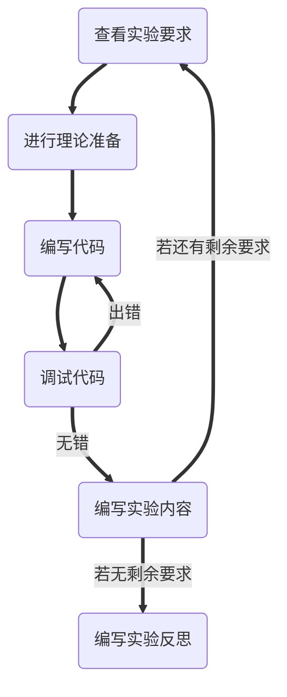
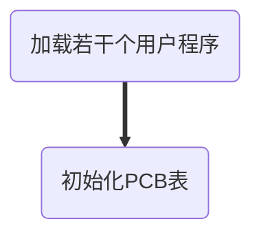
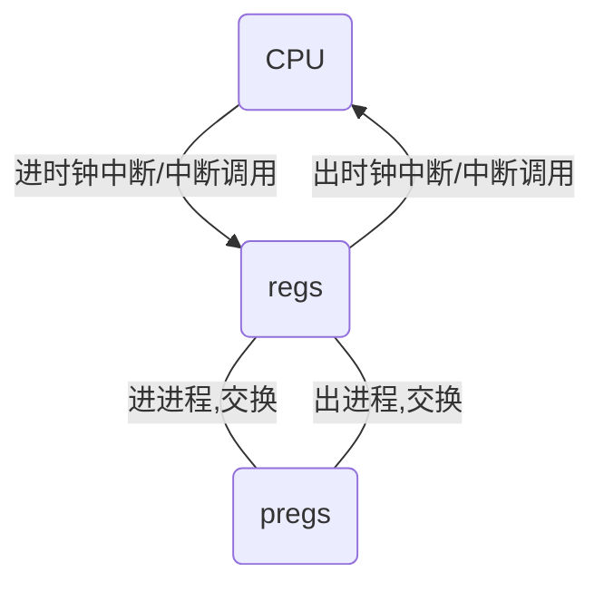
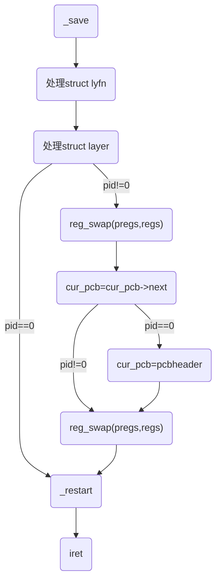
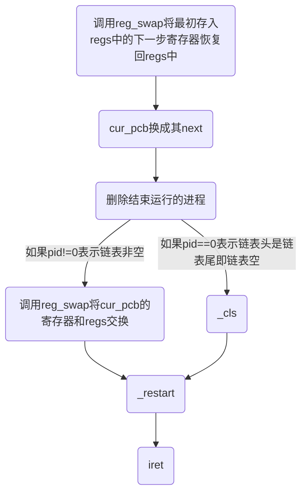

# <center>实验六：实现时间片轮转的二态进程模型</center>
### 一、实验目的：
1. 学习多道程序与CPU分时技术
2. 掌握操作系统内核的二态进程模型设计与实现方法
3. 掌握进程表示方法
4. 掌握时间片轮转调度的实现
### 二、实验要求：
1. 了解操作系统内核的二态进程模型
2. 扩展实验五的的内核程序，增加一条命令可同时创建多个进程分时运行，增加进程控制块和进程表数据结构。
3. 修改时钟中断处理程序，调用时间片轮转调度算法。
4. 设计实现时间片轮转调度算法，每次时钟中断，就切换进程，实现进程轮流运行。
5. 修改save()和restart()两个汇编过程，利用进程控制块保存当前被中断进程的现场，并从进程控制块恢复下一个进程的现场。
6. 编写实验报告，描述实验工作的过程和必要的细节，如截屏或录屏，以证实实验工作的真实性
### 三、技术路线：

### 四、实验内容：
##### (1) 修改实验5的内核代码，定义进程控制块PCB类型，包括进程号、程序名、进程内存地址信息、CPU寄存器保存区、进程状态等必要数据项，再定义一个PCB数组，最大进程数为10个。
###### 理论准备：
1. 将上次写的在asm中定义的`_register`，重写成C的结构体，方便建立多个结构体以给多进程使用。
2. 为了保持结构体在asm中的可读性，使用`equ`语法，定义一些标签表示偏移。
3. 定义PCB数组时，进程内存地址信息存在寄存器中。如段寄存器，`esp`，`ip`等。因而结构体需要存的成员有`pregs`，`pid`，`pname`，`pstate`。
4. `pid`从1开始。
###### 代码编写：
1. 重写`_register`为结构体`struct reg`。
```C
struct reg
{
    unsigned int ax;
    unsigned int bx;
    unsigned int cx;
    unsigned int dx;
    unsigned int sp;
    unsigned int bp;
    unsigned int si;
    unsigned int di;
    unsigned int ip;
    unsigned int flags;
    unsigned int es;
    unsigned int cs;
    unsigned int ss;
    unsigned int ds;
    unsigned int fs;
    unsigned int gs;
};
struct reg regs;
```
2. `equ`语法定义标签，保持结构体在asm中的可读性。
```x86asm
_ax equ 0
_bx equ 4
_cx equ 8
_dx equ 12
_sp equ 16
_bp equ 20
_si equ 24
_di equ 28
_ip equ 32
_flags equ 36
_es equ 40
_cs equ 44
_ss equ 48
_ds equ 52
_fs equ 56
_gs equ 60
```
3. `struct PCB`的构建。
```C
struct PCB
{
    struct reg pregs;
    int pid;
    char pname[10];
    char pstate;
};
struct PCB pcblist[MaxProcessNo];
```
##### (2) 扩展实验五的的内核程序，增加一条命令可同时执行多个用户程序，内核加载这些程序，创建多个进程，再实现分时运行。
###### 理论准备：
1. 命令的处理过程：

2. 为了能够同时加载多个用户程序，需要将原先的`_callf`分成加载和调用两个过程，另外加载要将加载到的数据段作为一个参数。
3. 因为可能频繁删除，所以将PCB表改成链表存储。
4. 将命令命名为`"SYNC"`。
###### 代码编写：
1. 拆`_callf`成`load`和`_callf`。
```
_callf:
    push dword ebx
    push dword ebp
    mov ax, 0x1000
    mov ds, ax
    mov word [0], 0x20cd
    mov word [0x2e], sp
    mov word [0x30], ss
    mov sp, 0xffff
    mov ss, ax
    push word 0x1000
    push word 0x0
    jmp 0x1000:0x100           ; 0xb100
_after_user_ret:
    pop dword ebp
    pop dword ebx
    o32 ret
```
注意`_load`也要写一个返回前的操作。
```x86asm
_load:
    mov ax, word[esp+20]
    mov es, ax                ; es:bx
    mov cl, byte[esp+4]       ; 扇区号
    mov ch, byte[esp+8]       ; 柱面号 ; 起始编号为0
    mov dh, byte[esp+12]      ; 磁头号 ; 起始编号为0
    mov al, byte[esp+16]      ; 扇区数
    push dword ebx
    mov bx, 0x100             ; 偏移地址; 存放数据的内存偏移地址
    mov ah, 2                 ; 功能号
    mov dl, 0                 ; 驱动器号 ; 软盘为0，硬盘和U盘为80H
    int 13H                   ; 调用读磁盘BIOS的13h功能
    pop dword ebx
    o32 ret
```
2. 利用`node`链式存储PCB表，操作大同小异，在此只展示分配新的PCB表过程。其中，寄存器初始化即初始化段寄存器，`ip`，`sp`和`flags`。另外`pid`为0表示链表尾。
```C
int new_pcb(unsigned int cs, int pid, char *pname, int cursor)
{
    int neo_pcb = new_node(cursor, &pcbheader, pcbndsp);
    if (neo_pcb != null)
    {
        pcbsp[neo_pcb].pregs.ax = 0;
        pcbsp[neo_pcb].pregs.bx = 0;
        pcbsp[neo_pcb].pregs.cx = 0;
        pcbsp[neo_pcb].pregs.dx = 0;
        pcbsp[neo_pcb].pregs.sp = 0xffff;
        pcbsp[neo_pcb].pregs.bp = 0;
        pcbsp[neo_pcb].pregs.si = 0;
        pcbsp[neo_pcb].pregs.di = 0;
        pcbsp[neo_pcb].pregs.ip = 100;
        pcbsp[neo_pcb].pregs.flags = 512;
        pcbsp[neo_pcb].pregs.es = 0;
        pcbsp[neo_pcb].pregs.cs = cs;
        pcbsp[neo_pcb].pregs.ss = cs;
        pcbsp[neo_pcb].pregs.ds = cs;
        pcbsp[neo_pcb].pregs.fs = 0;
        pcbsp[neo_pcb].pregs.gs = 0;
        pcbsp[neo_pcb].pid = pid;
        for (int i = 0; i < 10 && pname[i] != 0; i++)
        {
            pcbsp[neo_pcb].pname[i] = pname[i];
        }
        pcbsp[neo_pcb].pstate = 0;
    }
    return neo_pcb;
}
```
##### (3) 修改save()和restart()两个汇编过程，利用进程控制块保存当前被中断进程的现场，并从进程控制块恢复下一个进程的运行。
###### 理论准备：
1. 本来该步在老师的要求中是步骤5，但是我认为应该提前定义好`save`和`restart`的操作才能继续原本的第三步（现在的第四步）。
2. 原本的`_save`和`_restart`只能操作最开始定义的`regs`内的寄存器值，而不能操作任意一个PCB表中的内存器值。另外，考虑到用户程序可能会进行系统调用。假设时钟中断时，调用`_save`将寄存器存在`regs`，接着将当前CPU寄存器存到当前进程的PCB表`pregs`中，轮转到下一个。接着将新的当前进程PCB表中`pregs`换入CPU的寄存器中，这之后如果这个进程中断调用，也会调用`_save`，而且将一开始的`regs`覆盖掉了。另外注意到`pregs`这个时候是不会被修改的，而且在换入CPU的寄存器中后，是无用的数据。因而解决方法是，进入时钟中断轮转前调用`_save`后将`regs`和`pregs`交换，然后轮转后，将`regs`和`pregs`值交换，然后正常操作，这个时候中断调用，只会修改当前`regs`的值，当前`pregs`是被保护的，而当前`regs`值是无用的，可以覆盖。结束时，将寄存器存到`regs`，再将`regs`和`pregs`值交换。绘制示意图如下：

###### 代码编写：
1. 用于交换`struct regs`的函数`reg_swap`实现，使用了指针类型转换来做到用循环即可实现。
```C
void reg_swap(struct reg* reg1, struct reg* reg2)
{
    unsigned int *p1 = (unsigned int *)reg1;
    unsigned int *p2 = (unsigned int *)reg2;
    for (int i = 0; i < 16; i++)
    {
        p1[i] += p2[i];
        p2[i] = p1[i] - p2[i];
        p1[i] -= p2[i];
    }
}
```
##### (4) 修改时钟中断处理程序，保留无敌风火轮显示，而且增加调用进程调度过程。
###### 理论准备：
1. 之前`_clock`是时钟中断调用的函数，用于固定频率地调用`clock`处理`layfun`和`layer`，这里再调用一个调度程序即可（不能将调度程序加在`clock`中，因为`clock`频率太低了）。
2. 根据我自己的算法，有一个尾部节点（`pid`为0）是不使用的。而当PCB链表为空时，`pcbheader`就是该节点，要保证PCB链表为空时不执行调度算法（否则时钟中断结束后CPU的寄存器会被修改为尾部节点的`pregs`值），需要进行一个判断。
3. 轮转时，`cur_pcb`如果到尾部，需要将其修改为头部，所以加一个判断。
4. 时钟中断过程：

5. 由于命令函数`cmd_sync`未执行完时，PCB链表未完成，因而应该执行前`cli`关中断，执行完成后再`sti`开中断。
6. 考虑完成PCB链表后，如果直接调用时钟中断，会将当前CPU的寄存器值存入一个PCB表中的`pregs`里，而这是错误的。因而可以这个时候将`cur_pcb`置`null`，然后在`schedule`内对`null`做出响应。
7. 返回：由于最开始已经将下一步的寄存器存在了`regs`中，而`regs`在多次`reg_swap`的过程中是被保护的。因而只需要恢复`regs`回CPU的寄存器中即可。
8. 由于要恢复`regs`，且没结束运行一个进程，需要调用`delete_node`来删掉该PCB表节点。而用户程序的返回是通过`int 20h`来实现的，因而可以让`int 20h`判断是否是多进程来实现上述要求。
9. 由于多进程不需要上次实验写的PSP表中的`ss`和`sp`来恢复栈，只需要恢复`regs`即可。所以可以将其默认设为0，以此来作为判断是否是多进程的标志。
10. 另外需要对`_load`进行修改，来保证`_load`过程可以将PSP表中的前两个字节设为`int 20h`，`ss`，`sp`字节初始化为0，将PSP表中`int 20h`的地址放到栈中。
11. 对于单个结束进程的处理。注意`_restart`会将`regs`中的值放入CPU的寄存器中。因而通过判断是不是最后一个结束的进程来选择是切换到下一进程，还是切换回内核。

###### 代码编写：
1. 增加了调用`schedule`的`_clock`。
```x86asm
_clock:
    call dword _save
    dec dword[_count]         ; 递减计数变量
    jnz _clock_end            ; >0：跳转
    call dword clock
    mov dword[_count], _delay ; 重置计数变量=初值delay
_clock_end:
    call dword schedule
    mov al, 20h               ; AL = EOI
    out 20h, al               ; 发送EOI到主8529A
    out 0A0h, al              ; 发送EOI到从8529A
    call dword _restart
    iret                      ; 从中断返回
```
2. `schedule`实现。
```C
void schedule()
{
    if (pcbsp[cur_pcb].pid != 0)
    {
        reg_swap(&pcbsp[cur_pcb].pregs, &regs);
        cur_pcb = pcbndsp[cur_pcb].next;
        if (pcbsp[cur_pcb].pid == 0)
        {
            cur_pcb = pcbheader;
        }
        reg_swap(&pcbsp[cur_pcb].pregs, &regs);
    }
}
```
3. 新写`_cmd_sync`套在`cmd_sync`外面，用于关中断和开中断。
```x86asm
_cmd_sync:
    cli
    mov eax, dword[esp + 4]
    push dword eax
    call dword cmd_sync
    add esp, 4
    sti
    o32 ret
```
4. `schedule`对`null`的响应。
```C
void schedule()
{
    if (cur_pcb == null)
    {
        cur_pcb = pcbheader;
        if (pcbsp[cur_pcb].pid != 0)
        {
            reg_swap(&pcbsp[cur_pcb].pregs, &regs);
        }
    }
    ...
}
```
5. 重改的`_load`。注意修改PSP表和栈需要初始化`ds`，`ss`，`sp`，修改后需要恢复`ds`，`ss`，`sp`。
```x86asm
_load:
    ...
    int 13H                   ; 调用读磁盘BIOS的13h功能
    mov ax, es
    mov ds, ax
    mov word [0], 0x20cd
    mov word [0x2e], 0
    mov word [0x30], 0
    mov bx, sp
    mov sp, 0xffff
    mov ss, ax
    push word es
    push word 0x0
    mov ax, 0x800
    mov ds, ax
    mov ss, ax
    mov sp, bx
    pop dword ebx
    o32 ret
```
6. 修改的`_int_20h`，其中`ds:0x2e`是用来存放PSP表中`ss`和`sp`的地方。
```x86asm
_int_20h:
    mov eax, 0
    cmp eax, dword[0x2e]
    jz _int_20h_sync
_int_20h_normal:
    ...
_int_20h_sync:
    mov ax, cs
    mov ds, ax
    mov ss, ax
    call dword sync_ret
    call dword _restart
    iret
```
7. `sync_ret`用来处理单个进程的结束。
```C
void sync_ret()
{
    reg_swap(&pcbsp[cur_pcb].pregs, &regs);
    cur_pcb = pcbndsp[cur_pcb].next;
    delete_node(pcbndsp[cur_pcb].last, &pcbheader, pcbndsp);
    if (pcbsp[cur_pcb].pid == 0)
    {
        cur_pcb = pcbheader;
    }
    if (pcbsp[cur_pcb].pid != 0)
    {
        reg_swap(&pcbsp[cur_pcb].pregs, &regs);
    }
    else
    {
        _cls();
    }
}
```
##### (5) 内核增加进程调度过程：每次调度，将当前进程转入就绪状态，选择下一个进程运行，如此反复轮流运行。
###### 理论准备：
1. 大部分工作在上面已经做完，只需要在切换进程时增加对于`pstate`的修改。
###### 代码编写：
1. `schedule`的修改。
```C
void schedule()
{
    if (cur_pcb == null)
    {
        cur_pcb = pcbheader;
        if (pcbsp[cur_pcb].pid != 0)
        {
            reg_swap(&pcbsp[cur_pcb].pregs, &regs);
            pcbsp[cur_pcb].pstate = 1;
        }
    }
    else if (pcbsp[cur_pcb].pid != 0)
    {
        pcbsp[cur_pcb].pstate = 0;
        reg_swap(&pcbsp[cur_pcb].pregs, &regs);
        cur_pcb = pcbndsp[cur_pcb].next;
        if (pcbsp[cur_pcb].pid == 0)
        {
            cur_pcb = pcbheader;
        }
        reg_swap(&pcbsp[cur_pcb].pregs, &regs);
        pcbsp[cur_pcb].pstate = 1;
    }
}
```
2. `sync_ret`的修改。
```C
void sync_ret()
{
    reg_swap(&pcbsp[cur_pcb].pregs, &regs);
    cur_pcb = pcbndsp[cur_pcb].next;
    delete_node(pcbndsp[cur_pcb].last, &pcbheader, pcbndsp);
    if (pcbsp[cur_pcb].pid == 0)
    {
        cur_pcb = pcbheader;
    }
    if (pcbsp[cur_pcb].pid != 0)
    {
        reg_swap(&pcbsp[cur_pcb].pregs, &regs);
        pcbsp[cur_pcb].pstate = 1;
    }
    else
    {
        _cls();
    }
}
```
##### (6) 实验5的内核其他功能，如果不必要，可暂时取消服务。
###### 理论准备：
1. 目前功能都可以并存，没必要取消。
### 五、实验亮点：
1. 使用链式存储，实现了PCB表。
2. 灵活运用了`_save`和`_restart`达到切换进程的目的。
3. 对寄存器的保护进行了有意义的思考，使用`regs_swap`来防止用户程序进程可能出现的进行系统调用覆盖掉`regs`的潜在问题的发生。
4. 与前面的功能都是兼容的。
### 六、实验反思：
这次实验几乎是完成得最快的一次，没遇到什么bug。我认为原因可能是，一方面技术路线中理论准备部分做得充分，在写代码前便进行了深入的思考，并针对问题给出了合理的解决方案；另一方面，几次实验下来我对于汇编的熟练度也大大提高了，这次实验没有出现地址位数加载扇区数还有寄存器的保护问题。
但是不足之处是，我的这次实验没有多少很有创意的内容，除了一些具体问题的解决和代码设计，基本上是按照老师的要求来的。
再来说说我对整个操作系统实验的看法。老师有在课上讲过，本实验课最大的特点和优势在于，和理论课紧密结合。但是综合了几次实验，我认为其直接用到理论课的知识不是很多。两状态模型和PCB表只是其中一章的一个知识点。不过我也切切实实地从实验课中体会到了理论知识贯穿其中。从FAT表的实验中，我了解了磁盘的硬件基础，在理解“大页表有利于磁盘数据传输”问题上提供了很大的帮助；在加载用户程序的实验中，我第一次真实地接触了虚拟地址和物理地址，在当时通过网络提前了解了一些知识；在中断调用的实验里，我也终于理解了“中断是啥”这个从计算机组成原理课开始就一直困扰我的问题。不仅如此，这个实验课磨练了还我的意志，我感觉这是我写过的最难debug的代码了，因为汇编的代码可读性不高而且bochsdbg的tui做的一言难尽（现在想想gdb这些调试工具真的很伟大）；另外代码量大，加上FAT的代码几千行应该是有了。以至于每次看到新的实验发布，脑海里都有一句“新的风暴已经出现，怎么能够停滞不前”在回荡。
最后，希望助教批改后能够早点给出反馈，指出我的不足，以便于下次在实验中进行改进。