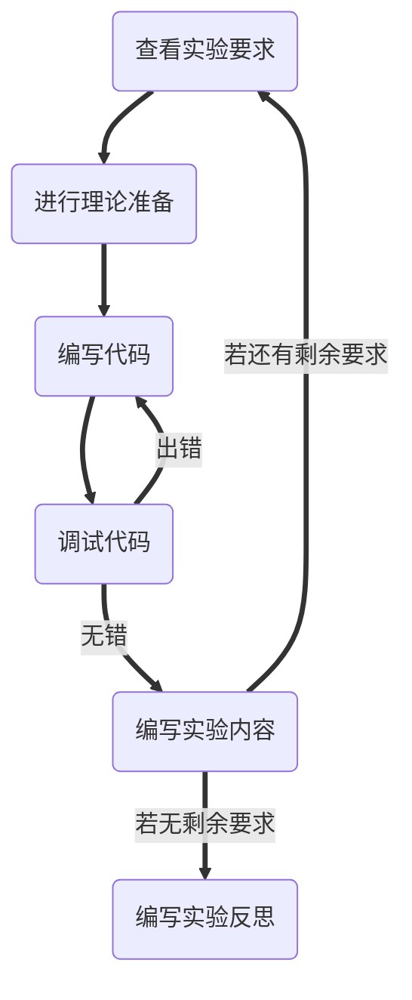
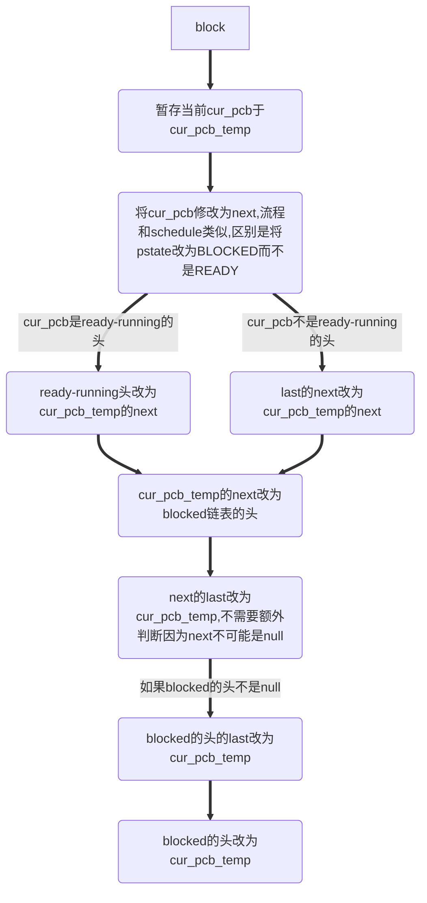
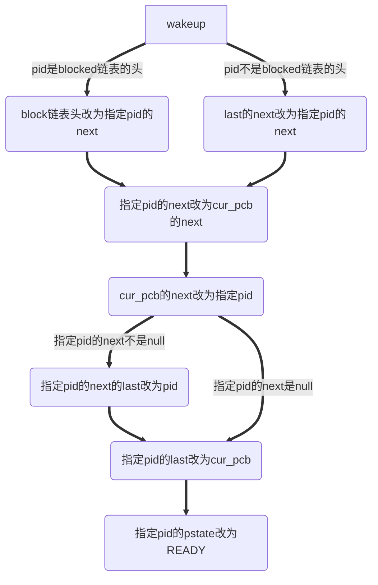

# <center>实验七：实现五态进程模型及多进程应用</center>
### 一、实验目的：
1. 理解5状态的进程模型
2. 掌握操作系统内核线程模型设计与实现方法
3. 掌握实现5状态的进程模型方法
4. 实现C库封装多线程服务的相关系统调用。
### 二、实验要求：
1. 学习内核级线程模型理论，设计总体实现方案
2. 理解类unix的内核线程做法，明确全局数据、代码、局部变量的映像内容哪些共享。
2. 扩展实验6的的内核程序，增加阻塞进程状态和阻塞过程、唤醒过程两个进程控制过程。
3. 修改内核，提供创建线程、撤销线程和等待线程结束，实现你的线程方案。
4. 增加创建线程、撤销线程和等待线程结束等系统调用。修改扩展C库，封装创建线程、撤销线程和等待线程结束等系统调用操作。
5. 设计一个多线程应用的用户程序，展示你的多线程模型的应用效果。
6. 编写实验报告，描述实验工作的过程和必要的细节，如截屏或录屏，以证实实验工作的真实性
### 三、技术路线：

### 四、实验内容：
##### 1. 修改内核代码，增加阻塞队列，实现5状态进程模型。
###### 理论准备：
1. 总体设计：`block`可以将当前当前线程阻塞，`wakeup`可以唤醒指定`pid`的线程。
2. 因为`wakeup`需要可以唤醒指定`pid`的线程，即访问队列中间的PCB，阻塞队列实际上不是一个队列，而是一个阻塞链表。
3. 阻塞链表的实现：由于实验6中已经实现PCB表之间连接的逻辑，因而只需要加一个头`blockheader`即可。
4. 注意ready-running链表和blocked链表设计的区别，ready-running链表会一直保留一个pid=0的不会访问的尾节点便于代码的编写（如不用考虑next是null的情况）。而为了不做太大改动blocked链表没有这个尾节点。
5. `block`的实现：将`cur_pcb`指向的PCB表移出ready-running（即原先的）的PCB链表，移入blocked（即新的）的PCB链表的头部。另外由于`schedule`的正确运行需要保证`cur_pcb`在ready-running的PCB链表中，因而`block`也需要能够按照`schedule`的流程正确地将`cur_pcb`改为其`next`。

6. `wakeup`的实现：将指定pid的节点移出blocked链表，并移入ready-running链表cur_pcb的后面，这样只要运行一个schedule，就可以轮转到唤醒的进程中。

###### 代码编写：
1. 阻塞链表的实现。
```C
int blockheader;
```
2. `block`的实现。
- 暂存当前cur_pcb于cur_pcb_temp
```C
int cur_pcb_temp = cur_pcb;
```
- 类似`schedule`的流程实现。
```C
pcbsp[cur_pcb].pstate = BLOCKED;
reg_swap(&pcbsp[cur_pcb].pregs, &regs);
cur_pcb = pcbndsp[cur_pcb].next;
if (pcbsp[cur_pcb].pid == 0)
{
    cur_pcb = pcbheader;
}
reg_swap(&pcbsp[cur_pcb].pregs, &regs);
pcbsp[cur_pcb].pstate = RUNNING;
```
- 将cur_pcb_temp指向的PCB表移出ready-running链表，移入blocked链表的头。
```C
if (cur_pcb_temp == pcbheader)
{
    pcbheader = pcbndsp[cur_pcb_temp].next;
}
else
{
    pcbndsp[pcbndsp[cur_pcb_temp].last].next = pcbndsp[cur_pcb_temp].next;
}
pcbndsp[cur_pcb_temp].next = blockheader;
pcbndsp[pcbndsp[cur_pcb_temp].next].last = pcbndsp[cur_pcb_temp].last;
pcbndsp[cur_pcb_temp].last = null;
if (blockheader != null)
{
    pcbndsp[blockheader].last = cur_pcb_temp;
}
blockheader = cur_pcb_temp;
```
3. wakeup的实现。
```C
void wakeup(int pid)
{
    if (pid == blockheader)
    {
        blockheader = pcbndsp[pid].next;
    }
    else
    {
        pcbndsp[pcbndsp[pid].last].next = pcbndsp[pid].next;
    }
    pcbndsp[pid].next = pcbndsp[cur_pcb].next;
    pcbndsp[cur_pcb].next = pid;
    if (pcbndsp[pid].next != null)
    {
        pcbndsp[pcbndsp[pid].next].last = pid;
    }
    pcbndsp[pid].last = cur_pcb;
    pcbsp[pid].pstate = READY;
}
```
##### 2. 如果采用线程控制块，就要分离进程控制块的线程相关项目，组成线程控制块，重构进程表数据结构。
###### 理论准备：
1. 需要增加一种`pstate`，`BLOCKED`。
2. 需要增加一个成员变量，父进程`fpid`，以便`exit`时对父进程执行`wakeup`操作。
###### 代码编写：
1. 增加一种`pstate`。
```C
#define READY 0
#define RUNNING 1
#define BLOCKED 2
```
2. 增加`fpid`。
```C
struct PCB
{
    struct reg pregs;
    int pid;
    char pname[10];
    char pstate;
    int fpid;
};
```
```C
int new_pcb(char *pname, int cursor)
{
    int neo_pcb = new_node(cursor, &pcbheader, pcbndsp);
    if (neo_pcb != null)
    {
        ...
        pcbsp[neo_pcb].fpid = cur_pcb;
    }
    return neo_pcb;
}
```
##### 3. 修改内核代码，增加阻塞block()、唤醒wakeup()、睡眠sleep()、创建线程do_fork()、撤销线程do_exit()和等待线程结束do_wait()等过程，实现你的线程控制。
###### 理论准备：
1. `fork`的设计：调用`new_pcb`在`cur_pcb`前生成一个新的PCB表，将`cur_pcb`的`pregs`拷贝给新的PCB表，分配新的栈给`cur_pcb`，将`cur_pcb`对应的栈拷贝给新的PCB表对应的栈，返回值通过修改`regs`及`pregs`的`ax`实现。
2. `pregs`拷贝`reg_cpy`的实现：类似`reg_swap`，使用指针类型转换加一个循环实现。注意由于实验6中，进入某进程时会将其PCB表中的`pregs`和`regs`进行交换，对`regs`进行保护，因而调用时应将`regs`，而不是`pcbsp[cur_pcb].pregs`拷贝给`pcbsp[pid].pregs`。
3. 栈分配的实现：老师给出的方案是每个栈256字节，我认为栈空间不大，而且浪费了PCB表`pid`和`ss`段地址一一对应的关系。可以通过在`pid`和`ss`间建立映射，`ss=0x1000*(pid-1)`。由于`pid`使用的直接是在`pcbsp`中的下标，`0`是`null`，`1`是尾节点，所以从`2`开始。

|pid|  ss  |
|---|------|
|  0|     -|
|  1|     -|
|  2|0x1000|
|  3|0x2000|
|...|   ...|
| 10|0x9000|
4. 栈拷贝`_stack_cpy`的实现：由于涉及到“段:偏移”的寻址方式，因而直接用汇编实现比较方便。另外注意nasm对栈的操作最小的单位是`word`，因而一次拷贝一个`word`是相对好的选择。
5. `exit`的设计：如果父进程的`pstate`是`BLOCKED`则唤醒，此时父进程一定在子进程后（因为创建时子进程在父进程前，`wakeup`中将进程放在当前进程后）然后直接调用实验6编写的`sync_ret`，完成删除节点和调度的工作。
6. 封装成系统调用：`wakeup`之外的函数没有参数，因而系统调用也不设置参数。`wakeup`的参数指定`pid`由`ebx`传递。
###### 代码编写：
1. `reg_cpy`的实现。
```C
void reg_cpy(struct reg* reg1, struct reg* reg2)
{
    unsigned int *p1 = (unsigned int *)reg1;
    unsigned int *p2 = (unsigned int *)reg2;
    for (int i = 0; i < 16; i++)
    {
        p1[i] = p2[i];
    }
}
```
2. 栈分配的实现。
- 映射关系在创建进程时的体现。
```C
int new_pcb(char *pname, int cursor)
{
    int neo_pcb = new_node(cursor, &pcbheader, pcbndsp);
    if (neo_pcb != null)
    {
        int cs = 0x1000 * (neo_pcb - 1);
        ...
        pcbsp[neo_pcb].pregs.cs = cs;
        pcbsp[neo_pcb].pregs.ss = cs;
        pcbsp[neo_pcb].pregs.ds = cs;
        ...
    }
    return neo_pcb;
}
```
- 映射关系在`fork`中的体现。
```C
void fork()
{
    ...
    reg_cpy(&pcbsp[pid].pregs, &regs);
    pcbsp[pid].pregs.ax = 0;
    pcbsp[pid].pregs.ss = 0x1000 * (pid - 1);
    ...
}
```
3. 栈拷贝`_stack_cpy`的实现。
```x86asm
_stack_cpy:
    mov ax, word [esp + 4]
    mov es, ax
    mov ax, word [esp + 12]
    mov fs, ax
    mov eax, dword [esp + 8]
    mov ecx, dword [esp + 16]
_stack_cpy_loop:
    mov dx, word [fs:ecx]
    mov word [es:eax], dx
    add eax, 2
    add ecx, 2
    cmp eax, dword [esp + 20] 
    jnz _stack_cpy_loop
_stack_cpy_end:
    o32 ret
```
4. `fork`的实现。
```C
void fork()
{
    int pid = new_pcb("Thread", cur_pcb);
    if (pid == null)
    {
        regs.ax = -1;
        return;
    }
    reg_cpy(&pcbsp[pid].pregs, &regs);
    pcbsp[pid].pregs.ax = 0;
    pcbsp[pid].pregs.ss = 0x1000 * (pid - 1);
    _stack_cpy(pcbsp[pid].pregs.ss, pcbsp[pid].pregs.sp, regs.ss, regs.sp, 0xffff);
    regs.ax = pid;
}
```
5. `exit`的实现。
```C
void exit()
{
    if (pcbsp[pcbsp[cur_pcb].fpid].pstate == BLOCKED)
    {
        wakeup(pcbsp[cur_pcb].fpid);
    }
    sync_ret();
}
```
6. 封装成系统调用。
```C
_int_21h_64h:
    call dword fork
    jmp _int_21h_end
_int_21h_65h:
    call dword exit
    jmp _int_21h_end
_int_21h_66h:
    call dword block
    jmp _int_21h_end
_int_21h_67h:
    push dword ebx
    call dword wakeup
    jmp _int_21h_end
```
##### 4. 修改扩展C库，封装创建线程fork()、撤销线程exit(0)、睡眠sleep()和等待线程结束wait()等系统调用操作。
###### 理论准备：
1. 类似实验5，可以将所有asm的代码写成内联汇编嵌入到C代码中，不过注意其格式不是x86asm，有如源操作数在前目的操作数在后等的诸多区别。另外定义前需要先声明。
###### 代码编写：
1. `_fork`的实现。
```C
int _fork();
__asm__(
    "_fork:\n"
    "    mov  %ebx, %edx\n"
    "    mov  $0x64, %ah\n"
    "    int  $0x21\n"
    "    mov  %edx, %ebx\n"
    "    ret\n");
```
2. `_exit`的实现。
```C
void _exit();
__asm__(
    "_exit:\n"
    "    mov  %ebx, %edx\n"
    "    mov  $0x65, %ah\n"
    "    int  $0x21\n"
    "    mov  %edx, %ebx\n"
    "    ret\n");
```
3. `_block`的实现。
```C
void _block();
__asm__(
    "_block:\n"
    "    mov  %ebx, %edx\n"
    "    mov  $0x66, %ah\n"
    "    int  $0x21\n"
    "    mov  %edx, %ebx\n"
    "    ret\n");
```
4. `_wakeup`的实现。
```C
void _wakeup(int pid);
__asm__(
    "_wakeup:\n"
    "    mov  %ebx, %edx\n"
    "    mov  4(%esp), %ebx\n"
    "    mov  $0x67, %ah\n"
    "    int  $0x21\n"
    "    mov  %edx, %ebx\n"
    "    ret\n");
```
##### 5. 设计一个多线程应用的用户程序，展示你的多线程模型的应用效果。示范：进程创建2个线程，分别统计全局数组中的字母和数字的出现次数。你也可以另选其他多进程应用。
###### 理论准备：
1. 老师提供的代码是一个线程统计字母数，一个线程打印字母数，我认为这也能很好地说明问题，因而选用了这个代码。
2. 注意由于`fork`的主线程需要有一个PCB表，最初写的调用用户程序的CALL命令并不会建立PCB表，而SYNC命令会建立PCB表，所以对于需要多线程的用户程序，要使用SYNC命令调用。
3. 第一次用CALL调用。
- `cur_pcb=1`是尾节点。而`schedule`有逻辑判断：如果`cur_pcb`是尾节点，不启动轮转，因而无法进入子进程。
- `_block`阻塞当前进程，需要对`schedule`的依赖，而CALL不依赖`schedule`因此不会因`_block`阻塞，因此能够打印0。
- 由于`fork`的运行，ready-running链表头不是尾节点了。
- `_block`的运行，完成了一次类似`schedule`的流程，导致`cur_pcb`修改成了ready-running的头，因此`cur_pcb`不再是尾节点，因此后续的`schedule`将被启动。
4. 第二次用CALL调用。由于上述原因可以进入子进程，但是仍然无法`_block`。但是可能因为子进程执行比较快，提前完成了计数，所以即使没有`_block`，也能有打印在计数后，因此显示正常。
5. 如果用SYNC调用，则会正常操作并会返回字母数。
6. 注意！对于多线程用户程序只有使用SYNC才是正确的，使用CALL会导致ready-running链表有无法清理的项，在此只是为了说明原理的对这种现象的解释。
7. 由于所有的debug都是在此步完成，所以将debug的方式也在此说明。有两种方式，一种是使用bochsdbg直接对软盘debug，可以找到asm部分代码的错误，但是比较耗时；另一种是在C模拟多线程的操作，进而可以找到C部分代码的逻辑错误，而且高效。在使用bochsdbg来debug时，我先在内核设置断点，并反汇编，获得内核部分的代码和地址，存在txt文件中，再进行后续断点调试。debug的代码均保存在dbg文件夹中。
###### 代码编写：
1. 用户程序COUNT.COM多线程部分的实现。
```C
int pid = _fork();
if (pid == -1)
{
    printf(0, 0, 7, "Error in fork!");
}
if (pid)
{
    _block();
    printf(0, 0, 7, "Number of letters = %d", LetterNr);
}
else
{
    for (int i = 0; str[i] != '\0'; i++)
    {
        if ((str[i] >= 'a' && str[i] <= 'z') || (str[i] >= 'A' && str[i] <= 'Z'))
        {
            LetterNr++;
        }
    }
    _exit();
}
```
2. 多线程模拟代码的实现。
```C
int main()
{
    init();
    cmd_sync("COUNT.COM");
    schedule();
    ffork();
    block();
    eexit();
    schedule();
    return 0;
}
```
###### 运行结果：
1. 执行SYNC。

2. 第一次执行CALL。

3. 第二次执行CALL。

### 五、实验亮点：
1. 完成全部任务。
2. 链表实现5状态模型。
3. 使用内联汇编的方法做到只使用.h文件就可以封装全部的库。
4. 利用设计原理，解释一个出错的现象。
5. 使用`pid`和`ss`间映射的方式，为子进程分配栈（本质上也是依托链表串起来了，不连续存放省空间）。
6. 使用流程图、表格、图片，更清楚地解释原理。
7. 使用用C语言模拟的方式调试代码。
### 六、实验反思：
最近时间充裕了，我觉得可能还可以再做几个实验？争取把布置的实验全部做完。