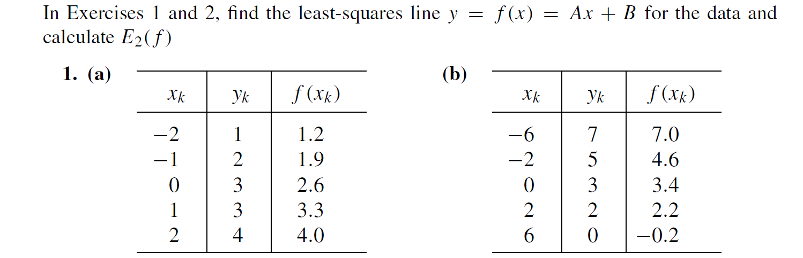
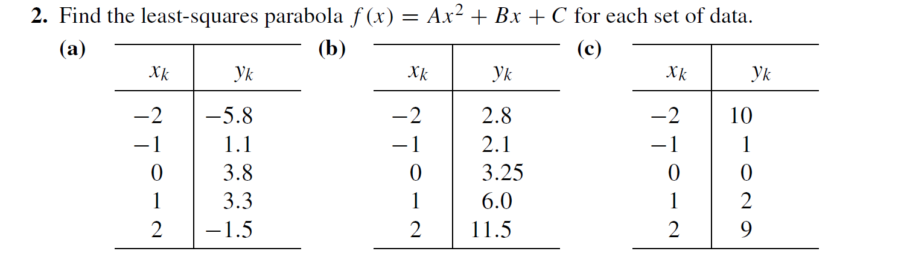
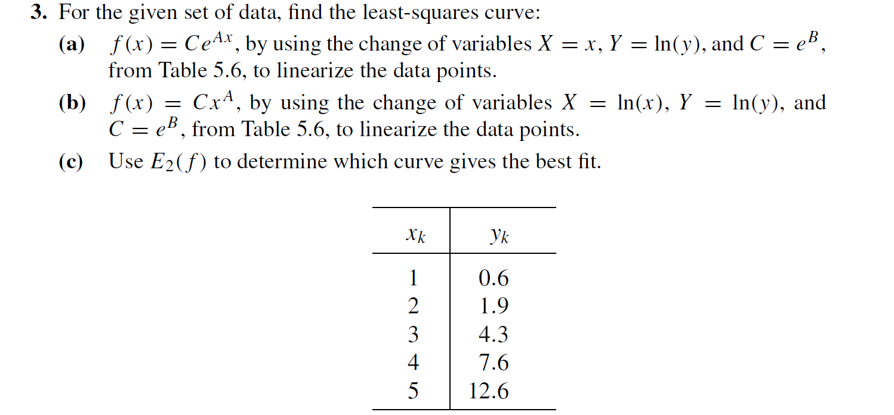

分别计算$\sum_{k=1}^Nx_k^2$，$\sum_{k=1}^Nx_k$，$\sum_{k=1}^Nx_ky_k$，$N$，$\sum_{k=1}^Ny_k$：
```matlab
%a1.m
X = [-2; -1; 0; 1; 2];
Y = [1; 2; 3; 3; 4];
F = [1.2; 1.9; 2.6; 3.3; 4.0];
sum_X_2 = sum(X.^2)
sum_X = sum(X)
sum_XY = sum(X .* Y)
N = size(X, 1)
sum_Y = sum(Y)
```
得：
```matlab
>> a1

sum_X_2 =

    10


sum_X =

     0


sum_XY =

     7


N =

     5


sum_Y =

    13
```
求解方程组：
$$\begin{cases}
(\sum_{k=1}^Nx_k^2)A+(\sum_{k=1}^Nx_k)B=\sum_{k=1}^Nx_ky_k\\
(\sum_{k=1}^Nx_k)A+NB=\sum_{k=1}^Ny_k
\end{cases}$$
代入
$$\begin{cases}
\sum_{k=1}^Nx_k^2=sum\_X\_2\\
\sum_{k=1}^Nx_k=sum\_X\\
\sum_{k=1}^Nx_ky_k=sum\_XY\\
N=N\\
\sum_{k=1}^Ny_k=sum\_Y
\end{cases}$$
得：
$$\begin{cases}
10A=7\\
5B=13
\end{cases}$$
得：
$$\begin{cases}
A=0.7\\
B=2.6
\end{cases}$$
求$E_2(f)=(\frac1N\sum_{k=1}^N|f(x_k)-y_k|^2)^{1/2}$：
```matlab
E2 = sqrt(1 / N * sum((F - Y).^2))
```
得：
```matlab
E2 =

    0.2449
```
所以，$E_2(f)=0.2449$

分别计算$A=(\sum_{k=1}^Nx_k^2y_k)/(\sum_{k=1}^Nx_k^{2\cdot 2})$，$B=(\sum_{k=1}^Nx_k^3y_k)/(\sum_{k=1}^Nx_k^{2\cdot 3})$
```matlab
%a8.m
X = [2.0; 2.3; 2.6; 2.9; 3.2];
Y = [5.1; 7.5; 10.6; 14.4; 19.0];
A = sum(X.^2 .* Y) / sum(X.^(2 * 2))
B = sum(X.^3 .* Y) / sum(X.^(2 * 3))
```
```matlab
>> a8

A =

    1.6866


B =

    0.5902
```
所以，$A = 1.6866$，$B = 0.5902$

计算E2：
```matlab
E2A = sqrt(1 / N * sum((A .* X.^2 - Y).^2))
E2B = sqrt(1 / N * sum((B .* X.^3 - Y).^2))
```
```matlab
E2A =

    1.2971


E2B =

    0.2870
```
所以$M=2$时，$E2=1.2971$，$M=3$时，$E2=0.2870$

分别计算$\sum_{k=1}^Nx_k^4$，$\sum_{k=1}^Nx_k^3$，$\sum_{k=1}^Nx_k^2$，$\sum_{k=1}^Ny_kx_k^2$，$\sum_{k=1}^Nx_k$，$\sum_{k=1}^Ny_kx_k$，N，$\sum_{k=1}^Ny_k$。
```matlab
%a2.m
X = [-2; -1; 0; 1; 2];
Y = [-5.8; 1.1; 3.8; 3.3; -1.5];
sum_X_4 = sum(X.^4)
sum_X_3 = sum(X.^3)
sum_X_2 = sum(X.^2)
sum_Y_X_2 = sum(Y .* X.^2)
sum_X = sum(X)
sum_Y_X = sum(Y .* X)
N = size(X, 1)
sum_Y = sum(Y)
```
```matlab
>> a2

sum_X_4 =

    34


sum_X_3 =

     0


sum_X_2 =

    10


sum_Y_X_2 =

  -24.8000


sum_X =

     0


sum_Y_X =

   10.8000


N =

     5


sum_Y =

    0.9000
```
高斯消元法解方程组：
```matlab
%solve.m
function [solution] = solve(UV)
    solution = zeros(size(UV, 1), 1);
    for  i = 1:size(UV, 1) - 1
        for j = i + 1:size(UV, 1)
            UV(j, :) = UV(j, :) - UV(j, i) / UV(i, i) * UV(i, :);
        end
    end
    for  i = size(UV, 1):-1:1
        UV(i, :) = UV(i, :) / UV(i, i);
        solution(i) = UV(i, size(UV, 2));
        for j = 1:i - 1
            UV(j, :) = UV(j, :) - UV(j, i) / UV(i, i) * UV(i, :);
        end
    end
end
```
```matlab
solve([sum_X_4, sum_X_3, sum_X_2, sum_Y_X_2;
    sum_X_3, sum_X_2, sum_X, sum_Y_X;
    sum_X_2, sum_X, N, sum_Y])
```
```matlab
ans =

   -1.9000
    1.0800
    3.9800
```
所以$A=-1.9$，$B=1.08$，$C=3.98$

因为$y=Ce^{Ax}$带入$X=x$，$Y=ln(y)$，$C=e^B$得，$Y=AX+B$

分别计算$\sum_{k=1}^NX_k^2$，$\sum_{k=1}^NX_k$，$\sum_{k=1}^NX_kY_k$，$N$，$\sum_{k=1}^NY_k$，使用高斯消元法求解方程组：
```matlab
x = [1; 2; 3; 4; 5];
y = [0.6; 1.9; 4.3; 7.6; 12.6];
X = x;
Y = log(y);
sum_X_2 = sum(X.^2);
sum_X = sum(X);
sum_XY = sum(X .* Y);
N = size(X, 1);
sum_Y = sum(Y);
[A; B] = solve([sum_X_2, sum_X, sum_XY;
            sum_X, N, sum_Y])
```
```matlab
>> a3

A =

    0.7475


B =

   -1.0123
```
所以$A=0.7475$，$B=1.2303$
计算$C$：
```matlab
C =

    0.3634
```
所以$f(x)=0.3634e^{0.7475x}$