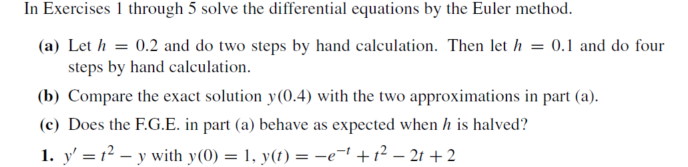
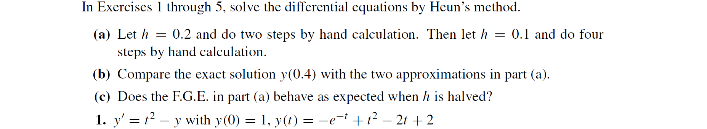
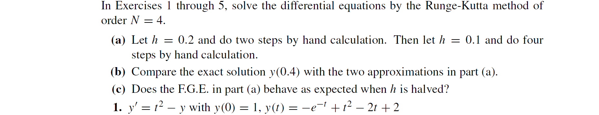
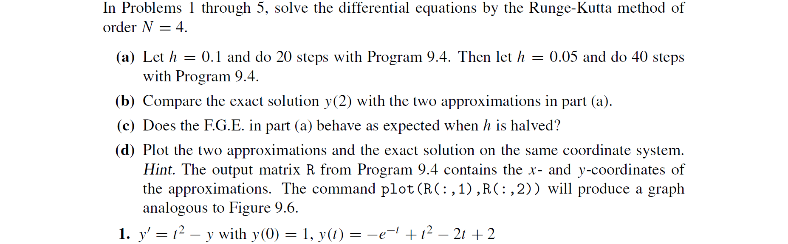
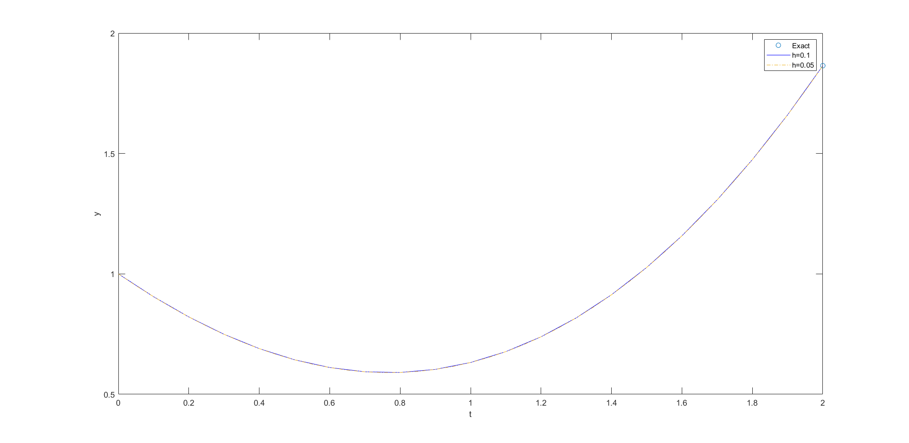
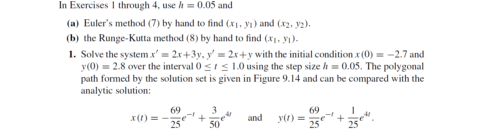

(a)
$y(0.2)=y(0)+hy'(0,y(0))=1+0.2(0^2-1)=0.8$
$y(0.4)=y(0.2)+hy'(0.2,y(0.2))=0.8+0.2(0.2^2-0.8)=0.648$

$y(0.1)=y(0)+hy'(0,y(0))=1+0.1(0^2-1)=0.9$
$y(0.2)=y(0.1)+hy'(0.1,y(0.1))=0.9+0.1(0.1^2-0.9)=0.811$
$y(0.3)=y(0.2)+hy'(0.2,y(0.2))=0.811+0.1(0.2^2-0.811)=0.7339$
$y(0.4)=y(0.3)+hy'(0.3,y(0.3))=0.7339+0.1(0.3^2-0.7339)=0.66951$

(b)
|$t_k$|$y_k$  |         |$y(t_k)$ Exact     |
|-----|-------|---------|-------------------|
|     |$h=0.2$|$h=0.1$  |                   |
|$0.4$|$0.648$|$0.66951$|$0.689679953964361$|

|$h$  |Number of steps, $M$|F.G.E. Error at $t = 0.4$|
|-----|--------------------|-------------------------|
|$0.4$|$2$                 |$0.041679953964361$      |
|$0.2$|$4$                 |$0.020169953964361$      |

(c)
$\therefore 0.020169953964361/0.041679953964361=0.483924573947649\approx0.5$
$\therefore$Yes


(a)
$\begin{aligned}
y^0(0.2)&=y(0)+hy'(0,y(0))\\
&=1+0.2(0^2-1)\\
&=0.8
\end{aligned}$
$\begin{aligned}
y(0.2)&=y(0)+h(y'(0,y(0))+y'(0.2,y^0(0.2)))/2\\
&=1+0.2((0^2-1)+(0.2^2-0.8))/2\\
&=0.824
\end{aligned}$
$\begin{aligned}
y^0(0.4)&=y(0.2)+hy'(0.2,y(0.2))\\
&=0.824+0.2(0.2^2-0.824)\\
&=0.6672
\end{aligned}$
$\begin{aligned}
y(0.4)&=y(0.2)+h(y'(0.2,y(0.2))+y'(0.4,y^0(0.4)))/2\\
&=0.824+0.2((0.2^2-0.824)+(0.4^2-0.6672))/2\\
&=0.69488
\end{aligned}$

$\begin{aligned}
y^0(0.1)&=y(0)+hy'(0,y(0))\\
&=1+0.1(0^2-1)\\
&=0.9
\end{aligned}$
$\begin{aligned}
y(0.1)&=y(0)+h(y'(0,y(0))+y'(0.1,y^0(0.1)))/2\\
&=1+0.1((0^2-1)+(0.1^2-0.9))/2\\
&=0.9055
\end{aligned}$
$\begin{aligned}
y^0(0.2)&=y(0.1)+hy'(0.1,y(0.1))\\
&=0.9055+0.1(0.1^2-0.9055)\\
&=0.81595
\end{aligned}$
$\begin{aligned}
y(0.2)&=y(0.1)+h(y'(0.1,y(0.1))+y'(0.2,y^0(0.2)))/2\\
&=0.9055+0.1((0.1^2-0.9055)+(0.2^2-0.81595))/2\\
&=0.8219275
\end{aligned}$
$\begin{aligned}
y^0(0.3)&=y(0.2)+hy'(0.2,y(0.2))\\
&=0.8219275+0.1(0.2^2-0.8219275)\\
&=0.74373475
\end{aligned}$
$\begin{aligned}
y(0.3)&=y(0.2)+h(y'(0.2,y(0.2))+y'(0.3,y^0(0.3)))/2\\
&=0.8219275+0.1((0.2^2-0.8219275)+(0.3^2-0.74373475))/2\\
&=0.7501443875
\end{aligned}$
$\begin{aligned}
y^0(0.4)&=y(0.3)+hy'(0.3,y(0.3))\\
&=0.7501443875+0.1(0.3^2-0.7501443875)\\
&=0.68412994875
\end{aligned}$
$\begin{aligned}
y(0.4)&=y(0.3)+h(y'(0.3,y(0.3)+y(0.4,y^0(0.4))))/2\\
&=0.7501443875+0.1((0.3^2-0.7501443875)+(0.4^2-0.68412994875))/2\\
&=0.6909306706875
\end{aligned}$

(b)
|$t_k$|$y_k$    |                 |$y(t_k)$ Exact     |
|-----|---------|-----------------|-------------------|
|     |$h=0.2$  |$h=0.1$          |                   |
|$0.4$|$0.69488$|$0.6909306706875$|$0.689679953964361$|

|$h$  |Number of steps, $M$|F.G.E. Error at $t = 0.4$|
|-----|--------------------|-------------------------|
|$0.4$|$2$                 |$0.005200046035639$      |
|$0.2$|$4$                 |$0.001250716723139$      |

(c)
$\therefore 0.001250716723139/0.005200046035639=0.240520317429326\approx0.25$
$\therefore$No


(a)
由
```matlab
function [y] = my_rk4(f, t, y, h, M)
    for i = 1:M
        y = RK41step(f, t, y, h);
        t = t + h;
    end
end
```
```matlab
function [y2] = RK41step(f, t1, y1, h)
    k1 = f(t1, y1)
    k2 = f(t1 + 0.5 * h, y1 + 0.5 * k1 * h)
    k3 = f(t1 + 0.5 * h, y1 + 0.5 * k2 * h)
    k4 = f(t1 + h, y1 + k3 * h)
    y2 = y1 + (k1 + 2 * k2 + 2 * k3 + k4) * h / 6
end
```
```matlab
function [d] = f(t, y)
    d = t^2 - y;
end
```
$k_1=-1$
$k_2=-0.89$
$k_3=-0.901$
$k_4=-0.7798$
$y(0.2)=0.8213$

$k_1=-0.7813$
$k_2=-0.6531$
$k_3=-0.6660$
$k_4=-0.5281$
$y(0.4)=0.689687853777778$

$k_1=-1$
$k_2=-0.9475$
$k_3=-0.9501$
$k_4=-0.8950$
$y(0.1)=0.9052$

$k_1=-0.8952$
$k_2=-0.8379$
$k_3=0.8408$
$k_4=-0.7811$
$y(0.2)=0.8213$

$k_1=-0.7813$
$k_2=-0.7197$
$k_3=-0.7228$
$k_4=-0.6590$
$y(0.3)=0.7492$

$k_1=-0.6592$
$k_2=-0.5937$
$k_3=-0.5970$
$k_4=-0.5295$
$y(0.4)=0.689680432829764$
(b)
|$t_k$|$y_k$              |                   |$y(t_k)$ Exact     |
|-----|-------------------|-------------------|-------------------|
|     |$h=0.2$            |$h=0.1$            |                   |
|$0.4$|$0.689687853777778$|$0.689680432829764$|$0.689679953964361$|

|$h$  |Number of steps, $M$|F.G.E. Error at $t = 0.4$       |
|-----|--------------------|--------------------------------|
|$0.4$|$2$                 |$7.899813416756274\times10^{-6}$|
|$0.2$|$4$                 |$4.788654031084860\times10^{-7}$|

(c)
$\therefore 4.788654031084860\times10^{-7}/7.899813416756274\times10^{-6}=0.0606\approx0.0625$
$\therefore$No


```matlab
>> rk4(@f,0,0+0.1*20,1,20)

ans =

         0    1.0000
    0.1000    0.9052
    0.2000    0.8213
    0.3000    0.7492
    0.4000    0.6897
    0.5000    0.6435
    0.6000    0.6112
    0.7000    0.5934
    0.8000    0.5907
    0.9000    0.6034
    1.0000    0.6321
    1.1000    0.6771
    1.2000    0.7388
    1.3000    0.8175
    1.4000    0.9134
    1.5000    1.0269
    1.6000    1.1581
    1.7000    1.3073
    1.8000    1.4747
    1.9000    1.6604
    2.0000    1.8647
```
```matlab
>> rk4(@f,0,0+0.05*40,1,40)

ans =

         0    1.0000
    0.0500    0.9513
    0.1000    0.9052
    0.1500    0.8618
    0.2000    0.8213
    0.2500    0.7837
    0.3000    0.7492
    0.3500    0.7178
    0.4000    0.6897
    0.4500    0.6649
    0.5000    0.6435
    0.5500    0.6256
    0.6000    0.6112
    0.6500    0.6005
    0.7000    0.5934
    0.7500    0.5901
    0.8000    0.5907
    0.8500    0.5951
    0.9000    0.6034
    0.9500    0.6158
    1.0000    0.6321
    1.0500    0.6526
    1.1000    0.6771
    1.1500    0.7059
    1.2000    0.7388
    1.2500    0.7760
    1.3000    0.8175
    1.3500    0.8633
    1.4000    0.9134
    1.4500    0.9679
    1.5000    1.0269
    1.5500    1.0903
    1.6000    1.1581
    1.6500    1.2305
    1.7000    1.3073
    1.7500    1.3887
    1.8000    1.4747
    1.8500    1.5653
    1.9000    1.6604
    1.9500    1.7602
    2.0000    1.8647
```

(b)
|$t_k$|$y_k$              |                   |$y(t_k)$ Exact     |
|-----|-------------------|-------------------|-------------------|
|     |$h=0.1$            |$h=0.05$           |                   |
|$2$  |$1.864666364534275$|$1.864664817490470$|$1.864664716763387$|

|$h$   |Number of steps, $M$|F.G.E. Error at $t = 0.4$       |
|------|--------------------|--------------------------------|
|$0.1$ |$20$                |$1.647770887736044\times10^{-6}$|
|$0.05$|$40$                |$1.007270828967677\times10^{-7}$|

(c)
$\therefore 1.007270828967677\times10^{-7}/1.647770887736044\times10^{-6}=0.0611
\approx0.0625$
$\therefore$No

(d)
由
```matlab
%p503t1
y=@(t)-exp(-t)+t^2-2*t+2;
plot(2, y(2), 'o')
hold on
R1 = rk4(@f,0,0+0.1*20,1,20)
plot(R1(:, 1), R1(:, 2), 'b')
R2 = rk4(@f,0,0+0.05*40,1,40)
plot(R2(:, 1), R2(:, 2), '-.')
xlabel('t')
ylabel('y')
legend('Exact', 'h=0.1', 'h=0.05')
```



(a)
```matlab
function [x, y] = euler_system(f, g, t, x, y, h, M)
    for i = 1:M
        x0 = x;
        y0 = y;
        x = x + h * f(t, x0, y0)
        y = y + h * g(t, x0, y0)
        t = t + h;
    end
end
```
```matlab
function [d] = xd(t, x, y)
    d = 2 * x + 3 * y;
end
```
```matlab
function [d] = yd(t, x, y)
    d = 2 * x + y;
end
```
```matlab
>> [x,y]=euler_system(@xd,@yd,0,-2.7,2.8,0.05,2);

x =

   -2.5500


y =

    2.6700


x =

   -2.4045


y =

    2.5485
```
$\therefore(-2.55,2.67),(-2.4045,2.5485)$

(b)
```matlab
function [x, y] = rk4_system(f, g, t, x, y, h, M)
    for i = 1:M
        x1 = x;
        y1 = y;
        f1 = f(t, x1, y1)
        g1 = g(t, x1, y1)
        f2 = f(t + 0.5 * h, x1 + 0.5 * f1 * h, y1 + 0.5 * g1 * h)
        g2 = g(t + 0.5 * h, x1 + 0.5 * f1 * h, y1 + 0.5 * g1 * h)
        f3 = f(t + 0.5 * h, x1 + 0.5 * f2 * h, y1 + 0.5 * g2 * h)
        g3 = g(t + 0.5 * h, x1 + 0.5 * f2 * h, y1 + 0.5 * g2 * h)
        f4 = f(t + h, x1 + f3 * h, y1 + g3 * h)
        g4 = g(t + h, x1 + f3 * h, y1 + g3 * h)
        x = x1 + (f1 + 2 * f2 + 2 * f3 + f4) * h / 6
        y = y1 + (g1 + 2 * g2 + 2 * g3 + g4) * h / 6
        t = t + h;
    end
end
```
```matlab
>> [x,y]=rk4_system(@xd,@yd,0,-2.7,2.8,0.05,1);

f1 =

    3.0000


g1 =

   -2.6000


f2 =

    2.9550


g2 =

   -2.5150


f3 =

    2.9591


g3 =

   -2.5151


f4 =

    2.9186


g4 =

   -2.4298


x =

   -2.5521


y =

    2.6742
```
$\therefore(-2.5521,2.6742)$