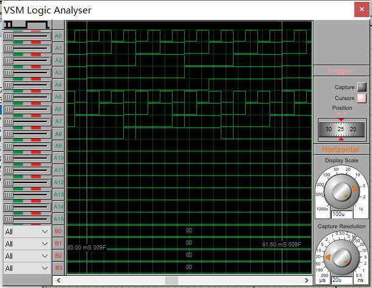
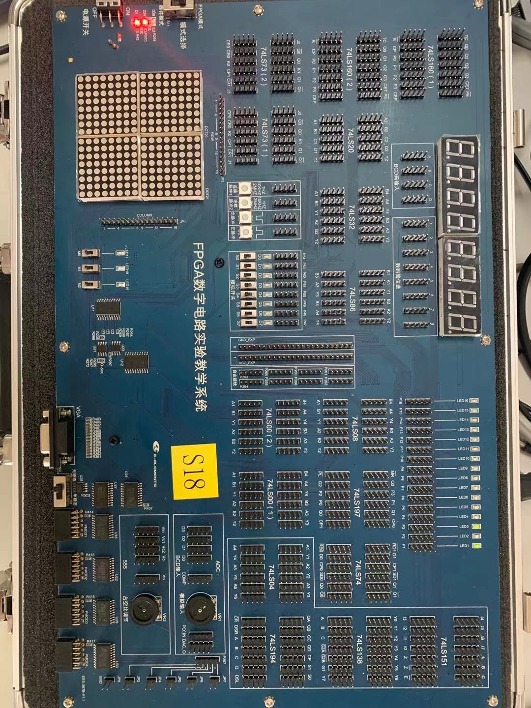
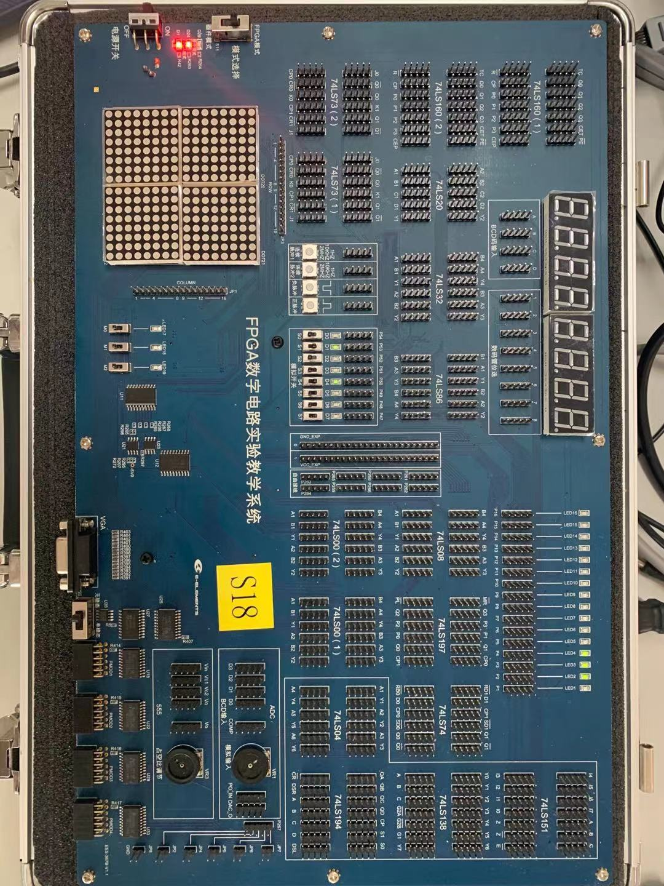
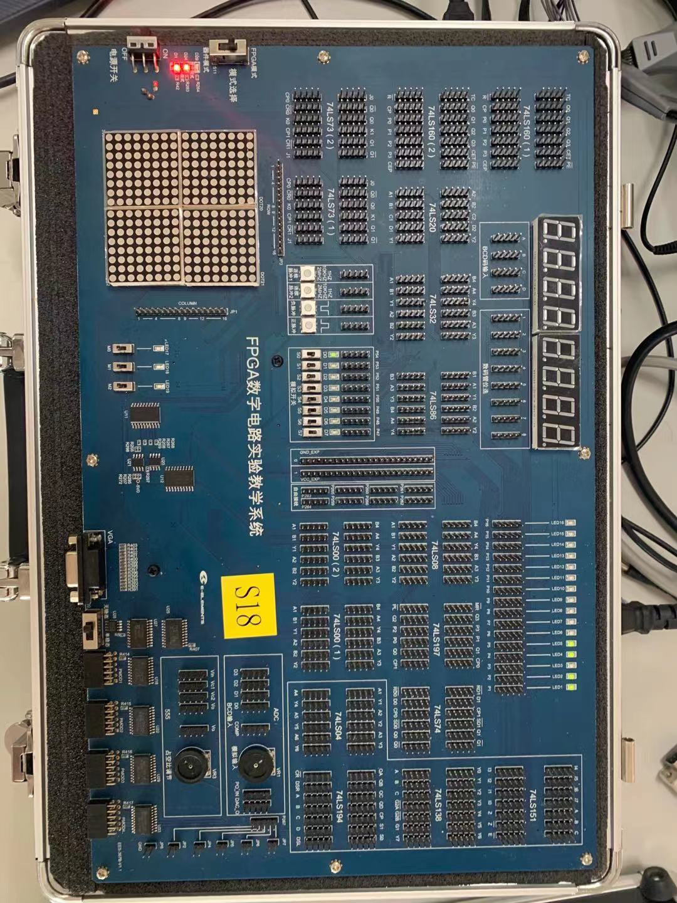

# BCD码余5码互转检测

## 假设

- 输入编码：$I_3I_2I_1I_0$
- 输出编码：$O_3O_2O_1O_0$
- 输入模式：$M$
    - $M=0$：BCD码转余5码
    - $M=1$：余5码转BCD码
- 输出错误检测：$F$
    - $F=0$：输入正确
    - $F=1$：输入错误

## 电路设计

编码转换用加减法器。加5是BCD码转余5码，减5是余5码转BCD码。

加减法器实现用74LS283，减5即加5的补码。在$B_3B_2B_1B_0$接异或门，再接$0101$用于根据$M$取反，$M$同时接入$C_0$用于取反时加$1$。

输入BCD码检测用组合逻辑电路实现。输入BCD码错误当且仅当$I_3\cdot(I_2+I_1)=1$。

输入余5码检测即输出BCD码检测。输入余5码错误当且仅当$O_3\cdot(O_2+O_1)=1$。

通过一位选择器根据$M$选择上述两个式子，$F=\overline M\cdot I_3\cdot(I_2+I_1)+M\cdot O_3\cdot(O_2+O_1)=1$。

## 仿真实验

### 电路图


左下角LOGICSTATE表示$M$，上面十六进制计数器表示$I_3I_2I_1I_0$，右边逻辑分析器分别记录$I_0I_1I_2I_3FO_0P_1O_2O_3$。

### 结果

M=0：



M=1：


## 实验箱实验

### 电路图


### 约束文件

将$FI_0I_1I_2I_3$绑定到$S_0S_1S_2S_3S_4$，将$O_0O_1O_2O_3F$绑定到$LED_1LED_2LED_3LED_4LED_5$。

```verilog
set_property PACKAGE_PIN U18 [get_ports F]
set_property PACKAGE_PIN N3 [get_ports I0]
set_property PACKAGE_PIN M1 [get_ports I1]
set_property PACKAGE_PIN M3 [get_ports I2]
set_property PACKAGE_PIN M6 [get_ports I3]
set_property PACKAGE_PIN N5 [get_ports M]
set_property IOSTANDARD LVCMOS33 [get_ports F]
set_property IOSTANDARD LVCMOS33 [get_ports I0]
set_property IOSTANDARD LVCMOS33 [get_ports I1]
set_property IOSTANDARD LVCMOS33 [get_ports I2]
set_property IOSTANDARD LVCMOS33 [get_ports I3]
set_property IOSTANDARD LVCMOS33 [get_ports M]
set_property IOSTANDARD LVCMOS33 [get_ports O0]
set_property IOSTANDARD LVCMOS33 [get_ports O1]
set_property IOSTANDARD LVCMOS33 [get_ports O2]
set_property IOSTANDARD LVCMOS33 [get_ports O3]

set_property PACKAGE_PIN N18 [get_ports O3]
set_property PACKAGE_PIN P18 [get_ports O2]
set_property PACKAGE_PIN T18 [get_ports O1]
set_property PACKAGE_PIN P15 [get_ports O0]
```

### 实验结果

- BCD码0000转余5码0101
    
- BCD码1010不合法
    
- BCD码1001转余5码1110
    
- 余5码0000不合法
    
- 余5码1010转BCD码0101
    
- 余5码1111不合法
    

## 实验感想

通过本次实验学会了vivado的使用，实践了从需求到电路设计再到电路实现的流程（不同于以往，需求到电路设计可以参考实验书或教材）。

实验箱实验最开始也想做动态，但是在实验室做实验时没有找到可供示波器连接的接口，于是临时改成静态实验。由于时间不太充裕，没能完成交通灯实验，十分可惜。
