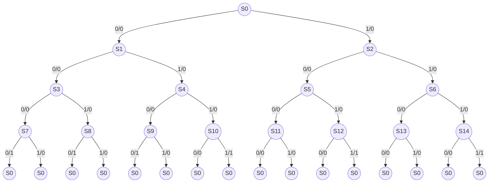
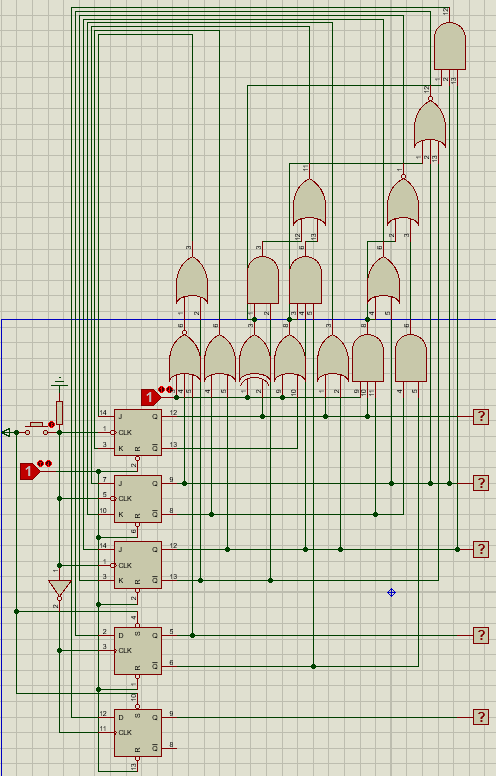

# 实验12

## 有效的余三码

0011
0100
0101
0110
0111
1000
1001
1010
1011
1100

## DFA

|   |0    |1    |
|---|-----|-----|
|S0 |S1 /0|S2 /0|
|S1 |S3 /0|S4 /0|
|S2 |S5 /0|S6 /0|
|S3 |S7 /0|S8 /0|
|S4 |S9 /0|S10/0|
|S5 |S11/0|S12/0|
|S6 |S13/0|S14/0|
|S7 |S0 /1|S0 /0|
|S8 |S0 /1|S0 /0|
|S9 |S0 /1|S0 /0|
|S10|S0 /0|S0 /1|
|S11|S0 /0|S0 /0|
|S12|S0 /0|S0 /1|
|S13|S0 /0|S0 /0|
|S14|S0 /0|S0 /1|

## Minimal DFA

|   |0    |1    |
|---|-----|-----|
|S0 |S1 /0|S2 /0|
|S1 |S3 /0|S4 /0|
|S2 |S5 /0|S5 /0|
|S3 |S7 /0|S7 /0|
|S4 |S7 /0|S10/0|
|S5 |S11/0|S10/0|
|S7 |S0 /1|S0 /0|
|S10|S0 /0|S0 /1|
|S11|S0 /0|S0 /0|

## 真值表

|32\\10|00 |01|11|10 |
|------|---|--|--|---|
|00    |S0 |S1|S2|S3 |
|01    |S4 |S5|S7|S10|
|11    |S11|X |X |X  |
|10    |X  |X |X |X  |

|X32\\10|00    |01    |11    |10    |
|-------|------|------|------|------|
|000    |0001/0|0010/0|0101/0|0111/0|
|001    |0111/0|1100/0|0000/1|0000/0|
|011    |0000/0|XXXX/X|XXXX/X|XXXX/X|
|010    |XXXX/X|XXXX/X|XXXX/X|XXXX/X|
|110    |XXXX/X|XXXX/X|XXXX/X|XXXX/X|
|111    |0000/0|XXXX/X|XXXX/X|XXXX/X|
|101    |0110/0|0110/0|0000/0|0000/1|
|100    |0011/0|0100/0|0101/0|0111/0|

## 表达式

$$
\begin{aligned}
    \because&\begin{cases}
        Q_3&=\overline X\cdot Q_2\cdot\overline{Q_1}\cdot Q_0\\
        Q_2&=\overline{Q_3}\cdot Q_2\cdot\overline{Q_1}+X\cdot \overline{Q_1}\cdot Q_0+\overline{Q_2}\cdot Q_1\\
        Q_1&=\overline{Q_3}\cdot Q_2\cdot\overline{Q_1}\cdot\overline{Q_0}+X\cdot\overline{Q_2}\cdot\overline{Q_0}+\overline X\cdot\overline{Q_2}\cdot\overline{Q_1}\cdot Q_0\\
        &+X\cdot\overline{Q_3}\cdot Q_2\cdot\overline{Q_1}+\overline{Q_2}\cdot Q_1\cdot\overline{Q_0}\\
        Q_0&=\overline{Q_2}\cdot\overline{Q_0}+\overline X\cdot\overline{Q_3}\cdot\overline{Q_1}\cdot\overline{Q_0}+\overline{Q_2}\cdot Q_1\\
        F&=\overline X\cdot Q_2\cdot Q_1\cdot Q_0+X\cdot Q_2\cdot Q_1\cdot\overline{Q_0}
    \end{cases}\\
    \because&Q=J\cdot\overline Q+\overline K\cdot Q\\
    \therefore&\begin{cases}
        D_3&=\overline X\cdot Q_2\cdot\overline{Q_1}\cdot Q_0\\
        &=\overline{(\overline{Q_0}+X)+\overline{Q_2}+Q_1}\\
        J_2&=X\cdot\overline{Q_1}\cdot Q_0+Q_1\\
        K_2&=\overline{X\cdot\overline{Q_1}\cdot Q_0+\overline{Q_3}\cdot\overline{Q_1}}\\
        J_1&=X\cdot\overline{Q_2}\cdot\overline{Q_0}+\overline{Q_3}\cdot Q_2\cdot\overline{Q_0}+\overline X\cdot\overline{Q_2}\cdot Q_0+X\cdot\overline{Q_3}\cdot Q_2\\
        &=\overline{Q_2}\cdot(X\oplus Q_0)+\overline{Q_3}\cdot Q_2\cdot(\overline{Q_0}+X)\\
        K_1&=\overline{X\cdot\overline{Q_2}\cdot\overline{Q_0}+\overline{Q_2}\cdot\overline{Q_0}}\\
        &=Q_2+Q_0\\
        J_0&=\overline{Q_2}+\overline X\cdot\overline{Q_3}\cdot\overline{Q_1}+\overline{Q_2}\cdot Q_1\\
        &=\overline{Q_2}+\overline{X+Q_3+Q_1}\\
        K_0&=\overline{\overline{Q_2}\cdot Q_1}\\
        &=Q_2+\overline{Q_1}\\
        D_F&=\overline X\cdot Q_2\cdot Q_1\cdot Q_0+X\cdot Q_2\cdot Q_1\cdot\overline{Q_0}\\
        &=Q_2\cdot Q_1\cdot(X\oplus Q_0)
    \end{cases}
\end{aligned}
$$

## 电路图

## 结果

测试了0000，1111，0101：

[演示视频](演示视频.mp4)
