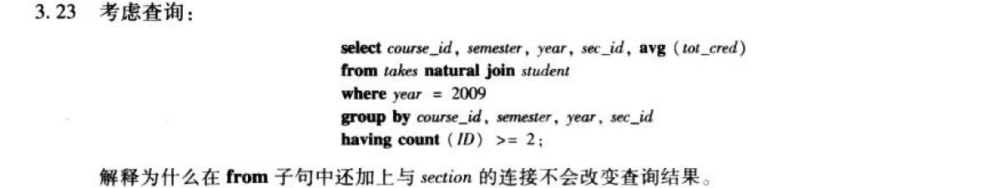

a.
```sql
select distinct name
from student, takes, course
where student.ID = takes.ID and takes.course_id = course.course_id
and dept_name = "Comp. Sci."
```
b.
```sql
select ID, name
from student
except
select ID, name
from student, takes, section
where student.ID = takes.ID and takes.course_id = section.course_id and year < 2009
```
c.
```sql
select max(salary), dept_name
from instructor
group by dept_name
```
d.
```sql
select min(max_salary)
from (select max(salary) as max_salary, dept_name
        from instructor
        group by dept_name)
```


a.
```sql
insert into course
values("CS-001", "Weekly Seminar", "Comp. Sci.", 0)
```
b.
```sql
insert into section
values("CS-001", 1, "Autumn", 2009, null, null, null)
```
c.
```sql
insert into takes
select ID, "CS-001", 1, "Autumn", 2009, null
from student
where dept_name = "Comp. Sci."
```
d.
```sql
delete from takes
where course_id = "CS-001" and sec_id = 1 semester = and "Autumn" and year = 2009
and ID in (select ID
            from student
            where name = "Chavez")
```
e.
```sql
delete from takes
where course_id = "CS-001"
delete from section
where course_id = "CS-001"
delete from course
where course_id = "CS-001"
```
会发生外码错误，因为课程段有参照课程的外码。
f.
```sql
delete from takes
where course_id in (select course_id 
                    from course
                    where lower(title) like "%database%")
```


```sql
create table person (
    driver_id varchar(20) not null,
    name varchar(20),
    address varchar(20),
    primary key(driver_id)
)
create table car (
    license varchar(20) not null,
    model varchar(20),
    year integer,
    primary key(license)
)
create table accident (
    report_number integer not null,
    date date,
    location varchar(20),
    primary key(report_number)
)
create table owns (
    driver_id varchar(20) not null,
    license varchar(20) not null,
    primary key(driver_id),
    foreign key(driver_id) references person,
    foreign key(license) references car
)
create table participated (
    report_number varchar(20) not null,
    license varchar(20) not null,
    driver_id varchar(20) not null,
    damage_amount integer,
    primary key(report_number, license)
    foreign key(report_number) references accident,
    foreign key(license) references car,
    foreign key(driver_id) references person
)
```


a.
```sql
select count(report_number)
from paricipated, owns, person 
where participated.license = owns.license and owns.driver_id = person.driver_id
and name = "John Simith"
```
b.
```sql
update participated
set damage_amount = 3000
where report_number = "AR2197" and license = "AABB2000"
```


a.
```sql
with branchcount as
(select count(*)
from branch
where branch_city = "Brooklyn"
)
select customer_name
from customer c1
where branchcount = (select count(distinct branch_name)
                        from branch, account, customer c2
                        where branch.branch_name = account.branch_name
                        and account.account_number = c2.account_number
                        and c1.customer_name = c2.customer_name)
```
b.
```sql
select sum(amount)
from loan
```
c.
```sql
select branch_name
from branch
where assets > some (select assets
                        from branch
                        where branch_name = "Brooklyn")
```

`x <>all S`即一元素x与一子查询S中任意元素都满足不等，当且仅当x不在S中即`x not in S`。


`year` `corse_id` `semester` `year` `sec_id`是`takes`参照`sction`。所以每个`takes`可以匹配至多一个`section`，所以每个组不会有更多元组。另外，这些属性是`section`的主码，不能是`null`，因而自然连接后每个组不会丢失元组，所以结果相同。