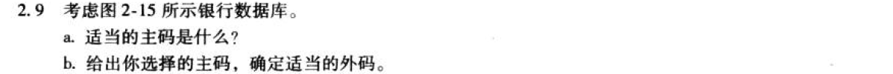
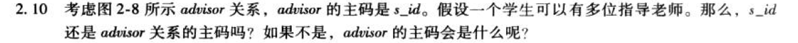
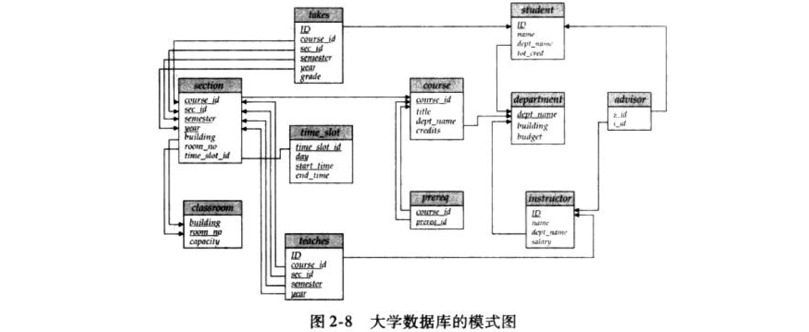
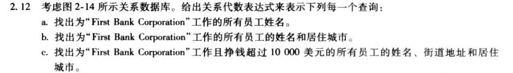

a.
假设customer_name都是唯一的，customer可以有多个account和loan
branch：{branch_name}
customer：{customer_name}
loan：{loan_number}
borrower：{account_number, loan_number}
account：{account_number}
depositor：{customer_name, account_number}

b.
loan：{branch_name}参照branch
borrower：{account_number}参照account，{loan_number}参照loan
account：{branch_name}参照branch
depositor：{customer_name}参照customer，{account_number}参照account

否。一个学生可以有多位指导老师，一位指导老师可以有多个学生。
{s_id, t_id}

关系模式是类型定义，关系是关系模式的实例。

a.
$\Pi_{\text{person-name}}(\sigma_{\text{company-name}=\text{"First Bank Corporation"}}(\text{works}))$
b.
$\Pi_{\text{person-name},\text{city}}(\text{employee}\Join(\sigma_{\text{company-name}=\text{"First Bank Corporation"}}(\text{works})))$
c.
$\Pi_{\text{person-name},\text{street},\text{city}}(\text{employee}\Join(\sigma_{\text{company-name}=\text{"First Bank Corporation"}\wedge\text{salary}>10000}(\text{works})))$

a.
$\Pi_{\text{loan\_number}}(\sigma_{\text{amount}>10000}(\text{loan}))$
b.
$\Pi_{\text{customer\_name}}(\text{depositor}\Join(\sigma_{\text{balance}>6000}(\text{loan})))$
c.
$\Pi_{\text{customer\_name}}(\text{depositor}\Join(\sigma_{\text{branch\_name}=\text{"Uptown"}\wedge\text{balance}>6000}(\text{account})))$

表示未知或不存在

非过程语言极大地简化了查询的规范（至少，它们旨在处理的查询类型）。用户无需担心如何评估查询；这不仅减少了编程工作量，而且实际上，在大多数情况下，查询优化器比通过反复试验的程序员能够更好地选择最佳的评估查询方法。另一方面，就程序语言可执行的计算而言，它们的功能要强大得多。某些任务要么无法使用非过程语言来完成，要么很难使用非过程语言来表达，或者如果以非过程方式指定，则执行效率很低。