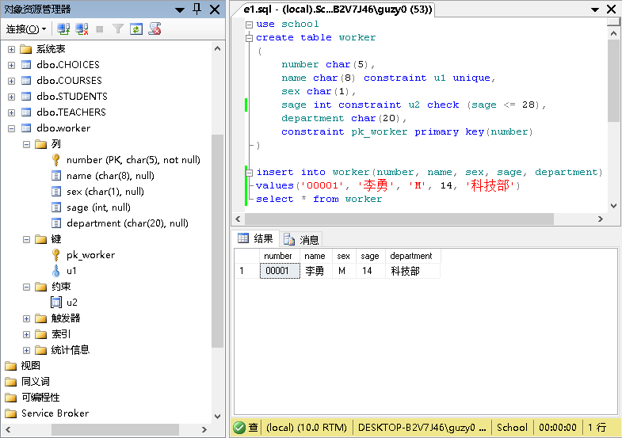
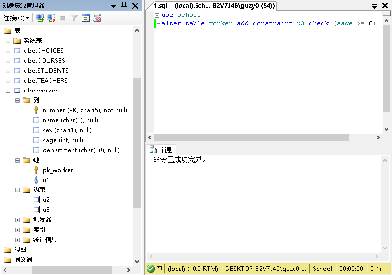
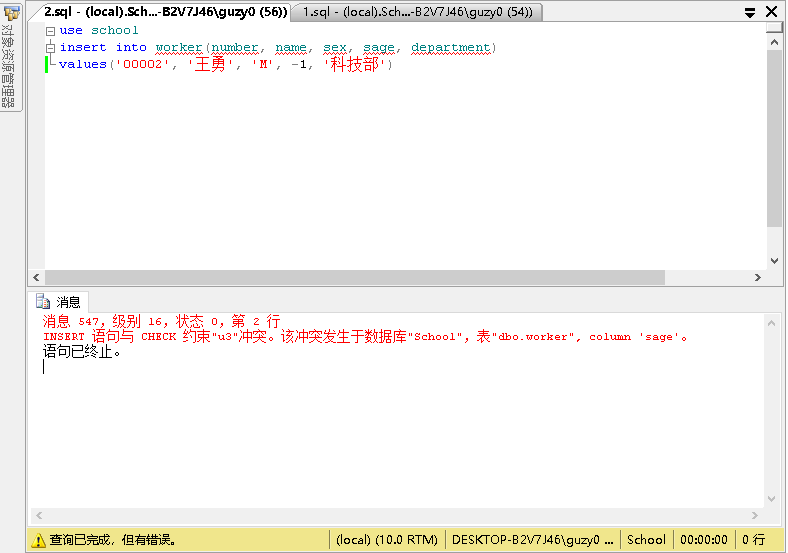
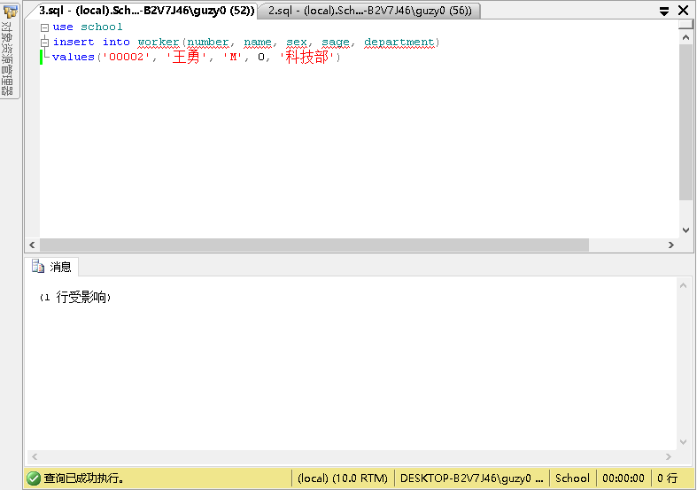
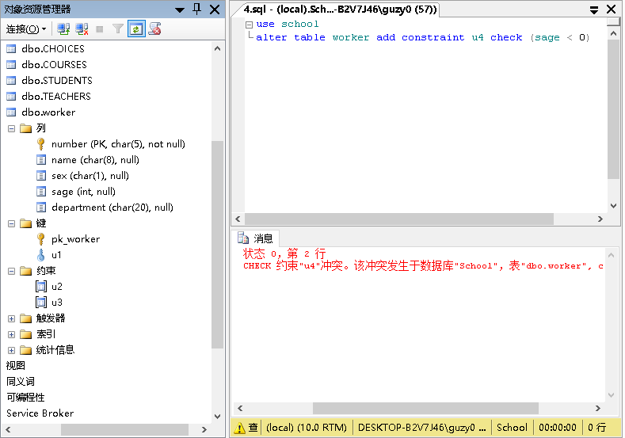
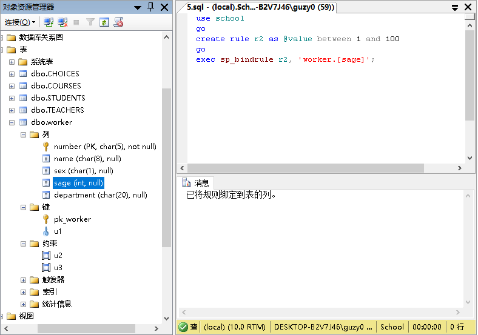
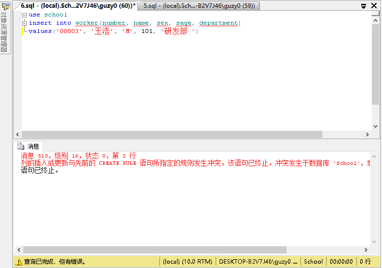
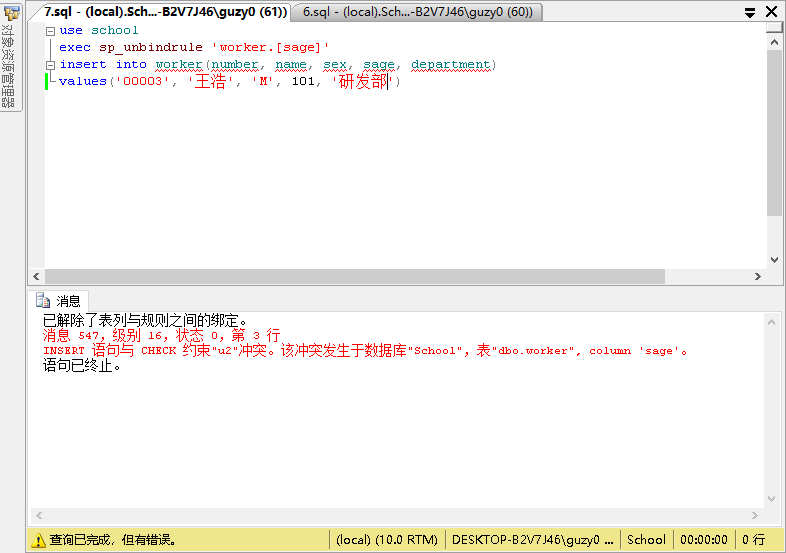
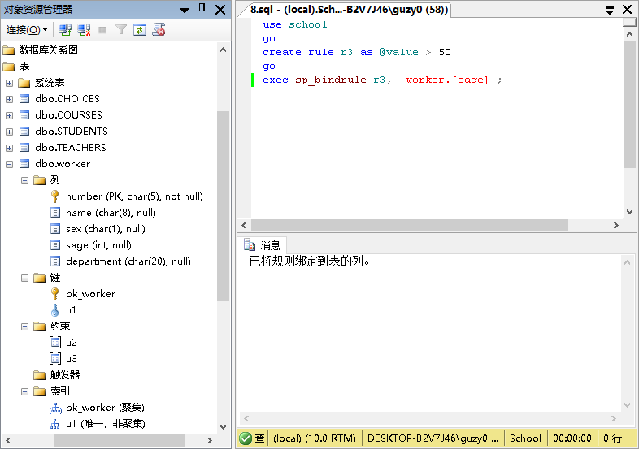

# EX10

## 练习1

1. 建立worker表，并自定义两个约束U1，U2，其中U1规定Name字段唯一，U2规定sage(级别）字段的上限为28。并在worker表中插入一条合法记录。

    ```sql
    use school
    create table worker
    (
    number char(5),
    name char(8) constraint u1 unique,
    sex char(1),
    sage int constraint u2 check (sage <= 28),
    department char(20),
    constraint pk_worker primary key(number)
    )

    insert into worker(number, name, sex, sage, department)
    values('00001', '李勇', 'M', 14, '科技部')
    select * from worker
    ```

    

2. 加入约束U3，令sage值大于等于0。

    ```sql
    use school
    alter table worker add constraint u3 check (sage >= 0)
    ```

    

## 练习2

演示插入违反约束U3的记录。

```sql
use school
insert into worker(number, name, sex, sage, department)
values('00002', '王勇', 'M', -1, '科技部')
```



## 练习3

演示插入不违反约束U3的记录。

```sql
use school
insert into worker(number, name, sex, sage, department)
values('00002', '王勇', 'M', 0, '科技部')
```



## 练习4

加入约束U4，令sage值<0，观察执行是否成功，分析原因。

```sql
use school
alter table worker add constraint u4 check (sage < 0)
```

因为其与约束u3冲突。



## 练习5

加入规则R2，确保插入的记录的sage值在1到100之间，并绑定到sage属性。

```sql
use school
go
create rule r2 as @value between 1 and 100
go
exec sp_bindrule r2, 'worker.[sage]';
```



## 练习6

演示插入违反R2的记录。

```sql
use school
insert into worker(number, name, sex, sage, department)
values('00003', '王浩', 'M', 101, '研发部·')
```



## 练习7

解除规则R2的绑定，并重复(6)的操作。

```sql
use school
exec sp_unbindrule 'worker.[sage]'
insert into worker(number, name, sex, sage, department)
values('00003', '王浩', 'M', 101, '研发部')
```



## 练习8

已知示例三中已插入sage为38的记录，那么加入规则R3，令sage大于50。观察加入规则R3的操作是否能成功。

```sql
use school
go
create rule r3 as @value > 50
go
exec sp_bindrule r3, 'worker.[sage]';
```



## 感想
constraint和constraint之前彼此冲突会出错；constraint和rule则是不同级的，会优先判断rule。
