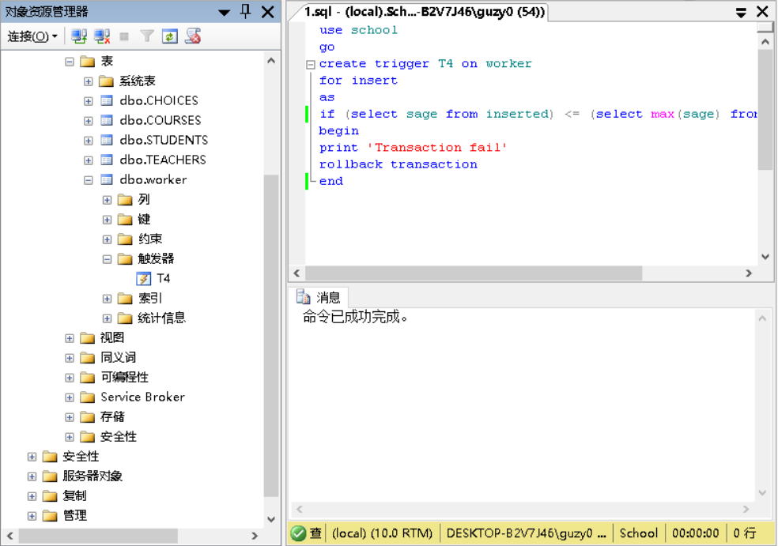
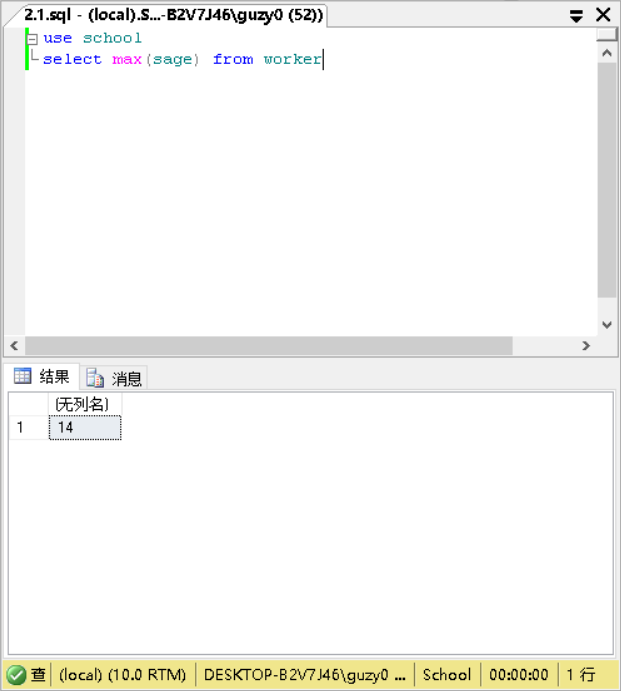
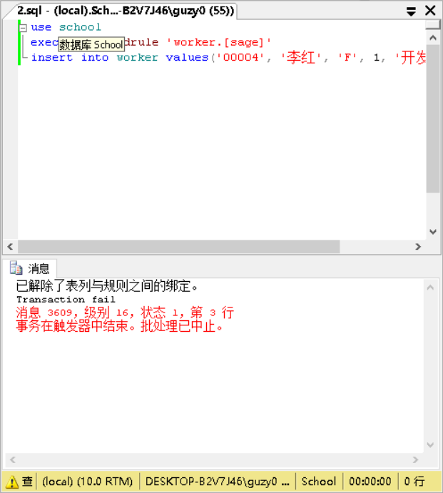
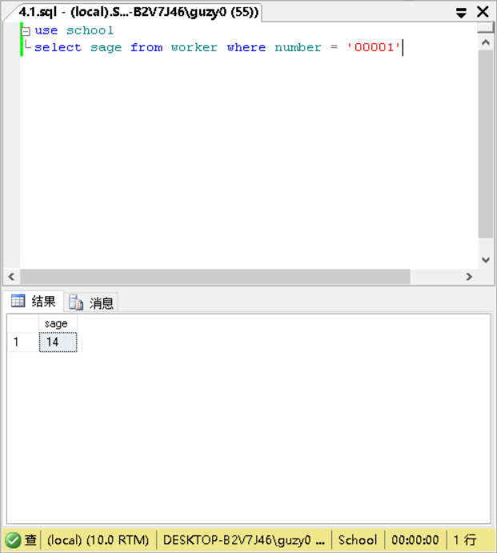
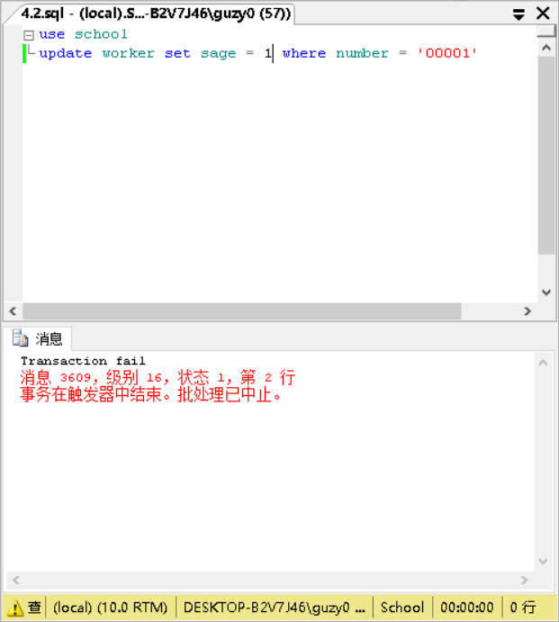
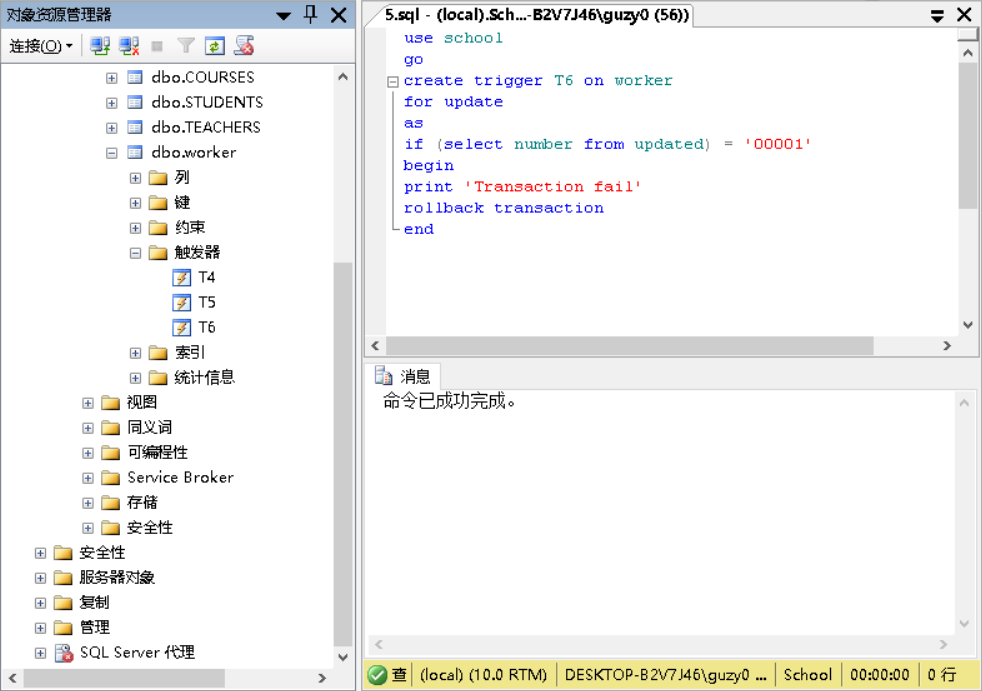
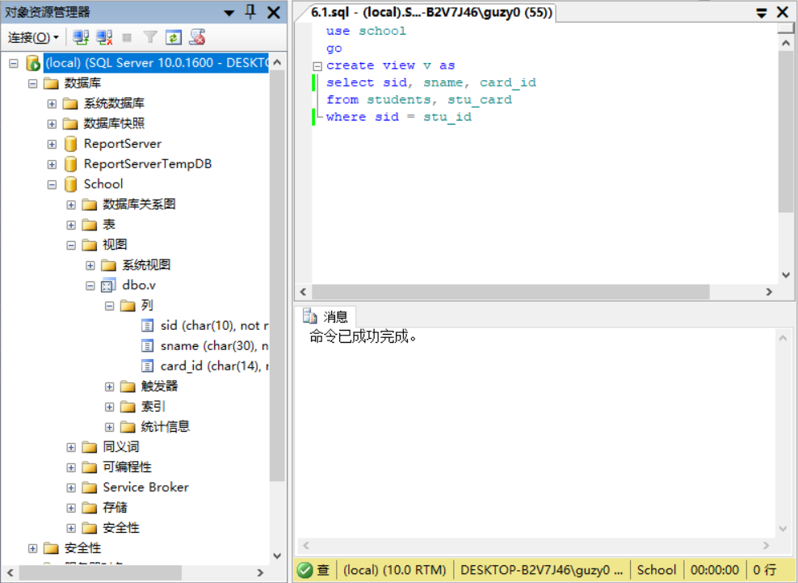
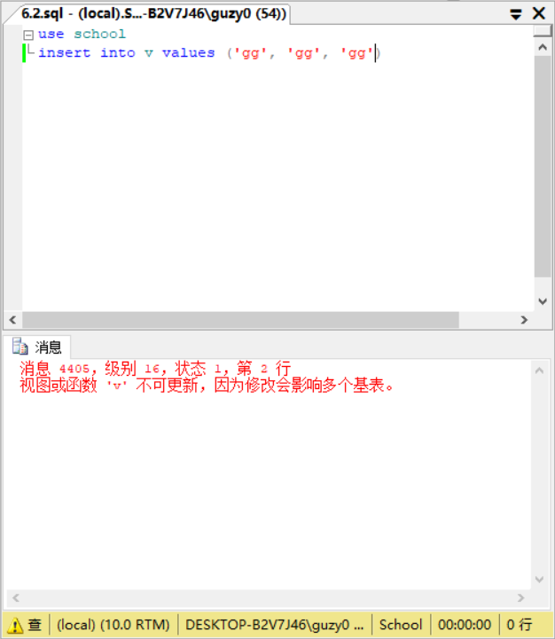
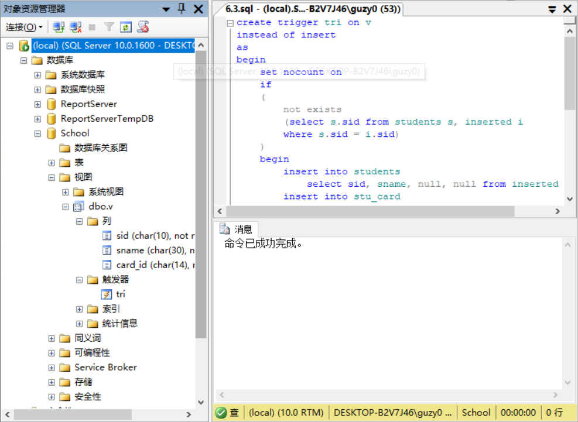
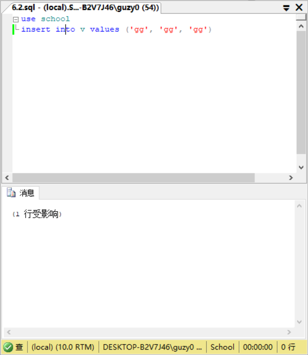

# EX11

1. 建立一个在worker表上的触发器T4，要求插入记录的sage值必须比表中已记录的最大sage值大。

    ```sql
    use school
    go
    create trigger T4 on worker
    for insert
    as
    if (select sage from inserted) <= (select max(sage) from worker)
    begin
    print 'Transaction fail'
    rollback transaction
    end
    ```

    

2. 演示违反触发器T4的操作，即插入一条比表中已记录的最大sage值小的记录。
    - 查看最大的sage

        ```sql
        use school
        select max(sage) from worker
        ```

        

    - 因此插入sage=1即可

        ```sql
        use school
        insert into worker values('00004', '李红', 'F', 1, '开发部')
        ```

        

3. 建立一个在worker表上的触发器T5，要求当更新一个记录的时候，表中记录的sage值要比老记录的sage值大，因为一般工资级别只能升不能降。

```sql
use school
go
create trigger T5 on worker
for update
as
if (select sage from inserted) <= (select sage from deleted)
begin
print 'Transaction fail'
rollback transaction
end
```

4. 演示违反触发器T5的操作。
    - 查看00001的sage

        ```sql
        use school
        select sage from worker where number = '00001'
        ```

        

    - 因此修改为sage=1即可

        ```sql
        use school
        update worker set sage = 1 where number = '00001'
        ```

        

5. 为worker表建立触发器T6，禁止修改编号为00001的记录。

    ```sql
    use school
    go
    create trigger T6 on worker
    for update
    as
    if (select number from updated) = '00001'
    begin
    print 'Transaction fail'
    rollback transaction
    end
    ```

    

6. 建立基于students和stu_card两个表的视图，创建INSTEADOF触发器使该视图支持更新操作，并演示更新操作。 （注：stu_card的建表见PPT10参照完整性page10）
    - 建视图v

        ```sql
        use school
        go
        create view v as
        select sid, sname, card_id
        from students, stu_card
        where sid = stu_id
        ```

        

    - 插入

        ```sql
        use school
        insert into v values ('gg', 'gg', 'gg')
        ```

        

    -  创建INSTEADOF触发器

        ```sql
        create trigger tri on v
        instead of insert
        as
        begin
            set nocount on
            if
            (
                not exists
                (select s.sid from students s, inserted i
                where s.sid = i.sid)
            )
            begin
                insert into students
                    select sid, sname, null, null from inserted
                insert into stu_card
                    select card_id, sid, null from inserted
            end
        end
        ```

        

    - 重新插入

        
