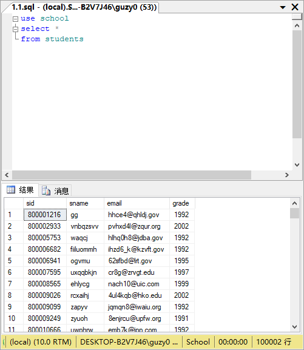
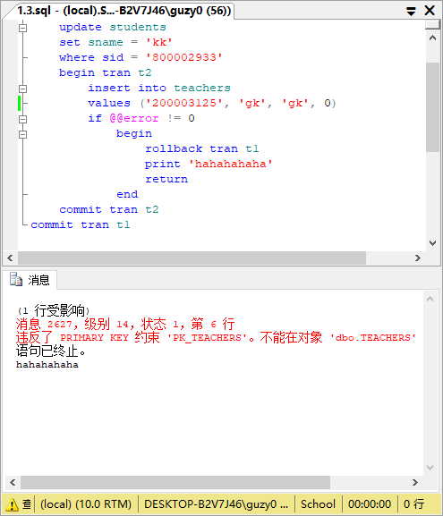
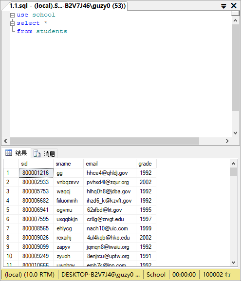
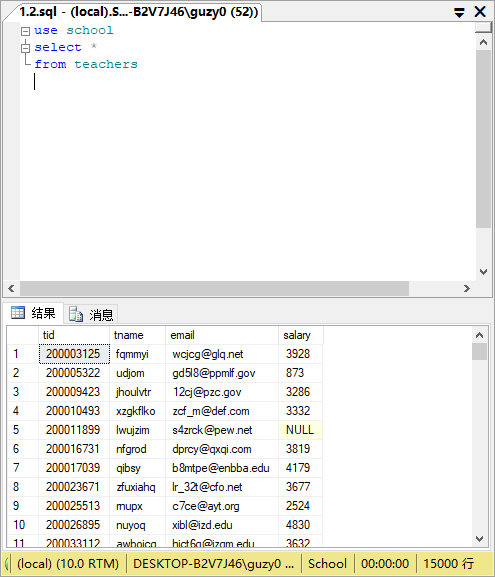
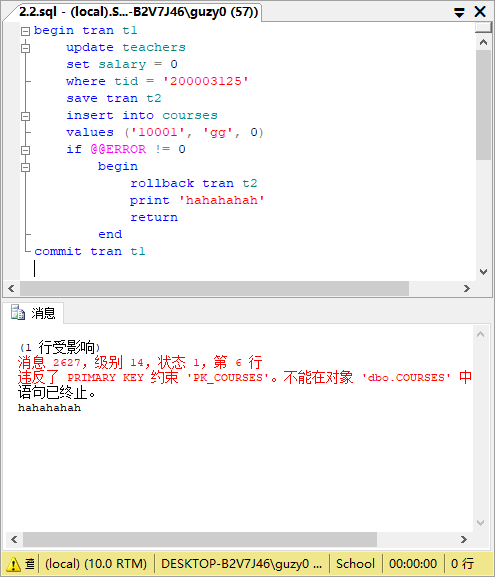
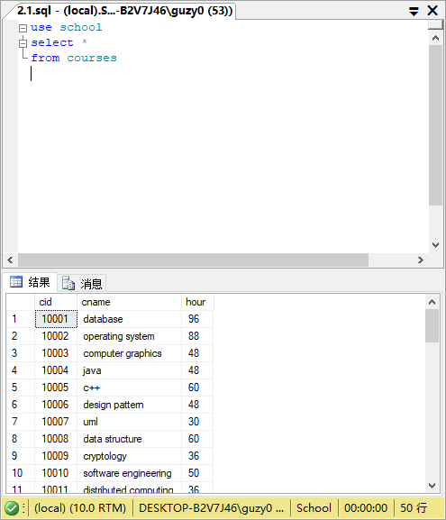
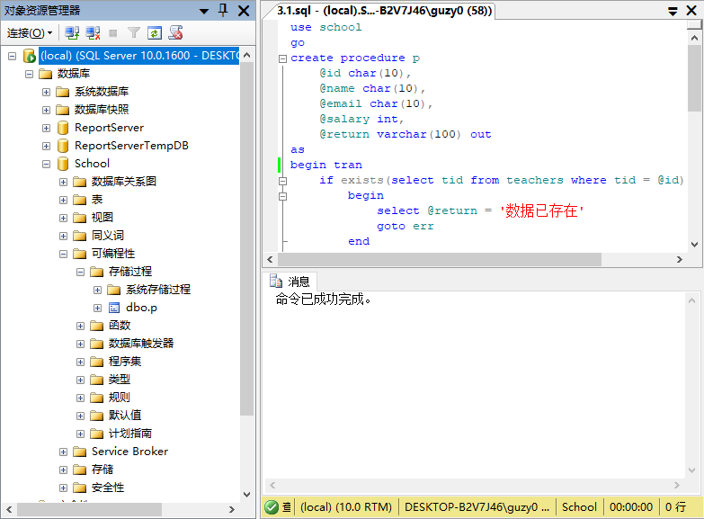
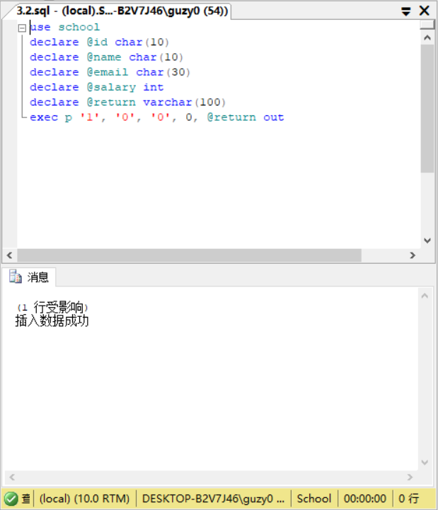
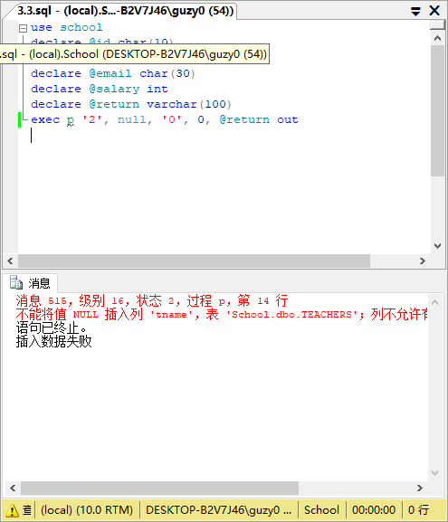
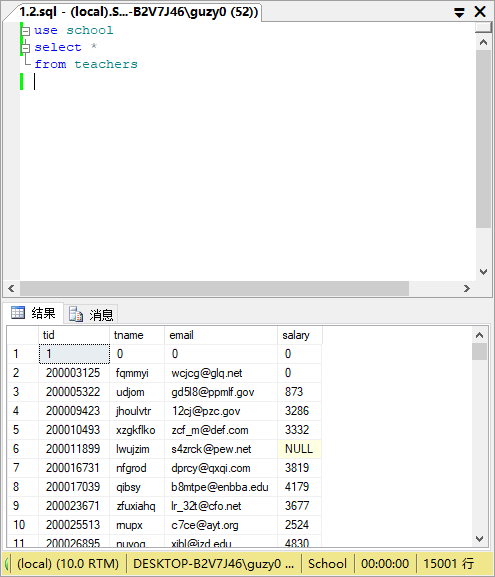

# EX12

## 练习1

1. 查看students表。

    ```sql
    use school
    select *
    from students
    ```

    

    可以看到有sid为800002933，后面更新它。

2. 查看teachers表。

    ```sql
    use school
    select *
    from teachers
    ```

    

    可以看到tid为200003125，后面插入它以演示失败。

3. 编写一个嵌套事务。外层修改students表某记录，内层在teachers表插入一条记录。演示内层插入操作失败后，外层修改操作回滚。

    ```sql
    use school
    go
    begin tran t1
        update students
        set sname = 'kk'
        where sid = '800002933'
        begin tran t2
            insert into teachers
            values ('200003125', 'gk', 'gk', 0)
            if @@error != 0
                begin
                    rollback tran t1
                    print 'hahahahaha'
                    return
                end
        commit tran t2
    commit tran t1
    ```

    

4. 查看students表。

    

    发现更新被回滚。

5. 查看teachers表。

    

    发现插入未成功。

## 练习2

1. 查看courses表。

    ```sql
    use school
    select *
    from courses
    ```

    

    可以看到cid为10001，后面插入它以演示失败。

2. 编写一个带有保存点的事务。更新teachers表中数据后，设置事务保存点，然后在表courses中插入数据，如果courses插入数据失败，则回滚到事务保存点。演示courses插入失败，但teachers表更新成功的操作。

    ```sql
    begin tran t1
        update teachers
        set salary = 0
        where tid = '200003125'
        save tran t2
        insert into courses
        values ('10001', 'gg', 0)
        if @@ERROR != 0
            begin
                rollback tran t2
                print 'hahahahah'
                return
            end
    commit tran t1
    ```

    

3. 查看teachers表。

    

    发现更新200003215的salary成功。

4. 查看courses表。

    

    发现插入未成功。

## 练习3
1. 编写一个包含事务的存储过程，用于插入teachers表数据。如果插入记录的tid已存在，则输出“数据已存在”，其他错误输出“插入数据失败”，如果执行成功，则输出“插入数据成功”。
    ```sql
    use school
    go
    create procedure p
        @id char(10),
        @name char(10),
        @email char(10),
        @salary int,
        @return varchar(100) out
    as
    begin tran
        if exists(select tid from teachers where tid = @id)
            begin
                select @return = '数据已存在'
                goto err
            end
        insert into teachers values(@id, @name, @email, @salary)
        if @@error != 0
            begin
                select @return = '插入数据失败'
                goto err
            end
        select @return = '插入数据成功'
        print @return
        commit tran
        goto succ
    err:
        print @return
        commit tran
    succ:
    ```

    注意这里我多设置了一个succ的label，防止插入成功仍执行一遍err的label下的指令。

    

    可以看到存储过程dbo.p成功建立。

2. 调用该存储过程，演示插入成功的操作。

    ```sql
    use school
    declare @id char(10)
    declare @name char(10)
    declare @email char(30)
    declare @salary int
    declare @return varchar(100)
    exec p '1', '0', '0', 0, @return out
    ```

    

3. 调用该存储过程，演示插入失败的操作。

    ```sql
    use school
    declare @id char(10)
    declare @name char(10)
    declare @email char(30)
    declare @salary int
    declare @return varchar(100)
    exec p '2', null, '0', 0, @return out
    ```

    

4. 查看teachers表。

    

    发现(1,0,0,0)插入成功，(2,null,0,0)插入未成功。
