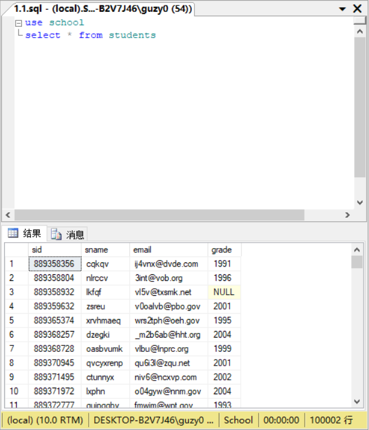
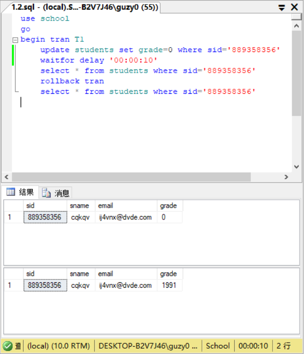
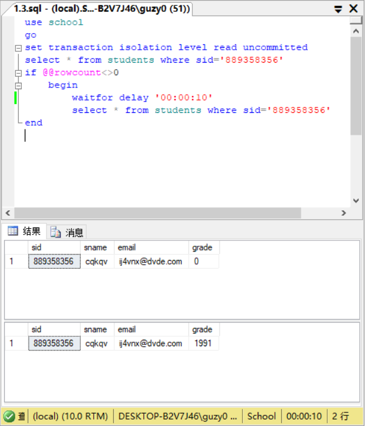
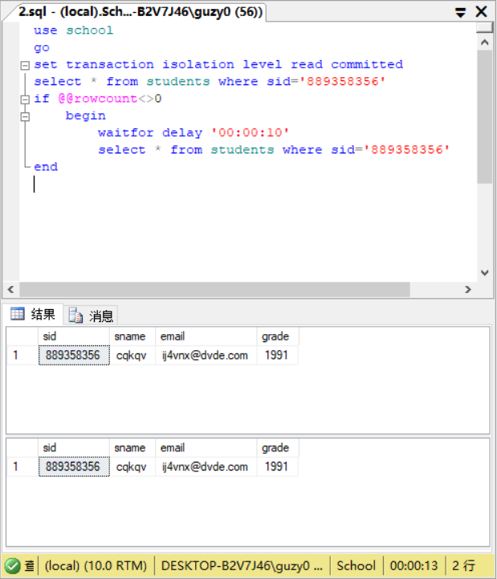
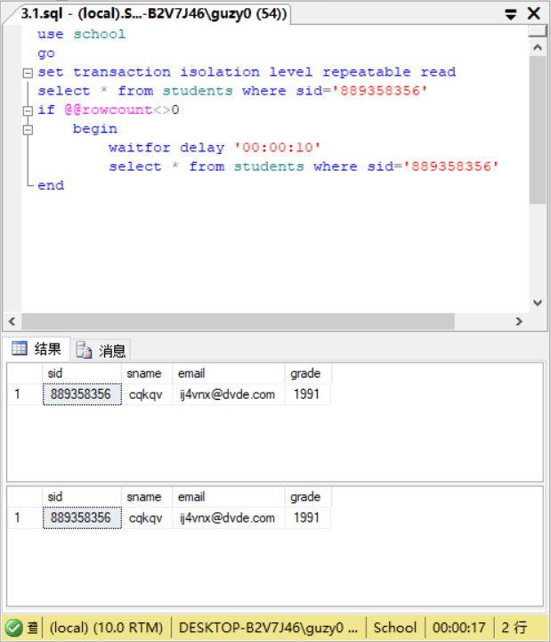
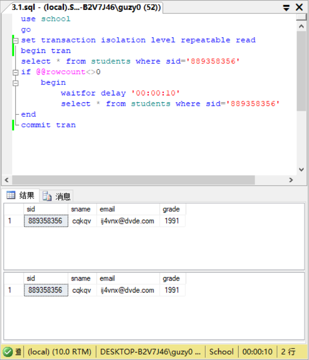
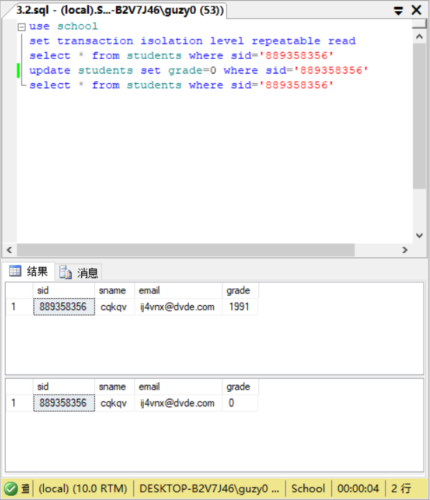
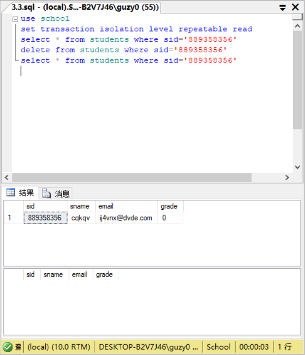
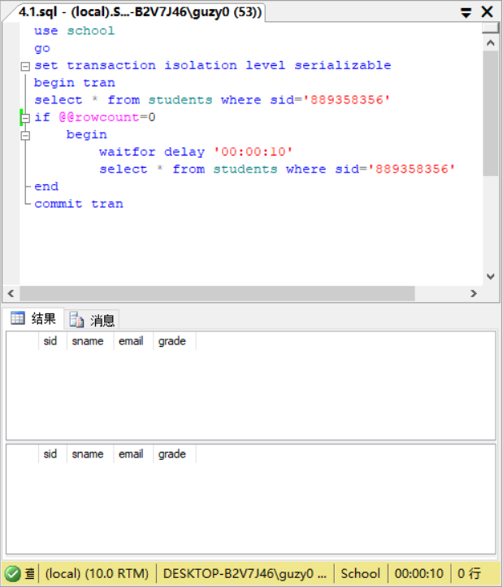
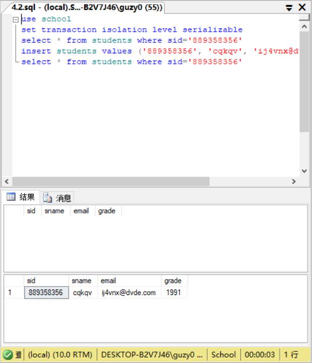

# EX13

## 练习1

1. 显示students表。

    ```sql
    use school
    select * from students
    ```

    

    发现有sid='889358356'。

2. 设置“未提交读”隔离级别（READ UNCOMMITTED），在students表上演示读“脏”数据。

    - 创建事务，更新sid='889358356'的学生的grade为0并等待并回滚，查看更新后和回滚后。

        ```sql
        use school
        go
        begin tran T1
            update students set grade=0 where sid='889358356'
            waitfor delay '00:00:10'
            select * from students where sid='889358356'
            rollback tran
            select * from students where sid='889358356'
        ```

        

        更新成功。

    - 不创建事务，设置未提交读，读脏数据。在执行1.2.sql等待时执行这个代码。

        ```sql
        use school
        go
        set transaction isolation level read uncommitted
        select * from students where sid='889358356'
        if @@rowcount<>0
            begin
                waitfor delay '00:00:10'
                select * from students where sid='889358356'
        end
        ```

        

        发现读到脏数据，得知在未提交读会在1.2.sql的事务未提交（等待）时读到中间结果。

## 练习2

1. 设置“提交读”隔离级别(READ COMMITTED)，在students表上演示避免读“脏”数据。

    - 不创建事务，设置提交读，避免读脏数据。在执行1.2.sql等待时执行这个代码。

        ```sql
        use school
        go
        set transaction isolation level read committed
        select * from students where sid='889358356'
        if @@rowcount<>0
            begin
                waitfor delay '00:00:10'
                select * from students where sid='889358356'
        end
        ```

        

        发现没读到脏数据，得知在提交读不会在1.2.sql事务未提交（等待）时读到中间结果。

## 练习3

1. 设置“可重复读”隔离级别(REPEATABLE READ)，在students表上演示避免读“脏”数据。

    - 不创建事务，设置可重复读读，避免读脏数据。在执行1.2.sql等待时执行这个代码。

        ```sql
        use school
        go
        set transaction isolation level repeatable read
        select * from students where sid='889358356'
        if @@rowcount<>0
            begin
                waitfor delay '00:00:10'
                select * from students where sid='889358356'
        end
        ```

        

        发现没读到脏数据，得知在可重复读不会在1.2.sql事务未提交（等待）时读到中间结果。

2. 设置“可重复读”隔离级别(REPEATABLE READ)，在students表上演示不可重复读。

    - 设置可重复读，创建事务，查询sid='889358356'并等待然后再次查询。在执行这个代码等待时执行3.3.sql。

        ```sql
        use school
        go
        set transaction isolation level repeatable read
        begin tran
        select * from students where sid='889358356'
        if @@rowcount<>0
            begin
                waitfor delay '00:00:10'
                select * from students where sid='889358356'
        end
        commit tran
        ```

        

        发现没读到重复数据，得知在可重复读不会在事务未提交（等待）时读到非事务3.3.sql的更新。

    - 设置可重复读，不创建事务，更新sid='889358356'的学生的grade为0，查看更新前和更新后。

        ```sql
        use school
        set transaction isolation level repeatable read
        select * from students where sid='889358356'
        update students set grade=0 where sid='889358356'
        select * from students where sid='889358356'
        ```

        

        更新成功。

3. 设置“可重复读”隔离级别(REPEATABLE READ)，在students表上演示不能避免幻象读。

    - 设置可重复读，不创建事务，删除sid='889358356'的学生记录，查看删除前和删除后。

        ```sql
        use school
        set transaction isolation level repeatable read
        select * from students where sid='889358356'
        delete from students where sid='889358356'
        select * from students where sid='889358356'
        ```

        

        删除成功。

    - 在执行3.2.sql等待时执行3.4.sql。

        

        发现幻像读，得知在可重复读会在事务未提交（等待）时读到非事务3.4.sql的删除。

4. 设置 “可串行化”隔离级别(SERIALIZABLE)，在students表上演示防止其他用户在事务提交之前更新数据。

    - 设置可串行化，创建事务，查询sid='889358356'并等待然后再次查询。在执行这个代码等待时执行4.2.sql。

        ```sql
        use school
        go
        set transaction isolation level serializable
        begin tran
        select * from students where sid='889358356'
        if @@rowcount=0
            begin
                waitfor delay '00:00:10'
                select * from students where sid='889358356'
        end
        commit tran
        ```

        

        发现避免幻像读，得知在可重复读不会在事务未提交（等待）时读到非事务4.1.sql的插入。

    - 设置可串行化，不创建事务，插入sid='889358356'的学生记录，查看插入前和插入后。

        ```sql
        use school
        set transaction isolation level serializable
        select * from students where sid='889358356'
        insert students values ('889358356', 'cqkqv', 'ij4vnx@dvde.com', 1991)
        select * from students where sid='889358356'
        ```

        

        插入成功。
