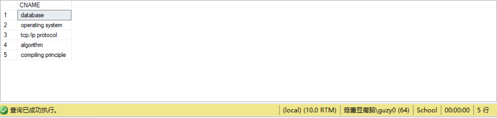

# <center>第2次实验</center>
### 一、实验目的
1. 熟悉SQL的数据查询语言，
2. 能够使用SQL语句对数据库进行单表查询、连接查询。
### 二、实验内容
1. 单表查询
   - 查询的目标表达式为所有列、指定列或指定列的运算。
   - 用DISTINCT保留字消除重复行。
   - 对查询结果排序和分组。
   - 集合分组使用集函数进行各项统计。
2. 连接查询
   - 笛卡儿连接和等值连接。
   - 自连接。
   - 外连接。
   - 复合条件连接。
   - 多表连接。
### 三、练习jk
1. 查询全部课程的详细记录;
```sql
SELECT *
FROM COURSES
```

2. 查询所有有选修课的学生的编号;
```sql
SELECT DISTINCT SID
FROM CHOICES
```

3. 查询课时<88(小时)的课程的编号;
```sql
SELECT CID
FROM COURSES
WHERE HOUR < 88
```

4. 请找出总分超过400分的学生;
```sql
USE SCHOOL
SELECT DISTINCT SNAME
FROM STUDENTS, CHOICES AS C1
WHERE STUDENTS.SID = C1.SID AND (SELECT SUM(SCORE)
   									FROM CHOICES AS C2
   									WHERE C1.SID = C2.SID) > 400
```

5. 查询课程的总数;
```sql
SELECT COUNT(CID)
FROM COURSES
```

6. 查询所有课程和选修该课程的学生总数;
```sql
SELECT CNAME, COUNT(SID)
FROM COURSES, CHOICES
WHERE COURSES.CID = CHOICES.CID
GROUP BY CNAME, COURSES.CID
```

7. 查询选修成绩超过60的课程超过两门的学生编号;
```sql
SELECT DISTINCT SID
FROM CHOICES AS C1
WHERE (SELECT COUNT(CID)
		FROM CHOICES AS C2
		WHERE SCORE > 60 AND C1.SID = C2.SID) > 2
```

8. 统计各个学生的选修课程数目和平均成绩;
```sql
SELECT SNAME, COUNT(CID), AVG(SCORE)
FROM STUDENTS, CHOICES
WHERE STUDENTS.SID = CHOICES.SID
GROUP BY SNAME, STUDENTS.SID
```

9. 查询选修Java的所有学生的编号及姓名;
```sql
SELECT DISTINCT STUDENTS.SID, SNAME
FROM STUDENTS, CHOICES, COURSES
WHERE STUDENTS.SID = CHOICES.SID AND CHOICES.CID = COURSES.CID AND COURSES.CNAME = 'Java'
```

10. 查询姓名为ssht的学生所选的课程的编号和成绩;
```sql
USE SCHOOL
SELECT CID, SCORE
FROM STUDENTS, CHOICES
WHERE STUDENTS.SID = CHOICES.SID AND SNAME = 'sssht'
```

11. 查询其他课时比课程C++多的课程的名称;
```sql
SELECT CNAME
FROM COURSES
WHERE HOUR > (SELECT HOUR 
				FROM COURSES
				WHERE CNAME = 'c++')
```
