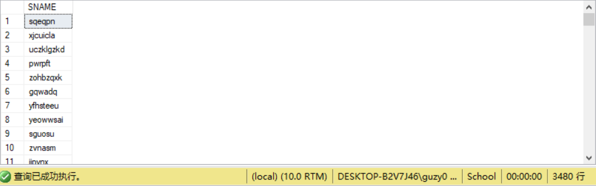
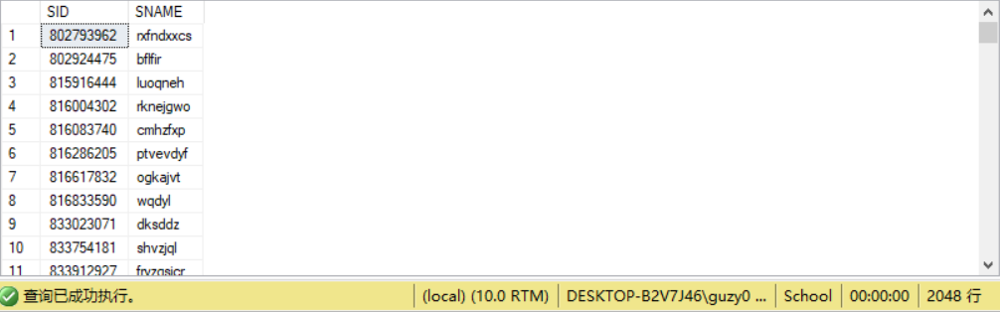
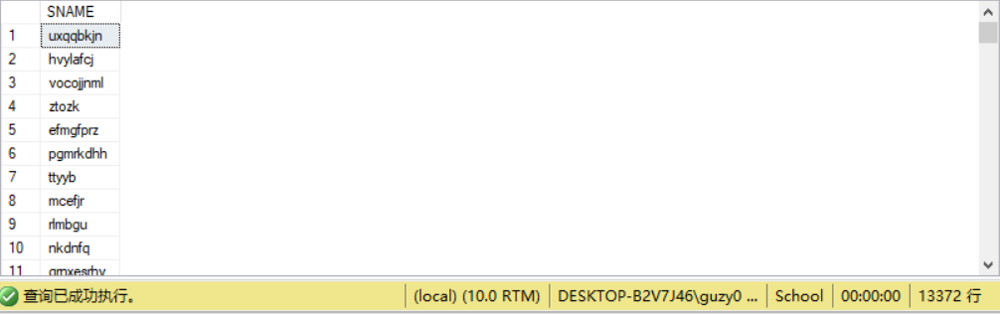
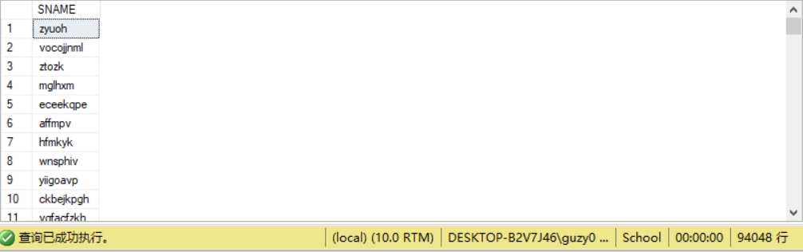
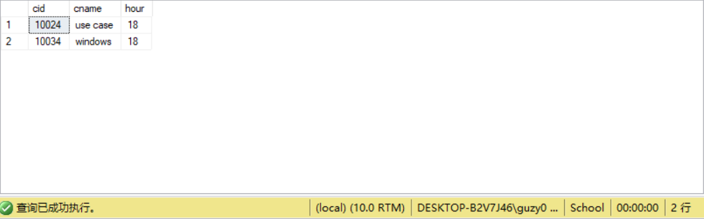
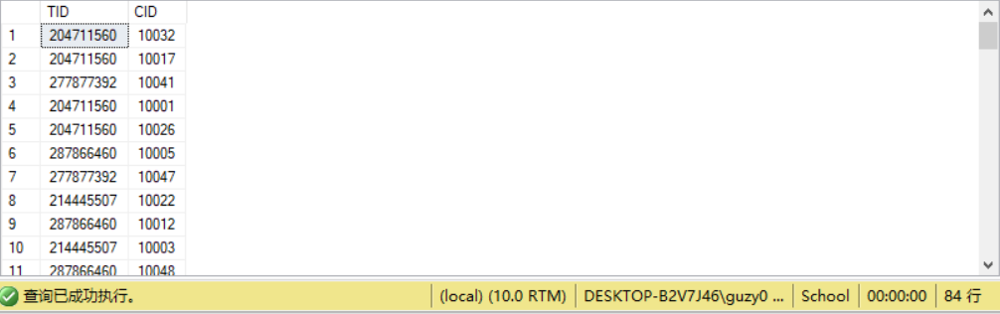
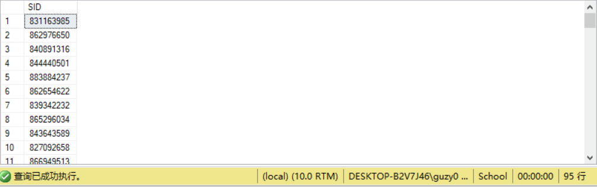
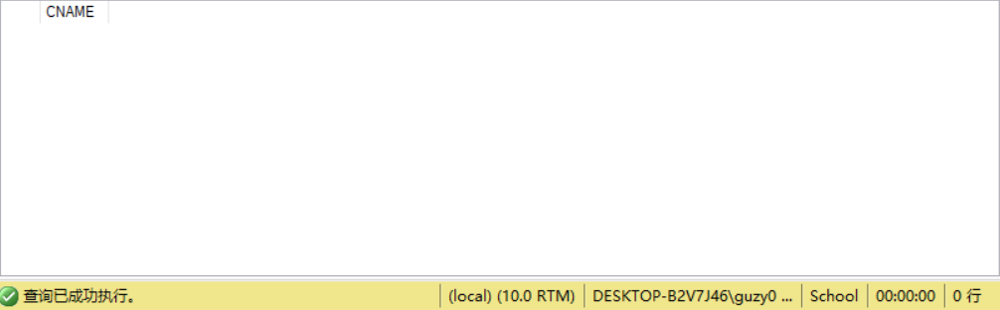
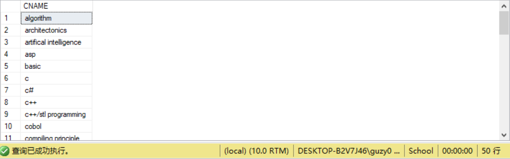
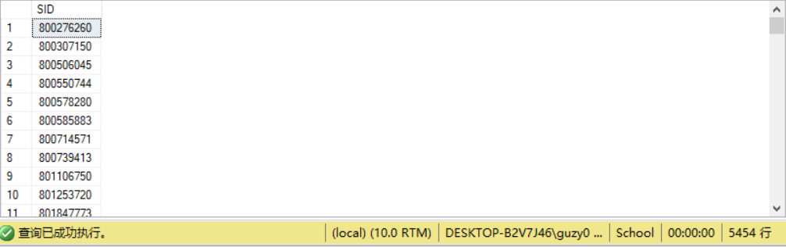

# <center>第3次实验</center>
### 一、上次实验问题
4. 请找出总分超过400分的学生;
	```sql
	USE SCHOOL
	SELECT DISTINCT SNAME
	FROM STUDENTS, CHOICES AS C1
	WHERE STUDENTS.SID = C1.SID AND (SELECT SUM(SCORE)
										FROM CHOICES AS C2
										WHERE C1.SID = C2.SID) > 400
	```
	应该为
	```sql
	USE SCHOOL
	SELECT SNAME
	FROM STUDENTS
	WHERE (SELECT SUM(SCORE)
			FROM CHOICES
			WHERE STUDENTS.SID = CHOICES.SID) > 400
	```
	一方面做了冗余的连接，另一方面`SNAME`可能重复，不能用`DISTINCT`，实验结果不变
	
### 二、本次实验练习
1. 查询选修C++课程的成绩比姓名为 ZNKOO的学生高的所有学生的编号和姓名;
	```sql
	USE SCHOOL
	SELECT DISTINCT STUDENTS.SID, SNAME
	FROM STUDENTS, CHOICES, COURSES
	WHERE STUDENTS.SID = CHOICES.SID
	AND CHOICES.CID = COURSES.CID
	AND CNAME = 'C++'
	AND SCORE > (SELECT SCORE
				FROM STUDENTS, CHOICES, COURSES
				WHERE STUDENTS.SID = CHOICES.SID
				AND CHOICES.CID = COURSES.CID
				AND CNAME = 'C++'
				AND SNAME = 'ZNKOO')
	```
	
2. 找出和学生883794999或学生850955252的年级一样的学生的姓名;
	```sql
	USE SCHOOL
	SELECT SNAME
	FROM STUDENTS
	WHERE GRADE = SOME (SELECT GRADE
						FROM STUDENTS
						WHERE SID = 883794999 OR SID = 850955252)
	```
	
3. 查询没有选修Java的学生名称;
	```sql
	USE SCHOOL
	SELECT SNAME
	FROM STUDENTS
	WHERE SID NOT IN (SELECT SID
						FROM CHOICES, COURSES
						WHERE CHOICES.CID = COURSES.CID
						AND CNAME = 'Java')
	```
	
4. 找出课时最少的课程的详细信息;
	```sql
	USE SCHOOL
	SELECT *
	FROM COURSES
	WHERE HOUR = (SELECT MIN(HOUR)
					FROM COURSES)
	```
	
5. 查询工资最高的教师的编号和开设的课程号;
	```sql
	USE SCHOOL
	SELECT TEACHERS.TID, CID
	FROM TEACHERS, CHOICES
	WHERE TEACHERS.TID = CHOICES.TID AND SALARY = (SELECT MAX(SALARY)
													FROM TEACHERS)
	```
	
6. 找出选修课程ERP成绩最高的学生编号; 
	```sql
	USE SCHOOL
	SELECT CHOICES.SID
	FROM CHOICES, COURSES
	WHERE CHOICES.CID = COURSES.CID
	AND CNAME = 'ERP'
	AND SCORE = (SELECT MAX(SCORE)
				FROM CHOICES, COURSES
				WHERE CHOICES.CID = COURSES.CID
				AND CNAME = 'ERP')
	```
	
7. 查询没有学生选修的课程名称;
	```sql
	USE SCHOOL
	SELECT CNAME
	FROM CHOICES RIGHT JOIN COURSES
	ON CHOICES.CID = COURSES.CID
	WHERE SID IS NULL
	```
	
8. 查询讲授课程UML的教师所讲授的所有课程名称;
	```sql
	USE SCHOOL
	SELECT DISTINCT CNAME
	FROM CHOICES, COURSES
	WHERE CHOICES.CID = COURSES.CID
	AND CHOICES.TID IN (SELECT TID
						FROM CHOICES, COURSES
						WHERE CHOICES.CID = COURSES.CID AND COURSES.CNAME = 'UML')
	```
	
9. 使用集合交运算，查询既选修了database又选修了UML课程的学生编号;
	```sql
	USE SCHOOL
	SELECT SID
	FROM CHOICES, COURSES
	WHERE CHOICES.CID = COURSES.CID AND CNAME = 'database'
	INTERSECT
	SELECT SID
	FROM CHOICES, COURSES
	WHERE CHOICES.CID = COURSES.CID AND CNAME = 'UML'
	```
	
10. 使用集合减运算，查询选修了database却没有选修UML课程的学生编号;
	```sql
	USE SCHOOL
	SELECT SID
	FROM CHOICES, COURSES
	WHERE CHOICES.CID = COURSES.CID AND CNAME = 'database'
	EXCEPT
	SELECT SID
	FROM CHOICES, COURSES
	WHERE CHOICES.CID = COURSES.CID AND CNAME = 'UML'
	```
	