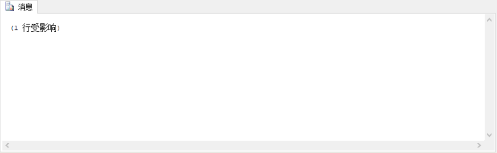
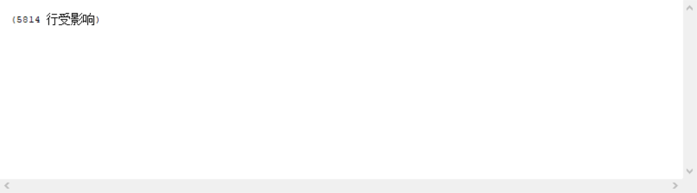
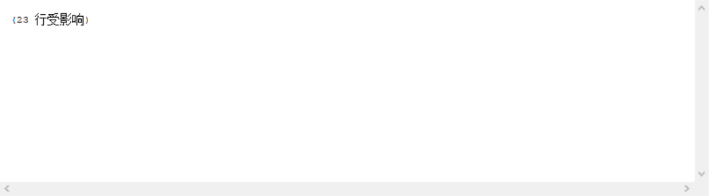
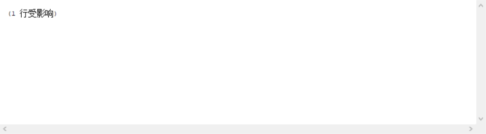
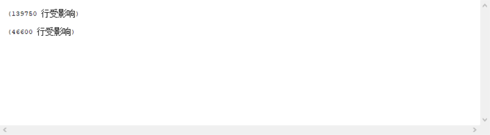
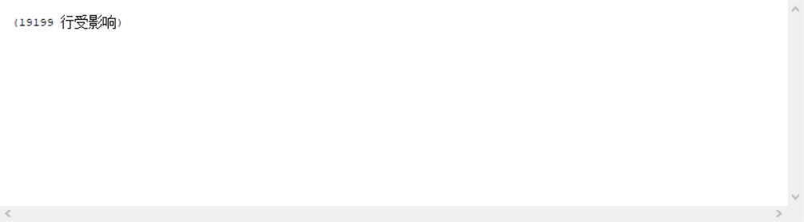

# <center>第4次实验</center>
### 一、练习
1. 向STUDENTS表插入编号是“800022222”且姓名是“WangLan”的元组。
	```sql
	USE SCHOOL
	INSERT
	INTO STUDENTS
	VALUES ('800022222', 'WangLan', null, null)
	```
	
2. 向TEACHERS表插入元组(“200001000”,“LXL”,“s4zrck@pew,net”,“3024”)。
	```sql
	USE SCHOOL
	INSERT
	INTO TEACHERS
	VALUES ('200001000', 'LXL', 's4zrck@pew.net', 3024)
	```
	
3. 将TEACHERS表中编号为“200010493”的老师工资改为4000。
	```sql
	USE SCHOOL
	UPDATE TEACHERS
	SET SALARY = 4000
	WHERE TID = '200010493'
	```
	
4. 将TEACHERS表中所有工资小于2500的老师工资改为2500。
	```sql
	USE SCHOOL
	UPDATE TEACHERS
	SET SALARY = 2500
	WHERE SALARY < 2500
	```
	
5. 将编号为“200016731”的老师讲授的课程全部改成由姓名为“rnupx”的老师讲授。
	```sql
	USE SCHOOL
	UPDATE CHOICES
	SET TID = (SELECT TID
				FROM TEACHERS
				WHERE TNAME = 'rnupx')
	WHERE TID = '200016731'
	```
	
6. 更新编号“800071780”的学生年级为“2001”。
	```sql
	USE SCHOOL
	UPDATE STUDENTS
	SET GRADE = '2001'
	WHERE SID = '800071780'
	```
	
7. 删除没有学生选修的课程。
	```sql
	USE SCHOOL
	DELETE COURSES
	WHERE CID NOT IN (SELECT DISTINCT COURSES.CID
						FROM COURSES INNER JOIN CHOICES ON COURSES.CID = CHOICES.CID)
	```
	
8. 删除年级高于1998的学生信息。
	```sql
	USE SCHOOL
	DELETE CHOICES
	WHERE SID IN (SELECT DISTINCT STUDENTS.SID
					FROM STUDENTS INNER JOIN CHOICES ON STUDENTS.SID = CHOICES.SID
					WHERE grade < 1998)
	DELETE STUDENTS
	WHERE GRADE < 1998
	```
	
9. 删除没有选修课程的学生信息。
	```sql
	USE SCHOOL
	DELETE STUDENTS
	WHERE SID NOT IN (SELECT DISTINCT STUDENTS.SID
						FROM STUDENTS INNER JOIN CHOICES ON STUDENTS.SID = CHOICES.SID)
	```
	
10. 删除成绩不及格的选课记录。
	```sql
	USE SCHOOL
	DELETE CHOICES
	WHERE SCORE < 60
	```
	