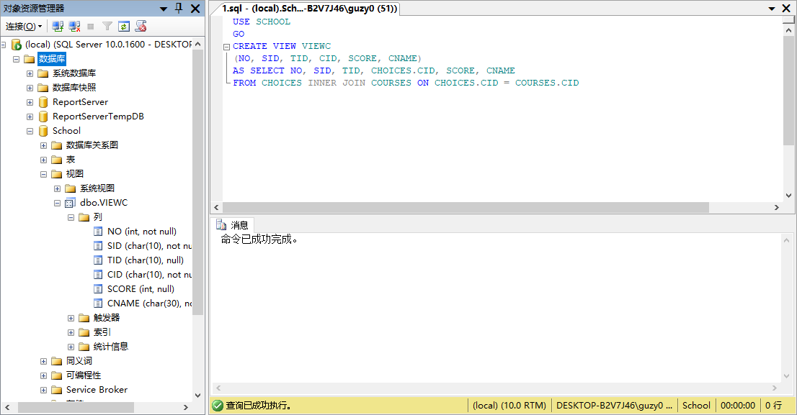
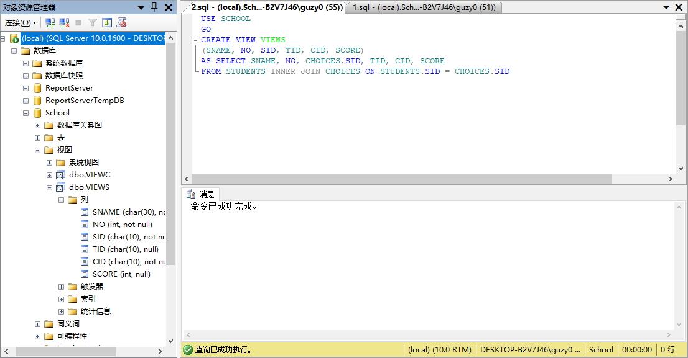
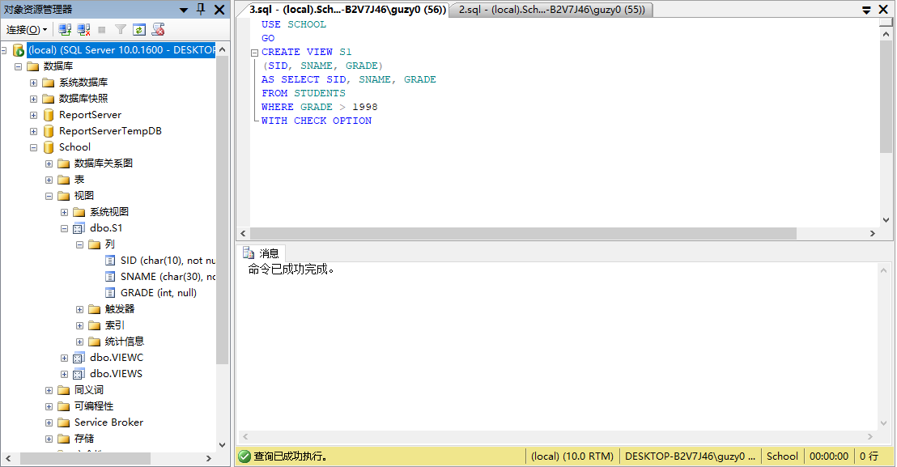
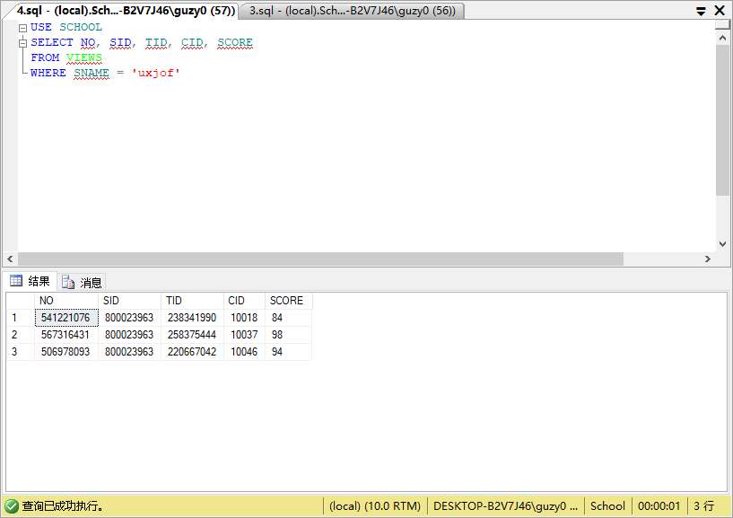
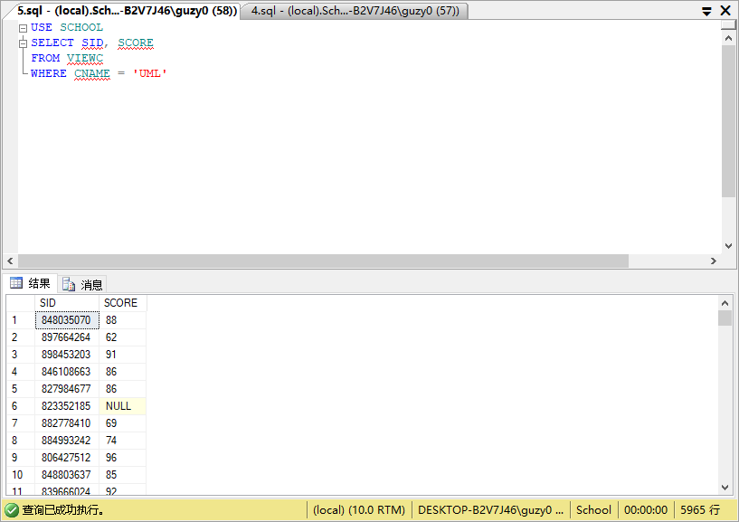
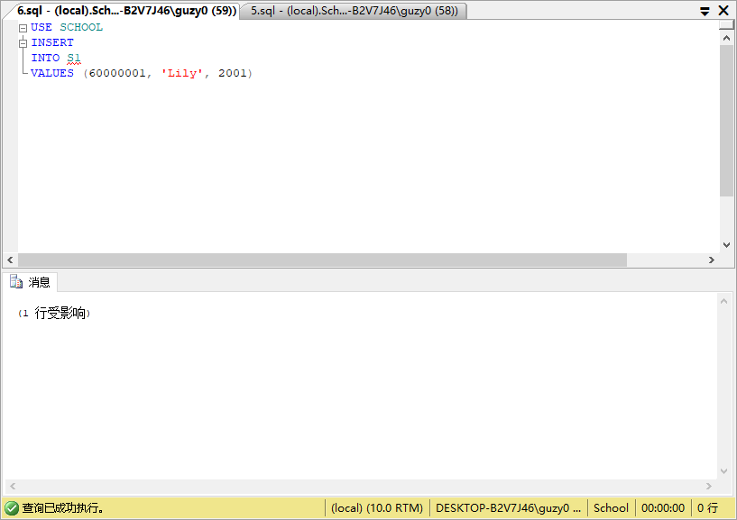
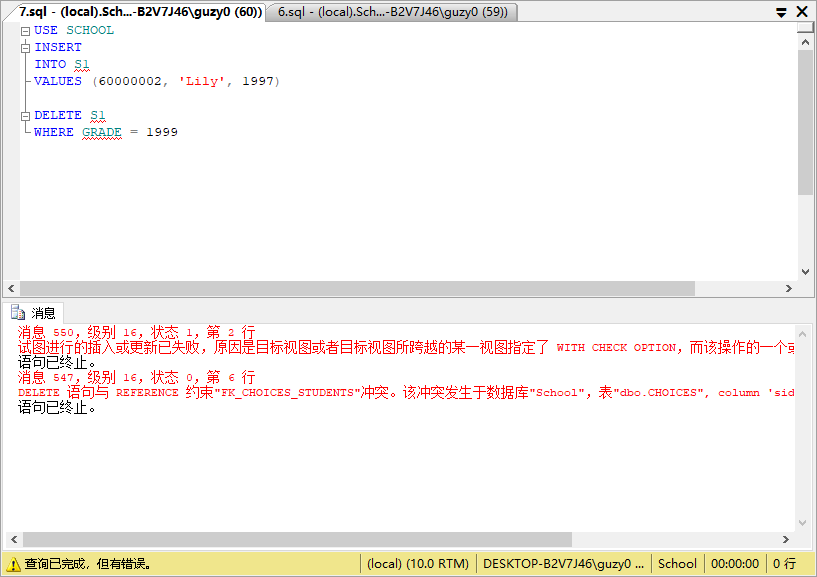
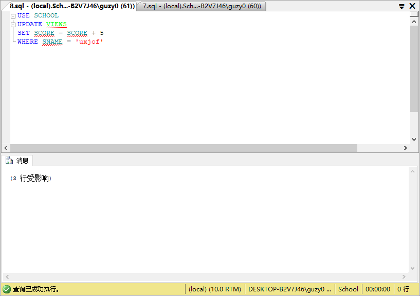
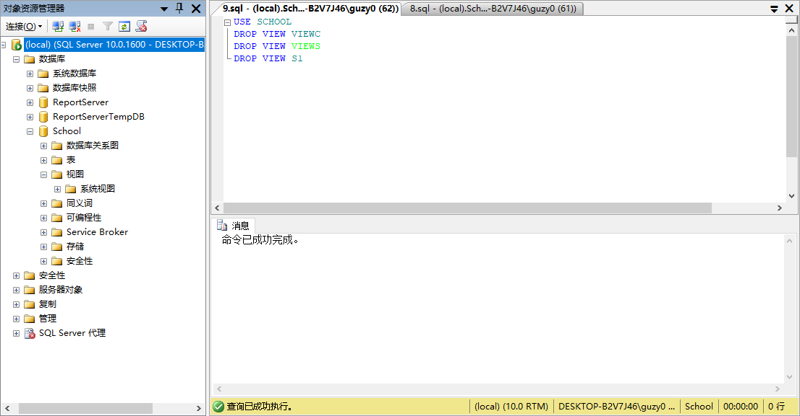

# <center>第4次实验</center>
### 一、练习
1. 定义选课信息和课程名称的视图 VIEWC;
    ```sql
    USE SCHOOL
    GO
    CREATE VIEW VIEWC
    (NO, SID, TID, CID, SCORE, CNAME)
    AS SELECT NO, SID, TID, CHOICES.CID, SCORE, CNAME
    FROM CHOICES INNER JOIN COURSES ON CHOICES.CID = COURSES.CID
    ```
    
2. 定义学生姓名与选课信息的视图 VIEWS;
    ```sql
    USE SCHOOL
    GO
    CREATE VIEW VIEWS
    (SNAME, NO, SID, TID, CID, SCORE)
    AS SELECT SNAME, NO, CHOICES.SID, TID, CID, SCORE
    FROM STUDENTS INNER JOIN CHOICES ON STUDENTS.SID = CHOICES.SID
    ```
    
3. 定义年级低于1998的学生的视图S1(SID, SNAME, GRADE);
    ```sql
    USE SCHOOL
    GO
    CREATE VIEW S1
    (SID, SNAME, GRADE)
    AS SELECT SID, SNAME, GRADE
    FROM STUDENTS
    WHERE GRADE > 1998
    WITH CHECK OPTION
    ```
    
4. 查询学生为“uxjof”的学生的选课信息;
    ```sql
    USE SCHOOL
    SELECT NO, SID, TID, CID, SCORE
    FROM VIEWS
    WHERE SNAME = 'uxjof'
    ```
    
5. 查询选修课程“UML”的学生的编号和成绩;
    ```sql
    USE SCHOOL
    SELECT SID, SCORE
    FROM VIEWC
    WHERE CNAME = 'UML'
    ```
    
6. 向视图S1插入记录(60000001,Lily,2001);
    ```sql
    USE SCHOOL
    INSERT
    INTO S1
    VALUES (60000001, 'Lily', 2001)
    ```
    
7. 定义包括更新和插入约束的视图S1,尝试向视图插入记录(60000001,Lily,1997),删除所有年级为1999的学生记录,讨论更新和插入约束带来的影响;
    ```sql
    USE SCHOOL
    INSERT
    INTO S1
    VALUES (60000002, 'Lily', 1997)

    DELETE S1
    WHERE GRADE = 1999
    ```
    
8. 在视图 VIEWS中将姓名为“uxjof”的学生的选课成绩都加上5分;
    ```sql
    USE SCHOOL
    UPDATE VIEWS
    SET SCORE = SCORE + 5
    WHERE SNAME = 'uxjof'
    ```
    
9. 取消以上建立的所有视图。
    ```sql
    USE SCHOOL
    DROP VIEW VIEWC
    DROP VIEW VIEWS
    DROP VIEW S1
    ```
    