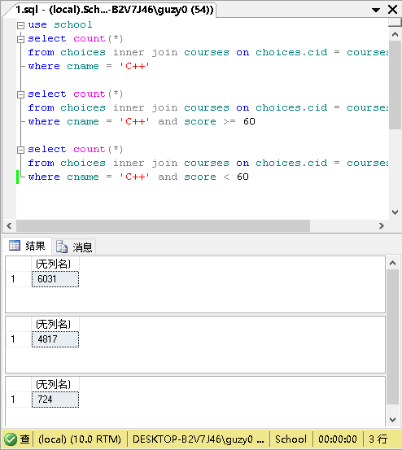
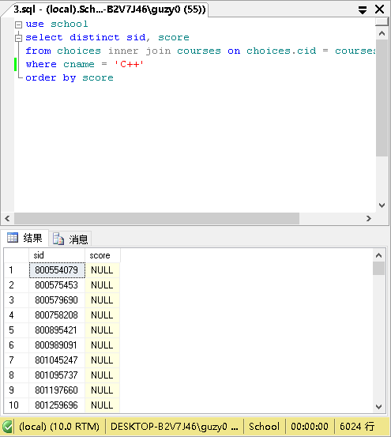
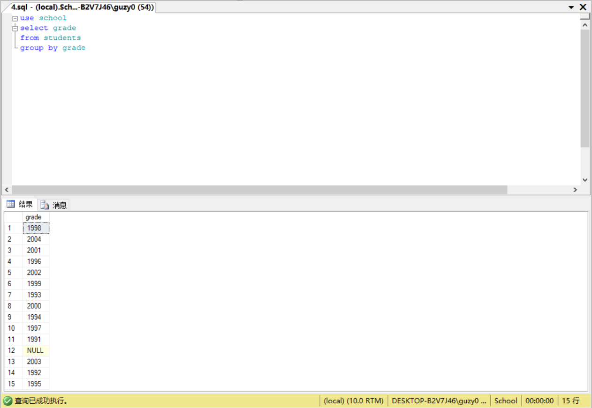
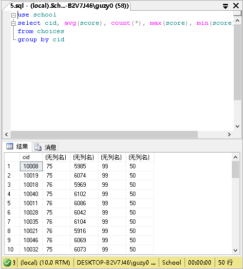
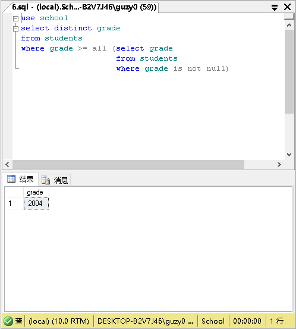

1. 通过查询选修课程C++的学生的人数，其中成绩合格的学生人数，不合格的学生人数，讨论NULL值的特殊含义。

    ```sql
    use school
    select count(*)
    from choices inner join courses on choices.cid = courses.cid
    where cname = 'C++'

    select count(*)
    from choices inner join courses on choices.cid = courses.cid
    where cname = 'C++' and score >= 60

    select count(*)
    from choices inner join courses on choices.cid = courses.cid
    where cname = 'C++' and score < 60
    ```

    

    NULL值含义是成绩不存在或成绩未知。

2. 查询选修课程C++的学生的编号和成绩，使用 ORDER BY按成绩进行排序时,取NULL的项是否出现在结果中？如果有，在什么位置?

    ```sql
    use school
    select sid, score
    from choices inner join courses on choices.cid = courses.cid
    where cname = 'C++'
    order by score
    ```

    

    有，在升序的开头，降序的结尾。

3. 在上面的查询的过程中，如果加上保留字 DISTINCT会有什么效果呢?

    ```sql
    use school
    select distinct sid, score
    from choices inner join courses on choices.cid = courses.cid
    where cname = 'C++'
    order by score
    ```

    

    去掉重复的(sid, score)

4. 按年级对所有的学生进行分组，能得到多少个组?与现实的情况有什么不同?

    ```sql
    use school
    select grade
    from students
    group by grade
    ```

    

    14组，有一个NULL

5. 结合分组,使用集合函数求每个课程选修的学生的平均分,总的选课记录数,最高成绩,最低成绩,讨论考察取空值的项对集合函数的作用的影响。

    ```sql
    use school
    select cid, avg(score), count(*), max(score), min(score)
    from choices
    group by cid
    ```

    

    除了count(*)，都会忽略含null的元组。如果全是null，count返回0，其他聚集函数返回null

6. 采用嵌套查询的方式,利用比较运算符和谓词ALL的结合来查询表 STUDENTS中最晚入学的学生年级。当存在 GRADE取空值的项时,考虑可能出现的情况,并解释。

    ```sql
    use school
    select distinct grade
    from students
    where grade >= all (select grade
                        from students
                        where grade is not null)
    ```

    

    则需要加入is not null的限制（如本题），因为NULL与所有的比较运算符都是不匹配的，因而无法找到一个grade大于等于所有的grade
