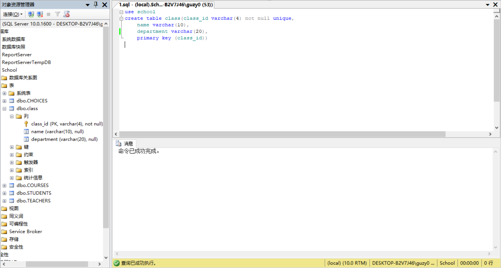
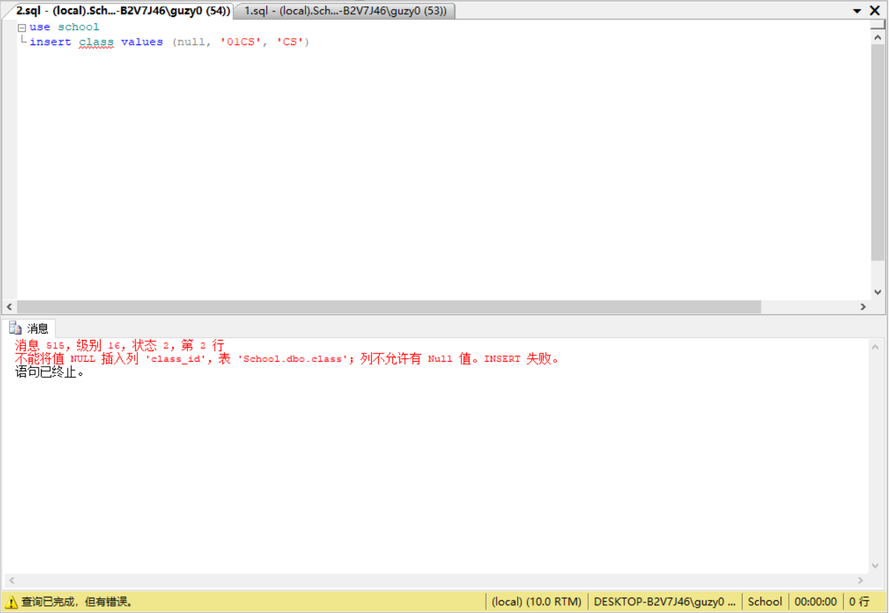
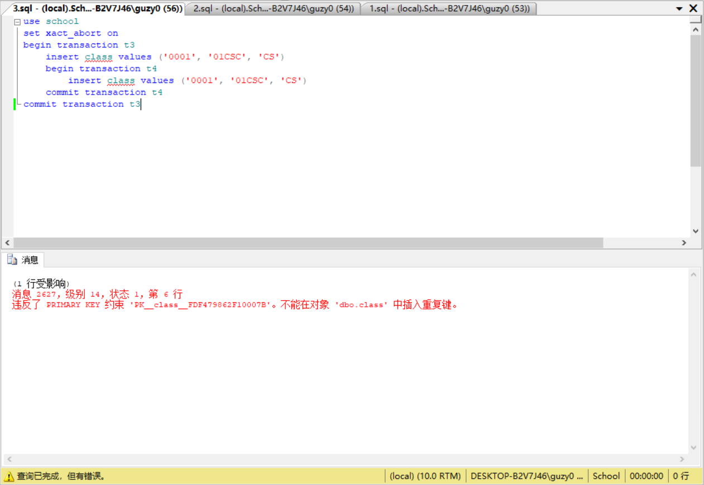

# EX8

1. 在school数据库中建立一张新表class，包括class_id(varchar(4)), name(varchar(10)), department(varchar(20))三个列，并约束class_id为主键。

    ```sql
    use school
    create table class(class_id varchar(4) not null unique,
        name varchar(10),
        department varchar(20),
        primary key (class_id))
    ```

    

2. 在class表中插入一个元组（NULL, ’01CS’, ‘CS’)，测试是否成功。

    ```sql
    use school
    insert class values (null, '01CS', 'CS')
    ```

    

3. 创建事务T3，在class表中插入一个元组（‘0001’，’01CSC’,’’CS’）,并在T3中嵌套创建事务T4，T4也插入和T3一样的元组，编写代码测试，查看结果。

    ```sql
    use school
    set xact_abort on
    begin transaction t3
        insert class values ('0001', '01CSC', 'CS')
        begin transaction t4
            insert class values ('0001', '01CSC', 'CS')
        commit transaction t4
    commit transaction t3
    ```

    
