# 实验可-第9次-18308045-谷正阳

## 练习1

- 在数据库 school中建立表 Stu_Union,设置sno为主键。

    ```sql
    use school
    create table Stu_Union
    (
        sno char(5) not null unique,
        sname char(8),
        ssex char(1),
        sage int,
        sdept char(20),
        constraint PK_Stu_Union primary key(sno)
    );
    insert into Stu_Union values ('10001', '李勇', '0', 24, 'EE');
    insert into Stu_Union values ('95002', '王敏', '1', 23, 'CS');
    insert into Stu_Union values ('95003', '王浩', '0', 25, 'EE');
    insert into Stu_Union values ('95005', '王杰', '0', 25, 'EE');
    insert into Stu_Union values ('95009', '李勇', '0', 25, 'EE');
    select * from Stu_Union;
    ```

    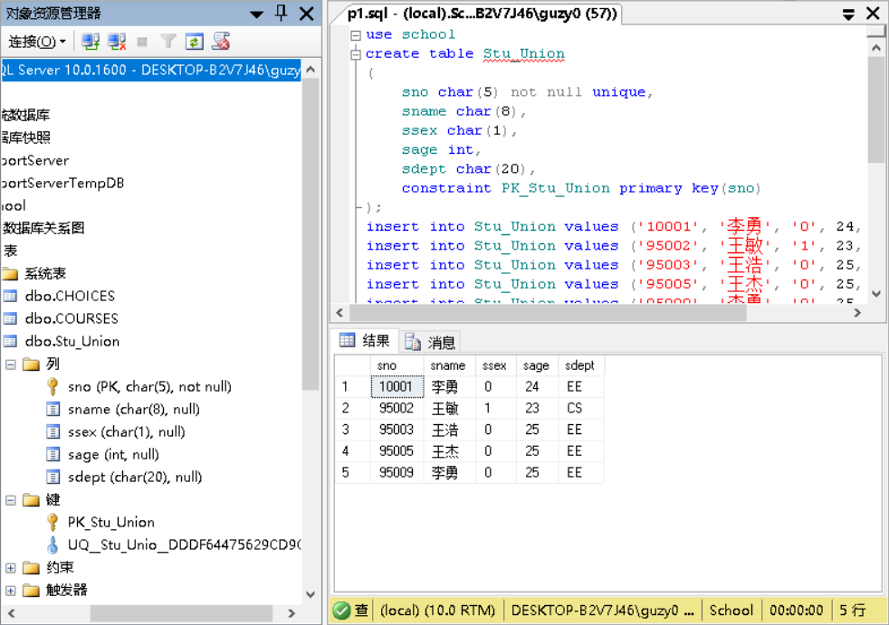

- 在数据库 school中建立表Course,令cno为主键。

    ```sql
    use school
    create table Course
    (
        cno char(4) not null unique,
        cname varchar(50) not null,
        cpoints int,
        constraint PK primary key (cno)
    );
    insert Course values ('0001', 'ComputerNetworks', 2);
    insert Course values ('0002', 'Database', 3);
    select * from Course
    ```

    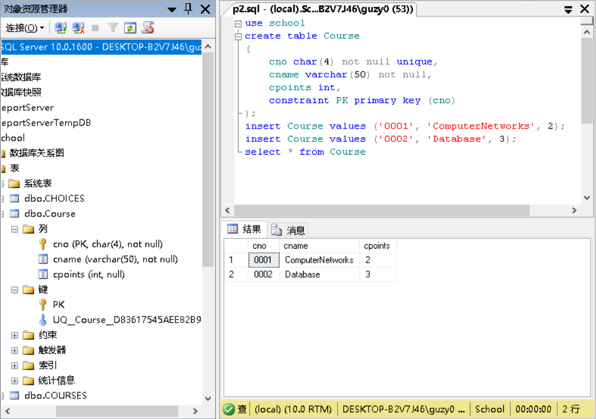

- 建立表SC，令sno和cno分别为参照Stu_Union表以及Course表的外键，设定为级联删除，并令（sno，cno）为其主键。在不违反参照完整性的前提下，插入数据。在主表Stu_Union中删除数据，演示级联删除。

    ```sql
    use school
    create table SC
    (
        sno char(5) references Stu_Union(sno) on delete cascade,
        cno char(4) references Course(cno) on delete cascade,
        grade int,
        constraint PK_SC primary key (sno, cno)
    );
    insert into sc values ('95002', '0001', 2);
    insert into sc values ('95002', '0002', 2);
    insert into sc values ('10001', '0001', 2);
    insert into sc values ('10001', '0002', 2);
    select * from SC
    delete from Stu_Union where sno = '10001';
    select * from SC
    ```

    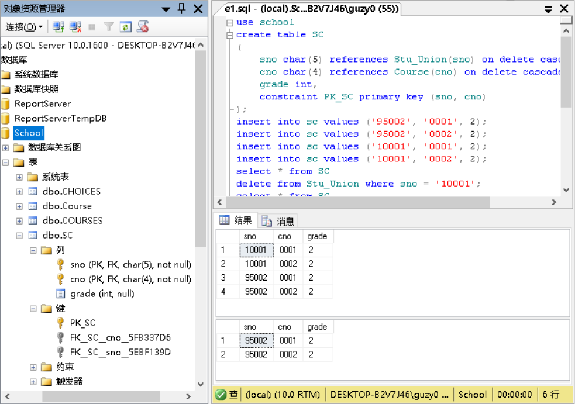

- 用alter table语句将SC表中的on delete cascade改为on delete no action,重新插入SC的数据（按照实验一） 。再删除Stu_Union中sno为‘10001’的数据。观察结果，并分析原因。

    ```sql
    use school
    alter table SC drop constraint FK__SC__cno__5FB337D6;
    alter table SC drop constraint FK__SC__sno__5EBF139D;
    alter table SC add constraint FK__SC__cno foreign key (cno)
        references Course(cno) on delete no action;
    alter table SC add constraint FK__SC__sno foreign key (sno)
        references Stu_Union(sno) on delete no action;
    insert into Stu_Union values ('10001', '李勇', '0', 24, 'EE');
    insert into sc values ('10001', '0001', 2);
    insert into sc values ('10001', '0002', 2);
    select * from SC
    delete from Stu_Union where sno = '10001';
    select * from SC
    ```

    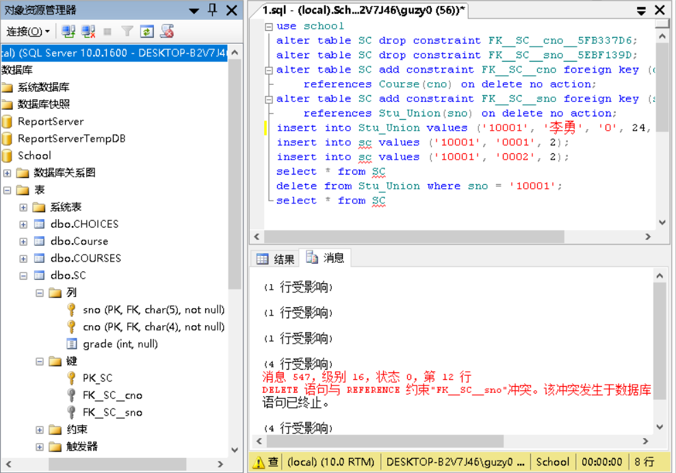

    on delete no action意味着当从表中有匹配的记录时，主表中相应的候选键不允许update/delete操作。
    `SC(sno)`参照`Stu_Union(sno)`，且设为`on delete no action`，因而不能删除。前后都是4行受影响说明没删。

## 练习2

- 用alter table语句将SC表中的on delete no action改为on delete set NULL,重新插入SC的数据（按照实验一） 。再删除Stu_Union中sno为‘10001’的数据。观察结果，并分析原因。

    ```sql
    use school
    alter table SC drop constraint FK__SC__cno;
    alter table SC drop constraint FK__SC__sno;
    alter table SC add constraint FK__SC__cno foreign key (cno)
        references Course(cno) on delete set null;
    alter table SC add constraint FK__SC__sno foreign key (sno)
        references Stu_Union(sno) on delete set null;
    insert into Stu_Union values ('10001', '李勇', '0', 24, 'EE');
    insert into sc values ('10001', '0001', 2);
    insert into sc values ('10001', '0002', 2);
    select * from SC
    delete from Stu_Union where sno = '10001';
    select * from SC
    ```

    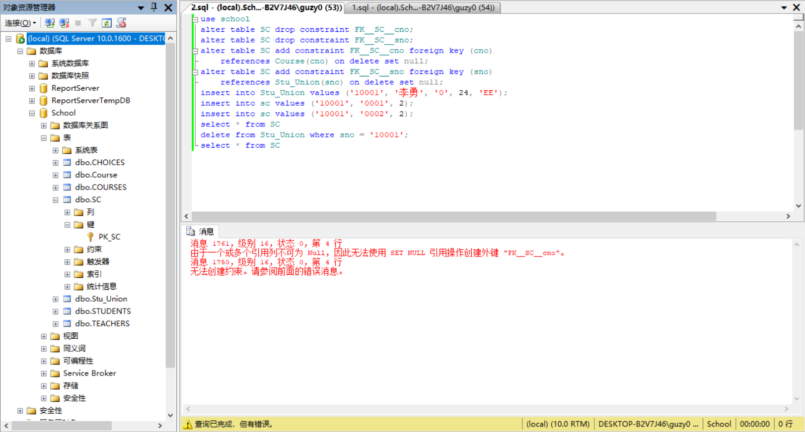

    set null当父表更新、删除的时候，字表会把外键字段变为null，所以这个时候设计表的时候该字段要允许为null，否则会出错。
    由于`Course(cno)`有约束`not null`，因而无法将参照它的`SC(cno)`设为`set null`

## 练习3

- 建立Stu_Card表：

    ```sql
    use school
    create table Stu_Card
    (
        card_id char(14),
        stu_id char(10) references students (sid) on delete cascade,
        remained_money decimal (10, 2),
        constraint PK_stu_card primary key (card_id)
    )
    insert into Stu_Card values ('05212567', '800001216', 100.25);
    insert into Stu_Card values ('05212222', '800005753', 200.50);
    select * from Stu_Card;
    ```

    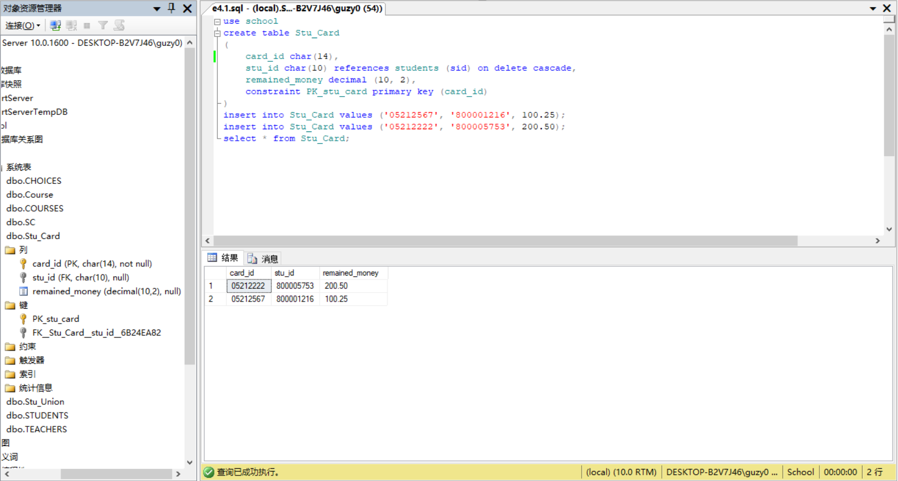

- 建立表ICBC_Card表:

    ```sql
    use school
    create table ICBC_Card
    (
        bank_id char(20),
        stu_card_id char(14) references Stu_Card(card_id),
        restored_money decimal (10, 2),
        constraint PK_ICBC_Card primary key (bank_id)
    )
    insert into ICBC_Card values ('9558844022312', '05212567', 15000.1);
    insert into ICBC_Card values ('9558844023645', '05212222', 50000.3);
    select * from ICBC_Card;
    ```

    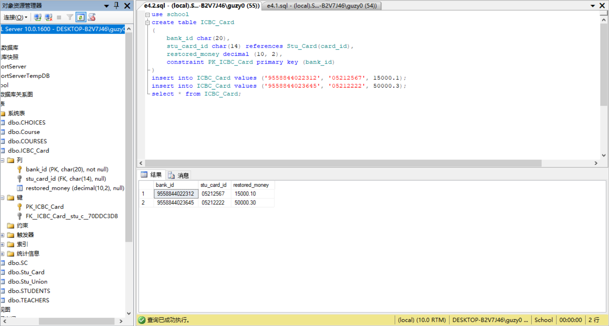

- 建立事务T3，修改ICBC_Card表的外键属性，使其变为on delete set NULL,尝试删除students表中一条记录。观察结果，并分析原因。

    ```sql
    use school
    begin transaction T3
    alter table ICBC_Card drop constraint FK__ICBC_Card__stu_c__70DDC3D8
    alter table ICBC_Card add constraint FK__ICBC_Card__stu_c foreign key (stu_card_id)
        references Stu_Card(card_id) on delete set null;
    delete from students where sid = '800001216';
    commit transaction T3
    ```

    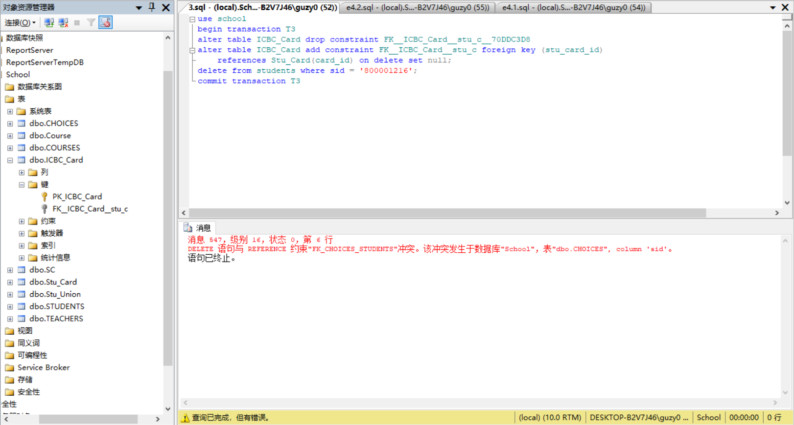

    删除数据出错原因：由于数据库中原有表Choices使用了外键关联Students表，采用on delete no action
    （即当从表中有匹配的记录时，主表中相应的候选键不允许update/delete操作） 。所以直接在students中删除数据会出错。

- 要演示多重级联删除，必须去除表choices原有约束，然后建立新的外键约束，并将其外键设置为级联删除。操作如下：

    ```sql
    use school
    alter table choices drop [FK_CHOICES_STUDENTS];
    alter table choices add
        constraint [FK_CHOICES_STUDENTS] foreign key ([sid])
        references [dbo].[students] ([sid]) on delete cascade;
    delete from students where sid = '800001216';
    select * from Stu_Card;
    select * from ICBC_Card;
    ```

    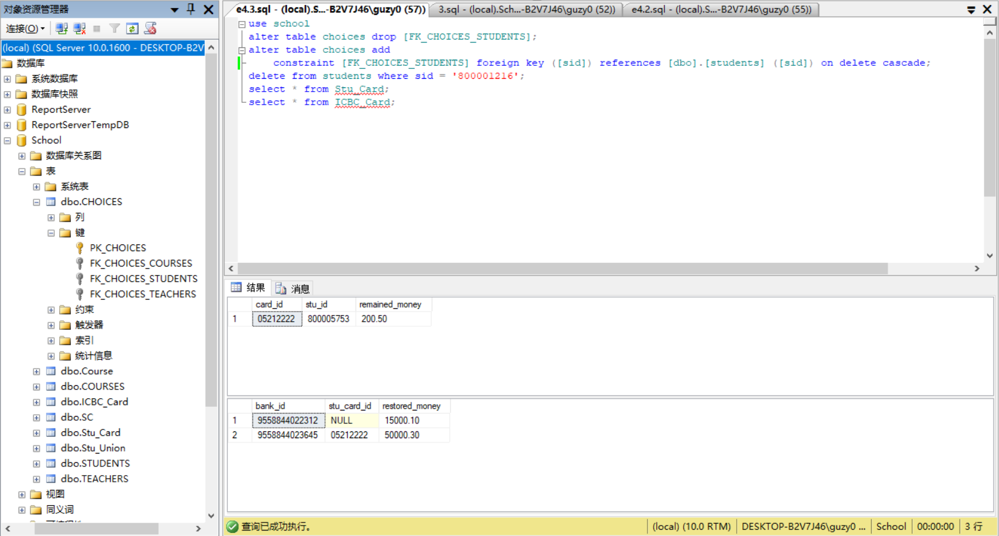

    set null当父表更新、删除的时候，字表会把外键字段变为null，所以这个时候设计表的时候该字段要允许为null，否则会出错。
    由于`Stu_Card(card_id)`没有约束`not null`，且参照它的`ICBC_Card(stu_card_id)`设为`set null`，所以删除时`ICBC_Card`对应记录的属性被设为`null`。

## 练习4

- 创建一个班里的学生互助表，规定：包括学生编号，学生姓名，学生的帮助对象，每个学生有且仅有一个帮助对象，帮助对象也必须是班里的学生。（表的自参照问题）

    ```sql
    use school
    create table mutual_help
    (
        sid char(10),
        sname char(8),
        target char(10) references mutual_help (sid) on delete no action,
        constraint PK_MH primary key (sid)
    )
    ```

    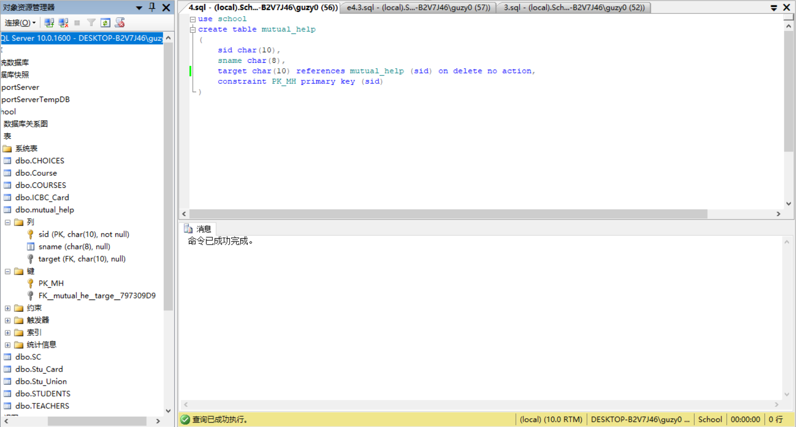

    自参照无法设`cascade`，否则删除/更新可能会引起连锁反应。

## 练习5

- 学校学生会的每个部门都有一个部长，每个部长领导多个部员，每个部只有一个部员有评测部长的权利，请给出体现这两种关系（领导和评测）的两张互参照的表的定义。（两个表互相参照的问题）

    ```sql
    use school
    create table lead
    (
        sid char(10),
        dept char(20),
        evaluator char(10),
        constraint PK__L primary key (sid, dept)
    )
    create table evaluate
    (
        sid char(10),
        dept char(20),
        leader char(10),
        constraint PK__E primary key (sid, dept)
    )
    alter table lead add 
        constraint FK__L foreign key (evaluator, dept) references evaluate (sid, dept);
    alter table evaluate add 
        constraint FK__E foreign key (leader, dept) references lead (sid, dept);
    ```

    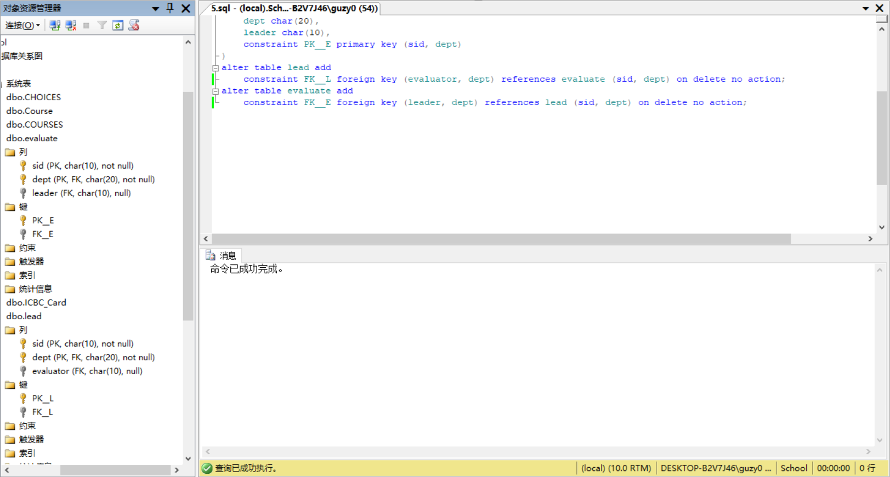

    相互参照无法设`cascade`，否则删除/更新可能会引起连锁反应。（但是此题限制一对一实际上不会出现这种情况）
