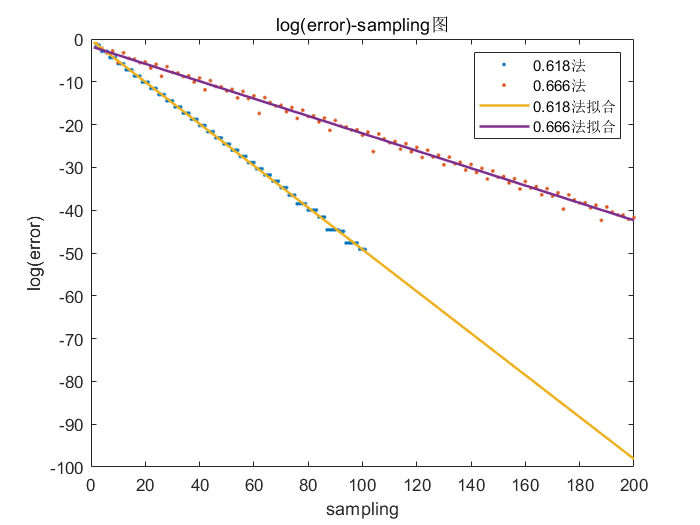

# <center>0.618法和0.666法的比较</center>
#### 一、实验要求

#### 二、实验原理
1. 0.618法

2. 0.666法    
在0.618法的基础上，将每次取的点用的常数$\frac{\sqrt{5}+1}{2}$改成$\frac{2}{3}$。由于区间每次迭代区间变为原来的$\frac{2}{3}$倍，因此收敛速度应约为$(0.666)^k$两者相差不大。注意的是，由于没有黄金分割的性质，每次迭代需要采样两次，因而从采样的角度上考察0.666法是非常慢的。
###### 3. matlab可以很方便地用于做数值计算和绘图
#### 三、实验问题
1. 用折线图会显得很乱。分析原因：虽然区间确实减小的，但是区间仅仅是error的一个上界（因为区间内两点距离小于等于区间大小）。如0.618法前两次迭代得到的结果一样。因而error的图像是不一定平滑的。所以考虑将其改成点图。

2. 画成点图则由于理论上收敛速度都是指数，指数的变化率变化很快而点间距是固定的，导致了看上去很稀疏。而且指数函数也不好判断是否是指数函数，所以对error取log，这样如果画出是均匀的线性则验证了理论的正确性。

3. 得到图像相对美观，可以很直观的看出是线性的，可以对其进行线性函数拟合从而验证理论正确性。另外对于采样数，0.618法平均每迭代一次约采样一次，0.666法平均每迭代一次采样两次，因而理论上设采样数s，则0.618法关于采样数的收敛速度约为$(0.618)^s$，0.666法关于采样数的收敛速度约为$(0.666)^{s/2}\approx(0.816)^s$。两者同样是指数函数，可以用同样的方法验证理论的正确性。

4. 前面的每个图最后一个点都会和理论偏差很大，导致最后拟合函数也偏下。原因是代码里的一个小bug，将最后一个函数值记作了解。

#### 四、实验代码
```matlab
%hw2.m
km = 100;
[x_opt, sampling_opt] = optimization_method(@f, -1, 1, km);
[x_frac23, sampling_frac23] = frac23_method(@f, -1, 1, km);

error_opt = abs(x_opt);
error_frac23 = abs(x_frac23);

log_error_opt = log(error_opt);
log_error_frac23 = log(error_frac23);

k = 1:km;
P_log_error_opt_k = polyfit(k, log_error_opt, 1)
P_log_error_frac23_k = polyfit(k, log_error_frac23, 1)
P_log_error_opt_sampling = polyfit(sampling_opt, log_error_opt, 1)
P_log_error_frac23_sampling = polyfit(sampling_frac23, log_error_frac23, 1)
X1 = [k; ones(1, km)];
X2 = [1:2 * km; ones(1, 2 * km)];

figure;
plot(log_error_opt, '.');
hold on;
plot(log_error_frac23, '.');
plot(P_log_error_opt_k * X1, 'Linewidth', 1.5);
plot(P_log_error_frac23_k * X1, 'Linewidth', 1.5);
hold off;
legend('0.618法', '0.666法', '0.618法拟合', '0.666法拟合');
xlabel('k');
ylabel('log(error)');
title('log(error)-k图');

figure;
plot(sampling_opt, log_error_opt, '.');
hold on;
plot(sampling_frac23, log_error_frac23, '.');
plot(P_log_error_opt_sampling * X2, 'Linewidth', 1.5);
plot(P_log_error_frac23_sampling * X2, 'Linewidth', 1.5);
hold off;
legend('0.618法', '0.666法', '0.618法拟合', '0.666法拟合');
xlabel('sampling');
ylabel('log(error)');
title('log(error)-sampling图');
```
```matlab
%f.m
function [y] = f(x)
    y = x^2/2;
end
```
```matlab
%optimization_method.m
function [x, sampling] = optimization_method(f, x0, x3, km)
    %f 目标函数
    %x0 区间左边界
    %x3 区间右边界
    %km 最大迭代次数
    c = (sqrt(5) - 1) / 2;  %常数0.618
    k = 1;                  %第k次迭代
    x = zeros(1, km);       %记录计算当前步长随迭代次数变化的所有取值
    sampling = zeros(1, km);%记录采样数随迭代次数变化的所有取值
    x1 = x3 - c * (x3 - x0);%待比较点较小值
    x2 = c * (x3 - x0) + x0;%待比较点较大值
    f1 = f(x1);
    f2 = f(x2);
    sampling(1, k) = 2;

    while k <= km - 1
        if f1 >= f2
            x(1, k) = x2;
            k = k + 1;
            x0 = x1;
            x1 = x2;
            x2 = c * (x3 - x0) + x0;
            f1 = f2;
            f2 = f(x2);
            sampling(1, k) = sampling(1, k - 1) + 1;
        else
            x(1, k) = x1;
            k = k + 1;
            x3 = x2;
            x2 = x1;
            x1 = x3 - c * (x3 - x0);
            f2 = f1;
            f1 = f(x1);
            sampling(1, k) = sampling(1, k - 1) + 1;
        end
    end

    if f1 >= f2
        x(1, k) = x2;
    else
        x(1, k) = x1;
    end
end
```
```matlab
%frac23_method.m
function [x, sampling] = frac23_method(f, x0, x3, km)
    %f 目标函数
    %x0 区间左边界
    %x3 区间右边界
    %km 最大迭代次数
    c = 2/3;                %常数0.666
    k = 1;                  %第k次迭代
    x = zeros(1, km);       %记录计算当前步长随迭代次数变化的所有取值
    sampling = zeros(1, km);%记录采样数随迭代次数变化的所有取值
    x1 = x3 - c * (x3 - x0);%待比较点较小值
    x2 = c * (x3 - x0) + x0;%待比较点较大值
    f1 = f(x1);
    f2 = f(x2);
    sampling(1, k) = 2;

    while k <= km - 1
        if f1 >= f2
            x(1, k) = x2;
            k = k + 1;
            x0 = x1;
            x1 = x3 - c * (x3 - x0);
            x2 = c * (x3 - x0) + x0;
            f1 = f(x1);
            f2 = f(x2);
            sampling(1, k) = sampling(1, k - 1) + 2;
        else
            x(1, k) = x1;
            k = k + 1;
            x3 = x2;
            x2 = c * (x3 - x0) + x0;
            x1 = x3 - c * (x3 - x0);
            f2 = f(x2);
            f1 = f(x1);
            sampling(1, k) = sampling(1, k - 1) + 2;
        end
    end

    if f1 >= f2
        x(1, k) = x2;
    else
        x(1, k) = x1;
    end
end
```
#### 四、实验结果
###### 1. error-k图

拟合得不错。
###### 2. error-sampling图

拟合得不错。
```matlab
>> hw2

P_log_error_opt_k =

   -0.4894   -0.7346


P_log_error_frac23_k =

   -0.4063   -1.7419


P_log_error_opt_sampling =

   -0.4894   -0.2452


P_log_error_frac23_sampling =

   -0.2031   -1.7419
```
其中，0.618法$log(error)$对$k$及$sampling$的实验值斜率$-0.4894$约等于理论值：
```matlab
>> log((sqrt(5) - 1) / 2)

ans =

   -0.4812
```
0.666法$log(error)$对$k$实验值斜率$-0.4063$约等于理论值：
```matlab
>> log(2 / 3)

ans =

   -0.4055
```
0.666法$log(error)$对$sampling$实验值斜率$-0.2031$约等于理论值：
```matlab
>> log(sqrt(2 / 3))

ans =

   -0.2027
```
#### 五、实验反思
1. 实验需要仔细检查，找到不合理的地方就是可能出了问题。
2. 实验要与理论结合。
3. 图像直观很重要。