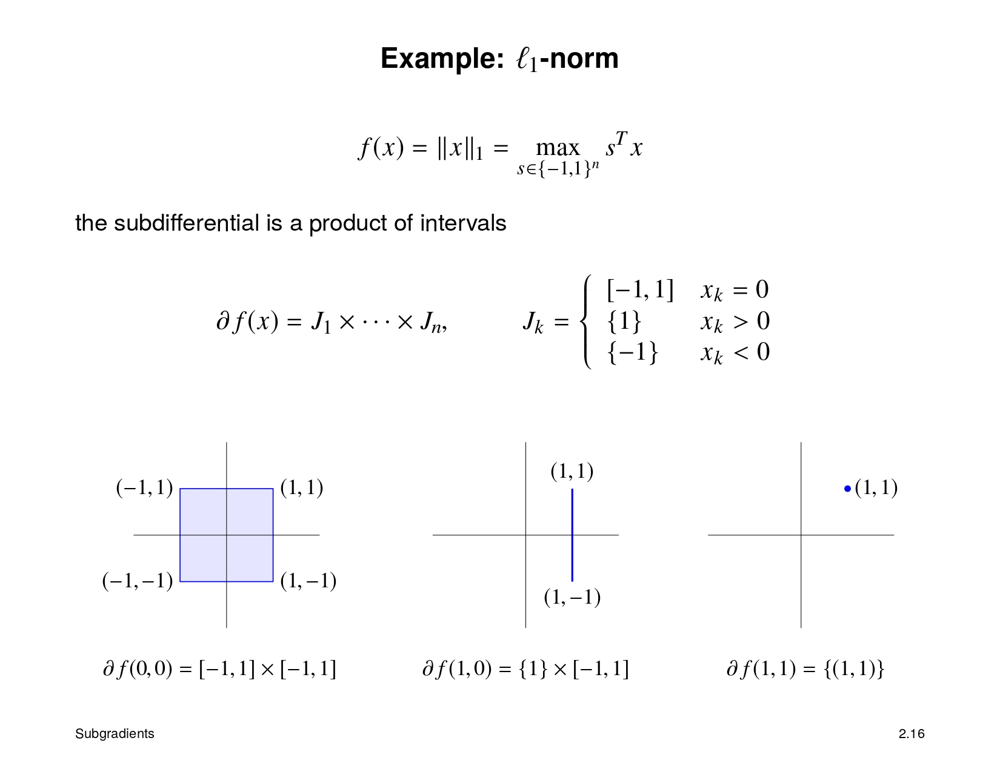

# 
一范数规范化最小二乘问题

#### 一、作业要求

#### 二、作业原理
1. 凸问题的重要性质：

2. 1-范数的次梯度：

#### 三、作业内容
因为1-范数，2-范数是凸函数
所以$f$是凸函数
所以该问题是无约束的图问题，局部最优解即全局最优解
所以$\mathbf0$是该问题最优解当且仅当$\exist R>0,\forall z\in\mathbb R^n$，若$\parallel z-\mathbf0\parallel\le R$，$f(z)>f(\mathbf0)$即$f(z)-f(\mathbf0)>\mathbf0\cdot(z-\mathbf0)$即$\mathbf0\in\partial f(\mathbf0)$
因为$\nabla\frac12\parallel Ax-b\parallel^2=A^T(Ax-b)$（分子布局）。
又因为$\partial\parallel x\parallel_1=J_1\times\cdots\times J_n$，其中$J_k=\begin{cases}
[-1,1]&x_k=0\\
\{1\}&x_k>0\\
\{-1\}&x_k<0
\end{cases}$
所以$\partial f(\mathbf0)=\{A^T(-b)+\lambda C|\forall i\in\mathbb N^+\wedge i\le n,C_i\in [-1,1]\}$
所以$\mathbf0\in\partial f(\mathbf0)$当且仅当$\forall i\in\mathbb N^+\wedge i\le n,0\in[(A^T(-b))_i-\lambda,(A^T(-b))_i+\lambda]$
当且仅当$\lambda\ge\max\limits_{1\le i\le n}\{|(A^Tb)_i|\}$
所以$\lambda_{max}=\max\limits_{1\le i\le n}\{|(A^Tb)_i|\}$