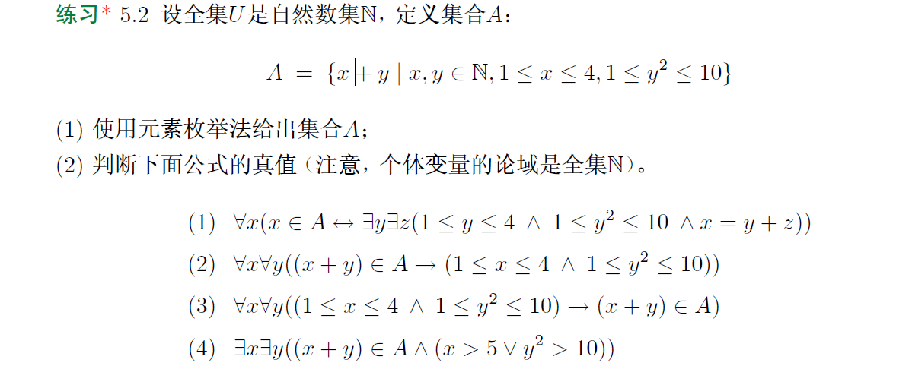
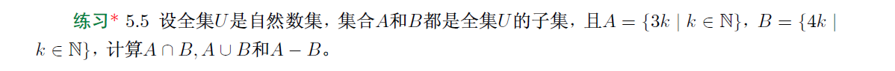
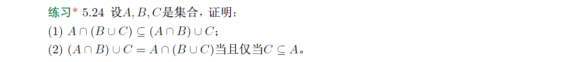

#### (1)
$A=\{2,3,4,5,6,7\}$
#### (2)
###### (1) 
$\because 论域是\mathbb N$

$\therefore \forall x(x\in A\leftrightarrow \exist y\exist z(x=y+z\wedge 1\le x\le 4\wedge 1\le y^2\le 10))是性质概括法定义集合A的逻辑含义$

$\therefore 真值为1$
###### (2)
$\because 论域是\mathbb N$

$\therefore 当x=0,y=2时，x+y=2\in A真值为1，(1\le x\le 4\wedge 1\le y^2\le 10)真值为0$

$\therefore 真值为0$
###### (3)
$\because 论域是\mathbb N$

$\therefore 对1\le x\le 4\wedge 1\le y^2\le 10即x=1,2,3,4，y=1,2,3显然有x+y\in A$

$\therefore 真值为1$
###### (4)
$\because 论域是\mathbb N$

$\therefore 当x=6,y=1时，x+y\in A真值为1且x>5\vee y^2>10真值为1$

$\therefore 真值为1$


```math
\begin{aligned}
A\cap B&=\{3k|k\in N\}\cap \{4k|k\in N\}\\
&=\{x|\exist k\in \mathbb N(x=3k)\}\cap \{x|\exist k\in \mathbb N(x=4k)\}\\
&=\{x|\exist k\in \mathbb N(x=3k)\wedge \exist k\in \mathbb N(x=4k)\}
\end{aligned}
```
$\because 对任意正整数a,b,c，有a|c且b|c当且仅当lcm(a,b)|c$

$\therefore A\cap B=\{x|\exist k\in \mathbb N(x=12k\}$
```math
\begin{aligned}
A\cup B&=\{3k|k\in N\}\cup \{4k|k\in N\}\\
&=\{x|\exist k\in \mathbb N(x=3k)\}\cup \{x|\exist k\in \mathbb N(x=4k)\}\\
&=\{x|\exist k\in \mathbb N(x=3k)\vee \exist k\in \mathbb N(x=4k)\}\\
&=\{x|\exist k\in \mathbb N(x=3k\vee x=4k)\}
\end{aligned}
```
```math
\begin{aligned}
A-B&=\{3k|k\in N\}-\{4k|k\in N\}\\
&=\{x|\exist k\in \mathbb N(x=3k)\}-\{x|\exist k\in \mathbb N(x=4k)\}\\
&=\{x|\exist k\in \mathbb N(x=3k)\wedge \lnot (\exist k\in \mathbb N(x=4k))\}\\
&=\{x|\exist k\in \mathbb N(x=3k)\wedge \forall k\in \mathbb N(\lnot (x=4k))\}\\
&=\{x|\exist k\in \mathbb N(x=3k)\wedge \forall k\in \mathbb N(x\ne 4k)\}\\
\end{aligned}
```


#### (1)
$\wp(\{\varnothing ,\{\varnothing\}\})=\{\varnothing,\{\varnothing\},\{\{\varnothing\}\},\{\varnothing,\{\varnothing\}\}\}$

$\wp(\{a,\{b\},\{\{c\}\}\})=\{\varnothing,\{a\},\{\{b\}\},\{\{\{c\}\}\},\{a,\{b\}\},\{a,\{\{c\}\}\},\{\{b\},\{\{c\}\}\},\{a,\{b\},\{\{c\}\}\}\}$

$\wp(\wp(\{\{a\}\}))=\wp(\{\varnothing,\{\{a\}\}\})=\{\varnothing,\{\varnothing\},\{\{\{a\}\}\},\{\varnothing,\{\{a\}\}\}\}$


#### (1)
$\because a是\{a\}中的元素$

$\therefore 是$
#### (2)
$\because \{a\}不是\{a\}中的元素$

$\therefore 否$
#### (3)
$\because \{a\}是\{a,\{a\}\}中的元素$

$\therefore 是$
#### (4)
$\because a是\{a\}中全部元素且a是\{a\}中的元素$

$\therefore 是$
#### (5)
$\because a是\{a\}中全部元素且a是\{a,\{a\}\}中的元素$

$\therefore 是$
#### (6)
$\because \{a\}是\{\{a\}\}中全部元素且\{a\}是\{a,\{a\}\}中的元素$

$\therefore 是$


#### (1)
$A\subseteq B$
```math
\begin{aligned}
\because A\cap B=A&当且仅当A\cap B\subseteq A且A\subseteq A\cap B\\
&当且仅当A\subseteq A\cap B\\
&当且仅当A\subseteq A且A\subseteq B\\
&当且仅当A\subseteq B
\end{aligned}
```
#### (2)
$B\subseteq A$
```math
\begin{aligned}
\because A\cup B=A&当且仅当A\cup B\subseteq A且A\subseteq A\cup B\\
&当且仅当A\cup B\subseteq A\\
&当且仅当A\subseteq A且B\subseteq A\\
&当且仅当B\subseteq A
\end{aligned}
```
#### (3)
$B=\varnothing$
```math
\begin{aligned}
\because A\oplus B=A&当且仅当A\cup B-A\cap B=A\\
&当且仅当(A\cup B)\cap (\overline{A\cap B})=A\\
&当且仅当(A\cup B)\cap (\overline{A}\cup \overline{B})=A//德摩尔根律\\
&当且仅当(A\cup B)\cap (\overline{A}\cup \overline{B})\subseteq A且A\subseteq (A\cup B)\cap (\overline{A}\cup \overline{B})\\
\because (A\cup B)\cap (\overline{A}\cup \overline{B})\subseteq A&当且仅当(A\cap \overline{A})\cup (A\cap \overline{B})\cup (B\cap \overline{A})\cup (B\cap \overline{B})\subseteq A//分配律\\
&当且仅当(A\cap \overline{B})\cup(B\cap \overline{A})\subseteq A//矛盾律\\
&当且仅当A\cap \overline{B}\subseteq A且B\cap \overline{A}\subseteq A\\
&当且仅当B\cap \overline{A}\subseteq A\\
&当且仅当B\cap \overline{A}=B\cap \overline{A}\cap A=\varnothing//结合律，矛盾律，同一律\\
A\subseteq A\cup B\cap \overline{A}\cup \overline{B}&当且仅当A\subseteq A\cup B且A\subseteq \overline{A}\cup \overline{B}\\
&当且仅当A\subseteq \overline{A}\cup \overline{B}\\
&当且仅当\overline{A}\cup \overline{B}=A\cup \overline{A}\cup B=U//排中律，零律\\
&当且仅当A\cap B=\varnothing//德摩尔根律\\
\therefore A\oplus B=A&当且仅当B\cap \overline{A}=\varnothing且A\cap B=\varnothing\\
\end{aligned}
```
$若B=\varnothing$

$\therefore B\cap \overline{A}=\varnothing且A\cap B=\varnothing//零律$

$若B\cap \overline{A}=\varnothing且A\cap B=\varnothing$

$\therefore B=B\cap (\overline{A}\cup A)=(B\cap \overline{A})\cup (B\cap A)=\varnothing //同一律，排中律，分配律，幂等律$

$\therefore A\oplus B当且仅当B=\varnothing$
#### (4)
$A=B$
```math
\begin{aligned}
A\cap B=A\cup B&当且仅当A\cap B\subseteq A\cup B且A\cup B\subseteq A\cap B\\
&当且仅当A\cup B\subseteq A\cap B\\
&当且仅当A\cup B\subseteq A且A\cup B\subseteq B\\
&当且仅当A\subseteq A且B\subseteq A且A\subseteq B且B\subseteq B\\
&当且仅当B\subseteq A且A\subseteq B\\
&当且仅当A=B
\end{aligned}
```

$\because A\cup B=A\cup C$

$\therefore \overline{A}\cap(A\cup B)=\overline{A}\cap(A\cup C)$

$\therefore \overline{A}\cap B=\overline{A}\cap C//分配律，矛盾律，同一律$

$\therefore (A\cap B)\cup(\overline{A}\cap B)=(A\cap C)\cup(\overline{A}\cap C)$

$\therefore (A\cup \overline{A})\cap B=(A\cup \overline{A})\cap C//分配律$

$\therefore B=C//排中律，同一律$


#### (1)
```math
\begin{aligned}
A\cap(B\cup C)&=(A\cap B)\cup(A\cap C)//分配律\\
&=((A\cap B)\cup A)\cap(A\cap B\cup C)//分配律
\end{aligned}
```
$\because ((A\cap B)\cup A)\cap(A\cap B\cup C)\subseteq (A\cap B)\cup C$

$\therefore 得证$
#### (2)
```math
\begin{aligned}
(A\cap B)\cup C=A\cap(B\cup C)&当且仅当(A\cap B)\cup C=(A\cap B)\cup(A\cap C)//分配律\\
&当且仅当(A\cap B)\cup C=((A\cap B)\cup A)\cap ((A\cap B)\cup C)//分配律\\
&当且仅当(A\cap B)\cup C\subseteq (A\cap B)\cup A\\
&当且仅当(A\cap B)\cup C\subseteq A\cap(B\cup A)//分配律，幂等律\\
&当且仅当(A\cap B)\cup C\subseteq A且(A\cap B)\cup C\subseteq B\cup A\\
&当且仅当A\cap B\subseteq A且C\subseteq A且A\cap B\subseteq B\cup A且C\subseteq B\cup A\\
&当且仅当C\subseteq A且C\subseteq B\cup A
\end{aligned}
```
$\because 当C\subseteq A时，C\subseteq B\cup A$

$\therefore 当C\subseteq A时，C\subseteq A且C\subseteq B\cup A$

$\therefore 当C\subseteq A时，(A\cap B)\cup C=A\cap(B\cup C)$

$\because 当C\subseteq A且C\subseteq B\cup A时，C\subseteq A$

$\therefore 当(A\cap B)\cup C=A\cap(B\cup C)时，C\subseteq A$

$\therefore 得证$


$若A=B$

$\therefore \forall x\in \wp(A)，有x\subseteq A即x\subseteq B即x\in \wp(B)$

$\therefore \wp(A)\subseteq \wp(B)$

$\because \forall x\in \wp(B)，有x\subseteq B即x\subseteq A即x\in \wp(A)$

$\therefore \wp(B)\subseteq \wp(A)$

$\therefore \wp(A)=\wp(B)$

$若\wp(A)=\wp(B)$

$\forall x\subseteq A，x\subseteq B且\forall x\subseteq B，x\subseteq A$

$\because \exist A\subseteq A且\exist B\subseteq B$

$\therefore A\subseteq B且B\subseteq A$

$\therefore A=B$

$\therefore 得证$