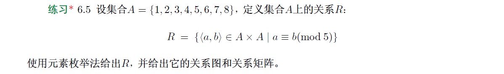
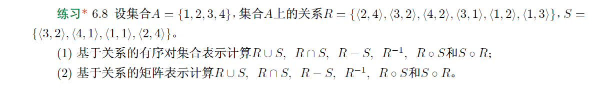
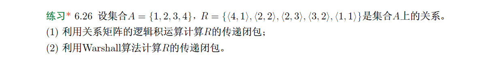
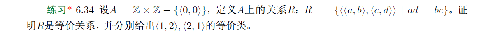
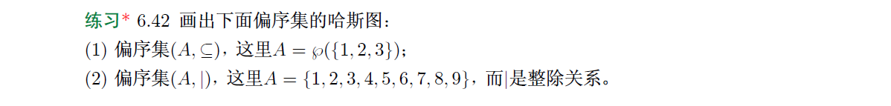

# 
18308045_谷正阳_hw6

(1)枚举法：

$R=\{\langle 1,1\rangle,\langle 1,6\rangle,\langle 2,2\rangle,\langle 2,7\rangle,\langle 3,3\rangle,\langle 3,8\rangle,\langle 4,4\rangle\}$

(2)关系图：

(3)关系矩阵：
$M_R=\left[\begin{matrix}
1&0&0&0&0&1&0&0\\
0&1&0&0&0&0&1&0\\
0&0&1&0&0&0&0&1\\
0&0&0&1&0&0&0&0\\
0&0&0&0&0&0&0&0\\
0&0&0&0&0&0&0&0\\
0&0&0&0&0&0&0&0\\
0&0&0&0&0&0&0&0\\
\end{matrix}\right]$

$\begin{aligned}
&\because任意\langle x,y\rangle\in R_1^{-1}当且仅当\langle y,x\rangle\in R_1即y\le x\\
&\therefore R_1^{-1}=\{\langle x,y\rangle\in\mathbb R\times\mathbb R|y\le x\}
\end{aligned}$

$\begin{aligned}
&\because任意\langle x,y\rangle\in R_2^{-1}当且仅当\langle y,x\rangle\in R_2即y<x\\
&\therefore R_2^{-1}=\{\langle x,y\rangle\in\mathbb R\times\mathbb R|y<x\}
\end{aligned}$

$\begin{aligned}
&\because任意\langle x,y\rangle\in R_1\circ R_2当且仅当存在z\in\mathbb R，\langle x,z\rangle\in R_2且\langle z,y\rangle\in R_1即x<z且z\le y\\
&\because若存在z\in\mathbb R，x<z且z\le y，则x<y\\
&若x<y，则存在z=\frac{x+y}2使x<z且z\le y\\
&\therefore任意\langle x,y\rangle\in R_1\circ R_2当且仅当x<y\\
&\therefore R_1\circ R_2=\{\langle x,y\rangle\in\mathbb R\times\mathbb R|x<y\}
\end{aligned}$

$\begin{aligned}
&\because任意\langle x,y\rangle\in R_2\circ R_1当且仅当存在z\in\mathbb R，\langle x,z\rangle\in R_1且\langle z,y\rangle\in R_2即x\le z且z<y\\
&\because若存在z\in\mathbb R，x\le z且z<y，则x<y\\
&若x<y，则存在z=\frac{x+y}2使x\le z且z<y\\
&\therefore任意\langle x,y\rangle\in R_2\circ R_1当且仅当x<y\\
&\therefore R_2\circ R_1=\{\langle x,y\rangle\in\mathbb R\times\mathbb R|x<y\}
\end{aligned}$

$\begin{aligned}
&\because任意\langle x,y\rangle\in R_2\circ R_3当且仅当存在z\in\mathbb R，\langle x,z\rangle\in R_3且\langle z,y\rangle\in R_2即x=z且z<y\\
&\because若存在z\in\mathbb R，x=z且z<y，则x<y\\
&若x<y，则存在z=x使x=z且z<y\\
&\therefore任意\langle x,y\rangle\in R_2\circ R_3当且仅当x<y\\
&\therefore R_2\circ R_3=\{\langle x,y\rangle\in\mathbb R\times\mathbb R|x<y\}
\end{aligned}$

$\begin{aligned}
&\because任意\langle x,y\rangle\in R_2\circ R_4当且仅当存在z\in\mathbb R，\langle x,z\rangle\in R_4且\langle z,y\rangle\in R_2即x\ne z且z<y\\
&\because若存在z\in\mathbb R，x\ne z且z<y，则x\in\mathbb R且y\in\mathbb R\\
&若x\in\mathbb R且y\in\mathbb R，则存在z=y-1或z=y-2使x\ne z且z<y\\
&\therefore任意\langle x,y\rangle\in R_2\circ R_4当且仅当x\in\mathbb R且y\in\mathbb R\\
&\therefore R_2\circ R_1=\{\langle x,y\rangle\in\mathbb R\times\mathbb R\}
\end{aligned}$

(1)

$\begin{aligned}
&\because任意\langle x,y\rangle\in R\cup S当且仅当\langle x,y\rangle\in R或\langle x,y\rangle\in S\\
&\therefore R\cup S=\{\langle 2,4\rangle,\langle 3,2\rangle,\langle 4,2\rangle,\langle 3,1\rangle,\langle 1,2\rangle,\langle 1,3\rangle,\langle 4,1\rangle,\langle 1,1\rangle\}
\end{aligned}$

$\begin{aligned}
&\because任意\langle x,y\rangle\in R\cap S当且仅当\langle x,y\rangle\in R且\langle x,y\rangle\in S\\
&\therefore R\cap S=\{\langle 2,4\rangle,\langle 3,2\rangle\}
\end{aligned}$

$\begin{aligned}
&\because任意\langle x,y\rangle\in R-S当且仅当\langle x,y\rangle\in R且\langle x,y\rangle\not\in S\\
&\therefore R-S=\{\langle 4,2\rangle,\langle 3,1\rangle,\langle 1,2\rangle,\langle 1,3\rangle\}
\end{aligned}$

$\begin{aligned}
&\because任意\langle x,y\rangle\in R^{-1}当且仅当\langle y,x\rangle\in R\\
&\therefore R^{-1}=\{\langle 4,2\rangle,\langle 2,3\rangle,\langle 2,4\rangle,\langle 1,3\rangle,\langle 2,1\rangle,\langle 3,1\rangle\}
\end{aligned}$

$\begin{aligned}
&\because任意\langle x,y\rangle\in R\circ S当且仅当存在z\in A，\langle x,z\rangle\in S且\langle z,y\rangle\in R\\
&\therefore R\circ S=\{\langle 3,4\rangle,\langle 4,2\rangle,\langle 4,3\rangle,\langle 1,2\rangle,\langle 1,3\rangle,\langle 2,2\rangle\}
\end{aligned}$

$\begin{aligned}
&\because任意\langle x,y\rangle\in S\circ R当且仅当存在z\in A，\langle x,z\rangle\in R且\langle z,y\rangle\in S\\
&\therefore S\circ R=\{\langle 2,1\rangle,\langle 3,4\rangle,\langle 4,4\rangle,\langle 3,1\rangle,\langle 1,4\rangle,\langle 1,2\rangle\}
\end{aligned}$

(2)

$\begin{aligned}
M_R=\left[\begin{matrix}
0&1&1&0\\
0&0&0&1\\
1&1&0&0\\
0&1&0&0
\end{matrix}\right],
M_S=\left[\begin{matrix}
1&0&0&0\\
0&0&0&1\\
0&1&0&0\\
1&0&0&0
\end{matrix}\right]
\end{aligned}$

$\begin{aligned}
&M_{R\cup S}=M_R\vee M_S=\left[\begin{matrix}
1&1&1&0\\
0&0&0&1\\
1&1&0&0\\
1&1&0&0
\end{matrix}\right]\\
&\therefore R\cup S=\{\langle 2,4\rangle,\langle 3,2\rangle,\langle 4,2\rangle,\langle 3,1\rangle,\langle 1,2\rangle,\langle 1,3\rangle,\langle 4,1\rangle,\langle 1,1\rangle\}
\end{aligned}$

$\begin{aligned}
&M_{R\cap S}=M_R\wedge M_S=\left[\begin{matrix}
0&0&0&0\\
0&0&0&1\\
0&1&0&0\\
0&0&0&0
\end{matrix}\right]\\
&\therefore R\cap S=\{\langle 2,4\rangle,\langle 3,2\rangle\}
\end{aligned}$

$\begin{aligned}
&M_{R-S}=M_R\ominus M_S=\left[\begin{matrix}
0&1&1&0\\
0&0&0&0\\
1&0&0&0\\
0&1&0&0
\end{matrix}\right]\\
&\therefore R-S=\{\langle 4,2\rangle,\langle 3,1\rangle,\langle 1,2\rangle,\langle 1,3\rangle\}
\end{aligned}$

$\begin{aligned}
&M_{R^{-1}}=(M_R)^T=\left[\begin{matrix}
0&0&1&0\\
1&0&1&1\\
1&0&0&0\\
0&1&0&0
\end{matrix}\right]\\
&\therefore R^{-1}=\{\langle 4,2\rangle,\langle 2,3\rangle,\langle 2,4\rangle,\langle 1,3\rangle,\langle 2,1\rangle,\langle 3,1\rangle\}
\end{aligned}$

$\begin{aligned}
&M_{R\circ S}=M_S\odot M_R=\left[\begin{matrix}
0&1&1&0\\
0&1&0&0\\
0&0&0&1\\
0&1&1&0
\end{matrix}\right]\\
&\therefore R\circ S=\{\langle 3,4\rangle,\langle 4,2\rangle,\langle 4,3\rangle,\langle 1,2\rangle,\langle 1,3\rangle,\langle 2,2\rangle\}
\end{aligned}$

$\begin{aligned}
&M_{S\circ R}=M_R\odot M_S=\left[\begin{matrix}
0&1&0&1\\
1&0&0&0\\
1&0&0&1\\
0&0&0&1
\end{matrix}\right]\\
&\therefore S\circ R=\{\langle 2,1\rangle,\langle 3,4\rangle,\langle 4,4\rangle,\langle 3,1\rangle,\langle 1,4\rangle,\langle 1,2\rangle\}
\end{aligned}$

$\begin{aligned}
&R=\{\langle 0,2\rangle\},S=\{\langle 0,3\rangle\},T=\{\langle 2,1\rangle,\langle 3,1\rangle\}\\
&\therefore (T\circ R)\cap(T\circ S)=\{\langle 0,1\rangle\}，T\circ(R\cap S)=\varnothing\\
&\therefore (T\circ R)\cap(T\circ S)不是T\circ(R\cap S)的子集
\end{aligned}$

(1)

$\begin{aligned}
&若R和S是反自反的\\
&任意x\in A，\langle x,x\rangle\in R-S当且仅当\langle x,x\rangle\in R且\langle x,x\rangle\not\in S\\
&\because R反自反\\
&\therefore\langle x,x\rangle\not\in R\\
&\therefore\langle x,x\rangle\not\in R-S\\
&\therefore R-S反自反
\end{aligned}$

(2)

$\begin{aligned}
&若R和S是对称的\\
&任意x,y\in A，若\langle x,y\rangle\in R-S即\langle x,y\rangle\in R且\langle x,y\rangle\not\in S\\
&\because R对称\\
&\therefore\langle y,x\rangle\in R\\
&若\langle y,x\rangle\in S\\
&\because S对称\\
&\therefore\langle x,y\rangle\in R(矛盾)\\
&\therefore\langle y,x\rangle\not\in S\\
&\therefore\langle y,x\rangle\in R-S\\
&\therefore R-S对称
\end{aligned}$

(3)

$\begin{aligned}
&若R和S是反对称的\\
&任意x,y\in A，若\langle x,y\rangle\in R-S且\langle y,x\rangle\in R-S即\langle x,y\rangle\in R且\langle x,y\rangle\not\in S且\langle y,x\rangle\in R且\langle y,x\rangle\not\in S\\
&\because R反对称\\
&\therefore x=y\\
&\therefore R-S反对称
\end{aligned}$

(1)

$\begin{aligned}
&对于A=R=S=\varnothing易知必然有命题成立\\
&A=\{0\}，R=S=\{\langle 0,0\rangle\}\\
&\therefore任意x\in A即x=0，\langle 0,0\rangle\in R且\langle 0,0\rangle\in S\\
&\therefore R和S对称\\
&\because R-S=\varnothing\\
&\therefore\langle 0,0\rangle\not\in R-S\\
&\therefore R-S不对称\\
&综上，命题不一定成立
\end{aligned}$

(2)

$\begin{aligned}
&对于A=R=S=\varnothing易知必然有命题成立\\
&A=\{0,1,2\}，R=\{\langle 0,1\rangle,\langle 0,2\rangle,\langle 1,2\rangle\}，S=\{\langle 0,2\rangle\}\\
&\therefore对于命题任意x,y,z\in A，若\langle x,z\rangle,\langle z,y\rangle\in R，则\langle x,y\rangle\in R易得有唯一的\langle 0,1\rangle,\langle 1,2\rangle\in R满足前件且\langle 0,2\rangle\in R满足后件\\
&\therefore R传递\\
&\therefore对于命题任意x,y,z\in A，若\langle x,z\rangle,\langle z,y\rangle\in S，则\langle x,y\rangle\in S易得没有x,y,z使前件为真\\
&\therefore S传递\\
&\because R-S=\{\langle 0,1\rangle,\langle 1,2\rangle\}\\
&\therefore对于命题任意x,y,z\in A，若\langle x,z\rangle,\langle z,y\rangle\in R-S，则\langle x,y\rangle\in R-S易得有唯一的\langle 0,1\rangle,\langle 1,2\rangle\in R满足前件且不存在\langle 0,2\rangle\in R-S满足后件\\
&\therefore R-S不传递\\
&综上，命题不一定成立
\end{aligned}$

(1)

$\begin{aligned}
r(R\cap S)&=(R\cap S)\cup\Delta_A\\
&=(R\cup\Delta_A)\cap(S\cup\Delta_A)//分配律\\
&=r(R)\cap r(S)
\end{aligned}$

(2)

$\begin{aligned}
&\because R\cap S\subseteq R\subseteq s(R)且s(R)对称\\
&\therefore s(R\cap S)\subseteq s(R)\\
&同理s(R\cap S)\subseteq s(S)\\
&\therefore s(R\cap S)\subseteq s(R)\cap s(S)\\
&设R=\{\langle 0,1\rangle\}，S=\{\langle 1,0\rangle\}\\
&\therefore R\cap S=\varnothing\\
&\therefore s(R\cap S)=s(\varnothing)=\varnothing\\
&\because s(R)=R\cup R^{-1}=\{\langle 0,1\rangle,\langle 1,0\rangle\}=S\cup S^{-1}=s(S)\\
&\therefore s(R)\cap s(S)\ne\varnothing\\
&\therefore s(R)\cap s(S)\not\subseteq s(R\cap S)
\end{aligned}$

(3)

$\begin{aligned}
&\because R\cap S\subseteq R\subseteq t(R)且t(R)传递\\
&\therefore t(R\cap S)\subseteq t(R)\\
&同理t(R\cap S)\subseteq t(S)\\
&\therefore t(R\cap S)\subseteq t(R)\cap t(S)\\
&设R=\{\langle 0,1\rangle,\langle 1,2\rangle\}，S=\{\langle 0,3\rangle,\langle 3,2\rangle\}\\
&\therefore R\cap S=\varnothing\\
&\therefore t(R\cap S)=t(\varnothing)=\varnothing\\
&\because t(R)=R^*=\{\langle 0,1\rangle,\langle 0,2\rangle,\langle 1,2\rangle\}，t(S)=S^*=\{\langle 0,3\rangle,\langle 0,2\rangle,\langle 3,2\rangle\}\\
&\therefore t(R)\cap t(S)\ne\varnothing\\
&\therefore t(R)\cap t(S)\not\subseteq t(R\cap S)
\end{aligned}$

(1)

$\begin{aligned}
&\because M_R=\left[\begin{matrix}
1&0&0&0\\
0&1&1&0\\
0&1&0&0\\
1&0&0&0
\end{matrix}\right]\\
&\therefore M_R^{[2]}=\left[\begin{matrix}
1&0&0&0\\
0&1&1&0\\
0&1&1&0\\
1&0&0&0
\end{matrix}\right],M_R^{[3]}=\left[\begin{matrix}
1&0&0&0\\
0&1&1&0\\
0&1&1&0\\
1&0&0&0
\end{matrix}\right],M_R^{[4]}=\left[\begin{matrix}
1&0&0&0\\
0&1&1&0\\
0&1&1&0\\
1&0&0&0
\end{matrix}\right]\\
&\therefore ,M_{t(R)}=\left[\begin{matrix}
1&0&0&0\\
0&1&1&0\\
0&1&1&0\\
1&0&0&0
\end{matrix}\right]\\
&\therefore t(R)=\{\langle 1,1\rangle,\langle 2,2\rangle,\langle 2,3\rangle,\langle 3,2\rangle,\langle 3,3\rangle,\langle 4,1\rangle\}
\end{aligned}$

(2)

$\begin{aligned}
&W_0=M_R=\left[\begin{matrix}
1&0&0&0\\
0&1&1&0\\
0&1&0&0\\
1&0&0&0
\end{matrix}\right]\\
&\therefore W_1=\left[\begin{matrix}
1&0&0&0\\
0&1&1&0\\
0&1&0&0\\
1&0&0&0
\end{matrix}\right],W_2=\left[\begin{matrix}
1&0&0&0\\
0&1&1&0\\
0&1&1&0\\
1&0&0&0
\end{matrix}\right],W_3=\left[\begin{matrix}
1&0&0&0\\
0&1&1&0\\
0&1&1&0\\
1&0&0&0
\end{matrix}\right]\\
&\therefore ,M_{t(R)}=W_4=\left[\begin{matrix}
1&0&0&0\\
0&1&1&0\\
0&1&1&0\\
1&0&0&0
\end{matrix}\right]\\
&\therefore t(R)=\{\langle 1,1\rangle,\langle 2,2\rangle,\langle 2,3\rangle,\langle 3,2\rangle,\langle 3,3\rangle,\langle 4,1\rangle\}
\end{aligned}$

$\begin{aligned}
&\because任意x\in A即任意a,b\in\mathbb Z且x=\langle a,b\rangle\ne\langle 0,0\rangle\\
&\because ab=ba\\
&\therefore \langle x,x\rangle\in R\\
&\therefore R自反\\
&\because任意x,y\in A即任意a,b,c,d\in\mathbb Z且x=\langle a,b\rangle\ne\langle 0,0\rangle且y=\langle c,d\rangle\ne\langle 0,0\rangle，若\langle x,y\rangle\in R即ad=bc\\
&\therefore cb=da即\langle y,x\rangle\in R\\
&\therefore R对称\\
&\because任意x,y,z\in A即任意a,b,c,d,e,f\in\mathbb Z且x=\langle a,b\rangle\ne\langle 0,0\rangle且y=\langle c,d\rangle\ne\langle 0,0\rangle且z=\langle e,f\rangle\ne\langle 0,0\rangle，若\langle x,y\rangle\in R且\langle y,z\rangle\in R即ad=bc且cf=de\\
&\therefore af=\frac{adcf}{cd}=\frac{bcde}{cd}=be\\
&\therefore R传递\\
&\therefore [\langle 1,2\rangle]_R=\{x=\langle a,b\rangle\in A|\langle \langle 1,2\rangle,\langle a,b\rangle\rangle\in R\}=\{x=\langle a,b\rangle\in A|b=2a\}\\
&\therefore [\langle 2,1\rangle]_R=\{x=\langle a,b\rangle\in A|\langle \langle 2,1\rangle,\langle a,b\rangle\rangle\in R\}=\{x=\langle a,b\rangle\in A|2b=a\}
\end{aligned}$

(1)

$\begin{aligned}
&\because存在\langle 1,0\rangle属于第一个集合且属于第二个集合\\
&\therefore 不是划分
\end{aligned}$

(2)

$\begin{aligned}
&\because x-y>0，x-y<0，x-y=0分别当且仅当x>y，x<y，x=y\\
&\because任意x,y\in\mathbb R有且只有x>y，x<y，x=y三种情况\\
&\therefore是划分\\
&\therefore导出的关系R_F是\langle x_1,y_1\rangle R_F\langle x_2,y_2\rangle当且仅当\\
&\begin{aligned}
&(x1<y1\wedge x2<y2)\vee\\
&(x1=y1\wedge x2=y2)\vee\\
&(x1>y1\wedge x2>y2)
\end{aligned}
\end{aligned}$

(3)

$\begin{aligned}
&\because xy>0，xy<0，xy=0分别当且仅当xy同号，xy异号，x,y至少一个0\\
&\because任意x,y\in\mathbb R有且只有xy同号，xy异号，x,y至少一个0三种情况\\
&\therefore是划分\\
&\therefore导出的关系R_F是\langle x_1,y_1\rangle R_F\langle x_2,y_2\rangle当且仅当\\
&\begin{aligned}
&(x1\cdot y1>0\wedge x2\cdot y2>0)\vee\\
&(x1\cdot y1=0\wedge x2\cdot y2=0)\vee\\
&(x1\cdot y1<0\wedge x2\cdot y2<0)
\end{aligned}
\end{aligned}$

(1)$\begin{aligned}
&\because A=\{\varnothing,\{1\},\{2\},\{3\},\{1,2\},\{1,3\},\{2,3\},\{1,2,3\}\}\\
&\therefore 哈斯图：
\end{aligned}$

(2)

$\begin{aligned}
&\because A=\{1,2,3,6,9,18,27,54\}\\
&\because任意x\in A，x|54\\
&\therefore极大元只有54且是最大元\\
&\because任意x\in A，1|x\\
&\therefore极小元只有1且是最小元\\
&\because 任意x\in \{2,3,6\}，有且仅有x|6,x|18,x|54\\
&\therefore 上界6,18,54\\
&\because 任意x\in \{2,3,6\}，有且仅有1|x\\
&\therefore 下界1\\
&\therefore 1是下确界\\
&\because 6|18且6|54\\
&\therefore 6是上确界\\
\end{aligned}$