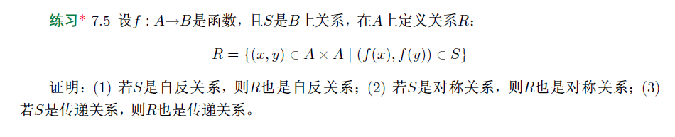
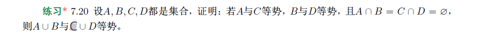

# <center>18308045 谷正阳 hw7</center>

(1)
$$
\begin{aligned}
\because&\forall x\in A，f(x)\in B\\
又\because&S是B上自反关系\\
\therefore&\langle f(x),f(x)\rangle\in S\\
\therefore&\langle x,x\rangle\in R\\
\therefore&R是自反关系
\end{aligned}
$$
(2)
$$
\begin{aligned}
&\forall x,y\in A，若\langle x,y\rangle\in R\\
\therefore&\langle f(x),f(y)\rangle\in S\\
\because&S是B上对称关系\\
\therefore&\langle f(y),f(x)\rangle\in B\\
\therefore&\langle y,x\rangle\in R\\
\therefore&R是对称关系
\end{aligned}
$$
(3)
$$
\begin{aligned}
&\forall x,y,z\in A， 若\langle x,y\rangle,\langle y,z\rangle\in R\\
\therefore&\langle f(x),f(y)\rangle,\langle f(y),f(z)\rangle\in S\\
\because&S是B上传递关系\\
\therefore&\langle f(x),f(z)\rangle\in S\\
\therefore&\langle x,z\rangle\in R\\
\therefore&R是传递关系
\end{aligned}
$$

(1)
$$
\begin{aligned}
&不是单函数，不是满函数，不是双函数\\
\because&f_1(-1)=3=f_1(1)\\
\therefore&-1\ne 1\rarr f_1(-1)\ne f_1(1)为假\\
\therefore&不是单函数\\
\because&\forall x\in\mathbb R，2x^2+1\ge 1\\
\therefore&\exist0\in R，使\exist x\in R(f_1(x)=0)为假\\
\therefore&不是满函数\\
\therefore&不是双函数
\end{aligned}
$$
(2)
$$
\begin{aligned}
&是单函数，是满函数，是双函数\\
\because&f_2'(x)=9x^2\ge 0（当且仅当x=0时，f_2'(x)=0）\\
\therefore&f_2(x)严格单调递增，即\forall x_1,x_2\in\mathbb R，若x_1<x_2则f_2(x_1)<f_2(x_2)\\
\therefore&是单函数\\
\because&\forall y\in\mathbb R，\exist x=\sqrt[3]{\frac{y-2}3}\in\mathbb R，使f_2(x)=y\\
\therefore&是满函数\\
\therefore&是双函数
\end{aligned}
$$
(3)
$$
\begin{aligned}
&不是单函数，不是满函数，不是双函数\\
\because&f_3(0)=0=f_3(-1)\\
\therefore&0\ne -1\rarr f_3(0)\ne f_3(-1)为假\\
\therefore&不是单函数\\
\because&\forall x\in\mathbb R，\lfloor(x+1)/2\rfloor\in Z\\
\therefore&\exist0.5\in R，使\exist x\in R(f_3(x)=0.5)为假\\
\therefore&不是满函数\\
\therefore&不是双函数
\end{aligned}
$$
(4)
$$
\begin{aligned}
&不是单函数，不是满函数，不是双函数\\
\because&f_4(1)=\frac 12=f_4(-1)\\
\therefore&1\ne -1\rarr f_4(1)\ne f_4(-1)为假\\
\therefore&不是单函数\\
\because&\forall x\in\mathbb R，\frac{x^2+1}{x^2+3}>0\\
\therefore&\exist-1\in R，使\exist x\in R(f_4(x)=-1)为假\\
\therefore&不是满函数\\
\therefore&不是双函数
\end{aligned}
$$

(1)
$$
\begin{aligned}
&考虑A=\varnothing，B=\{0,1\}，C=\{0\}，f=\varnothing，g=\{\langle 0,0\rangle,\langle 1,0\rangle\}\\
\therefore&f是单函数，g\circ f=\varnothing是单函数，0\ne 1\rarr g(0)\ne g(1)为假即g不是单函数\\
\therefore&得证
\end{aligned}
$$
(2)
$$
\begin{aligned}
&考虑A=\{0\}，B=\{0,1\}，C=\{0\}，f=\{\langle 0,0\rangle\}，g=\{\langle 0,0\rangle\}\\
\therefore&\forall z\in C即z=0，\exist y=0使g(y)=z，且\exist x=0使g(f(x))=0\\
\therefore&g，g\circ f是满函数\\
\because&\exist y=1，使\exist x\in A(f(x)=y)为假\\
\therefore&f不是满函数\\
\therefore&得证
\end{aligned}
$$
(3)
$$
\begin{aligned}
&\forall x,y\in A，若x\ne y\\
\because&g\circ f是双函数\\
\therefore&g(f(x))\ne g(f(y))\\
\because&g是函数\\
&若f(x)=f(y)\\
\therefore&g(f(x))=g(f(y))（矛盾）\\
\therefore&f(x)\ne f(y)\\
\therefore&f是单函数\\
&\forall z\in C\\
\because&g\circ f是双函数\\
\therefore&\exist x\in A，使g(f(x))=z\\
\therefore&\exist f(x)\in B，使g(f(x))=z\\
\therefore&g是满函数
\end{aligned}
$$

$$
\begin{aligned}
\because&A与C等势，B与D等势\\
\therefore&\exist f:A\rarr C,g:B\rarr D是双函数\\
&设 h:A\cup B\rarr C\cup D\\
\because&A\cap B=C\cap D=\varnothing\\
\therefore&A\cup B-B\\
=&(A\cup B)\cap\overline B//集合差等式\\
=&(A\cap\overline B)\cup(B\cap\overline B)//分配律\\
=&(A\cap\overline B)\cup(A\cap\overline A)//矛盾律，同一律\\
=&A\cap\overline{(A\cap B)}//分配律，交换律，德摩尔根律\\
=&A//A\cap B=\varnothing，同一律\\
&h(x)=\begin{cases}
f(x),x\in A\\
g(x),x\in B
\end{cases}\\
&\forall x,y\in A\cup B\\
&若x,y\in A\\
\because&f是双函数\\
\therefore&f(x)\ne f(y)\\
&若x,y\in B\\
\because&g是双函数\\
\therefore&g(x)\ne g(y)\\
&若x，y一个属于A，一个属于B，不妨设x\in A，y\in B\\
\because&C\cap D=\varnothing\\
\therefore&f(x)\in C\ne g(y)\in D\\
&综上，h(x)\ne h(y)\\
\therefore&h是单函数\\
&\forall y\in C\cup D\\
\therefore&y\in C或y\in D\\
&若y\in C\\
\because&f是双函数\\
\therefore&\exist x\in A，使f(x)=y\\
&若y\in D\\
\because&g是双函数\\
\therefore&\exist x\in B，使g(x)=y\\
&综上，\exist x\in A\cup B，使h(x)=y\\
\therefore&h是满函数\\
\therefore&h是双函数\\
\therefore&A\cup B与C\cup D等势
\end{aligned}
$$

$$
\begin{aligned}
\because&x+1>x\\
\therefore&x>0时，\frac1{x+1}<\frac1a\\
\therefore&x>0时，\left|\frac{x^3+2x+1}{x+1}\right|=\frac{x^3+2x+1}{x+1}<\frac{x^3+2x+1}x=x^2+2+\frac1x\\
\because&x>1+\sqrt2时，2x+1<x^2且x<x^2\\
\therefore&2+\frac1x<x<x^2\\
\therefore&x^2+2+\frac1x<2x^2=2|x^2|\\
\therefore&是O(x^2)\\
&若是O(x)，即\exist C>0，k\in R，使x>k时，\left|\frac{x^3+2x+1}{x+1}\right|<C|x|\\
\therefore&x>k且x>0时，x^3+2x+1<C(x^2+x)\\
\because&x>k且x>0且x>2C且x>1时，x^3+2x+1>C(2x^2+4+\frac1C)=C(x^2+x^2+4+\frac1C)\\
&>C(x^2+x+4+\frac1C)>C(x^2+x)（矛盾）\\
\therefore&不是O(x)
\end{aligned}
$$

(1)
$$
\begin{aligned}
\because&2x^3=O(x^3)，x^2\log x=O(x^3)\\
\therefore&O(f(x))=O(x^3)\\
\because&\forall C>0,k\in R，x>k且x>C且x>1时，f(x)>2Cx^2>C|x^2|\\
\therefore&n=3
\end{aligned}
$$
(2)
法一：没用洛必达法则：
$$
\begin{aligned}
&设m>0\\
\therefore&(\log x-mx^{3/4})'\\
=&\frac1x-\frac{3m}{4x^{1/4}}\\
=&\frac{4-3mx^{3/4}}{4x}\\
\therefore&x>\left(\frac4{3m}\right)^{4/3}时，4-3mx^{3/4}<0\\
\therefore&(\log x-mx^{3/4})'<0\\
\because&x=e^m时，\log x-mx^{3/4}=m-me^{3m/4}<0\\
\therefore&x>e^m时，\log x<mx^{3/4}\\
\therefore&\exist C=m^4+3>0,k=\max\{\left(\frac 4{3m}\right)^{4/3},e^m\}，使x>k时，|3x^3+(\log x)^4|<C|x^3|\\
\therefore&3x^3+(\log x)^4=O(x^3)\\
\because&\forall C>0,k\in\mathbb R，有x>k且x>1且x>C时，3x^3+(\log x)^4>3Cx^2>C|x^2|\\
\therefore&n=3
\end{aligned}
$$
法二：用了洛必达法则：
$$
\begin{aligned}
\because&\lim\limits_{x\rarr+\infty}\frac{(\log x)^4}{x^3}\\
=&\lim\limits_{x\rarr+\infty}\frac{4(\log x)^3}{3x^3}//\frac\infty\infty型，洛必达法则\\
=&\frac43\left(\lim\limits_{x\rarr+\infty}\frac{\log x}x\right)^3\\
=&0\\
\therefore&由极限定义，\forall\epsilon>0,\exist M>0，使x>M时，\left|\frac{(\log x)^4}{x^3}\right|<\epsilon\\
\therefore&\exist C>0,k\in R，使当x>k时|(\log x)^4|<C|x^3|\\
\therefore&(\log x)^4=O(x^3)\\
\because&3x^3=O(x^3)\\
\therefore&3x^3+(\log x)^4=O(x^3)\\
\because&\forall C>0,k\in\mathbb R，有x>k且x>1且x>C时，3x^3+(\log x)^4>3Cx^2>C|x^2|\\
\therefore&n=3
\end{aligned}
$$
(3)
$$
\begin{aligned}
\because&x^4+x^2+1=O(x^4)，x^3+1=O(x^3)\\
\therefore&\frac{(x^4+x^2+1)}{x^3+1}=O(x)\\
\because&\forall C>0,k\in\mathbb R，都有x>k且x>1且x>C时，x^4+x^2+1>x^4+1>Cx^3+1\\
\therefore&\frac{(x^4+x^2+1)}{x^3+1}\ne O(1)\\
\therefore&n=1
\end{aligned}
$$
(4)
$$
\begin{aligned}
\because&x^5=O(x^5)，5(\log x)^2=O(x^5)\\
\therefore&x^5+5(\log x)^2=O(x^5)\\
\because&x^3=O(x^3)，x\log x=O(x^3)\\
\therefore&x^3+x\log x=O(x^3)\\
\therefore&\frac{x^5+5(\log x)^2}{x^3+x\log x}=O(x^2)\\
\because&\forall C>0,k\in\mathbb R，都有x>k且x>1且x>2C时，x^5+5(\log x)^2>x^5>2Cx^4>C|x^4+x^2\log x|\\
\therefore&n=2
\end{aligned}
$$

输入：一组整数a[1],a[2],...,a[n],n<=2
输出：这组整数中第二大的整数
```python
max_1st_i = 1
i = 2
while i <= n:
    if a[i] > a[max_1st_i]:
        max_1st_i = i
    i += 1
max_2nd_i = 1
if max_1st_i == 1:
    max_2nd_i = 2
i = max_2nd_i + 1
while i <= n:
    if max_2nd_i == max_1st_i:
        continue
    if a[i] > a[max_2nd_i]:
        max_2nd_i = i
    i += 1
return a[max_2nd_i]
```
输入规模：n
基本操作：两个`while`内的判断和赋值操作以及while外部的判断、赋值、运算和返回操作。
执行次数最多的操作：第一个`while`中`i += 1`
与输入规模的函数关系：n-1
最坏情况下的算法复杂度：O(n)