# <center>18308045 谷正阳 hw8</center>
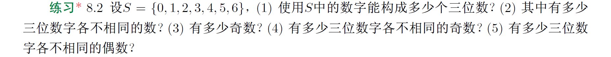
(1)
$\because第1个数字有除去0的6种可能，后2个数字都有7种可能，选3数字相互独立$
$\therefore6\times7\times7=294$
(2)
$\because第1个数字有除去0的6种可能，第2个数字有除去第一个数字的6种可能，第3个数字有除去前2个数字的5种可能，选3数字且相互独立$
$\therefore6\times6\times5=180$
(3)
$\because第3个数字有奇数的3种可能，第1个数字有除去0的6种可能，第2个数字有7种可能，选3数字相互独立$
$3\times6\times7=126$
(4)
$\because第3个数字有奇数的3种可能，第1个数字有除去0和第3个数字的5种可能，第2个数字有除去第1个数字和第3个数字的5种可能，选3数字相互独立$
$3\times5\times5=75$
(5)
$\because若第3个数字为0，则第1个数字有除去0的6种选择，第2个数字有除去第1个数字和0的5种选择，选前2数字相互独立$
$\therefore6\times5=30$
$\because若第3个数字非0偶数，则第3个数字有3种可能，第1个数字有除去0和第3个数字的5种可能，第2个数字有除去第1个数字和第3个数字的5种可能，选3数字相互独立$
$\therefore3\times5\times5=75$
$\because有且仅有以上两种情况$
$\therefore30+75=105$

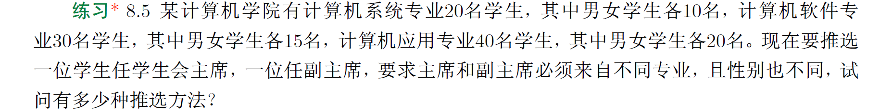
$\because若主席是计算机系统专业男生则副主席是其他专业女生$
$\therefore10\times(15+20)=350$
$\because若主席是计算机系统专业女生则副主席是其他专业男生$
$\therefore10\times(15+20)=350$
$\because若主席是计算机软件专业男生则副主席是其他专业女生$
$\therefore15\times(10+20)=450$
$\because若主席是计算机软件专业女生则副主席是其他专业男生$
$\therefore15\times(10+20)=450$
$\because若主席是计算机应用专业男生则副主席是其他专业女生$
$\therefore20\times(10+15)=500$
$\because若主席是计算机应用专业女生则副主席是其他专业男生$
$\therefore20\times(10+15)=500$
$\because有且仅有以上几种情况$
$\therefore350+350+450+450+500+500=2600$

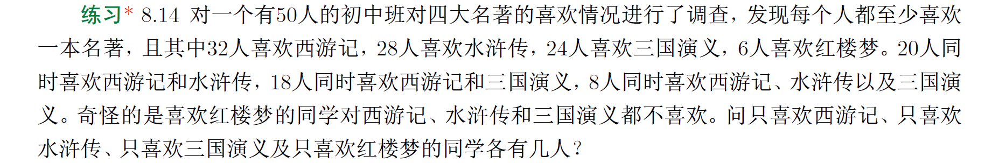
$设喜欢西游记的人的集合为A，喜欢水浒传的人的集合为B，喜欢喜欢三国演义的人的集合为C，喜欢红楼梦的人的集合为D$
$\therefore|A\cup B\cup C\cup D|=50，|A|=32，|B|=28，|C|=24，|D|=6，|A\cap B|=20，|A\cap C|=18，|A\cap B\cap C|=8，A\cap D=\varnothing，B\cap D=\varnothing，C\cap D=\varnothing$
$\therefore\begin{aligned}
|A\cup B\cup C\cup D|&=|A\cup B\cup C|+|D|-|(A\cup B\cup C)\cap D|\\
&=|A\cup B\cup C|+|D|\\
&=|A|+|B|+|C|-|A\cap B|-|A\cap C|-|B\cap C|+|A\cap B\cap C|+|D|
\end{aligned}$
$\therefore50=32+28+24-20-18-|B\cap C|+8+6$
$\therefore|B\cap C|=10$
$\therefore\begin{aligned}
|A-B-C-D|&=|A-B-C|-|(A-B-C)\cap D|\\
&=|A-B-C|-|A\cap D-B-C|\\
&=|A-B|-|(A-B)\cap C|-(|A\cap D-B|-|(A\cap D-B)\cap C|)\\
&=|A-B|-|A\cap C-B|-|A\cap D-B|+|A\cap C\cap D-B|\\
&=|A|-|A\cap B|-(|A\cap C|-|A\cap B\cap C|)-(|A\cap D|-|A\cap B\cap D|)+|A\cap C\cap D|-|A\cap B\cap C\cap D|\\
&=|A|-|A\cap B|-|A\cap C|+|A\cap B\cap C|-|A\cap D|+|A\cap B\cap D|+|A\cap C\cap D|-|A\cap B\cap C\cap D|\\
&=32-20-18-0+8+0+0-0\\
&=2
\end{aligned}$
$\therefore\begin{aligned}
|B-A-C-D|&=|B|-|B\cap A|-|B\cap C|+|B\cap A\cap C|-|B\cap D|+|B\cap A\cap D|+|B\cap C\cap D|-|B\cap A\cap C\cap D|\\
&=28-20-10-0+8+0+0-0\\
&=6
\end{aligned}$
$\therefore\begin{aligned}
|C-A-B-D|&=|C|-|C\cap A|-|C\cap B|+|C\cap A\cap B|-|C\cap D|+|C\cap A\cap D|+|C\cap B\cap D|-|C\cap A\cap B\cap D|\\
&=24-18-10-0+8+0+0-0\\
&=4
\end{aligned}$
$\therefore\begin{aligned}
|D-A-B-C|&=|D|-|D\cap A|-|D\cap B|+|D\cap A\cap B|-|D\cap C|+|D\cap A\cap C|+|D\cap B\cap C|-|D\cap A\cap B\cap C|\\
&=6
\end{aligned}$

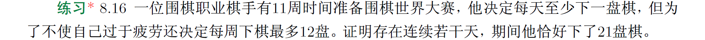
$设第i天累计下了a_i盘棋。$
$\therefore 1\le a_1<a_2<\cdots<a_{77}\le132$
$\therefore 1\le a_1<a_2<\cdots<a_{77}\le132$
$\therefore 1\le a_1,a_2,\cdots,a_{77},a_1+21,a_2+21,\cdots,a_{77}+21\le153$
$\therefore\exist i,j\in \mathbb N^+使a_i=a_j+21$
$\therefore得证$

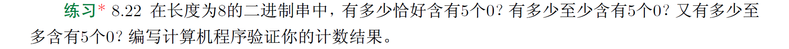
$\because恰好i个0：C_8^i$
$\therefore恰好5个0：C_8^5$
$\therefore至少5个0：\sum_{i=5}^8C_8^i$
$\therefore至多5个0：\sum_{i=0}^5C_8^i$

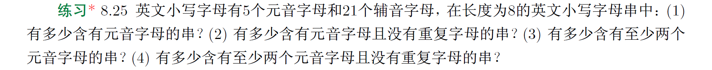
(1)
$\because总共26^8种，没有元音即只有辅音21^8种$
$\therefore26^8-21^8$
(2)
$\because总共P_{26}^8种，没有元音即只有辅音P_{21}^8种$
$\therefore P_{26}^8-P_{21}^8$
(3)
$\because只有一个元音C_8^7\cdot21^7\cdot5种$
$\therefore26^8-21^8-C_8^7\cdot21^7\cdot5$
(4)
$\because只有一个元音C_8^7\cdot P_{21}^7\cdot5种$
$\therefore P_{26}^8-P_{21}^8-C_8^7\cdot P_{21}^7\cdot 5$

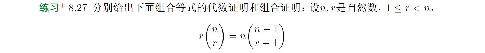
代数证明：
$\because rC_n^r=r\frac{n!}{(n-r)!r!}=n\frac{(n-1)!}{(n-1-(r-1))!(r-1)!}=nC_{n-1}^{r-1}$
组合证明：
$从n个人中选r-1个副班长和1个班长。$
$一种选法是先从n个人选r个人，再从中选出1个作班长，剩下的是副班长，共rC_n^r种$
$一种选法是先从n个人选1个人作班长，再从剩下n-1个人选r-1个人副班长，共nC_{n-1}^{r-1}种$

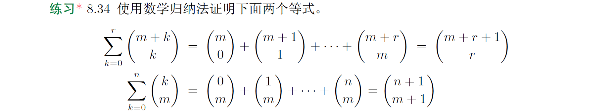
归纳基：
$r=0时，\forall m\in\mathbb N，\sum_{k=0}^0C_{m+k}^k=C_m^0=1=C_{m+0+1}^0，归纳假设成立$
归纳步：
$\forall i\in\mathbb N，若r=i时归纳假设成立$
$r=i+1时，\forall m\in\mathbb N，\sum_{k=0}^{i+1}C_{m+k}^k=\sum_{k=0}^iC_{m+k}^k+C_{m+i+1}^{i+1}=C_{m+i+1}^i+C_{m+i+1}^{i+1}=C_{m+i+1+1}^{i+1}，归纳假设成立$
综上：
$得证$

归纳基：
$n=0时，\forall m\in\mathbb N，\sum_{k=0}^0C_k^m=C_0^m=\begin{cases}
0,&m>0\\
1,&m=0
\end{cases}=C_1^{m+1}，归纳假设成立$
归纳步：
$\forall i\in\mathbb N，若n=i时归纳假设成立$
$n=i+1时，\forall m\in\mathbb N，\sum_{k=0}^{i+1}C_k^m=C_{i+1}^{m+1}+C_{i+1}^m=\begin{cases}
0,&i+1<m\\
C_{i+1+1}^{m+1},&i+1\ge m
\end{cases}=C_{i+1+1}^{m+1}，归纳假设成立$
综上：
$得证$


$\because有且仅有1个M，4个I，4个S，2个P$
$\therefore\frac{11!}{1!\cdot4!\cdot4!\cdot2!}$

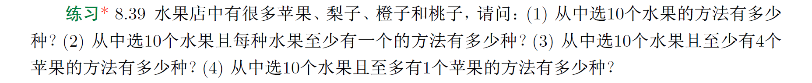
$设苹果x_1个，梨x_2个，橙子x_3个，桃子x_4个，x_1,x_2,x_3,x_4\in\mathbb N$
(1)
$\therefore x_1+x_2+x_3+x_4=10的自然数解个数$
$\therefore C_{13}^3$
(2)
$\therefore(x_1-1)+(x_2-1)+(x_3-1)+(x_4-1)=6的自然数解个数$
$\therefore C_9^3$
(3)
$\therefore(x_1-4)+x_2+x_3+x_4=6的自然数解个数$
$\therefore C_9^3$
(4)
$设全集U为全部情况，集合A为至少有2个苹果的全部情况$
$\therefore|U|=C_{13}^3，|A|=C_{11}^3$
$\therefore|\overline A|=|U|-|A|=C_{13}^3-C_{11}^3$

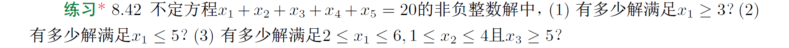
(1)
$\therefore(x_1-3)+x_2+x_3+x_4+x_5=17的自然数解个数$
$\therefore C_{21}^4$
(2)
$设全集U为全部情况，A为x_1\ge 6的全部情况$
$\therefore|U|=C_{24}^4，|A|=C_{18}^4$
$\therefore|\overline A|=|U|-|A|=C_{24}^4-C_{18}^4$
(3)
$设全集U为x_1\ge 2且x_2\ge 1且x_3\ge 5的全部情况$
$设A为x_1\ge 7且x_2\ge 1且x_3\ge 5的全部情况$
$设B为x_2\ge 5且x_1\ge 2且x_3\ge 5的全部情况$
$\therefore|U|=C_{16}^4，|A|=C_{11}^4，|B|=C_{12}^4，|A\cap B|=C_7^4$
$\therefore|\overline A\cap \overline B|=|U|-|A|-|B|+|A\cap B|=C_{16}^4-C_{11}^4-C_{12}^4+C_7^4$

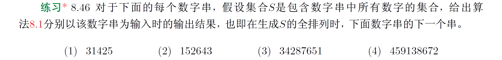
(1)
$31425是以3142为前缀的最大串，它的覆盖是以3145为前缀后缀递增，即31452$
(2)
$152643是以152为前缀的最大串，它的覆盖是以153为前缀后缀递增，即153246$
(3)
$34287651是以342为前缀的最大串，它的覆盖是以345为前缀后缀递增，即34512678$
(4)
$459138672是以4591386为前缀的最大串，它的覆盖是以4591387为前缀后缀递增，即459138726$


$设其个数a_n$
$\therefore若结尾是1则有a_{n-1}种，若结尾是0则倒数第二个一定是1则有a_{n-2}种$
$\therefore\forall n\in\mathbb N\wedge n\ge 2,a_n=a_{n-1}+a_{n-2}$


$设其个数a_n$
$\therefore若倒数第二个是0则结尾是1或2，若倒数第二个是1则结尾是0或2，若倒数第二个是2则结尾是0或1$
$\therefore a_n=2a_{n-1}$


$\because三阶线性齐次$
$\therefore x^3-2x^2-x+2=(x-1)(x^2-x-2)=(x-1)(x+1)(x-2)=0有1，-1，2重数均为1的根$
$\therefore a_n=c_11^n+c_2(-1)^n+c_32^n$
$\because a_0=c_1+c_2+c_3=3，a_1=c_1-c_2+2c_3=6，a_2=c_1+c_2+4c_3=0$
$\therefore c_1=6，c_2=-2，c_3=-1$
$\therefore a_n=6-2(-1)^n-2^n$

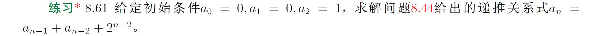
$\because二阶线性非齐次$
$\therefore x^2-x-1=0的解\frac{1+\sqrt 5}2和\frac{1-\sqrt 5}2重数均为1$
$\therefore a_n^{(h)}=c_1(\frac{1+\sqrt 5}2)^n+c_2(\frac{1-\sqrt 5}2)^n$
$\therefore a_n^{(p)}=p_02^n$
$\therefore a_n^{(h)}=c_1(\frac{1+\sqrt 5}2)^n+c_2(\frac{1-\sqrt 5}2)^n+p_02^n$
$\therefore a_0=c_1+c_2+p_0=0，a_1=\frac{(1+\sqrt 5)c_1+(1-\sqrt 5)c_2}2+2p_0=0，a_2=\frac{(3+\sqrt 5)c_1+(3-\sqrt 5)c_2}2+4p_0=1$
$\therefore c_1=\frac{-3\sqrt 5-5}{10}，c_2=\frac{3\sqrt 5-5}{10}，p_0=1$

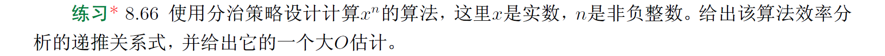
（1）纯分治
python：
```python
def power(x, n):
    if n == 0:
        return 0
    if n == 1:
        return x
    return power(x, int(n / 2)) * power(x, n - int(n / 2))
```
伪代码：
```
power(x, n)
如果n == 0，返回0
如果n == 1，返回x
否则，n1 = n / 2取整数部分，返回power(x, n1) * power(x, n - n1)
```
$f(n)=2f(n/2)+C$
$\because2>2^0$
$\therefore O(n)$

（2）分治+动态规划
python：
```python
def power(x, n, table=dict()):
    if n == 0:
        return 0
    if n == 1:
        return x
    if table.get(int(n / 2)) is None:
        table[int(n / 2)] = power(x, int(n / 2), table)
    if table.get(n - int(n / 2)) is None:
        table[n - int(n / 2)] = power(x, n - int(n / 2), table)
    return table[int(n / 2)] * table[n - int(n / 2)]
```
伪代码：
```
table初始化为全0数组
power(x, n, table):
    如果n == 0，返回0
    如果n == 1，返回x
    若则，n1 = n / 2取整数部分
        如果table[n1] == 0，table[n1] = power(x, n1, table)
        如果table[n - n1] == 0，table[n - n1] = power(x, n - n1), table)
        返回table[n1] * table[n - n1]
```
$f(n)=f(n/2)+C$
$\because1=2^0$
$\therefore O(\log n)$