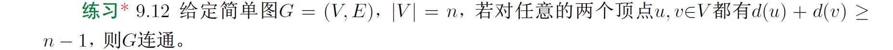

# 18308045_谷正阳

$\because握手定理$
$\therefore总度数2\times12=24$
$\because3度顶点有6个$
$\therefore剩下的顶点的度数有24-6\times3=6$
$\because剩下的顶点的度数都小于3$
$\therefore若剩下每个顶点度数为2时，顶点最少$
$\therefore顶点最少\frac6 2=3$
$\therefore最少顶点数6+3=9$

$设P(n)为至少有两个顶点的简单图G有n个顶点，至少有两个顶点度数相同$
归纳基：
$n=2时，度数要么全1要么全0$
$\therefore P(2)=1$
归纳步：
$若任意大于等于2的整数k，都有n=k时，P(2),\cdots,P(k)=1$
$\therefore n=k+1时，若有孤立的顶点$
$\therefore删除一个孤立的顶点，图顶点数为k，由归纳假设，P(k+1)=1$
$若无鼓励的顶点$
$\therefore每个顶点度数是1到n-1的整数$
$\because鸽笼原理$
$\therefore P(k+1)=1$
$\therefore得证$

$\because对任意顶点u,v，d(u)+d(v)\ge n-1$
$若G不连通$
$\therefore p(G)\ge 2$
$设一个连通分支G_1顶点数n_1，另一个连通分支G_2顶点数n_2$
$\therefore n_1+n_2\le n$
$\because简单图$
$\therefore任意G_1内顶点u_1，都有d(u_1)\le n_1-1$
$\therefore任意G_2内顶点v_1，都有d(v_1)\le n_2-1$
$\therefore d(u_1)+d(v_1)\le n_1-1+n_2-1\le n-2（矛盾）$
$\therefore G连通$

(1)
$3条边边割集有\{e_4,e_7,e_8\}$
$4条边边割集有\{e_1,e_2,e_3,e_7\}$
$最小的边割集为\{e_1\}$
$最大的边割集为\{e_2,e_3,e_4,e_5\}$
(2)
$最小点割集为\{b,d,e\}$
$1个顶点的点割集有\{f\}$
$2个顶点的点割集有\{b,d\}$
(3)
$(1)点连通度3$
$(1)边连通度3$
$(2)点连通度1$
$(2)边连通度1$

(1)
$\left[
\begin{matrix}
0&1&0&1&0\\
0&0&0&0&1\\
0&1&0&1&0\\
0&0&0&0&1\\
1&0&1&0&0
\end{matrix}
\right]$
(2)
$A^4=
\left[
\begin{matrix}
0&4&0&4&0\\
0&0&0&0&4\\
0&4&0&4&0\\
0&0&0&0&4\\
4&0&4&0&0
\end{matrix}
\right]$
$\therefore8\times 4=32$
$\therefore回路个数trace(A^4)=0$
(3)
$W_0=A$
$W_1=
\left[
\begin{matrix}
0&1&0&1&0\\
0&0&0&0&1\\
0&1&0&1&0\\
0&0&0&0&1\\
1&1&1&1&0
\end{matrix}
\right]$
$W_2=
\left[
\begin{matrix}
0&1&0&1&1\\
0&0&0&0&1\\
0&1&0&1&1\\
0&0&0&0&1\\
1&1&1&1&1
\end{matrix}
\right]$
$W_3=
\left[
\begin{matrix}
0&1&0&1&1\\
0&0&0&0&1\\
0&1&0&1&1\\
0&0&0&0&1\\
1&1&1&1&1
\end{matrix}
\right]$
$W_4=
\left[
\begin{matrix}
0&1&0&1&1\\
0&0&0&0&1\\
0&1&0&1&1\\
0&0&0&0&1\\
1&1&1&1&1
\end{matrix}
\right]$
$W_5=
\left[
\begin{matrix}
1&1&1&1&1\\
1&1&1&1&1\\
1&1&1&1&1\\
1&1&1&1&1\\
1&1&1&1&1
\end{matrix}
\right]$
$\therefore可达矩阵即为W_5$
$\therefore强连通有向图$

$若G连通$
$若G有回路$
$\therefore设简单回路顶点集V_0，回路G_0$
$\therefore由简单回路定义v_0e_1v_1e_2\cdots e_nv_0且不存在重复边可知，回路边数大于等于顶点数$
$\therefore G_0边数大于等于|V_0|$
$设G_0-V_0的连通分支数i，顶点个数分别为n_1,n_2,\cdots,n_i$
$\because连通$
$\therefore G_0要与每个连通分支至少1条边$
$\therefore总边数大于等于n_1-1+n_2-1+\cdots+n_i-1+|V_0|+i=n（矛盾）$
$\therefore无回路$

$设P(n)为n个顶点的简单图G若是连通的且无回路，则边数是n-1$
归纳基：
$当n=1时，有1个顶点$
$\because简单图$
$\therefore显然连通当且无回路，且有0条边$
$\therefore P(1)=1$
归纳步：
$若对任意自然数k，当n=k时，P(1),P(2),\cdots,P(k)=1$
$\therefore当n=k+1时，有k+1个顶点和k条边$
$任取一顶点v，设G-\{v\}有i个连通分支，顶点数分别为n_1,n_2,\cdots,n_i$
$\because归纳假设$
$\therefore边数分别为n_1-1,n_2-1,\cdots,n_i-1$
$\because连通$
$\therefore v到每个连通分支至少1条边$
$\because无回路$
$\therefore v到每个连通分支至多1条边$
$\therefore v到每个连通分支1条边$
$\therefore总边数n_1-1+n_2-1+\cdots+n_i-1+i=n-1$
$\therefore P(k+1)=1$
$综上对任意自然数n，都有P(n)=1$

$若G无回路$
$设G有i个连通分支，顶点数分别为n_1,n_2,\cdots,n_i$
$\therefore连通分支无回路$
$\therefore边数分别为n_1-1,n_2-1,\cdots,n_i-1$
$\therefore边数之和为n_1-1+n_2-1+\cdots+n_i-1=n-i=n-1$
$\therefore p(G)=1即G是连通图$

$设顶点数n，边数n-1$
$若至多k-1个树叶$
$\because\Delta(T)\ge k$
$\therefore至少有一个顶点度数大于等于k$
$\because握手定理$
$\therefore总度数2n-2$
$若k=1$
$\therefore2n-2\ge2n（矛盾）$
$若k\ge2$
$设树叶数x$
$\therefore2n-2\ge x+2(n-x-1)+k=2n-2-x+k\ge 2n-1$
$\therefore至少k个树叶$

(1)
$根节点：A$
$叶子节点：K,L,F,G,M,I,J$
$内部节点：A,B,C,D,E,H$
(2)
$A层数：0$
$B层数：1$
$C层数：1$
$D层数：1$
$E层数：2$
$F层数：2$
$G层数：2$
$H层数：2$
$I层数：2$
$J层数：2$
$K层数：3$
$L层数：3$
$M层数：3$
(3)
$高度：3$
$最大出度：是A和D的出度3$
(4)
$中序遍历：KELBFAGCMHDIJ$
$前序遍历：ABEKLFCGDHMIJ$
$中序遍历：KLEFBGCMHIJDA$

|步骤 |$v_1$    |$v_2$  |$v_3$  |$v_4$       |$v_5$       |$v_6$       |
|-----|---------|-------|-------|------------|------------|------------|
|第0步|$\boxed0$|$1/v_1$|$4/v_1$|$\infty/v_1$|$\infty/v_1$|$\infty/v_1$|
|第1步|   |$\boxed1/v_1$|$3/v_2$|$8/v_2$|$6/v_2$|$\infty/v_1$|
|第2步|   |       |$\boxed3/v_2$|$8/v_2$     |$4/v_3$     |$\infty/v_1$|
|第3步|   |       |             |$7/v_5$    |$\boxed4/v_3$|$10/v_5$|
|第4步|   |       |             |$\boxed7/v_5$|           |$9/v_4$    |
|第5步|   |       |             |            |           |$\boxed9/v_4$|
$所以到v_2最短路径1，v_1\rarr v_2$
$所以到v_3最短路径1，v_1\rarr v_2\rarr v_3$
$所以到v_4最短路径1，v_1\rarr v_2\rarr v_3\rarr v_5\rarr v_4$
$所以到v_5最短路径1，v_1\rarr v_2\rarr v_3\rarr v_5$
$所以到v_6最短路径1，v_1\rarr v_2\rarr v_3\rarr v_5\rarr v_4\rarr v_6$

Kruskal：
|步骤 |选边                     |
|-----|------------------------|
|第1步|$\langle v_1,v_2\rangle$|
|第2步|$\langle v_3,v_5\rangle$|
|第3步|$\langle v_2,v_3\rangle$|
|第4步|$\langle v_2,v_4\rangle$|
|第5步|$\langle v_4,v_6\rangle$|
$其中，第5步没选\langle v_1,v_3\rangle，\langle v_4,v_5\rangle因为形成回路$
Prim：
| |$V'$|$V-V'$                |选中的边|
|-|----|----------------------|-------|
|1|$v_1$|$v_2,v_3,v_4,v_5,v_6$|$\langle v_1,v_2\rangle$|
|2|$v_1,v_2$|$v_3,v_4,v_5,v_6$|$\langle v_2,v_3\rangle$|
|3|$v_1,v_2,v_3$|$v_4,v_5,v_6$|$\langle v_3,v_5\rangle$|
|4|$v_1,v_2,v_3,v_5$|$v_4,v_6$|$\langle v_2,v_4\rangle$|
|4|$v_1,v_2,v_3,v_5,v_4$|$v_6$|$\langle v_4,v_6\rangle$|

(1)

(2)
0:10
1:00
2:110
3:010
4:011
5:1110
6:11111
7:11110
(3)
$10000\times(20\%\times2+30\%\times2+10\%\times3+10\%\times3+15\%\times3+6\%\times4+4\%\times5+5\%\times5)=27400$

$C_1：$
$设内部面从左到右为R_1,R_2，外部面R_3$
$\therefore R_1边界bb，度1，R2边界abcda，度4，R_3边界abbcdefeda，度9$
$C_2：$
$设内部面R_1，外部面R_2$
$\therefore R_1边界cdec，度3，R_2边界aba和adec，度5$

$设顶点数n$
$若所有顶点度数大于等于5$
$若n\ge3$
$\therefore5n\le2m\le2(3n-6)$
$\therefore n\ge12$
$\therefore m\ge30（矛盾）$
$若n\le2$
$\therefore度数1或0（矛盾）$
$得证$

(1)
$由简单图，无环，长度为1的回路不存在$
$若r个面存在度数等于2的面$
$则由简单图，不存在重边，回路长度是2只可能是1条边$
$由于连通，所以不存在孤立点$
$所以是2个顶点（与n\ge3矛盾）$
$\therefore l\ge3$
$\therefore n+r-2\le \frac l{l-2}(n-2)$
$\therefore r\le (l-2)r\le 2n-4$
(2)
$若至多5个顶点度数小于等于5$
$设有x个顶点度数小于等于5$
$\because最小度4$
$\therefore每个顶点度数大于等于4$
$\therefore总度数大于等于4x+6(n-x)=6n-2x\ge 6n-10$
$\because总度数小于等于2(3n-6)=6n-12（矛盾）$
$\therefore得证$