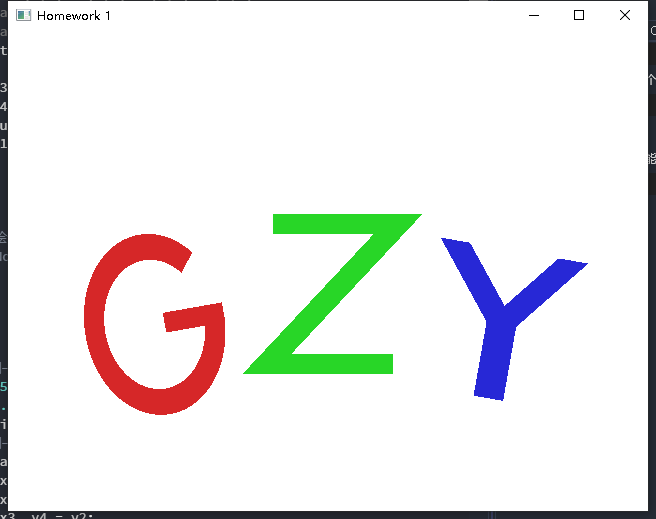

# 作业1

| 学号     | 姓名   | 专业(方向) |
| -------- | ------ | ---------- |
| 18308045 | 谷正阳 | 大数据     |

### 1. 环境配置
- 前面步骤参照附件，最后安装grew，将glew文件夹中对应文件放入VS的bin，include，lib文件夹中。
### 2. 绘制姓名首字母
- 姓名首字母分别为'G'，'Z'，'Y'。其中将'G'分解为'C'和'-'；将'Z'分解为两个'-'和'/'；将'Y'分解为'\\'，'/'和'|'。
- 四边形的绘制：除'C'外其他图形本质上是四边形，可由两个三角形构成。
- 'C'的绘制：'C'是椭圆的一部分，可以通过椭圆的参数公式$\begin{cases}
                x=ar\cos(\theta)\\
                y=br\sin(\theta)
                \end{cases}$绘制。注意$ar$是与x轴平行半轴长度，$br$是与y轴平行的半轴长度。每轮循环绘制两个三角形构成的梯形，梯形四个顶点分别位于外围椭圆和内围椭圆上。
- `glBegin`，`glEnd`分别调用3次，每次绘制一个字母，然后分别移动位置。
- `glVertex`每画一个四边形调用$6$次，画'C'时，`start_theta`为$\frac\pi4$，`delta_theta`为$\frac\pi{2^{20}}$，`end_theta`为$2\pi$，共$\frac{2\pi-\pi/4}{\pi/2^{20}}=7\times2^{18}$个四边形，'G'就画了$7\times2^{18}+1$个四边形，'Z'画了$3$个四边形，'Y'画了3个四边形，这样总共画了$7\times2^{18}+7$个四边形，共调用`glVertex`$21\times(2^{19}+2)$次。
### 3. 代码
```C++
/*
函数：quadrilateral
函数描述：绘制四边形，第2，3点在对角线上
参数描述：
x1：第1个点的横坐标
y1：第1个点的纵坐标
x2：第2个点的横坐标
y2：第2个点的纵坐标
x3：第3个点的横坐标
y3：第3个点的纵坐标
x4：第4个点的横坐标
y4：第4个点的纵坐标
*/
void quadrilateral(float x1, float y1, float x2, float y2, float x3, float y3, float x4, float y4)
{
    glVertex2f(x1, y1);
    glVertex2f(x2, y2);
    glVertex2f(x3, y3);
    glVertex2f(x2, y2);
    glVertex2f(x3, y3);
    glVertex2f(x4, y4);
}
/*
函数：eliptic_ring
函数描述：以原点为圆心绘制椭圆环，根据参数方程x=a*r*cos(theta),y=b*r*sin(theta)表示椭圆
参数描述：
start_theta：起始theta值
end_theta：终止theta值
delta_theta：精度，每轮循环theta增加值
r1：内围椭圆参数r
r2：外围椭圆参数r
a：椭圆参数a
b：椭圆参数b
*/
void eliptic_ring(float start_theta, float end_theta, float delta_theta, float r1, float r2, float a, float b)
{
	float theta;
	float x1, y1, x2, y2, x3, y3, x4, y4;
	x1 = a * r1 * cos(start_theta), y1 = b * r1 * sin(start_theta);
	x2 = a * r2 * cos(start_theta), y2 = b * r2 * sin(start_theta);
	for (theta = start_theta + delta_theta; theta <= end_theta; theta += delta_theta)
	{
		x3 = a * r1 * cos(theta), y3 = b * r1 * sin(theta);
		x4 = a * r2 * cos(theta), y4 = b * r2 * sin(theta);
        quadrilateral(x1, y1, x2, y2, x3, y3, x4, y4);
		x1 = x3, y1 = y3, x2 = x4, y2 = y4;
    }
}
/*
函数：G
函数描述：绘制G，包括'C'，'-'
参数描述：None
*/
void G()
{
	float r1, r2, a, b;
    float x1, y1, x2, y2, x3, y3, x4, y4;
    //绘制一个'C'
	r1 = 50.0f, r2 = 70.0f;
	a = 1.0f, b = 1.3f;
    eliptic_ring(M_PI / 4, 2 * M_PI, M_PI / 1048576, r1, r2, a, b);
    //绘制一个'-'
    x1 = a * r2, y1 = -10.0f;
    x2 = x1, y2 = -y1;
    x3 = x1 - 60.0f, y3 = y1;
    x4 = x3, y4 = y2;
    quadrilateral(x1, y1, x2, y2, x3, y3, x4, y4);
}
/*
函数：Z
函数描述：绘制Z，包括'-'，'/'，'-'
参数描述：None
*/
void Z()
{
    float x1, y1, x2, y2, x3, y3, x4, y4;
    //绘制上面的'-'
	x1 = 60.0f, y1 = 80.0f;
    x2 = x1, y2 = y1 - 20.0f;
    x3 = -x1, y3 = y1;
    x4 = x3, y4 = y2;
    quadrilateral(x1, y1, x2, y2, x3, y3, x4, y4);
    //绘制下面的'-'
	y1 = -y1;
    y2 = -y2;
    y3 = -y3;
    y4 = -y4;
    quadrilateral(x1, y1, x2, y2, x3, y3, x4, y4);
    //绘制一个'/'
	x1 = 60.0f, y1 = 80.0f;
	x2 = 90.0f, y2 = 80.0f;
	x3 = -x2, y3 = -y2;
	x4 = -x1, y4 = -y1;
    quadrilateral(x1, y1, x2, y2, x3, y3, x4, y4);
}
/*
函数：Y
函数描述：绘制Y，包括'\'，'/'，'|'
参数描述：None
*/
void Y()
{
    float x1, y1, x2, y2, x3, y3, x4, y4;
    //绘制一个'\'
	x1 = -15.0f, y1 = 0;
    x2 = -x1, y2 = y1;
    x3 = x1 - 60.0f, y3 = 75.0f;
    x4 = x2 - 60.0f, y4 = y3;
    quadrilateral(x1, y1, x2, y2, x3, y3, x4, y4);
    //绘制一个'/'
	x1 = -x1;
    x2 = -x2;
    x3 = -x3;
    x4 = -x4;
    quadrilateral(x1, y1, x2, y2, x3, y3, x4, y4);
    //绘制一个'|'
	x1 = -15.0f, y1 = 0;
    x2 = -x1, y2 = y1;
    x3 = x1, y3 = -75.0f;
    x4 = x2, y4 = y3;
    quadrilateral(x1, y1, x2, y2, x3, y3, x4, y4);
}
/*
函数：scene_1
函数描述：绘制GZY
参数描述：None
*/
void MyGLWidget::scene_1()
{
	glClear(GL_COLOR_BUFFER_BIT);//指定及应用背景颜色
	glMatrixMode(GL_PROJECTION);
	//now we are in projection matrix stack!
	//do projection transformation here...
	glLoadIdentity();//重置当前指定的矩阵为单位矩阵
	glOrtho(0.0f, width(), 0.0f, height(), -1000.0f, 1000.0f);//垂直投影

	glMatrixMode(GL_MODELVIEW);
	//now we are in modelview matrix stack!
	//do modelview transformation here...
    //G的绘制：
	glLoadIdentity();//重置当前指定的矩阵为单位矩阵
	glTranslatef(0.5 * width(), 0.5 * height(), 0.0f);//平移
	glPushMatrix();
	glColor3f(0.839f, 0.153f, 0.157f);//指定物体颜色
	glRotatef(10.0f, 0.0f, 0.0f, 1.0f);//旋转
	glTranslatef(-180.0f, -22.5f, 0.0f);//平移
	glBegin(GL_TRIANGLES);
    G();
	glEnd();

    //Z的绘制：
	glLoadIdentity();//重置当前指定的矩阵为单位矩阵
	glTranslatef(0.5 * width(), 0.5 * height(), 0.0f);//平移
	glPushMatrix();
	glColor3f(0.157f, 0.839f, 0.153f);//指定物体颜色
	glRotatef(0.0f, 0.0f, 0.0f, 1.0f);//旋转
	glTranslatef(5.0f, -22.5f, 0.0f);//平移
	glBegin(GL_TRIANGLES);
    Z();
	glEnd();

    //Y的绘制：
	glLoadIdentity();//重置当前指定的矩阵为单位矩阵
	glTranslatef(0.5 * width(), 0.5 * height(), 0.0f);//平移
	glPushMatrix();
	glColor3f(0.153f, 0.157f, 0.839f);//指定物体颜色
	glRotatef(-10.0f, 0.0f, 0.0f, 1.0f);//旋转
	glTranslatef(180.0f, -22.5f, 0.0f);//平移
	glBegin(GL_TRIANGLES);
    Y();
	glEnd();

	glPopMatrix();
}
```
### 4. 结果

