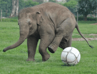

# 《计算机视觉》期末大作业

[TOC]

## Q1: Seam Carving

### Q1问题描述

结合"Lecture 6 Resizing"的Seam Carving算法，设计并实现前景保持的图像缩放，前景由gt文件夹中对应的标注给定。要求使用"Forward Seam Removing"机制，X,Y方向均要进行压缩。压缩比例视图像内容自行决定（接近$1-前景区域面积/(2*图像面积)$即可。每一位同学从各自的测试子集中任选两张代表图，将每一步的seam removing的删除过程记录，做成gif动画格式提交测试子集的其余图像展示压缩后的图像结果。

### Q1求解过程

主体代码在[my_seam_carving.py](my_seam_carving.py)中，实验代码在[seam_carving.ipynb](seam_carving.ipynb)中。

#### 图像缩放

Seam Carving是我的期中项目，当时通过修改一个包的源代码已经实现了许多功能，以下是本次作业用到的。

##### 前景保持的图像缩放

图像缩放调用`resize(src, size, energy_mode, order)`，而前景保持需要设置全局变量`keep_mask`。

前景保持实际上是直接在能量图上前景部分加一个大数，人为提高其重要程度，防止它被优先删除。

```python
if keep_mask is not None:
    cost_top[keep_mask[r]] += KEEP_MASK_ENERGY
```

##### Forward Seam Removing

这个机制由函数`_get_forward_seams(gray, num_seams)`实现。通过设置`resize`的参数`energy_mode`为`forward`来使用。它的想法是在删除seam后的图上计算梯度（可想象成被删除的像素块变成了其相邻像素块之间的线）。详细介绍见期中报告。

##### 最优顺序缩小

最有顺序缩放由函数`_optimal_order(src, width, height, energy_mode)`实现。通过设置`resize`的参数`order`为`optimal-order`来使用。因为通常缩小图片时会对宽和高两个方向进行缩小，每次缩小一个方向的一个像素大小，不同缩小顺序结果的能量不同，因而就有了最优缩小顺序的问题。算法本质是用动态规划的方法找到最优的缩小顺序。

##### 记录像素删除顺序

这个功能由函数`_record_seam(seam, seam_mask)`实现。它的作用是在和原图同样大小的图上记录每个像素点删除的顺序，如果没被删除则记为0。可以用它来做实时的图像缩放，也可以方便的做可视化。

#### 删除过程可视化

可视化由`gernerate_gif(src, path)`实现。它按照删除顺序的记录重做一遍删除过程，在删除的过程中将每一步中间结果作为一帧写入gif动图。由于用最优顺序缩小图像，每一步可能宽度缩小也可能高度缩小，因而需要做一个判断。通过判断此步删除像素个数等于高度还是宽度来确定缩小方向。

```python
mask = seam_records != j
temp = (~mask).sum() / 3
dh = int(temp == dst_w)
dw = int(temp == dst_h)
dst_h -= dh
dst_w -= dw
if dh:
    dst = dst.transpose(1, 0, 2)[mask.transpose(1, 0, 2)].reshape(dst_w, dst_h, 3).transpose(1, 0, 2)
    seam_records = seam_records.transpose(1, 0, 2)[mask.transpose(1, 0, 2)].reshape(dst_w, dst_h, 3).transpose(1, 0, 2)
else:
    dst = dst[mask].reshape(dst_h, dst_w, 3)
    seam_records = seam_records[mask].reshape(dst_h, dst_w, 3)
```

#### Q1实验

宽、高方向的缩放比例计算如下：

```python
src = cv2.imread('data/imgs/' + str(i) + '.png')
src_h, src_w, _ = src.shape
mask = (cv2.imread('data/gt/' + str(i) + '.png')[:, :, 0] > 0)
temp = (src_h * src_w) - mask.sum() / 2
dst_w = np.sqrt((temp * src_w / src_h)).round().astype(np.uint)
dst_h = np.sqrt((temp * src_h / src_w)).round().astype(np.uint)
```

以保证满足要求，面积压缩比接近$1-前景区域面积/(2*图像面积)$。

### Q1结果

全部结果见[data/seam_carving/res](data/seam_carving/res)。

可视化如下：




## Q2: Graph-based Image Segmentation

### Q2问题描述

结合"Lecture 7 Segmentation"内容及参考文献[1]，实现基于Graph-based image segmentation方法（可以参考开源代码，建议自己实现），通过设定恰当的阈值将每张图分割为50~70个区域，同时修改算法要求任一分割区域的像素个数不能少于50个（即面积太小的区域需与周围相近区域合并）。结合GT中给定的前景mask，将每一个分割区域标记为前景（区域50%以上的像素在GT中标为255）或背景50%以上的像素被标为0。区域标记的意思为将该区域内所有像素置为0或255。要求对测试图像子集生成相应处理图像的前景标注并计算生成的前景mask和GT前景mask的IOU比例。假设生成的前景区域为$R_1$该图像的GT前景区域为$R_2$则$IOU=\frac{R_1\cap R_2}{R_1\cup R_2}$。

### Q2求解过程

主体代码在[graph_based_image_segmentation.py](graph_based_image_segmentation.py)中，实验代码在[segmentation.ipynb](segmentation.ipynb)中。

#### 基于图的图像分割

该部分由函数`Segment(img, k, sigma, Merge, Dis, len_min)`实现。本质上是一个层次聚类，让满足
$$Diff(C_i,C_j)\le MInt(C_i,C_j)$$
的两类合并成一类。

#### 小区域合并

目的是为了满足每个区域像素数不少于50个。我实现了两种方法：

- `MergeNeareast(img, Id, C, Dis, len_min)`：将小区域合并到与它连通，且差异最小的区域中。
- `MergeMinimal(img, Id, C, Dis, len_min)`：将小区域合并到与它连通，且像素数最小的区域中，考虑如长颈鹿身上有很多差异大的小斑点，这样可能可以将它们合成一类。

通过函数`Segment`的参数`Merge`来指定。`Segment`将会在结束聚类以后，调用`Merge`将小的区域合并。

#### 搜索`k`

目的是为了调节`k`使聚类满足约束50-70个区域。由函数`Find_k(img, k_mean, i, sigma, Merge, Dis, len_min, count_min, count_max)`实现。搜索以历史均值`k_mean`为起点：

```python
k = k_mean
Id, count = Segment(img, k, sigma, Merge, Dis, len_min)
```

如果`count`不满足要求，则会对`k`不断乘2或除以2，找到解`k`所在的范围：

```python
k_min = 0
k_max = float('inf')
if count < count_min:
    cc = 0
    while count < count_min:
        if cc == 4 and Segment(img, 0, sigma, Merge, Dis, len_min)[1] < count_min:
            return k_mean, i, None
        k /= 2
        Id, count = Segment(img, k, sigma, Merge, Dis, len_min)
        cc += 1
    k_min = k
    k_max = k * 2
elif count > count_max:
    while count > count_max:
        k = k * 2
        Id, count = Segment(img, k, sigma, Merge, Dis, len_min)
    k_min = k / 2
    k_max = k
```

确定范围后，用二分查找找到满足要求的k：

```python
if count < count_min or count > count_max:
    while True:
        k = (k_min + k_max) / 2
        Id, count = Segment(img, k, sigma, Merge, Dis, len_min)
        if count < count_min:
            k_max = k
        elif count > count_max:
            k_min = k
        else:
            break
```

最后还会返回新的`k_mean`：

```python
return (k_mean * i + k) / (i + 1), i + 1, Id
```

注意这里特别地考虑了一种情况，即像素数过少导致没有符合要求的`k`。这种情况可以通过看`k=0`即可能的最多聚类数是否仍小于50来判断：

```python
if count < count_min:
    cc = 0
    while count < count_min:
        if cc == 4 and Segment(img, 0, sigma, Merge, Dis, len_min)[1] < count_min:
            return k_mean, i, None
        k /= 2
        Id, count = Segment(img, k, sigma, Merge, Dis, len_min)
        cc += 1
    k_min = k
    k_max = k * 2
```

#### 距离函数

距离函数用于评价两个像素点的差异性，我实现了两种：

- Euclid(v1, v2)：欧氏距离
- Cosine(v1, v2)：余弦相似度

特别需要注意的是，余弦相似度取值范围是$[0, 1]$，且是越大越相似，和其他距离函数越小越相似不同，因而这里取了倒数。这就引入了新的问题，分母两向量点积结果可能是0，如果分子不是0则结果为$\infty$，如果分子也是0则无解。这里先排除分子是0的可能，在`Segment`里将`img`加0.01：

```python
if Dis == Cosine:
    img += 0.01
```

然后如果分母是0，直接返回$\infty$：

```pytnon
def Cosine(v1, v2):
    temp = (v1 * v2).sum()
    if temp == 0:
        return float('inf')
    return (np.linalg.norm(v1) * np.linalg.norm(v2)) / temp - 1
```

#### 聚类可视化

可视化是为每一个聚类给一个颜色，要相邻聚类颜色有区分度，且不同聚类映射到的颜色要尽可能不一样。这里运用了哈希函数`md5`，因为哈希函数有防碰撞和非连续性的特点。

```python
h1 = hashlib.md5(int(Id[y, x]).to_bytes(length=64, byteorder='little', signed=False)).digest()
h2 = hashlib.md5(h1).digest()
h3 = hashlib.md5(h2).digest()
img_new[y, x, 0] = int.from_bytes(h1, byteorder='little', signed=False) % 256
img_new[y, x, 1] = int.from_bytes(h2, byteorder='little', signed=False) % 256
img_new[y, x, 2] = int.from_bytes(h3, byteorder='little', signed=False) % 256
```

#### Q2实验

测试用函数是`test(i, Merge=gbis.MergeNeareast, Dis=gbis.Euclid, gray=False)`，包括`Merge`，`Dis`的选用，而`gray`表示是否用灰度图，它会测试不同的高斯模糊参数，可以通过可视化结果从中选一个比较好的进行全部的图像分割。测试过程详见[segmentation.ipynb](segmentation.ipynb)，结果上看灰度图和余弦相似度用`MergeNeareast`方法合并是最好的。

### Q2结果

全部结果见：

- [data/graph_based_image_segmentation/res](data/graph_based_image_segmentation/res)
- [data/graph_based_image_segmentation/res_cos](data/graph_based_image_segmentation/res_cos)
- [data/graph_based_image_segmentation/res_gray](data/graph_based_image_segmentation/res_gray)

IOU见：

- [data/graph_based_image_segmentation/IOU.txt](data/graph_based_image_segmentation/IOU.txt)
- [data/graph_based_image_segmentation/IOU_cos.txt](data/graph_based_image_segmentation/IOU_cos.txt)
- [data/graph_based_image_segmentation/IOU_gray.txt](data/graph_based_image_segmentation/IOU_gray.txt)

## Q3: Classification

### Q3问题描述

从训练集中随机选择200张图用以训练，对每一张图提取归一化RGB颜色直方图（8\*8\*8=512维），同时执行问题2对其进行图像分割，（分割为50~70个区域），对得到的每一个分割区域提取归一化RGB颜色直方图特征（维度为8\*8\*8=512），将每一个区域的颜色对比度特征定义为区域颜色直方图和全图颜色直方图的拼接，因此区域颜色区域对比度特征的维度为2\*512=1024维，采用PCA算法对特征进行降维取前20维。利用选择的200张图的所有区域（每个区域20维特征）构建visual bag of words dictionary（参考Lecture 12. Visual Bag of Words 内容），单词数（聚类数）设置为50个，visual word的特征设置为聚簇样本的平均特征，每个区域降维后颜色对比度降维后颜色对比度特征（20维）和各个visual word的特征算点积相似性得到50个相似性值形成50维。将得到的50维特征和前面的20维颜色对比度特征拼接得到每个区域的70维特征表示。根据问题2，每个区域可以被标注为可以被标注为类别1（前景：该区域50%以上像素为前景）或0（背景：该区域50%%以上像素为背景），选用任意分类算法（SVM，Softmax，随机森林，KNN等）进行学习得到分类模型。最后在测试集上对每一张图的每个区域进行测试（将图像分割为50~70个区域，对每个区域提取同样特征并分类），根据测试图像的GT，分析测试分析测试集区域预测的准确率。

### Q3求解过程

主体代码在[classification.ipynb](classification.ipynb)中。

#### 图像分割

使用余弦相似度，对所有图像做图像分割，可视化结果存在[data/classification/segmentation](data/classification/segmentation)。

#### RGB颜色直方图

对所有图片的所有分割区域做RGB统计，同时对整个图做颜色统计，统计存在一维数组中，全部统计信息有如下结构：

```python
{img_idx: [histogram_for_a_picture, [histogram_for_a_area]]}
```

将全部统计信息存在[data/classification/H.txt](data/classification/H.txt)中。

#### PCA降维

将统计信息归一化后，使用sklearn的PCA将其降维至50维，将PCA模型存在[data/classification/pca.model](data/classification/pca.model)。

#### k-means++聚类

k-means++是在k-means的基础上，让聚类中心的初始化容易遍布整个样本集，而不是聚集于同一区域，使用sklearn的k-means++聚50类，将k-means模型存在[data/classification/kmeans.model](data/classification/kmeans.model)。

#### 分类

我使用了三种分类算法，分别是SVM，逻辑回归，随机森林，并将模型分别保存在[data/classification/svc.model](data/classification/svc.model)，[data/classification/lr.model](data/classification/lr.model)，[data/classification/rfc.model](data/classification/rfc.model)。

#### 评估

我分别评估了在训练集和测试集上的accuracy, precision, recall, F1 score。

### Q3结果

在训练集上随机森林表现更好，在测试集上SVM的accuracy更高，随机森林的F1 score更高。详见[classification.ipynb](classification.ipynb)。
