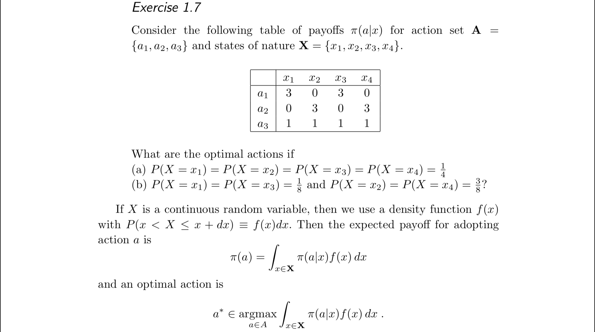
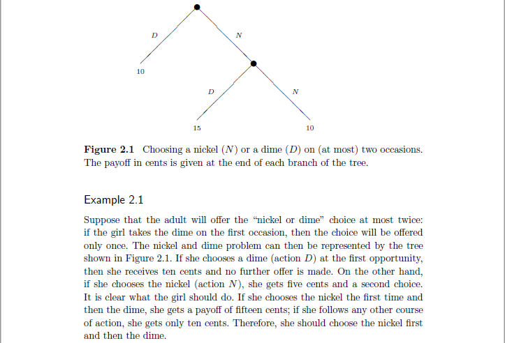
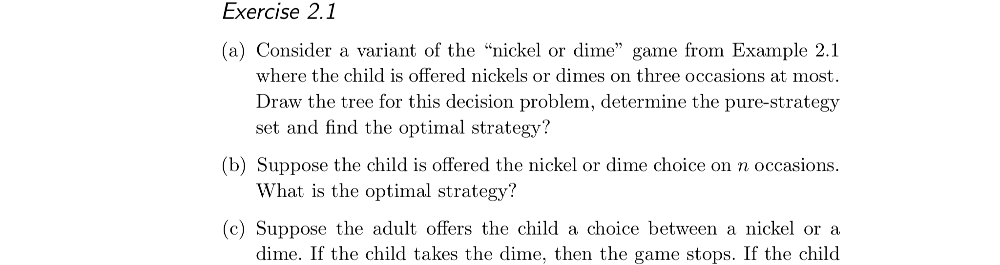
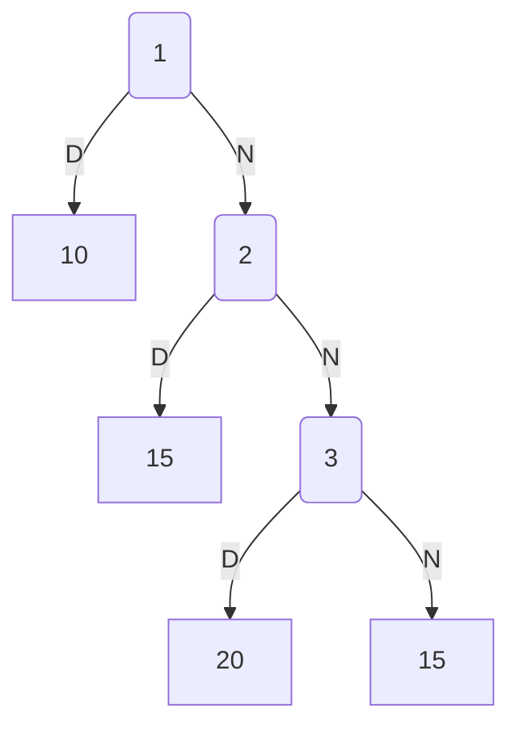
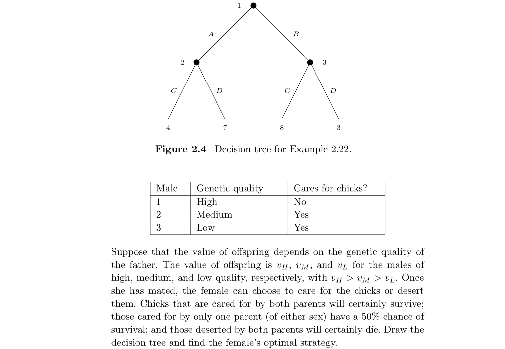
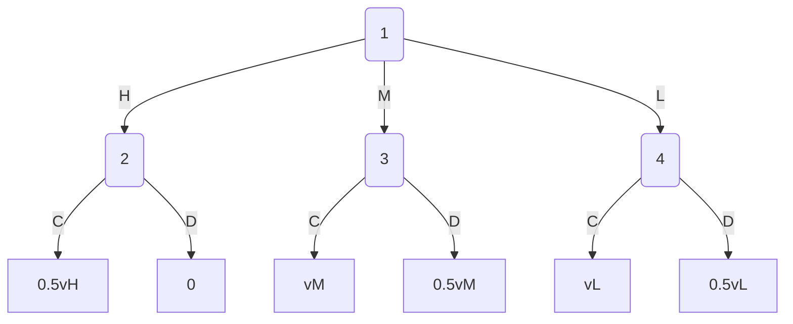

(a)
$\pi(a_1)=\sum_{i=1}^4\pi(a_1|x_i)P(X=x_i)=\frac3 2$
$\pi(a_2)=\sum_{i=1}^4\pi(a_2|x_i)P(X=x_i)=\frac3 2$
$\pi(a_3)=\sum_{i=1}^4\pi(a_3|x_i)P(X=x_i)=1$
$\therefore a^*=a_1或a_2$
(b)
$\pi(a_1)=\sum_{i=1}^4\pi(a_1|x_i)P(X=x_i)=\frac3 4$
$\pi(a_2)=\sum_{i=1}^4\pi(a_2|x_i)P(X=x_i)=\frac9 4$
$\pi(a_3)=\sum_{i=1}^4\pi(a_3|x_i)P(X=x_i)=1$
$\therefore a^*=a_2$

(a)

$S=\{NNN,NND,NDN,NDD,DNN,DND,DDN,DDD\}$
$最优是NND$
(b)
$最优是N_1N_2\cdots N_{n-1}D$
(c)
$\pi(a)=\lim\limits_{i\to\infty}\sum_{i=0}^n5ip^{i-1}*(1-p)=\lim\limits_{i\to\infty}5(\frac{1-p^n}{1-p}-np^n)=\frac5{1-p}$
$所以若p\le0.5时，\pi(a)\le10，最开始选D$
$若p\ge0.5时，\pi(a)\ge10，一直选N$

$最优\begin{cases}
HC,&0.5v_H\ge v_M\\
MC,&0.5v_H\le v_M
\end{cases}$