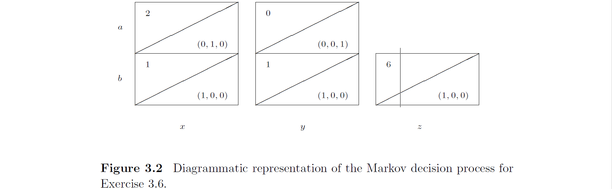
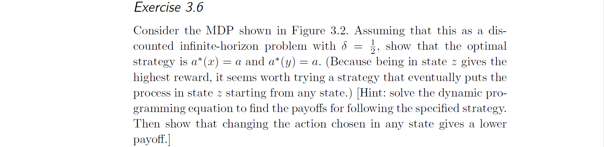

若起始policy是$a(x)=a$，$a(y)=a$：
```math
\begin{cases}
v(x)=2+\frac1 2v(y)\\
v(y)=\frac1 2v(z)\\
v(z)=6+\frac1 2v(x)
\end{cases}
```
可得：
```math
\begin{cases}
v(x)=4\\
v(y)=4\\
v(z)=8
\end{cases}
```
若令下一步policy是$a(x)=b$，则：
```math
v(x)=1+\frac1 2v(x)=3<4
```
若令下一步policy是$a(y)=b$，则：
```math
v(y)=1+\frac1 2v(x)=3<4
```
所以policy会一直是$a(x)=a$，$a(y)=a$即收敛。
所以optimal是$a^*(x)=a$，$a^*(y)=a$。

若起始policy是$s=\{a(x)=a,a(y)=a\}$
根据3.6题，optimal是$a^*(x)=a$，$a^*(y)=a$
若起始policy是$s=\{a(x)=a,a(y)=b\}$
```math
\begin{cases}
v(x)=2+\frac1 2v(y)\\
v(y)=1+\frac1 2v(x)\\
v(z)=6+\frac1 2v(x)
\end{cases}
```
可得：
```math
\begin{cases}
v(x)=\frac{10}3\\
v(y)=\frac{8}3\\
v(z)=\frac{23}3
\end{cases}
```
若令下一步policy是$a(x)=b$，则：
```math
v(x)=1+\frac1 2v(x)=\frac{8}3<\frac{10}3
```
若令下一步policy是$a(y)=a$，则：
```math
v(y)=\frac1 2v(z)=\frac{23}6>\frac{8}3
```
所以下一步policy是$a(x)=a$，$a(y)=a$。
根据3.6题，optimal是$a^*(x)=a$，$a^*(y)=a$